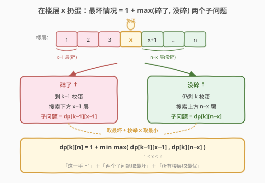
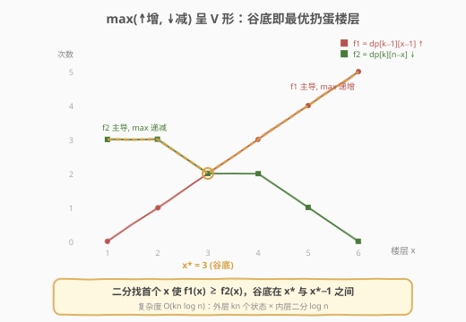
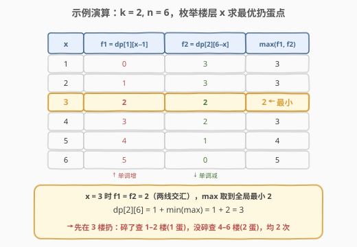
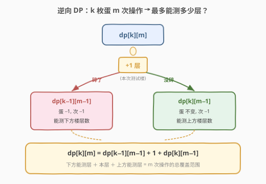

# 鸡蛋掉落

- **题目名称**：鸡蛋掉落
- **链接**：[887. 鸡蛋掉落](https://leetcode.cn/problems/super-egg-drop/)
- **难度**：困难
- **标签**：数学、二分查找、动态规划

## 1. 题目概述

有 `k` 枚**相同**的鸡蛋和一栋 `n` 层楼（`1` 到 `n`）。存在一个临界楼层 `f`（`0 <= f <= n`）：**高于** `f` 的楼层扔下鸡蛋会碎，`f` 及以下不会碎。每次操作取一枚**未碎**的鸡蛋从某层 `x`（`1 <= x <= n`）扔下——碎了就不能再用，没碎可重复使用。求在**最坏情况下**确定 `f` 确切值所需的**最少操作次数**。

**示例 1**：

```text
输入：k = 1, n = 2
输出：2
解释：只有 1 枚蛋，只能从低到高逐层试。
  扔 1 楼：碎了 → f=0；没碎则扔 2 楼：碎了 → f=1；没碎 → f=2。
  最坏需要 2 次。
```

**示例 2**：

```text
输入：k = 2, n = 6
输出：3
```

**示例 3**：

```text
输入：k = 3, n = 14
输出：4
```

**约束条件**：

- `1 <= k <= 100`
- `1 <= n <= 10^4`

> ⚠️ 本题是经典的「扔鸡蛋」问题，难点不在状态定义而在**转移的优化**。朴素 DP 是 $O(kn^2)$ 会超时，需用**二分**把转移优化到 $O(\log n)$；进一步可用**逆向状态定义**做到 $O(kn)$。面试中以二分优化 DP 为主解，逆向 DP 作为进阶讨论。

---

## 2. 解题思路

### 2.1 暴力思路

最朴素的想法：枚举第一次在哪层扔。设在 `x` 层扔，有两种结果：

- **碎了**：临界点在 `x` 以下，剩 `k−1` 枚蛋，需在 `1..x−1` 共 `x−1` 层中确定 `f`。
- **没碎**：临界点在 `x` 及以上，仍剩 `k` 枚蛋，需在 `x+1..n` 共 `n−x` 层中确定 `f`。

由于我们不知道会不会碎，必须按**最坏情况**取两者较大值，再加上这一次操作本身（`+1`）。然后枚举所有 `x`，取其中的**最小值**作为最优策略。

定义 `dp[k][n]` = `k` 枚蛋、`n` 层楼时最坏情况下的最少操作次数，则：

$$
\text{dp}[k][n] = 1 + \min_{1 \le x \le n} \max\bigl(\text{dp}[k-1][x-1],\ \ \text{dp}[k][n-x]\bigr)
$$

**边界**：`dp[1][n] = n`（只有 1 枚蛋，只能从 1 楼起逐层线性试）；`dp[k][0] = 0`（没有楼层无需操作）。

直接枚举 `x` 的复杂度为 $O(kn^2)$，`n = 10^4` 时约 $10^{10}$ 量级，必然超时。突破口在于：**对每个状态，最优 `x` 可以用二分快速定位**。

### 2.2 核心观察：最坏情况 DP + 二分优化转移



关键观察：固定 `(k, n)` 后，让 `x` 从 `1` 递增到 `n`，考察转移中的两个子问题：

- $f_1(x) = \text{dp}[k-1][x-1]$：随 `x` 增大，楼层数 `x−1` 增多，所需次数**单调递增**。
- $f_2(x) = \text{dp}[k][n-x]$：随 `x` 增大，楼层数 `n−x` 减少，所需次数**单调递减**。

我们要最小化的是 $\max(f_1(x), f_2(x))$。一个递增、一个递减，取 `max` 后整体呈 **V 形**（先减后增），**谷底即为最优扔蛋楼层** $x^*$。

> 💡 **直觉**：`x` 太低时「没碎」的搜索空间 `n−x` 很大（`f2` 主导，偏贵）；`x` 太高时「碎了」的搜索空间 `x−1` 很大（`f1` 主导，偏贵）。最优 `x` 让两个子问题「势均力敌」，这正是 `f1` 与 `f2` 的交点。

### 2.3 二分优化：V 形谷底



利用单调性，**二分查找**首个使 $f_1(x) \ge f_2(x)$ 的位置 `x*`。由于 `max(f1, f2)` 在 `x*` 左侧递减（`f2` 主导）、在 `x*` 右侧递增（`f1` 主导），谷底必在 `x*` 与 `x*−1` 之间，只需比较这两个候选点即可。

二分逻辑（对 `x ∈ [1, n]`）：

- 若 $f_1(\text{mid}) < f_2(\text{mid})$：交点在右侧，`lo = mid`。
- 若 $f_1(\text{mid}) > f_2(\text{mid})$：交点在左侧，`hi = mid`。
- 若相等：已命中谷底，`lo = hi = mid`。

收敛到 `lo`、`hi` 相邻（或相等）后，取 $\min(\max(f_1(\text{lo}), f_2(\text{lo})),\ \max(f_1(\text{hi}), f_2(\text{hi})))$ 即可。

这样每个状态的转移从 $O(n)$ 降到 $O(\log n)$，总复杂度 $O(kn \log n)$。

### 2.4 示例演算

以 `k = 2, n = 6` 为例。先由边界填好 `dp[1][j] = j`（1 枚蛋线性试），再逐层求 `dp[2][j]`。求 `dp[2][6]` 时枚举 `x = 1..6`：



| x | $f_1=\text{dp}[1][x-1]$ ↑ | $f_2=\text{dp}[2][6-x]$ ↓ | $\max(f_1, f_2)$ |
|---|---|---|---|
| 1 | 0 | 3 | 3 |
| 2 | 1 | 3 | 3 |
| **3** | **2** | **2** | **2 ← 最小** |
| 4 | 3 | 2 | 3 |
| 5 | 4 | 1 | 4 |
| 6 | 5 | 0 | 5 |

`x = 3` 时 `f1 = f2 = 2`（两线交汇），`max` 取到全局最小 `2`，故 `dp[2][6] = 1 + 2 = 3`。

**策略还原**：先在 3 楼扔——碎了则用最后 1 枚蛋在 1–2 楼线性试（最多 2 次）；没碎则在 4–6 楼用 2 枚蛋继续（最多 2 次）。两种情况都不超过 2 次，加上第 1 次共 3 次。

> 💡 **递推依赖**：求 `dp[2][6]` 需要 `dp[1][0..5]`（上一「蛋数」行，已由边界给出）和 `dp[2][0..5]`（同一「蛋数」行、更少楼层，需先算完）。因此按**蛋数 `k` 从小到大、楼层数 `n` 从小到大**双重递推即可保证依赖就绪。

---

## 3. 参考代码

### C++

```cpp
class Solution {
  public:
    int superEggDrop(int k, int n) {
        // dp[eggs][floors] = eggs 枚蛋、floors 层时最坏情况最少次数
        vector<vector<int>> dp(k + 1, vector<int>(n + 1, 0));
        for (int j = 1; j <= n; j++) dp[1][j] = j;   // 1 枚蛋：线性
        for (int eggs = 2; eggs <= k; eggs++) {
            for (int floors = 1; floors <= n; floors++) {
                // 二分找 f1(x)=dp[eggs-1][x-1] 与 f2(x)=dp[eggs][floors-x] 的交点
                int lo = 1, hi = floors;
                while (lo + 1 < hi) {
                    int mid = lo + (hi - lo) / 2;
                    int f1 = dp[eggs - 1][mid - 1];      // ↑ 单调增
                    int f2 = dp[eggs][floors - mid];     // ↓ 单调减
                    if (f1 < f2)      lo = mid;
                    else if (f1 > f2) hi = mid;
                    else              lo = hi = mid;
                }
                // 谷底在 lo 与 hi 之间，取两者较小
                dp[eggs][floors] = 1 + min(
                    max(dp[eggs - 1][lo - 1], dp[eggs][floors - lo]),
                    max(dp[eggs - 1][hi - 1], dp[eggs][floors - hi])
                );
            }
        }
        return dp[k][n];
    }
};
```

### Python

```python
class Solution:
    def superEggDrop(self, k: int, n: int) -> int:
        dp = [[0] * (n + 1) for _ in range(k + 1)]
        for j in range(1, n + 1):
            dp[1][j] = j                      # 1 枚蛋：线性
        for eggs in range(2, k + 1):
            for floors in range(1, n + 1):
                lo, hi = 1, floors
                while lo + 1 < hi:           # 二分找交点
                    mid = (lo + hi) // 2
                    f1 = dp[eggs - 1][mid - 1]      # ↑ 单调增
                    f2 = dp[eggs][floors - mid]      # ↓ 单调减
                    if f1 < f2:
                        lo = mid
                    elif f1 > f2:
                        hi = mid
                    else:
                        lo = hi = mid
                dp[eggs][floors] = 1 + min(
                    max(dp[eggs - 1][lo - 1], dp[eggs][floors - lo]),
                    max(dp[eggs - 1][hi - 1], dp[eggs][floors - hi]),
                )
        return dp[k][n]
```

> 💡 **空间优化**：`dp[eggs][*]` 只依赖上一行 `dp[eggs-1][*]` 和**同行更小楼层** `dp[eggs][floors-x]`。若固定 `eggs`、`floors` 从小到大扫，可用**一维滚动数组** `dp[floors]` 逐行覆盖，空间降到 $O(n)$。

---

## 4. 复杂度分析

| 维度 | 复杂度 | 说明 |
|------|--------|------|
| 时间复杂度 | $O(kn \log n)$ | $k \times n$ 个状态，每个用二分 $O(\log n)$ 定位最优转移点 |
| 空间复杂度 | $O(kn)$ | 二维 dp 表；一维滚动可优化至 $O(n)$ |

---

## 5. 扩展：逆向 DP——$O(kn)$ 的优雅解法

上述做法是对「`k` 蛋 `n` 层 → 最少几次」做 DP。换个角度：**固定「`k` 蛋 `m` 次」，最多能测多少层？** 这样转移是**线性递推**，无需二分。

定义 `dp[k][m]` = `k` 枚蛋、`m` 次操作**最多**能确定的楼层数。在某层扔一次后：

- **碎了**：剩 `k−1` 蛋、`m−1` 次，能测下方 `dp[k−1][m−1]` 层；
- **没碎**：仍 `k` 蛋、`m−1` 次，能测上方 `dp[k][m−1]` 层；
- **本层**：这一次操作本身确定了 `1` 层。



于是：

$$
\text{dp}[k][m] = \text{dp}[k-1][m-1] + 1 + \text{dp}[k][m-1]
$$

**边界**：`dp[∗][0] = 0`（0 次操作测 0 层）、`dp[1][m] = m`（1 枚蛋只能线性试）。找到**最小的 `m`** 使 `dp[k][m] >= n` 即为答案。

```cpp
class Solution {
  public:
    int superEggDrop(int k, int n) {
        // dp[eggs] = 当前操作次数下、eggs 枚蛋最多能测的层数（一维滚动）
        vector<int> dp(k + 1, 0);
        int m = 0;
        while (dp[k] < n) {
            m++;
            for (int eggs = k; eggs >= 1; eggs--)   // 从高到低，保证 dp[eggs-1] 仍是 m-1 轮的值
                dp[eggs] = dp[eggs - 1] + dp[eggs] + 1;
        }
        return m;
    }
};
```

```python
class Solution:
    def superEggDrop(self, k: int, n: int) -> int:
        dp = [0] * (k + 1)
        m = 0
        while dp[k] < n:
            m += 1
            for eggs in range(k, 0, -1):   # 从高到低滚动
                dp[eggs] = dp[eggs - 1] + dp[eggs] + 1
        return m
```

> 💡 **滚动方向**：`dp[eggs]` 依赖 `dp[eggs-1]`（上一蛋数）和 `dp[eggs]`（上一轮），二者都是 `m−1` 轮的旧值。`eggs` **从大到小**更新，保证读 `dp[eggs-1]` 时它尚未被本轮覆盖。这与 0-1 背包的倒序滚动同理。

**演算** `k=2, n=6`（一维 `dp` 数组，下标 = 蛋数）：

| m | dp[1] | dp[2] | dp[2]≥6? |
|---|-------|-------|----------|
| 0 | 0 | 0 | 否 |
| 1 | 1 | 1 | 否 |
| 2 | 2 | 3 | 否 |
| 3 | 3 | **6** | 是 → 返回 3 |

| 维度 | 复杂度 | 说明 |
|------|--------|------|
| 时间复杂度 | $O(kn)$ | `m` 最多到 `n`（1 蛋时退化），每轮 `O(k)` |
| 空间复杂度 | $O(k)$ | 一维滚动数组 |

> ⚠️ 逆向 DP 把「最小化次数」转为「最大化覆盖」，消除了 `max` 与枚举 `x`，是**状态定义决定复杂度**的典范。面试时先讲正向 DP + 二分（思路自然、易推导），再抛出逆向 DP 作为优化，能体现深度。

---

## 6. 面试要点

1. **为什么转移里取 `max` 而不是 `min`？**
   - 我们无法预知鸡蛋会不会碎，对手（运气）会选对我们**最不利**的那种结果。因此一次扔蛋的代价是「碎了」与「没碎」两个子问题的**较大者**（最坏情况）。再对所有楼层取 `min`，是我们主动选最优楼层来**最小化这个最坏代价**——典型的 Minimax 思想。

2. **为什么 $f_1(x)$ 单调增、$f_2(x)$ 单调减？这如何保证二分正确？**
   - $f_1(x) = \text{dp}[k-1][x-1]$：`x` 越大，下方楼层数 `x−1` 越多，所需次数越多，故单调增。$f_2(x) = \text{dp}[k][n-x]$：`x` 越大，上方楼层数 `n−x` 越少，所需次数越少，故单调减。一增一减使 $\max(f_1, f_2)$ 呈 V 形（先减后增），**单峰**，因此二分能定位谷底。

3. **二分收敛后为什么要比较 `lo` 和 `hi` 两个候选点？**
   - 离散情形下 `f1`、`f2` 的交点未必恰好落在整数 `x` 上。`lo` 是最后一个 `f1 < f2` 的位置，`hi` 是首个 `f1 >= f2` 的位置，谷底必在这两者之一，所以各算一次 `max` 取较小值即可，不会遗漏最优。

4. **逆向 DP 为什么能把复杂度从 $O(kn \log n)$ 降到 $O(kn)$？**
   - 正向转移需枚举楼层 `x` 并取 `max`（用二分压到 $\log n$）；逆向定义 `dp[k][m]` 后，转移变成 `dp[k-1][m-1] + dp[k][m-1] + 1` 的**纯加法递推**，无 `max`、无枚举，每个状态 $O(1)$ 转移。本质是把「最小化次数」的决策难题转嫁给了「最大化覆盖」的累加，决策消失了。

5. **`k=1` 时为什么直接返回 `n`？`k` 很大时有什么结论？**
   - `k=1` 只有一枚蛋，碎了就没得试，只能从 1 楼起逐层往上，最坏试 `n` 次。当 `k >= ⌈log₂(n+1)⌉` 时，每次都二分扔蛋（碎则向下二分、不碎向上二分），答案就是 `⌈log₂(n+1)⌉`——此时蛋数足够多，瓶颈在操作次数而非蛋数。逆向 DP 在 `k` 大时自然停在该值。

---

## 7. 同类练习题

- [1884. 鸡蛋掉落-两枚鸡蛋](https://leetcode.cn/problems/egg-drop-with-2-eggs-and-n-floors/)：本题 `k=2` 的特例，可用逆向 DP 退化为一维递推，适合作为入门铺垫
- [300. 最长递增子序列](https://leetcode.cn/problems/longest-increasing-subsequence/)（[题解](../0201-0300/300_最长递增子序列.md)）：同样「DP 转移 + 二分优化」的经典，体会二分如何把 $O(n^2)$ 降到 $O(n \log n)$
- [410. 分割数组的最大值](https://leetcode.cn/problems/split-array-largest-sum/)（[题解](../0401-0500/410_分割数组的最大值.md)）：对比「DP 内二分优化转移」与「直接对答案二分」两种思路的差异
- [875. 爱吃香蕉的珂珂](https://leetcode.cn/problems/koko-eating-bananas/)（[题解](./875_爱吃香蕉的珂珂.md)）：二分答案 + 验证函数，与本题「最坏情况取 max」思想相通
- [378. 有序矩阵中第K小的元素](https://leetcode.cn/problems/kth-smallest-element-in-a-sorted-matrix/)（[题解](../0301-0400/378_有序矩阵中第K小的元素.md)）：二分值域 + 计数验证，另一种二分应用范式
