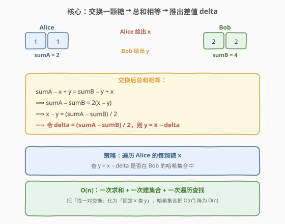
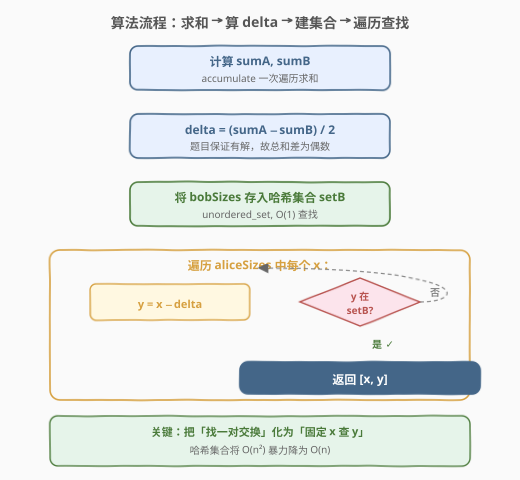
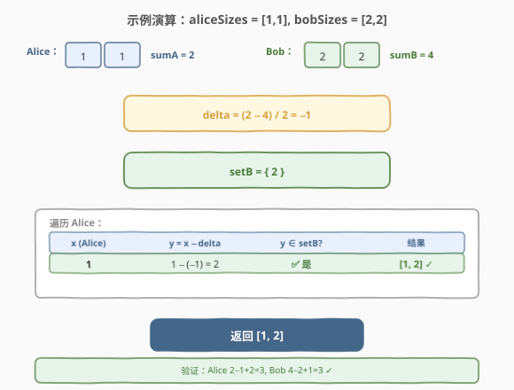

# LeetCode 公平的糖果交换 题解

## 1. 题目概述

- **标题 / 题号**：公平的糖果交换（#888，easy）
- **链接**：https://leetcode.cn/problems/fair-candy-swap/
- **难度**：简单
- **标签**：数组、哈希表、数学

**题意**：爱丽丝和鲍勃拥有不同数量的糖果盒（每个盒子装有若干颗糖）。两人决定**各交换一个盒子**给对方，使得交换后两人拥有的糖果**总数相等**。

给定两个整数数组 `aliceSizes` 和 `bobSizes`，其中 `aliceSizes[i]` 是爱丽丝第 `i` 个盒子里的糖果数，`bobSizes[j]` 是鲍勃第 `j` 个盒子里的糖果数。返回一个长度为 2 的整数数组 `answer`，其中 `answer[0]` 是爱丽丝交出的盒子里的糖果数，`answer[1]` 是鲍勃交出的盒子里的糖果数。题目保证**恰好存在一个有效答案**。

**示例 1**：

```text
输入：aliceSizes = [1,1], bobSizes = [2,2]
输出：[1,2]
解释：
    爱丽丝总和 sumA = 1+1 = 2，鲍勃总和 sumB = 2+2 = 4。
    爱丽丝交出 1 颗的盒子，鲍勃交出 2 颗的盒子。
    交换后：爱丽丝 2−1+2 = 3，鲍勃 4−2+1 = 3，相等 ✓
```

**示例 2**：

```text
输入：aliceSizes = [1,2], bobSizes = [2,3]
输出：[1,2]
解释：
    sumA = 3, sumB = 5。爱丽丝交出 1，鲍勃交出 2。
    交换后：爱丽丝 3−1+2 = 4，鲍勃 5−2+1 = 4，相等 ✓
```

**示例 3**：

```text
输入：aliceSizes = [2], bobSizes = [1,3]
输出：[2,3]
解释：
    sumA = 2, sumB = 4。爱丽丝交出 2，鲍勃交出 3。
    交换后：爱丽丝 2−2+3 = 3，鲍勃 4−3+2 = 3，相等 ✓
```

**约束**：

- $1 \le \text{aliceSizes.length}, \text{bobSizes.length} \le 10^4$
- $1 \le \text{aliceSizes[i]}, \text{bobSizes[j]} \le 10^5$
- 爱丽丝和鲍勃的糖果总数至少为 $1$
- 题目保证**恰好存在一个有效答案**

## 2. 解题思路

### 2.1 暴力思路：双重循环枚举每对交换

最直接的做法是：枚举爱丽丝的每个盒子 `x` 和鲍勃的每个盒子 `y`，检查交换后两人总数是否相等，即 `sumA - x + y == sumB - y + x`。一旦找到满足条件的一对 `(x, y)` 即返回。

这种做法需要 $O(n \times m)$ 次比较——当 $n = m = 10^4$ 时高达 $10^8$，会超时。

> ⚠️ 暴力法的瓶颈在于「不知道该找哪个 `y`」。破局思路：**从等式反解 `y`**，把双重循环化为「固定 `x` 查 `y`」的单层循环 + 哈希查找。

### 2.2 核心观察：从交换等式反解差值 delta

设爱丽丝糖果总和为 $\text{sumA}$，鲍勃为 $\text{sumB}$。爱丽丝交出 $x$、鲍勃交出 $y$ 后，两人总数相等：

$$\text{sumA} - x + y = \text{sumB} - y + x$$

移项整理：

$$\text{sumA} - \text{sumB} = 2(x - y)$$

$$x - y = \frac{\text{sumA} - \text{sumB}}{2}$$

令 $\text{delta} = \frac{\text{sumA} - \text{sumB}}{2}$，则：

$$y = x - \text{delta}$$



**关键直觉**：

- **交换不改变两人糖果总数之和**（$\text{sumA} + \text{sumB}$ 不变），只是重新分配。
- **目标是各分一半**：交换后每人应有 $\frac{\text{sumA} + \text{sumB}}{2}$ 颗糖。
- **差值固定**：爱丽丝需要「净获得」$\frac{\text{sumB} - \text{sumA}}{2}$ 颗糖，即 $y - x = \frac{\text{sumB} - \text{sumA}}{2}$，等价于 $y = x - \text{delta}$。
- **降维**：有了 `delta` 后，问题从「找一对 `(x, y)`」化为「对每个 `x`，查 `y = x - delta` 是否存在」——只需遍历爱丽丝的盒子，用**哈希集合** $O(1)$ 查 `y` 是否在鲍勃的盒子中。

> 💡 **为什么 `delta` 一定是整数？** 因为题目保证恰好存在一个有效答案，而有效答案要求 $x - y = \frac{\text{sumA} - \text{sumB}}{2}$ 为整数（糖果数都是整数），所以 $\text{sumA} - \text{sumB}$ 必为偶数。无需额外处理除不尽的情况。

### 2.3 算法流程图



**完整步骤**：

1. **求和**：计算 $\text{sumA} = \sum \text{aliceSizes}$，$\text{sumB} = \sum \text{bobSizes}$。
2. **算 delta**：$\text{delta} = (\text{sumA} - \text{sumB}) / 2$。
3. **建集合**：将 `bobSizes` 全部存入哈希集合 `setB`，用于 $O(1)$ 查找。
4. **遍历查找**：遍历 `aliceSizes` 中每个 $x$，计算 $y = x - \text{delta}$，若 $y \in \text{setB}$，返回 `[x, y]`。

> ⚠️ **易错点**：① `delta` 的符号——$\text{delta} = (\text{sumA} - \text{sumB}) / 2$，若爱丽丝糖果少则 `delta` 为负，$y = x - \text{delta} = x + |\text{delta}|$，即爱丽丝要用小盒子换鲍勃的大盒子。② 交换的是**盒子**（值），不是下标——同一个值可能出现多次，但只需查值是否存在，不关心第几个盒子。

### 2.4 示例演算

以示例 1 `aliceSizes = [1,1]`、`bobSizes = [2,2]` 为例：



| 步骤 | 计算 | 值 |
|------|------|-----|
| 求和 | $\text{sumA} = 1+1$，$\text{sumB} = 2+2$ | $\text{sumA}=2$，$\text{sumB}=4$ |
| 算 delta | $(\text{sumA} - \text{sumB}) / 2$ | $(2-4)/2 = -1$ |
| 建集合 | `setB = {2}` | — |
| 遍历 $x=1$ | $y = x - \text{delta} = 1 - (-1) = 2$ | $2 \in \text{setB}$ ✅ |
| 返回 | `[1, 2]` | 验证：$2-1+2=3$，$4-2+1=3$ ✓ |

> 💡 第一个 $x=1$ 即命中，无需遍历第二个。若 $x=1$ 不命中（比如 `setB` 里没有 2），则继续检查下一个 $x$。

## 3. 参考代码

### C++

```cpp
class Solution {
public:
    vector<int> fairCandySwap(vector<int>& aliceSizes, vector<int>& bobSizes) {
        int sumA = accumulate(aliceSizes.begin(), aliceSizes.end(), 0);
        int sumB = accumulate(bobSizes.begin(), bobSizes.end(), 0);
        int delta = (sumA - sumB) / 2;

        unordered_set<int> setB(bobSizes.begin(), bobSizes.end());
        for (int x : aliceSizes) {
            int y = x - delta;
            if (setB.count(y)) return {x, y};
        }
        return {};
    }
};
```

### Python

```python
class Solution:
    def fairCandySwap(self, aliceSizes: List[int], bobSizes: List[int]) -> List[int]:
        sumA = sum(aliceSizes)
        sumB = sum(bobSizes)
        delta = (sumA - sumB) // 2

        setB = set(bobSizes)
        for x in aliceSizes:
            y = x - delta
            if y in setB:
                return [x, y]
        return []
```

> 💡 **实现要点**：① C++ 用 `accumulate` 一次求和，`unordered_set` 用迭代器区间构造，一行建集合。② Python 用 `sum()` 和 `set()`，`//` 整除（Python 中 `/` 返回浮点数，必须用 `//`）。③ `delta` 的正负由 `sumA - sumB` 决定，无需取绝对值——公式 `y = x - delta` 对正负 `delta` 都成立。④ 题目保证恰好一个答案，找到即返回，`return {}` 只是语法兜底。

## 4. 复杂度分析

| 维度 | 复杂度 | 说明 |
|------|--------|------|
| **时间复杂度** | $O(n + m)$ | 求和 $O(n) + O(m)$，建集合 $O(m)$，遍历查找最坏 $O(n)$ 次哈希查找（每次 $O(1)$） |
| **空间复杂度** | $O(m)$ | 哈希集合 `setB` 存储 Bob 的 $m$ 个糖果值 |

> 💡 $n = \text{aliceSizes.length}$，$m = \text{bobSizes.length}$。时间已是最优——必须至少读一遍两个数组才能求和与查找。空间上，选择对**较小数组建集合**可进一步优化到 $O(\min(n, m))$，但本题数据规模下差异可忽略。

## 5. 扩展：选择较小数组建集合

当 $n \gg m$ 或 $m \gg n$ 时，可以**对较短的数组建集合**，遍历较长的数组查找，将空间降为 $O(\min(n, m))$：

```python
class Solution:
    def fairCandySwap(self, aliceSizes: List[int], bobSizes: List[int]) -> List[int]:
        sumA, sumB = sum(aliceSizes), sum(bobSizes)
        delta = (sumA - sumB) // 2

        # 对较短数组建集合，遍历较长数组
        if len(aliceSizes) > len(bobSizes):
            setB = set(bobSizes)
            for x in aliceSizes:
                y = x - delta
                if y in setB:
                    return [x, y]
        else:
            setA = set(aliceSizes)
            for y in bobSizes:
                x = y + delta          # 由 y = x - delta 反解 x
                if x in setA:
                    return [x, y]
        return []
```

> 💡 注意反向遍历时，由 $y = x - \text{delta}$ 反解 $x = y + \text{delta}$。两种方向的公式对称，只需保证返回顺序为 `[Alice交出的, Bob交出的]`。本题 $n, m \le 10^4$，优化收益不大，但面试中提一句能展现空间意识。

## 6. 面试要点

1. **如何从暴力 $O(n \times m)$ 优化到 $O(n + m)$？**

   > 关键是从交换等式反解出差值 `delta`。交换后两人总数相等意味着 `sumA - x + y == sumB - y + x`，整理得 `x - y = (sumA - sumB) / 2`。固定 `delta` 后，只需遍历一个数组，用哈希集合 $O(1)$ 查另一数组中是否存在对应的 `y = x - delta`，把双重循环降为单层。

2. **为什么 `delta` 一定是整数？需要处理除不尽的情况吗？**

   > 不需要。题目保证恰好存在一个有效答案，而有效答案要求 `x - y` 为整数（糖果数都是整数），所以 `sumA - sumB` 必为偶数，`delta = (sumA - sumB) / 2` 一定是整数。若题目不保证有解，则需先检查 `sumA - sumB` 的奇偶性。

3. **为什么用哈希集合而不是排序 + 二分？**

   > 哈希集合建集合 $O(m)$、查找 $O(1)$，总时间 $O(n + m)$。排序 + 二分需要 $O(m \log m)$ 排序 + $O(n \log m)$ 查找，总时间 $O((n + m) \log m)$，渐近更慢。当 $m$ 很大时哈希集合优势明显；但若内存受限或需要去重后有序输出，排序方案也有用武之地。

4. **如果题目不保证恰好一个答案（可能有多个或没有）怎么办？**

   > 有多个时收集所有满足 `y = x - delta` 的 `(x, y)` 对即可，注意去重（同一 `x` 值多次出现只需记一次）。没有时返回空数组。此外应先检查 `(sumA - sumB)` 是否为偶数——奇数则直接无解。

5. **这道题和「两数之和」有什么共同点？**

   > 两者都是「固定一个元素，查补集是否在哈希表中」。两数之和是 `x + y = target`，查 `target - x`；本题是 `x - y = delta`，查 `x - delta`。核心范式完全一致：**用等式约束把二元搜索降为一元查找 + 哈希**。

> 💡 **一句话总结**：888 是「两数之和」的变体——从交换等式反解 `delta`，把「找一对交换」化为「固定 `x` 查 `y = x - delta`」，哈希集合 $O(1)$ 查找将 $O(n^2)$ 降为 $O(n)$。核心范式：等式约束 + 哈希补集查找。

## 同类练习题

| # | 题目 | 与本题的关联 |
|---|------|-------------|
| 1 | [两数之和](https://leetcode.cn/problems/two-sum/)（[题解](../0001-0100/1_两数之和.md)） | 最直接的同范式题——固定 `x` 查 `target - x` 是否在哈希表中，本题将 `target` 换成 `delta` |
| 454 | [四数相加 II](https://leetcode.cn/problems/4sum-ii/)（[题解](../0401-0500/454_四数相加%20II.md)） | 分组 + 哈希（Meet in the Middle），同样是「等式约束 + 哈希查找补集」的进阶版 |
| 349 | [两个数组的交集](https://leetcode.cn/problems/intersection-of-two-arrays/)（[题解](../0301-0400/349_两个数组的交集.md)） | 哈希集合求两数组公共元素，同为「跨数组哈希查找」模式 |
| 219 | [存在重复元素 II](https://leetcode.cn/problems/contains-duplicate-ii/)（[题解](../0201-0300/219_存在重复元素II.md)） | 哈希表查找 + 索引约束，展示哈希查找在不同约束下的应用 |
| 560 | [和为 K 的子数组](https://leetcode.cn/problems/subarray-sum-equals-k/)（[题解](../0501-0600/560_和为K的子数组.md)） | 前缀和 + 哈希查找补集，将区间和化为「固定右端查左端」的哈希查找，与本题「固定 `x` 查 `y`」同构 |
