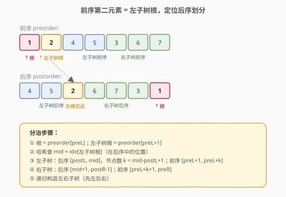
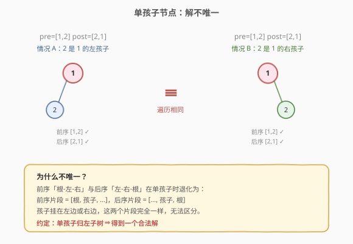
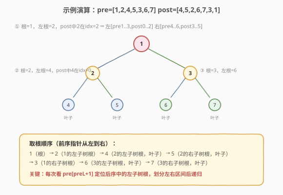

# LeetCode 根据前序与后序遍历构造二叉树 题解

## 1. 题目概述

- **标题 / 题号**：根据前序与后序遍历构造二叉树（#889，medium）
- **链接**：https://leetcode.cn/problems/construct-binary-tree-from-preorder-and-postorder-traversal/
- **难度**：中等
- **标签**：树、二叉树、分治、哈希表

**题意**：给定两个整数数组 `preorder` 和 `postorder`，分别表示同一棵二叉树（每个节点值互不相同）的**前序遍历**与**后序遍历**，请构造并返回这棵二叉树。若存在多个合法答案，返回**任意一个**即可。

**示例 1**：

```text
输入：preorder = [1,2,4,5,3,6,7], postorder = [4,5,2,6,7,3,1]
输出：[1,2,3,4,5,6,7]
```

**示例 2**：

```text
输入：preorder = [1], postorder = [1]
输出：[1]
```

**约束**：

- `1 <= preorder.length <= 30`
- `inorder.length == preorder.length`（注：此处指 postorder）
- `preorder` 和 `postorder` 是同一棵二叉树的前序与后序遍历
- 所有值互不相同

## 2. 解题思路

### 2.1 暴力思路：无法直接分治

前序+后序与「前序+中序」「中序+后序」不同：**没有中序序列就无法用根直接划分左右子树**，因为前序首部和后序尾部都是根，缺少「根在中序中的位置」这个划分锚点。需要另找线索。

### 2.2 核心观察：前序第二元素是左子树根，定位它在后序中的位置



关键观察：前序顺序是「根-左-右」，后序顺序是「左-右-根」。因此：

1. **前序**第一个元素 `preorder[preL]` 是当前子树的**根**。
2. **前序**第二个元素 `preorder[preL+1]`（若存在）是**左子树的根**（约定如此，单孩子时归左）。
3. 在 `postorder` 中找到这个左子树根的位置 `idx`，则：
   - `postorder[postL .. idx]` 是**左子树**的后序（共 `k = idx - postL + 1` 个元素）。
   - `postorder[idx+1 .. postR-1]` 是**右子树**的后序。
4. 对应回前序：
   - `preorder[preL+1 .. preL+k]` 是左子树的前序。
   - `preorder[preL+k+1 .. preR]` 是右子树的前序。
5. 对左右子树**递归**构造。

> 💡 用哈希表 `val -> idx` 预存 `postorder` 的下标，第 3 步查左子树根从 `O(n)` 降到 `O(1)`，整体 `O(n)`。

### 2.3 解不唯一的情况



> ⚠️ 当某节点**只有一个孩子**时，前序+后序无法判断这个孩子是左还是右。例如 `preorder = [1,2]`，`postorder = [2,1]`：`1` 只有一个孩子 `2`，可以是左孩子也可以是右孩子，两棵树的前序后序完全相同。约定把孩子归入左子树即可得到一个合法答案。

### 2.4 算法流程图与示例演算



以 `preorder = [1,2,4,5,3,6,7]`，`postorder = [4,5,2,6,7,3,1]` 为例：

| 步骤 | 当前根 | 左子树根 | post 中位置 | 左区间 | 右区间 |
|------|--------|----------|-------------|--------|--------|
| 1    | 1      | 2        | idx=2       | pre[1..3]=[2,4,5], post[0..2]=[4,5,2] | pre[4..6]=[3,6,7], post[3..5]=[6,7,3] |
| 2    | 2      | 4        | idx=0       | pre[2]=[4], post[0]=[4] | pre[3]=[5], post[1]=[5] |
| 3    | 4      | —        | 叶子        | — | — |
| 4    | 5      | —        | 叶子        | — | — |
| 5    | 3      | 6        | idx=4       | pre[5]=[6], post[3]=[6] | pre[6]=[7], post[4]=[7] |

最终树：`1` 的左孩子 `2`、右孩子 `3`；`2` 的左孩子 `4`、右孩子 `5`；`3` 的左孩子 `6`、右孩子 `7`。

## 3. 参考代码

### C++

```cpp
class Solution {
  public:
    TreeNode* constructFromPrePost(vector<int>& preorder, vector<int>& postorder) {
        unordered_map<int, int> idx;
        for (int i = 0; i < (int)postorder.size(); ++i) idx[postorder[i]] = i;
        int preIdx = 0;
        return build(preorder, idx, preIdx, 0, (int)postorder.size() - 1);
    }

  private:
    // preIdx 是全局前序指针；[postL, postR] 是当前子树对应的后序区间
    TreeNode* build(vector<int>& preorder, unordered_map<int, int>& idx,
                    int& preIdx, int postL, int postR) {
        if (postL > postR) return nullptr;
        int rootVal = preorder[preIdx++];            // 前序下一个是根
        TreeNode* root = new TreeNode(rootVal);
        if (postL == postR) return root;             // 叶子，无孩子
        int leftRoot = preorder[preIdx];             // 前序第二个 = 左子树根
        int mid = idx[leftRoot];                     // 在后序中的位置
        int leftSize = mid - postL + 1;              // 左子树节点数
        root->left  = build(preorder, idx, preIdx, postL, mid);
        root->right = build(preorder, idx, preIdx, mid + 1, postR - 1);
        return root;
    }
};
```

### Python

```python
class Solution:
    def constructFromPrePost(self, preorder: List[int], postorder: List[int]) -> Optional[TreeNode]:
        idx = {v: i for i, v in enumerate(postorder)}
        pre_iter = iter(preorder)

        def build(postL: int, postR: int) -> Optional[TreeNode]:
            if postL > postR:
                return None
            rootVal = next(pre_iter)                 # 前序下一个是根
            root = TreeNode(rootVal)
            if postL == postR:                       # 叶子，无孩子
                return root
            leftRoot = next(pre_iter)                # 偷看左子树根（需回退）
            # 注意：这里偷看会消费迭代器，需用下标法更稳妥
            return root

        # 用下标法更清晰：
        def build2(preL: int, postL: int, postR: int) -> Optional[TreeNode]:
            if postL > postR:
                return None
            rootVal = preorder[preL]
            root = TreeNode(rootVal)
            if postL == postR:
                return root
            leftRoot = preorder[preL + 1]
            mid = idx[leftRoot]
            leftSize = mid - postL + 1
            root.left  = build2(preL + 1, postL, mid)
            root.right = build2(preL + 1 + leftSize, mid + 1, postR - 1)
            return root

        return build2(0, 0, len(postorder) - 1)
```

> 💡 本题用**前序下标 + 后序区间**的双指针法最直观：`preL` 指向前序中当前根，`[postL, postR]` 是后序中当前子树范围。左子树根 `preorder[preL+1]` 在后序中的位置 `mid` 划分左右。递归顺序**先左后右**（前序指针从左到右）。

## 4. 复杂度分析

| 维度 | 复杂度 | 说明 |
|------|--------|------|
| 时间复杂度 | O(n) | 每个节点构造一次；哈希表查左子树根 O(1) |
| 空间复杂度 | O(n) | 哈希表 O(n)；递归栈最坏 O(n)（链状树） |

## 5. 扩展：为什么前序+后序不唯一？

前序+后序能唯一确定一棵树，**当且仅当**每个节点要么没有孩子，要么有两个孩子（满二叉树）。当某节点只有一个孩子时，无论这个孩子挂在左边还是右边，前序和后序遍历结果完全相同——因为前序只记录「根-孩子」，后序只记录「孩子-根」，无法区分左右。

形式化地：对于节点 `u` 和它唯一的孩子 `v`，前序片段是 `[u, v, ...]`，后序片段是 `[..., v, u]`，无论 `v` 是 `u` 的左孩子还是右孩子，这两个片段都一样。

> 💡 这也是为什么 LeetCode 允许返回任意一个合法答案。约定「单孩子归左」是最常见的实现。

## 6. 面试要点

1. **为什么前序+后序不像前序+中序那样直接？**
   - 中序提供了「根把序列一分为二」的锚点。前序+后序里根在两端，缺少中间锚点，必须借助「前序第二个元素是左子树根」这一间接线索来划分。

2. **为什么用前序第二个元素定位，而不是后序倒数第二个？**
   - 两者对称等价。前序第二个是左子树根（约定），后序倒数第二个是右子树根。用哪个都行，只要递归时对应好左右区间即可。本题用前序第二个更直观。

3. **为什么解不唯一？什么时候唯一？**
   - 单孩子节点无法判断孩子左右归属。当树是满二叉树（每个非叶节点都有两个孩子）时解唯一。本题约定单孩子归左，返回一个合法解即可。

4. **递归顺序是先左后右还是先右后左？**
   - 用前序指针从左到右移动时，**先左后右**（因为前序中左子树在前）。若改用后序指针从右往左移动并取「后序倒数第二为右子树根」，则先右后左。两种写法等价。

5. **能否改成迭代？**
   - 可以。利用前序压栈、后序匹配弹栈的方式迭代构造，思路类似 105 的迭代版。面试一般写递归版即可。

## 同类练习题

| # | 题目 | 与本题的关联 |
|---|------|-------------|
| 105 | [从前序与中序遍历序列构造二叉树](https://leetcode.cn/problems/construct-binary-tree-from-preorder-and-inorder-traversal/)（[题解](../0101-0200/105_从前序与中序遍历序列构造二叉树.md)） | 有中序，解唯一 |
| 106 | [从中序与后序遍历序列构造二叉树](https://leetcode.cn/problems/construct-binary-tree-from-inorder-and-postorder-traversal/)（[题解](../0101-0200/106_从中序与后序遍历序列构造二叉树.md)） | 有中序，解唯一 |
| 1008 | [前序遍历构造二叉搜索树](https://leetcode.cn/problems/construct-binary-search-tree-from-preorder-traversal/)（[题解](../1001-1100/1008_前序遍历构造二叉搜索树.md)） | 仅前序 + BST 性质 |
| 297 | [二叉树的序列化与反序列化](https://leetcode.cn/problems/serialize-and-deserialize-binary-tree/)（[题解](../0201-0300/297_二叉树的序列化与反序列化.md)） | 用遍历序列表示树 |
