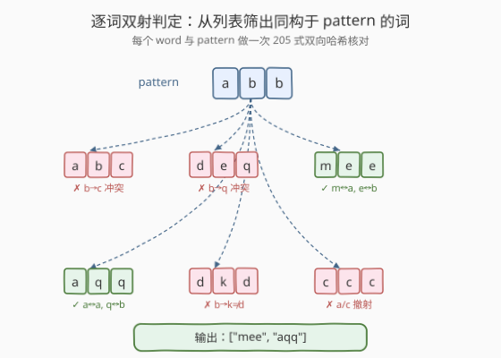
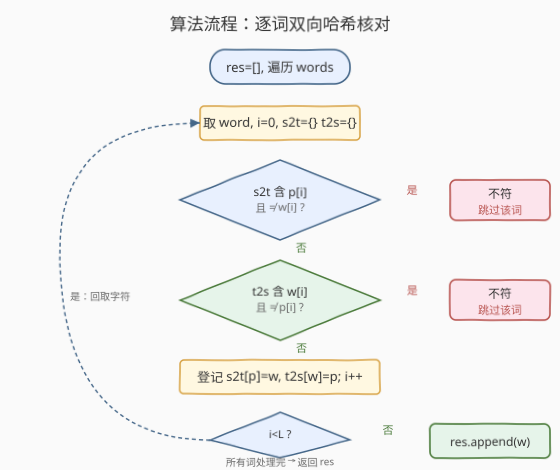
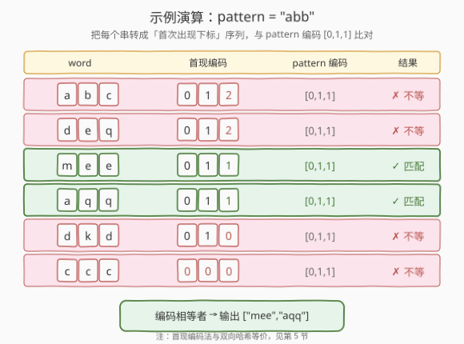

# LeetCode 查找和替换模式 题解

## 1. 题目概述

- **标题 / 题号**：查找和替换模式（#890，medium）
- **链接**：https://leetcode.cn/problems/find-and-replace-pattern/
- **难度**：中等
- **标签**：数组、哈希表、字符串

**题意**：给定一个单词列表 `words` 和一个模式串 `pattern`，返回 `words` 中所有**匹配** `pattern` 的单词。

「匹配」的定义：存在一个字母置换（全排列）$p$，把 $p$ 作用到 `pattern` 的每个字母上，恰好得到该单词。换言之，`word` 与 `pattern` 的字母之间存在**一一对应的双射**——

1. **同一个 `pattern` 字母每次出现都替换成同一个 `word` 字母**——不能这次换 `m` 下次换 `n`；
2. **不同 `pattern` 字母不能替换成同一个 `word` 字母**——两个不同源字母不能挤到同一个目标上（即映射是**双射**）；
3. 替换只发生在字母层面，不改变顺序与长度。

> 💡 本题是 [205 同构字符串](../0201-0300/205_同构字符串.md)的**列表筛选版**——把 205 的「判定一对字符串是否同构」换成「对列表中每个词跑一次 205 判定，筛出所有同构于 `pattern` 的词」。核心模板完全一致：双向哈希同步核对。

**示例 1**：

```text
输入：words = ["abc","deq","mee","aqq","dkd","ccc"], pattern = "abb"
输出：["mee","aqq"]
解释：
  "mee" 与 "abb" 匹配：m ↔ a，e ↔ b（两个 e 对应两个 b，双射成立）。
  "aqq" 与 "abb" 匹配：a ↔ a，q ↔ b（两个 q 对应两个 b，双射成立）。
  其余词均破坏双射，见 2.4 演算。
```

**示例 2**：

```text
输入：words = ["a","b","c"], pattern = "a"
输出：["a","b","c"]
解释：单字符的 pattern 与任意单字符词都构成双射（一一对应）。
```

**约束**：

- $1 \leq \text{pattern.length} \leq 20$
- $1 \leq \text{words.length} \leq 50$
- `words[i].length == pattern.length`
- `pattern` 和 `words[i]` 只含小写英文字母。

## 2. 解题思路

### 2.1 暴力思路：枚举字母全排列

题目字面意思是「找一个字母替换（置换）把 `pattern` 变成 `word`」。最直白的暴力做法：枚举 26 个小写字母的所有置换（共 $26! \approx 4 \times 10^{26}$ 种），对每个置换 $\pi$ 计算 $\pi(\text{pattern})$，再与每个 `word` 比较。

```text
for π in permutations('a'..'z'):          # 26! 种
    transformed = apply(π, pattern)
    for w in words:
        if transformed == w: res.add(w)
```

> ⚠️ $26!$ 是天文数字，单是枚举就已不可行，更谈不上对每个置换再遍历 `words`。这条路堵死了，必须从「双射」的**判定性质**入手，而非「枚举构造」。

> 💡 **半暴力陷阱：单表只查一个方向**。退一步，对每个 `word` 只建一张 `pattern→word` 映射表扫一遍——这与 [205 同构字符串](../0201-0300/205_同构字符串.md) 2.1 节的单表陷阱完全相同：只保证 `pattern→word` 单射，漏掉 `word→pattern` 方向。反例 `pattern="abb"`、`word="aaa"`：
>
> | `i` | `p[i]` | `w[i]` | `p2w` 登记结果 |
> |-----|--------|--------|----------------|
> | 0 | a | a | `a→a` |
> | 1 | b | a | `b` 没登记过，登记 `b→a` |
> | 2 | b | a | `p2w[b]==a` ✓ |
>
> 单表扫完不报错返回 `true`，但 `a→a` 与 `b→a` 意味着 `word` 的 `a` 被 `pattern` 的 `a`、`b` 两个不同字母共用，**不是双射**，正确答案应是 `false`。修复方式与 205 一致：再加一张 `w2p` 表双向同步核对。

### 2.2 核心观察：双射判定，不必枚举置换

「存在一个置换把 `pattern` 变成 `word`」等价于「`pattern` 与 `word` 之间存在字母级双射」，而双射又等价于**两个方向都是单射**。因此无需枚举 $26!$ 种置换，只需对每个 `word` 与 `pattern` 跑一次 [205](../0201-0300/205_同构字符串.md) 的双向哈希核对：

- `p2w[p[i]]` 存在 → 必须等于 `w[i]`；不存在 → 登记；
- `w2p[w[i]]` 存在 → 必须等于 `p[i]`；不存在 → 登记；
- 任一方向冲突 → 该词不匹配，跳过；
- 全程无冲突 → 该词匹配，加入结果。



> 💡 **与 205/290 的关系**：核心套路完全一致——双向哈希同步核对。区别只在调用层级：205 判定**一对**字符串；290 在判定前多一步 `split` 切分；890 把判定**套进外层循环**，对列表中每个词跑一次。一句话：**同一套双射模板，205 是单次判定，890 是批量筛选**。

### 2.3 算法流程图

相比 205，本题多了一层「遍历 `words`」的外循环；内层每个词的核对流程与 205 完全相同。



外层遍历 `words` 共 $W$ 个词，每个词内层一次遍历 $O(L)$（$L$ 为 `pattern` 长度）。总时间 $O(W \cdot L)$，空间 $O(|\Sigma|)$（小写字母即 $O(1)$）。

### 2.4 示例演算

以 `words = ["abc","deq","mee","aqq","dkd","ccc"]`、`pattern = "abb"` 为例。下面用**首现位置编码法**（见第 5 节）统一展示：把每个串转成「每个字母首次出现的位置」序列，与 `pattern` 的编码 $[0,1,1]$ 比对，相等即双射成立。



| word | 双向哈希核对过程 | 首现编码 | pattern 编码 | 结果 |
|------|------------------|----------|--------------|------|
| `abc` | `a→a`、`b→b`、第 3 位 `b→c` 与 `b→b` 冲突 | $[0,1,2]$ | $[0,1,1]$ | ✗ |
| `deq` | `d→a`、`e→b`、第 3 位 `b→q` 与 `b→e` 冲突 | $[0,1,2]$ | $[0,1,1]$ | ✗ |
| `mee` | `m→a`、`e→b`、第 3 位 `b→e` ✓，反向亦一致 | $[0,1,1]$ | $[0,1,1]$ | ✓ |
| `aqq` | `a→a`、`q→b`、第 3 位 `b→q` ✓，反向亦一致 | $[0,1,1]$ | $[0,1,1]$ | ✓ |
| `dkd` | `d→a`、`k→b`、第 3 位 `b→d` 与 `b→k` 冲突 | $[0,1,0]$ | $[0,1,1]$ | ✗ |
| `ccc` | `c→a`、第 2 位 `b→c` 时 `w2p[c]=a` 与 `b` 冲突 | $[0,0,0]$ | $[0,1,1]$ | ✗ |

最终输出 `["mee","aqq"]`。

> 💡 `ccc` 是典型的「`word` 字母种类少于 `pattern`」情形：3 个 `c` 想同时映到 `a`、`b`、`b`，第二个 `c` 就在 `word→pattern` 方向撞车（`c` 已映 `a`，又要映 `b`），双向哈希的 `w2p` 表正好拦下。这也印证了 2.1 节「单表不够」的结论。

## 3. 参考代码

### C++

```cpp
// 查找和替换模式.cpp —— 逐词双向哈希双射判定，O(W·L) 时间 / O(Σ) 空间
// 编译: g++ -O2 -std=c++17 查找和替换模式.cpp -o frp
class Solution {
  public:
    vector<string> findAndReplacePattern(vector<string>& words, string pattern) {
        vector<string> res;
        for (const string& w : words) {
            if (match(w, pattern)) res.push_back(w);
        }
        return res;
    }

  private:
    // 复用 205 的双向哈希核对：w 与 p 是否字母级双射
    bool match(const string& w, const string& p) {
        unordered_map<char, char> p2w, w2p;          // 双向映射表
        for (int i = 0; i < (int)p.size(); ++i) {
            char a = p[i], b = w[i];
            if (p2w.count(a) && p2w[a] != b) return false;   // pattern→word 单射被破坏
            if (w2p.count(b) && w2p[b] != a) return false;   // word→pattern 单射被破坏
            p2w[a] = b;
            w2p[b] = a;
        }
        return true;
    }
};
```

### Python

```python
class Solution:
    def findAndReplacePattern(self, words: List[str], pattern: str) -> List[str]:
        def match(w: str) -> bool:
            p2w, w2p = {}, {}                       # 双向映射表
            for a, b in zip(pattern, w):
                if p2w.get(a, b) != b:              # pattern→word 方向核对
                    return False
                if w2p.get(b, a) != a:              # word→pattern 方向核对
                    return False
                p2w[a] = b
                w2p[b] = a
            return True

        return [w for w in words if match(w)]
```

> 💡 内层 `match` 与 [205 同构字符串](../0201-0300/205_同构字符串.md) 的 `isIsomorphic` 函数体**逐行一致**——`p2w.get(a, b) != b` 的默认值技巧也照搬。本题只是把它包进列表推导式批量调用。由于题目保证 `words[i].length == pattern.length`，无需再做长度检查（对照 [290 单词规律](../0201-0300/290_单词规律.md) 必须做长度检查的差异）。

## 4. 复杂度分析

| 维度 | 双向哈希（逐词） | 首现编码（逐词） | 枚举全排列 |
|------|------------------|------------------|------------|
| **时间复杂度** | $O(W \cdot L)$ | $O(W \cdot L)$ | $O(26! \cdot W \cdot L)$，不可行 |
| **空间复杂度** | $O(\|\Sigma\|)$，小写字母即 $O(1)$ | $O(L)$（编码数组） | $O(\|\Sigma\|)$ |
| **实现难度** | 直观，复用 205 模板，推荐面试首选 | 巧妙，代码极短 | 不可行 |
| **扩展性** | 易推广到 205/290 | 适合同构判定与批量筛选 | — |

> ⚠️ **时间 $O(W \cdot L)$ 的来源**：外层遍历 $W$ 个词，每个词内层遍历 $L$ 个字符，每次哈希操作 $O(1)$。题目规模极小（$W \leq 50$，$L \leq 20$），总操作数至多 $1000$ 量级。空间上两张哈希表最多各存 26 个条目（小写字母集），故 $O(1)$。

## 5. 扩展：首现位置编码法（批量筛选更简洁）

与 [205 同构字符串](../0201-0300/205_同构字符串.md) 第 5 节、[290 单词规律](../0201-0300/290_单词规律.md) 第 5 节同源：**把每个字符替换成它首次出现的位置**，`word` 与 `pattern` 双射当且仅当它们转换后的下标序列**完全相同**。

思路：双射的本质是「**出现模式相同**」——同一位置上的字符，在各自串里是不是「第一次出现」。若 `pattern[i]` 首次出现的位置与 `word[i]` 首次出现的位置始终一致，两串就有相同的结构模式，即双射。

对本题而言，`pattern` 固定不变，可以**预先算一次**它的编码，再对每个 `word` 算编码做比对：

```python
class Solution:
    def findAndReplacePattern(self, words: List[str], pattern: str) -> List[str]:
        def encode(s: str) -> tuple:
            seen = {}
            return tuple(seen.setdefault(c, i) for i, c in enumerate(s))
        target = encode(pattern)
        return [w for w in words if encode(w) == target]
```

> ⚠️ 这个方法把「双射」转换成「**模式编码相同**」——和 205/290 的巧解完全同源，只是本题里 `pattern` 编码只算一次，对每个 `word` 算一次编码后做元组相等比较。代码最短但需解释「为什么位置序列相等 ⇔ 双射」。面试推荐先用双向哈希讲清双射，再提此法作为巧解。注意返回 `tuple` 而非 `list`，以便用 `==` 直接比较且可哈希。

## 6. 面试要点

1. **为什么不能枚举字母全排列？**

   - 26 个小写字母的全排列有 $26! \approx 4 \times 10^{26}$ 种，枚举不可行。
   - 但「存在置换」等价于「双射」，而双射可用 $O(L)$ 的双向哈希**判定**，无需构造置换。从「枚举构造」转为「性质判定」是本题的关键降维。

2. **本题和 205 同构字符串的关系？**

   - **同**：核心都是「**双向哈希同步核对**判定双射」，内层模板逐行一致。
   - **异**：205 判定**一对**字符串；890 把判定**套进外层循环**，对 `words` 中每个词跑一次，筛出匹配者。
   - 一句话：**890 = 205 的批量筛选版**。

3. **为什么本题不用做长度检查（对照 290）？**

   - 题目约束保证 `words[i].length == pattern.length`，所有词与 `pattern` 等长。
   - [290 单词规律](../0201-0300/290_单词规律.md) 需要自己做长度检查，是因为 `s` 经 `split` 后单词个数可能与 `pattern` 字符数不等。本题无此风险。

4. **「首现位置编码法」为什么和双向哈希等价？**

   - 双射要求「同一源映同一目标、不同源映不同目标」。把字符替换成首次出现位置后，相同字符得到相同下标、不同字符得到不同下标——编码序列恰好刻画了「位置上的出现模式」。
   - 两串编码相同 ⇔ 每个位置上的字符在各自串里「是否首现」一致 ⇔ 字符间可建立双射。形式化证明见 [205 同构字符串](../0201-0300/205_同构字符串.md) 第 5 节。

5. **如果 `words` 很大（如 $10^5$ 个词），还能用这个方法吗？**

   - 时间仍是 $O(W \cdot L)$，每个词独立判定，可并行化。
   - 用首现编码法还能做优化：把所有词按编码分组（哈希表键为编码元组），一次扫描 `pattern` 编码后直接取同组词，避免对每个词重复比较——但渐近复杂度不变，常数更优。

> 💡 **一句话总结**：查找和替换模式 = 205 同构字符串的列表筛选版。核心套路是**逐词双向哈希同步核对**，把 205 的单次判定套进外层循环。与 205、290 合称双射判定三件套；巧解可用首现位置编码统一模式后做元组相等比较。

## 同类练习题

| # | 题目 | 与本题的关联 |
|---|------|-------------|
| 205 | [同构字符串](https://leetcode.cn/problems/isomorphic-strings/)（[题解](../0201-0300/205_同构字符串.md)） | 字符 ↔ 字符的双射，890 的单次判定原版，内层模板逐行一致 |
| 290 | [单词规律](https://leetcode.cn/problems/word-pattern/)（[题解](../0201-0300/290_单词规律.md)） | 字符 ↔ 单词的双射，先 `split` 再套 205 模板，对照本题无需 `split` 的差异 |
| 49 | [字母异位词分组](https://leetcode.cn/problems/group-anagrams/) | 同样「把字符串归一化为结构键再分组」的思想——本题用首现位置编码，49 题用排序后的字符作键 |
| 1 | [两数之和](https://leetcode.cn/problems/two-sum/)（[题解](../0001-0100/1_两数之和.md)） | 同样「一次遍历边查边插」的哈希套路，单向查找对照本题双向核对 |
