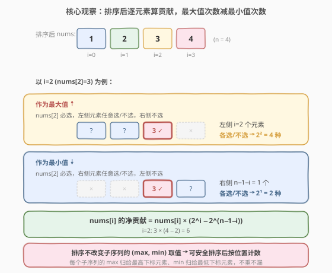
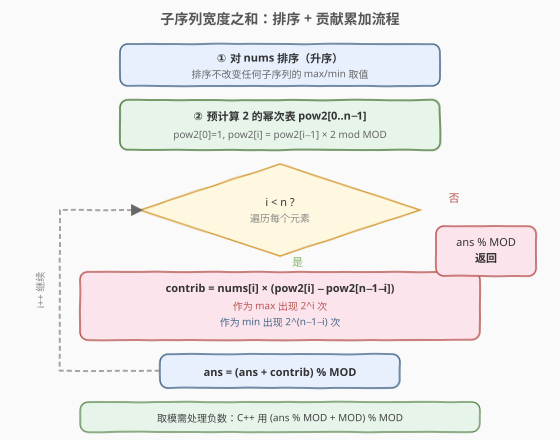
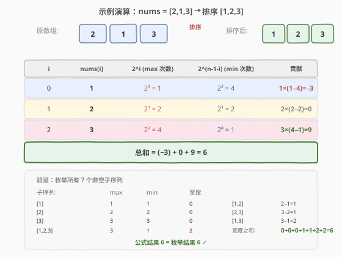

# 子序列宽度之和

- **题目名称**：子序列宽度之和
- **链接**：[891. 子序列宽度之和](https://leetcode.cn/problems/sum-of-subsequence-widths/)
- **难度**：困难
- **标签**：数组、数学、排序、贡献法

## 1. 题目概述

一个序列的**宽度**定义为该序列中最大元素和最小元素的差值。给定一个整数数组 `nums`，返回 `nums` 的所有**非空子序列**的宽度之和。由于答案可能很大，返回对 $10^9 + 7$ 取余后的结果。

> **子序列**定义为从一个数组里删除一些（或不删除）元素但不改变剩下元素顺序得到的数组。

**示例 1**：

```text
输入：nums = [2,1,3]
输出：6
解释：子序列为 [1], [2], [3], [2,1], [2,3], [1,3], [2,1,3]。
      相应宽度为 0, 0, 0, 1, 1, 2, 2，宽度之和为 6。
```

**示例 2**：

```text
输入：nums = [2]
输出：0
```

**约束条件**：

- $1 \le \text{nums.length} \le 10^5$
- $1 \le \text{nums[i]} \le 10^5$

> 💡 **核心难点**：子序列总数为 $2^n - 1$，$n = 10^5$ 时天文数字，无法枚举。需要找到一种**不逐一枚举子序列**就能求和的方法——关键在于将宽度拆成「最大值之和 − 最小值之和」，再对每个元素独立计算贡献。

---

## 2. 解题思路

### 2.1 暴力思路：枚举所有子序列

枚举 `nums` 的所有 $2^n - 1$ 个非空子序列，对每个子序列求 max − min，累加。

```text
ans = 0
for mask in 1..2^n - 1:
    subseq = nums 的第 mask 个子序列
    ans += max(subseq) - min(subseq)
return ans % MOD
```

时间复杂度 $O(n \cdot 2^n)$，$n = 10^5$ 时完全不可行。

> ⚠️ 暴力法的浪费在于：它把每个子序列当作独立个体处理，没有利用「同一个元素在大量子序列中扮演 max/min 角色」的重复结构。

### 2.2 核心观察：排序 + 逐元素贡献法



关键洞察分为三步：

**第一步：宽度可拆分**

总宽度之和 $= \sum_{\text{子序列 } S} (\max(S) - \min(S))$ $= \sum_S \max(S) - \sum_S \min(S)$。于是只需分别求「所有子序列最大值之和」与「所有子序列最小值之和」，再做差。

**第二步：排序不改变答案**

子序列的宽度只取决于其中元素的**值**（max 和 min 的值），与元素在原数组中的**顺序无关**。将 `nums` 排序后，原数组的每个子序列在排序后的数组中仍有一个宽度相同的对应子序列（选取相同的一组元素值，只是位置重排了）。因此**排序后求宽度之和，结果不变**。

> 💡 严格来说：原数组的每个子序列选取一组下标 $\{i_1, i_2, \ldots\}$，对应一组值。排序后，同一组值仍可被选取（只是下标变了），且宽度（max 值 − min 值）不变。因此排序前后所有子序列的宽度多重集相同。

**第三步：排序后逐元素计数**

排序后 `nums` 升序排列。对第 $i$ 个元素（0 下标），考察它作为子序列 max 和 min 的次数：

- **作为最大值**：`nums[i]` 是子序列的最大值，当且仅当 `nums[i]` 被选中，且**不选任何下标 $> i$ 的元素**（它们 $\ge \text{nums}[i]$，会抢走 max 身份）。下标 $< i$ 的元素可自由选/不选，共 $i$ 个元素 $\Rightarrow$ $2^i$ 种组合。

- **作为最小值**：`nums[i]` 是子序列的最小值，当且仅当 `nums[i]` 被选中，且**不选任何下标 $< i$ 的元素**。下标 $> i$ 的元素可自由选/不选，共 $n - 1 - i$ 个 $\Rightarrow$ $2^{n-1-i}$ 种组合。

因此 `nums[i]` 对总宽度之和的**净贡献**为：

$$\text{contrib}[i] = \text{nums}[i] \times \left(2^i - 2^{n-1-i}\right)$$

最终答案 $= \sum_{i=0}^{n-1} \text{contrib}[i] \mod (10^9 + 7)$。

> ⚠️ **重复元素的处理**：当有重复值时（如 `nums = [1, 2, 2]`），公式仍然正确。因为贡献是按**下标位置**分配的——每个子序列的 max 归给其中最高下标的元素，min 归给最低下标的元素。值相同的元素不会重复计数，也不会遗漏。

### 2.3 算法流程图



**完整步骤**：

1. **排序** `nums`（升序）。
2. **预计算** $2$ 的幂次表 `pow2[0..n-1]`，`pow2[i]` $= 2^i \bmod \text{MOD}$，递推 `pow2[i] = pow2[i-1] * 2 % MOD`。
3. **遍历** $i = 0 \ldots n-1$，累加 $\text{nums}[i] \times (\text{pow2}[i] - \text{pow2}[n-1-i])$ 到 `ans`，每步取模。
4. **返回** $(\text{ans} \bmod \text{MOD} + \text{MOD}) \bmod \text{MOD}$（处理负数取模）。

> ⚠️ **负数取模**：当 $i < \frac{n-1}{2}$ 时，$2^i < 2^{n-1-i}$，贡献为负（小元素更常当 min）。C++ 的 `%` 对负数返回负值，最终需 `(ans % MOD + MOD) % MOD` 归正。Python 的 `%` 天然返回非负，无需额外处理。

### 2.4 示例演算

以 `nums = [2, 1, 3]` 为例，排序后 $= [1, 2, 3]$，$n = 3$。



| $i$ | $\text{nums}[i]$ | $2^i$（max 次数） | $2^{n-1-i}$（min 次数） | 贡献 |
|-----|-------------------|---------------------|---------------------------|------|
| 0 | 1 | $2^0 = 1$ | $2^2 = 4$ | $1 \times (1 - 4) = -3$ |
| 1 | 2 | $2^1 = 2$ | $2^1 = 2$ | $2 \times (2 - 2) = 0$ |
| 2 | 3 | $2^2 = 4$ | $2^0 = 1$ | $3 \times (4 - 1) = 9$ |

**总和** $= (-3) + 0 + 9 = 6$ ✓

> 💡 **直觉理解**：最小的元素 $1$ 在大多数子序列中当 min（$4$ 次），很少当 max（$1$ 次），净贡献为负 $-3$；最大的元素 $3$ 反之，净贡献为正 $+9$；中间元素 $2$ 当 max 和 min 次数相等，贡献为 $0$。正负抵消后总和为 $6$，恰好等于枚举 $7$ 个子序列宽度之和。

---

## 3. 参考代码

### C++

```cpp
class Solution {
  public:
    int sumSubseqWidths(vector<int>& nums) {
        const int MOD = 1e9 + 7;
        int n = nums.size();
        sort(nums.begin(), nums.end());

        // 预计算 2 的幂次表
        vector<long long> pow2(n);
        pow2[0] = 1;
        for (int i = 1; i < n; ++i)
            pow2[i] = pow2[i - 1] * 2 % MOD;

        long long ans = 0;
        for (int i = 0; i < n; ++i) {
            // nums[i] 作为 max 出现 2^i 次，作为 min 出现 2^(n-1-i) 次
            long long contrib = (long long)nums[i] * (pow2[i] - pow2[n - 1 - i]) % MOD;
            ans = (ans + contrib) % MOD;
        }
        // 处理 C++ 负数取模
        return (ans % MOD + MOD) % MOD;
    }
};
```

### Python

```python
class Solution:
    def sumSubseqWidths(self, nums: list[int]) -> int:
        MOD = 10**9 + 7
        nums.sort()
        n = len(nums)

        # 预计算 2 的幂次表
        pow2 = [1] * n
        for i in range(1, n):
            pow2[i] = pow2[i - 1] * 2 % MOD

        ans = 0
        for i in range(n):
            # nums[i] 作为 max 出现 2^i 次，作为 min 出现 2^(n-1-i) 次
            contrib = nums[i] * (pow2[i] - pow2[n - 1 - i])
            ans = (ans + contrib) % MOD

        return ans
```

> 💡 两版逻辑一致。Python 的 `%` 对负数天然返回非负值，无需额外归正；C++ 需在最后 `(ans % MOD + MOD) % MOD`。`pow2[i] - pow2[n-1-i]` 的差在 $(-\text{MOD}, \text{MOD})$ 内，乘以 `nums[i]`（$\le 10^5$）后用 `long long` 足够容纳，再 `% MOD` 回到 $(-\text{MOD}, \text{MOD})$，`ans` 始终在该范围内，无溢出风险。

---

## 4. 复杂度分析

| 维度 | 复杂度 | 说明 |
|------|--------|------|
| **时间复杂度** | $O(n \log n)$ | 排序 $O(n \log n)$；预计算幂次表 $O(n)$；遍历累加 $O(n)$；总体由排序主导 |
| **空间复杂度** | $O(n)$ | 幂次表 `pow2[]` 占 $O(n)$（可优化为 $O(1)$，见第 5 节） |

> 💡 $n = 10^5$ 时 $n \log n \approx 1.7 \times 10^6$，远在时限内。排序是必须的——不排序则无法按位置确定每个元素的 max/min 计数。

---

## 5. 扩展：空间优化至 $O(1)$

幂次表 `pow2[]` 可以省去，改为**两个方向各扫一次**：

- **从左到右**扫，维护 `pow2 = 1` 每步翻倍，累加 `nums[i] * pow2`（max 贡献）。
- **从右到左**扫，维护 `pow2 = 1` 每步翻倍，累加 `-nums[i] * pow2`（min 贡献）。

等价于将 $2^i$ 和 $2^{n-1-i}$ 分别用两个方向的递推计算，省去数组。

```cpp
class Solution {
  public:
    int sumSubseqWidths(vector<int>& nums) {
        const int MOD = 1e9 + 7;
        int n = nums.size();
        sort(nums.begin(), nums.end());

        long long ans = 0, pow2 = 1;
        // 从左到右：累加 nums[i] * 2^i（作为 max 的贡献）
        for (int i = 0; i < n; ++i) {
            ans = (ans + nums[i] * pow2) % MOD;
            pow2 = pow2 * 2 % MOD;
        }
        // 从右到左：减去 nums[i] * 2^(n-1-i)（作为 min 的贡献）
        pow2 = 1;
        for (int i = n - 1; i >= 0; --i) {
            ans = (ans - nums[i] * pow2 % MOD + MOD) % MOD;
            pow2 = pow2 * 2 % MOD;
        }
        return ans;
    }
};
```

> 💡 此版本空间 $O(1)$，时间仍 $O(n \log n)$。两遍扫描分别累加 max 贡献与 min 贡献，逻辑与单遍扫描等价，但省去了幂次数组。C++ 中减法需 `+ MOD` 防负。

---

## 6. 面试要点

1. **为什么排序不影响答案？**

   - 子序列的宽度只取决于其中元素的**值**（max 值 − min 值），与元素在数组中的位置无关。排序只是重新排列了位置，每个子序列选取的元素值集合不变，宽度不变。因此排序前后所有子序列宽度的多重集完全相同。

2. **为什么 `nums[i]` 作为 max 恰好出现 $2^i$ 次？**

   - 排序后，`nums[i]` 是子序列的最大值，当且仅当它被选中、且不选任何下标 $> i$ 的元素（它们 $\ge \text{nums}[i]$ 会抢走 max）。下标 $< i$ 的 $i$ 个元素可自由选/不选，共 $2^i$ 种组合。

3. **重复元素时公式为什么仍正确？**

   - 贡献按**下标位置**分配：每个子序列的 max 归给其中**最高下标**的元素，min 归给**最低下标**的元素。即使有等值元素，这种分配也不重不漏——一个子序列恰好有一个最高下标和一个最低下标，不会因等值而重复或遗漏。

4. **为什么要取模，C++ 如何处理负数？**

   - $2^n$ 极大（$n = 10^5$），必须全程取模。当 $i$ 较小时 $2^i < 2^{n-1-i}$，贡献为负。C++ 的 `%` 对负数返回负值，故最终需 `(ans % MOD + MOD) % MOD` 归正。Python 的 `%` 天然非负，无需处理。

5. **能否不用排序？**

   - 不能。排序是确定每个元素「作为 max / min 次数」的前提——只有在有序数组中，才能用「左侧元素自由选」来界定 max 身份。若不排序，无法用简单的 $2^i$ 公式计数。

---

## 7. 同类练习题

- [1984. 学生分数的最小差值](https://leetcode.cn/problems/minimum-difference-between-highest-and-lowest-of-k-scores/)：排序后滑动窗口取 $k$ 个元素的最小差值，与本题共享「排序后按位置分析 max−min」的思想
- [2144. 打折购买糖果的最小开销](https://leetcode.cn/problems/minimum-cost-of-buying-candies-with-discount/)：排序 + 贪心，从大到小每三个取最便宜的免费，同样是排序后按位置做决策
- [1509. 三次操作后最大值与最小值的最小差值](https://leetcode.cn/problems/minimum-difference-between-largest-and-smallest-value-in-three-moves/)：排序后枚举改哪些端点来缩小 max−min，与本题的「排序 + 端点贡献」分析同源
- [795. 区间子数组个数](https://leetcode.cn/problems/number-of-subarrays-with-bounded-maximum/)：按元素位置计数满足条件的子数组，贡献法思想（每个元素作为 max 的合法子数组数），与本题的「逐元素独立计数」一脉相承
