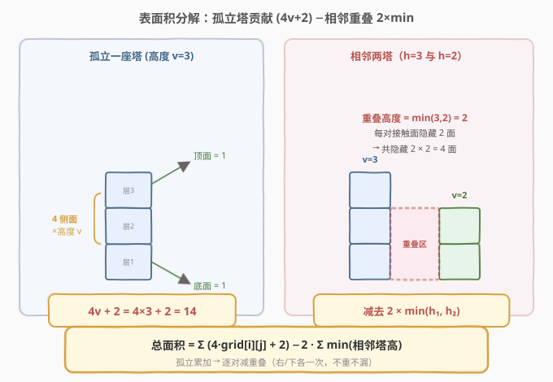
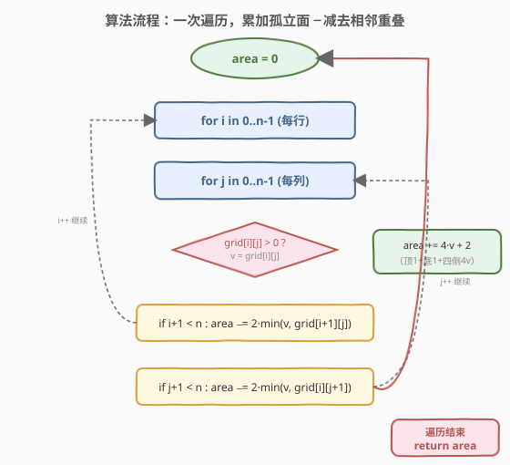
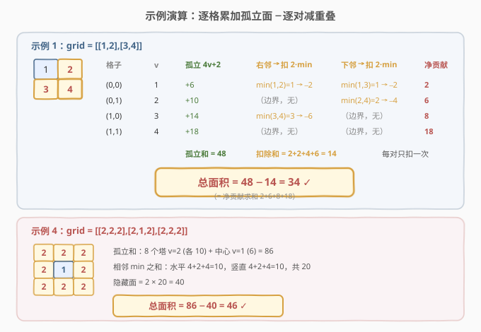

# LeetCode 三维形体的表面积 题解

## 1. 题目概述

- **标题 / 题号**：三维形体的表面积（#892，easy）
- **链接**：https://leetcode.cn/problems/surface-area-of-3d-shapes/
- **难度**：简单
- **标签**：几何、数组、数学

**题意**：在 $n \times n$ 的网格 `grid` 中，我们放置了一些 $1 \times 1 \times 1$ 的立方体。每个值 `v = grid[i][j]` 表示在格子 $(i, j)$ 上叠放了 $v$ 个立方体（一列高度为 $v$ 的"塔"）。返回最终形体的**总表面积**。

> 💡 **与 883 的区别**：883「三维形体投影面积」求的是三个方向上的**影子**面积（被遮挡的部分不计）；892 求的是整个形体**外露**的总表面积（所有从外部能看到的面，包括被相邻塔"咬合"后仍露出的部分）。两者共享同一个"塔状网格"模型，但统计口径截然不同。

**示例 1**：

```text
输入：grid = [[1,2],[3,4]]
输出：34
解释：2×2 网格，四个格子分别有 1、2、3、4 个立方体。
```

**示例 2**：

```text
输入：grid = [[2]]
输出：10
解释：单个格子放了 2 个立方体。表面积 = 顶1 + 底1 + 四侧(4×2) = 10。
```

**示例 3**：

```text
输入：grid = [[1,1,1],[1,0,1],[1,1,1]]
输出：32
```

**示例 4**：

```text
输入：grid = [[2,2,2],[2,1,2],[2,2,2]]
输出：46
```

**约束**：

- $n = \text{grid.length} = \text{grid[i].length}$
- $1 \le n \le 50$
- $0 \le \text{grid[i][j]} \le 50$

> ⚠️ 网格是**方阵**（行数 = 列数 = $n$）。每个格子是一根独立的"塔"，塔与塔之间在四个水平方向上可能相邻、可能分离；高度不同的相邻塔，较矮者被较高者"包住"的部分对内贴合、不计入表面积。

## 2. 解题思路

### 2.1 暴力思路：逐个立方体数面

最直观的做法是**枚举每一个立方体**，逐个统计它的 6 个面中有几个外露：

- 对位于 $(i, j, k)$（第 $k$ 层）的立方体，检查上下左右前后 6 个相邻位置是否被其它立方体占据；
- 若某方向被占据，该面不计入；否则计入。

总立方体数可达 $\sum \text{grid[i][j]} \le 50 \times 50 \times 50 = 125000$，每个立方体 $O(1)$ 判断，整体 $O(\sum v)$ 能 AC，但常数大、且需要把"塔"展开成三维坐标逐层处理，代码冗长。

> 💡 转机：**塔是连续叠放的，不必逐个立方体数**。一座高度为 $v$ 的塔，孤立放置时表面积是固定的——可以整体计算，再一次性扣掉与邻居"咬合"的部分。

### 2.2 核心观察：孤立塔表面积 + 相邻重叠扣除



把整体表面积拆成两步：**先假设每座塔都孤立，累加各自的表面积；再减去相邻塔之间被"咬合"隐藏的面**。

**第一步：孤立塔的表面积**。一座高度为 $v$ 的塔（$v > 0$）由 $v$ 个立方体叠成：

| 部位 | 面数 | 说明 |
|------|------|------|
| 顶面 | $1$ | 最顶层立方体的上表面 |
| 底面 | $1$ | 最底层立方体的下表面 |
| 四个侧面 | $4v$ | 每层 4 个侧面，共 $v$ 层 |
| **合计** | $4v + 2$ | $v = 0$ 时无塔，贡献 $0$ |

> 💡 **为什么是 $4v+2$ 而非 $6v$？** 单个立方体有 6 面，$v$ 个孤立立方体共 $6v$ 面。但叠成一根柱子后，相邻层之间贴合：$v$ 层有 $v-1$ 个层间接触面，每个接触面隐藏**两侧各一面**，共隐藏 $2(v-1)$ 面。于是 $6v - 2(v-1) = 4v + 2$。这就是"垂直叠放"已经消化掉的内部贴合。

**第二步：相邻塔的重叠扣除**。两座水平相邻的塔（高度 $h_1, h_2$）在接触面上贴合，贴合高度为 $\min(h_1, h_2)$——超过较矮塔高度的那部分较高塔侧面，仍然外露，不受影响。每个贴合的"单位高度"在**两座塔各隐藏一面**，故每对相邻塔隐藏 $2 \times \min(h_1, h_2)$ 面。

> ⚠️ **只看两个方向**：为避免每对相邻关系被扣两次（A 扣 B 一次、B 又扣 A 一次），对每个格子只检查**右方** `(i, j+1)` 和**下方** `(i+1, j)` 两个邻居。这样每对水平/竖直相邻关系恰好被处理一次，不重不漏。

**合并公式**：

$$
\text{表面积} = \sum_{i,j} \big(4 \cdot \text{grid[i][j]} + 2\big) \;-\; 2 \cdot \sum_{\text{相邻对}} \min(h_1, h_2)
$$

其中第一项仅对 `grid[i][j] > 0` 计入（$v=0$ 无塔无面），第二项对每对相邻格子（右/下方向）取两者高度的较小值求和后乘 2。

### 2.3 算法流程图



**完整步骤**：

1. 初始化 `area = 0`。
2. 双重循环遍历每个格子 $(i, j)$，记 $v = \text{grid[i][j]}$：
   - 若 $v > 0$：`area += 4 * v + 2`（孤立塔表面积）。
   - 若 `i + 1 < n`（有下方邻居）：`area -= 2 * min(v, grid[i+1][j])`。
   - 若 `j + 1 < n`（有右方邻居）：`area -= 2 * min(v, grid[i][j+1])`。
3. 返回 `area`。

> ⚠️ **边界处理**：下方/右方邻居的判断必须带越界检查（`i+1 < n` / `j+1 < n`）。边界格子的外露侧面不需要扣减（外面没有塔挡着），公式自然成立——没有邻居就不扣，孤立面全额计入。

### 2.4 示例演算

以示例 1 `grid = [[1,2],[3,4]]` 与示例 4 `grid = [[2,2,2],[2,1,2],[2,2,2]]` 为例，逐格拆解：



**示例 1**（`[[1,2],[3,4]]`）：

| 格子 | $v$ | 孤立 $4v+2$ | 右邻扣 $2\min$ | 下邻扣 $2\min$ | 净贡献 |
|------|-----|------------|----------------|----------------|--------|
| $(0,0)$ | 1 | $+6$ | $\min(1,2)=1 \to -2$ | $\min(1,3)=1 \to -2$ | $2$ |
| $(0,1)$ | 2 | $+10$ | 边界，无 | $\min(2,4)=2 \to -4$ | $6$ |
| $(1,0)$ | 3 | $+14$ | $\min(3,4)=3 \to -6$ | 边界，无 | $8$ |
| $(1,1)$ | 4 | $+18$ | 边界，无 | 边界，无 | $18$ |
| **合计** | — | $48$ | — | — | **$34$** ✓ |

孤立和 $48$，扣除和 $2+2+4+6=14$，$48 - 14 = 34$。等价于净贡献求和 $2+6+8+18=34$。

> 💡 **每对只扣一次**：$(0,0)$ 与 $(0,1)$ 这对水平邻居的重叠只在 $(0,0)$ 处扣（作为"右邻"），$(0,1)$ 处不再扣——它只负责自己与下方 $(1,1)$ 的关系。这正是"只看右/下两方向"带来的不重不漏。

**示例 2**（`[[2]]`）：孤立 $4 \times 2 + 2 = 10$，无邻居，总表面积 $10$。

**示例 4**（`[[2,2,2],[2,1,2],[2,2,2]]`）：

- 孤立和：8 个 $v=2$ 塔（各 $10$）+ 中心 $v=1$ 塔（$6$）$= 86$。
- 相邻 $\min$ 之和：水平方向 $4+2+4=10$，竖直方向 $4+2+4=10$，共 $20$。
- 隐藏面 $= 2 \times 20 = 40$。
- 总表面积 $= 86 - 40 = 46$ ✓。

> 💡 **中心 $v=1$ 塔的作用**：它比四周 $v=2$ 的塔矮，被四面包围。与每个邻居的 $\min$ 都是 $1$，四面各隐藏 $2$ 面，共隐藏 $8$ 面；但它的顶面（$1$）仍外露。若中心也是 $v=2$，则与邻居 $\min$ 全为 $2$，隐藏面翻倍——这正是示例 3 与示例 4 表面积差异的来源。

## 3. 参考代码

### C++

```cpp
class Solution {
public:
    int surfaceArea(vector<vector<int>>& grid) {
        int n = grid.size();
        int area = 0;
        for (int i = 0; i < n; ++i) {
            for (int j = 0; j < n; ++j) {
                int v = grid[i][j];
                if (v > 0) {
                    area += 4 * v + 2;                 // 孤立塔表面积：顶1+底1+四侧4v
                }
                if (i + 1 < n) {                       // 下方邻居：扣 2×min
                    area -= 2 * min(v, grid[i + 1][j]);
                }
                if (j + 1 < n) {                       // 右方邻居：扣 2×min
                    area -= 2 * min(v, grid[i][j + 1]);
                }
            }
        }
        return area;
    }
};
```

### Python

```python
class Solution:
    def surfaceArea(self, grid: List[List[int]]) -> int:
        n = len(grid)
        area = 0
        for i in range(n):
            for j in range(n):
                v = grid[i][j]
                if v > 0:
                    area += 4 * v + 2                  # 孤立塔表面积：顶1+底1+四侧4v
                if i + 1 < n:                          # 下方邻居：扣 2×min
                    area -= 2 * min(v, grid[i + 1][j])
                if j + 1 < n:                          # 右方邻居：扣 2×min
                    area -= 2 * min(v, grid[i][j + 1])
        return area
```

> 💡 **实现要点**：① 只用一个累加器 `area`，无额外数组。② `4*v + 2` 必须在 `v > 0` 时才加——`v == 0` 无塔无面（否则会错误地加上 $2$）。③ 两个邻居扣除各自独立判断越界，顺序无关。④ `min(v, neighbor)` 用的是**当前格的高度**与**邻居高度**的较小值，方向对称（`min` 满足交换律，故从哪一侧扣结果一致）。

## 4. 复杂度分析

| 维度 | 复杂度 | 说明 |
|------|--------|------|
| **时间复杂度** | $O(n^2)$ | 双重循环遍历 $n \times n$ 个格子各一次，每个格子 $O(1)$（一次加法 + 至多两次 `min`/减法）；已是该问题下界 |
| **空间复杂度** | $O(1)$ | 仅一个累加器 `area` 与循环变量，常数额外空间 |

> ⚠️ 相比逐立方体计数的暴力法 $O(\sum v)$，塔级累加法把每个格子的处理降为 $O(1)$，与塔高无关。当 $n=50$、$\text{grid[i][j]}=50$ 时，暴力法最坏 $125000$ 次操作，本法仅 $2500$ 次——常数优势显著。但两者渐近都受 $n$ 约束（$n \le 50$ 时性能差异可忽略），本题考察重点在**几何分解**而非性能。

| 写法 | 操作次数 | 与塔高关系 | 代码量 |
|------|---------|-----------|--------|
| 逐立方体数面 | $O(\sum v)$ | 相关（塔越高越慢） | 冗长，需三维坐标 |
| **塔级累加 − 重叠扣除** | $O(n^2)$ | 无关 | 紧凑，~10 行 |

## 5. 扩展：四方向逐格法与公式等价性

除了"孤立累加 − 重叠扣除"的写法，还有一种**逐格统计外露侧面**的等价写法：对每个格子 $(i, j)$，其四个方向的外露面积 = $\max(v - \text{邻居高度}, 0)$（邻居越矮，本塔该侧露出越多），加上顶底两面：

$$
\text{表面积} = \sum_{i,j} \Big[\, 2 \cdot [v > 0] \;+\; \sum_{\text{四方向}} \max(v - h_{\text{邻居}}, 0) \Big]
$$

其中边界方向邻居高度视作 $0$（外面没塔）。

```python
class Solution:
    def surfaceArea(self, grid: List[List[int]]) -> int:
        n = len(grid)
        area = 0
        for i in range(n):
            for j in range(n):
                if grid[i][j] > 0:
                    area += 2                       # 顶 + 底
                for ni, nj in [(i-1, j), (i+1, j), (i, j-1), (i, j+1)]:
                    neighbor = grid[ni][nj] if 0 <= ni < n and 0 <= nj < n else 0
                    area += max(grid[i][j] - neighbor, 0)
        return area
```

**两种写法的等价性**：逐格法对每对相邻塔计算的是 $\max(v-h_2,0) + \max(h_2-v,0) = |v - h_2|$（两座塔各自的外露部分之和），而"孤立−重叠"法对同一对计算 $4v+2 + 4h_2+2 - 2\min(v,h_2)$ 中归属于该方向的净效应。代入 $|v-h_2| = v + h_2 - 2\min(v,h_2)$ 即可验证两者一致。

> 💡 **何时用哪种？** 「孤立−重叠」写法更紧凑、只需看两个方向、边界处理简单（越界即不扣）；「四方向逐格」写法更直观地对应"每个方向露多少"，但要看四个方向且需显式处理边界取 0。面试中推荐前者，代码更短更不易错。

## 6. 面试要点

1. **一座高度为 $v$ 的孤立塔表面积为什么是 $4v+2$？**

   > 单个立方体 6 面，$v$ 个叠成柱后层间贴合隐藏 $2(v-1)$ 面（每个层间接触面藏两侧各一面），故 $6v - 2(v-1) = 4v + 2$。即顶 1 + 底 1 + 四个侧面各高 $v$ 共 $4v$。

2. **相邻两座塔为什么要扣 $2 \times \min(h_1, h_2)$ 而不是 $2 \times h_1$ 或 $2 \times h_2$？**

   > 接触面上，只有两座塔**都存在**的高度区间才会贴合隐藏——超过较矮塔高度的部分，较高塔的侧面仍外露。故贴合高度是 $\min(h_1, h_2)$，每单位高度隐藏两侧各一面，共 $2 \times \min$。

3. **为什么只检查右方和下方两个邻居，不会漏扣或重扣？**

   > 每对水平/竖直相邻关系有"左右"或"上下"两个端点。若两端点都扣，会重复一次；只让"左方/上方"那个端点扣（即检查右邻、下邻），则每对恰好被扣一次。遍历所有格子后，所有相邻对都被覆盖，不重不漏。

4. **`v == 0` 的格子怎么处理？为什么 `4v+2` 要加在 `v > 0` 判断里？**

   > `v == 0` 表示该格无塔，孤立表面积为 $0$。若不加判断直接算 $4 \times 0 + 2 = 2$，会错误地计入两个"虚拟面"。故必须 `if (v > 0)`。扣除部分无需特判：$\min(0, h) = 0$，自动不扣。

5. **这题和 883「三维形体投影面积」有什么联系和区别？**

   > 共享同一个"塔状网格"模型，但统计口径相反：883 求投影（影子，被遮挡的不计，每行/列取最大值）；892 求表面积（外露总面，被咬合的不计，逐对扣 $\min$）。883 的答案是 $\sum \max$ 型，892 是 $\sum (4v+2) - 2\sum\min$ 型。可对照理解"遮挡"在不同问题中的处理方式。

> 💡 **一句话总结**：892 是几何表面积入门题——把总表面积分解为「孤立塔贡献 $4v+2$」减去「相邻塔咬合 $2 \times \min$」，只看右/下两方向避免重复，一次 $O(n^2)$ 遍历即可。核心是"先加全量、再逐对扣重叠"的容斥思想。

## 同类练习题

| # | 题目 | 与本题的关联 |
|---|------|-------------|
| 883 | [三维形体投影面积](https://leetcode.cn/problems/projection-area-of-3d-shapes/)（[题解](../0801-0900/883_三维形体投影面积.md)） | 同一"塔状网格"模型的姊妹题——求三方向投影面积（每行/列取最大值），与 892 求外露表面积（逐对扣 min）形成"遮挡统计"的对照 |
| 223 | [矩形面积](https://leetcode.cn/problems/rectangle-area/)（[题解](../0201-0300/223_矩形面积.md)） | 经典"总面积 = 面积1 + 面积2 − 重叠"容斥，与 892 的"孤立累加 − 重叠扣除"同构，是同一容斥思想在二维平面的最简实例 |
| 836 | [矩形重叠](https://leetcode.cn/problems/rectangle-overlap/)（[题解](../0801-0900/836_矩形重叠.md)） | 判定两矩形是否相交并计算重叠区域，与 892 中"相邻塔取 min 求贴合高度"的相交/重叠判定同源 |
| 807 | [保持城市天际线](https://leetcode.cn/problems/max-increase-to-keep-city-skyline/)（[题解](../0801-0900/807_保持城市天际线.md)） | 网格上行/列最大值约束建筑高度，与 892 共享"网格上塔的高度"几何直觉，巩固对 grid 高度场的理解 |
| 850 | [矩形面积 II](https://leetcode.cn/problems/rectangle-area-ii/)（[题解](../0801-0900/850_矩形面积II.md)） | 多矩形并集面积（容斥 + 扫描线/离散化），是 223 的多体推广版，与 892 的"多体求并集面积"思想一致但规模更大 |
