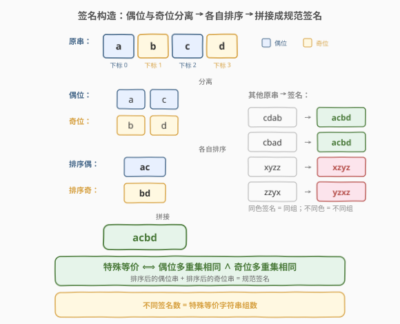
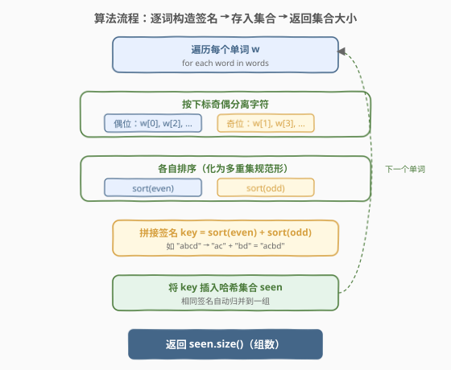
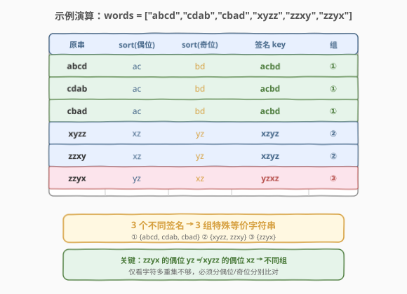

# 特殊等价字符串组

- **题目名称**：特殊等价字符串组
- **链接**：[893. 特殊等价字符串组](https://leetcode.cn/problems/groups-of-special-equivalent-strings/)
- **难度**：中等
- **标签**：数组、哈希表、字符串

## 1. 题目概述

给你一个字符串数组 `words`，所有字符串**长度相同**，仅由小写字母组成。

**一步操作**：可以交换字符串的任意两个**偶数下标**对应的字符，或任意两个**奇数下标**对应的字符（下标 0, 2, 4, … 为偶数下标，1, 3, 5, … 为奇数下标）。

两个字符串 `s` 和 `t` 如果经过**任意次数**的操作后可以变为相等，则称它们是**特殊等价**的。

返回 `words` 中**特殊等价字符串组**的数量——即将 `words` 按特殊等价关系划分，问能分成多少组（每组内的字符串两两特殊等价，且组间不等价）。

**示例 1**：

```text
输入：words = ["abcd","cdab","cbad","xyzz","zzxy","zzyx"]
输出：3
解释：
      一组为 ["abcd","cdab","cbad"]，三者两两特殊等价；
      另一组为 ["xyzz","zzxy"]；
      最后一组为 ["zzyx"]。
      注意 "zzxy" 与 "zzyx" 不特殊等价。
```

**示例 2**：

```text
输入：words = ["abc","acb","bac","bca","cab","cba"]
输出：3
解释：3 组 ["abc","cba"]、["acb","bca"]、["bac","cab"]
```

**约束条件**：

- `1 <= words.length <= 1000`
- `1 <= words[i].length <= 20`
- 所有 `words[i]` 都只由小写字母组成
- 所有 `words[i]` 都具有相同的长度

> 💡 这道题的本质是**等价关系划分**——交换操作定义了字符串上的等价类，问有多少个不同的等价类。与 [49. 字母异位词分组](../0001-0100/49_字母异位词分组.md) 是同一家族，区别在于这里**不是**对整个字符串排序，而是对偶数位、奇数位**分别**排序。核心在于识别出等价类的不变量。

---

## 2. 解题思路

### 2.1 暴力思路：对每对字符串验证可达性

最朴素的做法完全照搬定义：对 `words` 中的每对字符串 $(s, t)$，验证是否存在一条操作序列使 $s$ 变为 $t$。验证方式可以是 BFS——从 $s$ 出发，每步尝试交换两个偶位或两个奇位字符，看能否到达 $t$。

这种做法有两个致命问题：

1. **状态空间爆炸**：长度为 $L$ 的字符串，偶位有 $\lceil L/2 \rceil$ 个字符可任意排列、奇位有 $\lfloor L/2 \rfloor$ 个字符可任意排列，可达状态数高达 $\lceil L/2 \rceil! \times \lfloor L/2 \rfloor!$，$L = 20$ 时天文数字。
2. **配对验证低效**：对 $n$ 个字符串做 $O(n^2)$ 配对，每组还要跑 BFS，整体不可接受。

问题的本质在于**等价关系的判定**——与其逐对验证可达性，不如找到等价类的**规范表示**（不变量），直接按规范表示分组。

### 2.2 核心观察：偶位多重集 + 奇位多重集 = 不变量

关键洞察在于理解操作的本质：

- **交换两个偶位字符** ⟺ 对偶位字符做一次**对换**（transposition）
- 任意有限次对换 ⟺ **任意排列**

因此，偶数下标的字符可以被**任意重排**，奇数下标的字符也可以被**任意重排**，但偶位与奇位之间**不能交叉**。

> 💡 换言之，操作保持的不变量是：**偶数下标字符的多重集**与**奇数下标字符的多重集**。两个字符串特殊等价，当且仅当它们的偶位多重集相同**且**奇位多重集相同。

将多重集化为规范形式最简单的方法就是**排序**：偶位字符排序后拼接、奇位字符排序后拼接，得到的字符串就是等价类的**规范签名**（canonical signature）。



以 `"abcd"` 为例：

| 步骤 | 偶位字符（下标 0, 2） | 奇位字符（下标 1, 3） |
|------|------------------------|------------------------|
| 提取 | `a`, `c` | `b`, `d` |
| 排序 | `ac` | `bd` |
| 拼接签名 | `ac` + `bd` = **`acbd`** | — |

而 `"cdab"` 的偶位是 `c`, `a`（排序得 `ac`）、奇位是 `d`, `b`（排序得 `bd`），签名同样是 `acbd`——与 `"abcd"` 同组。

> ⚠️ **易错点**：不能简单地排序整个字符串。例如 `"zzyx"` 全排序得 `xyzz`，与 `"xyzz"` 相同——但它们**不**特殊等价（`"zzyx"` 偶位 `yz`、奇位 `xz` ≠ `"xyzz"` 偶位 `xz`、奇位 `yz`）。必须**分偶位/奇位**各自排序，这正是本题与 49 题（字母异位词分组）的关键区别。

### 2.3 算法流程图



**完整步骤**：

1. **初始化**一个哈希集合 `seen`，用于存放所有出现过的签名。
2. **遍历每个单词** `w`：
   - 按下标奇偶分离字符：偶位字符（`w[0]`, `w[2]`, …）放入 `even`，奇位字符（`w[1]`, `w[3]`, …）放入 `odd`。
   - 分别对 `even` 和 `odd` 排序。
   - 拼接签名 `key = sort(even) + sort(odd)`。
   - 将 `key` 插入 `seen`（相同签名自动归并）。
3. **返回** `seen.size()`，即不同签名的数量 = 特殊等价字符串组的数量。

> 💡 为什么用哈希集合就够了？因为「特殊等价」是一个**等价关系**（自反、对称、传递），等价类由签名唯一确定。我们不需要并查集或配对比较——每个词算出签名后投入集合，集合大小天然就是等价类个数。

### 2.4 示例演算

以示例 1 `words = ["abcd","cdab","cbad","xyzz","zzxy","zzyx"]` 为例，逐词计算签名：



| 原串 | sort(偶位) | sort(奇位) | 签名 key | 组 |
|------|-----------|-----------|----------|-----|
| `abcd` | `ac` | `bd` | `acbd` | ① |
| `cdab` | `ac` | `bd` | `acbd` | ① |
| `cbad` | `ac` | `bd` | `acbd` | ① |
| `xyzz` | `xz` | `yz` | `xzyz` | ② |
| `zzxy` | `xz` | `yz` | `xzyz` | ② |
| `zzyx` | `yz` | `xz` | `yzxz` | ③ |

3 个不同签名 → 返回 **3**。

> 💡 注意 `zzyx`：它的偶位是 `z`, `y`（排序 `yz`）、奇位是 `z`, `x`（排序 `xz`），签名 `yzxz` 与 `xyzz`/`zzxy` 的 `xzyz` 不同——虽然两者含相同字符，但偶位/奇位的分配不同，故不特殊等价。这正是不变量判定的精髓：**字符的"位置奇偶归属"不可改变**。

---

## 3. 参考代码

### C++

```cpp
class Solution {
  public:
    int numSpecialEquivGroups(vector<string>& words) {
        unordered_set<string> seen;
        for (const string& w : words) {
            string even, odd;
            for (int i = 0; i < (int)w.size(); ++i) {
                (i & 1 ? odd : even) += w[i];       // 按下标奇偶分离
            }
            sort(even.begin(), even.end());         // 偶位排序
            sort(odd.begin(), odd.end());           // 奇位排序
            seen.insert(even + odd);                // 拼接签名入集合
        }
        return seen.size();
    }
};
```

### Python

```python
class Solution:
    def numSpecialEquivGroups(self, words: List[str]) -> int:
        def sig(w: str) -> str:
            return "".join(sorted(w[::2])) + "".join(sorted(w[1::2]))
        return len({sig(w) for w in words})
```

> 💡 Python 用切片 `w[::2]`（步长 2，取偶位）和 `w[1::2]`（从下标 1 起步长 2，取奇位）一步完成分离，配合 `sorted` 和集合推导式，三行写完全部逻辑。C++ 则用 `i & 1` 三元表达式分流字符，两段 `sort` + 拼接 + `insert` 一气呵成。两版思路完全一致：**分离 → 排序 → 拼接签名 → 集合去重**。

---

## 4. 复杂度分析

| 维度 | 复杂度 | 说明 |
|------|--------|------|
| **时间复杂度** | $O(N \cdot L \log L)$ | $N$ 为 `words` 长度，$L$ 为单词长度；每个词分离 $O(L)$、排序 $O(L \log L)$、拼接与哈希插入 $O(L)$，总计 $O(N \cdot L \log L)$ |
| **空间复杂度** | $O(N \cdot L)$ | 哈希集合最多存储 $N$ 个长度为 $L$ 的签名字符串 |

> ⚠️ 严格说哈希单次操作需对长度 $L$ 的字符串做哈希与比较，为 $O(L)$ 而非 $O(1)$，但整体仍为 $O(N \cdot L \log L)$。本题 $N \le 1000$、$L \le 20$，实际开销极小。

---

## 5. 扩展：计数字典替代排序签名

排序签名的时间复杂度为 $O(L \log L)$。由于字符仅 26 种小写字母，可以用**长度 26 的计数字典**（频次数组）代替排序，将单词签名的时间降到 $O(L)$：

```python
class Solution:
    def numSpecialEquivGroups(self, words: List[str]) -> int:
        def sig(w: str) -> tuple:
            even = [0] * 26
            odd = [0] * 26
            for i, ch in enumerate(w):
                if i & 1:
                    odd[ord(ch) - 97] += 1
                else:
                    even[ord(ch) - 97] += 1
            return (tuple(even), tuple(odd))
        return len({sig(w) for w in words})
```

**思路**：偶位频次数组 + 奇位频次数组构成一个可哈希的元组，作为签名。频次数组天然是多重集的规范表示，且构造只需 $O(L)$（遍历一次），无需排序。两个频次数组相等 ⟺ 两个多重集相同 ⟺ 特殊等价。

> 💡 这与排序签名**完全等价**——排序后的字符串和频次数组都是多重集的双射表示。当字母表规模 $|\Sigma|$ 远小于 $L$ 时，计数法 $O(L + |\Sigma|)$ 优于排序法 $O(L \log L)$；当 $L$ 很小（如本题 $L \le 20$）时两者差异不大，排序法更简洁。这种「排序 vs 计数」的取舍在 [49. 字母异位词分组](../0001-0100/49_字母异位词分组.md) 中同样出现。

---

## 6. 面试要点

1. **为什么偶位/奇位分别排序就能判定特殊等价？**

   - 交换两个偶位字符是偶位字符上的一次对换（transposition），而任意排列都可分解为对换的复合。因此偶位字符可被**任意重排**，奇位字符同理，但偶位与奇位之间不能交叉。所以等价类的不变量就是「偶位多重集 + 奇位多重集」，排序后的拼接串是这个不变量的规范表示，两串特殊等价 ⟺ 签名相同。

2. **能不能直接对整个字符串排序作为签名？**

   - 不能。例如 `"zzyx"` 全排序得 `xyzz`，但它与 `"xyzz"` **不**特殊等价——前者的 `y` 在偶位、`x` 在奇位，后者正好相反。全排序丢失了「字符属于偶位还是奇位」的信息，而正是这个归属不可改变。必须分偶位/奇位各自排序。

3. **为什么用哈希集合就够了，不需要并查集？**

   - 特殊等价是**等价关系**（自反、对称、传递），每个等价类由签名唯一确定。我们只需给每个词算签名、投入集合，集合大小就是等价类个数——$O(1)$ 归并，无需并查集的 union-find。对比 [839. 相似字符串组](839_相似字符串组.md) 中等价关系由「至多两处不同」定义、无法化为简单签名，才需要并查集做配对合并。

4. **如果字符集很大（如 Unicode），排序法还适用吗？**

   - 排序法仍然适用，复杂度仍为 $O(L \log L)$，因为排序不依赖字符集大小。但计数法（频次哈希表）的代价会随字符集增大而上升，此时排序法更优。若字符集规模 $|\Sigma| \ll L$，计数法 $O(L + |\Sigma|)$ 更快。

5. **如果允许交换任意两个位置（不区分奇偶），本题退化为什么？**

   - 退化为 [49. 字母异位词分组](../0001-0100/49_字母异位词分组.md)——整个字符串的字符可任意重排，等价类由全字符多重集决定，签名就是对整个字符串排序。本题是 49 题的「受限排列」变体：排列被限制在偶位组内和奇位组内分别进行。

> 💡 **一句话总结**：893 是「等价类规范签名」的经典题——交换操作的不变量是偶位/奇位各自的多重集，排序后拼接即为规范签名，集合大小即组数。与 49 题（字母异位词分组）一脉相承，区别仅在排序粒度从「整串」细化到「偶位/奇位分排」。

---

## 7. 同类练习题

- [49. 字母异位词分组](https://leetcode.cn/problems/group-anagrams/)（[题解](../0001-0100/49_字母异位词分组.md)）：对整个字符串排序作为签名分组，893 的「精神父题」——本题将排序粒度从整串细化到偶位/奇位分排
- [839. 相似字符串组](https://leetcode.cn/problems/similar-string-groups/)（[题解](839_相似字符串组.md)）：同为字符串等价类分组，但等价关系无法化为简单签名，需并查集 + 配对判定，对照本题的「签名归并」与「并查集归并」两种策略
- [859. 亲密字符串](https://leetcode.cn/problems/buddy-strings/)（[题解](859_亲密字符串.md)）：字符串交换等价判定，关注「恰交换两位」的精确条件，对照本题「任意次交换」的宽松条件
- [187. 重复的 DNA 序列](https://leetcode.cn/problems/repeated-dna-sequences/)（[题解](../0201-0300/187_重复的DNA序列.md)）：定长子串的签名/哈希去重，同为「构造规范键 + 集合查重」模式
- [242. 有效的字母异位词](https://leetcode.cn/problems/valid-anagram/)：单对字符串的异位词判定（排序 / 计数两种签名），是 49 与 893 的单对验证基础版
