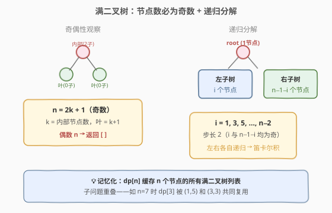
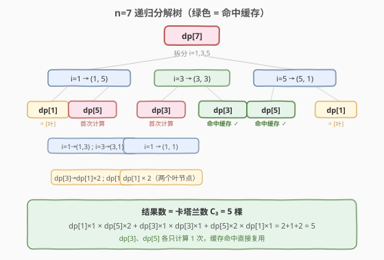
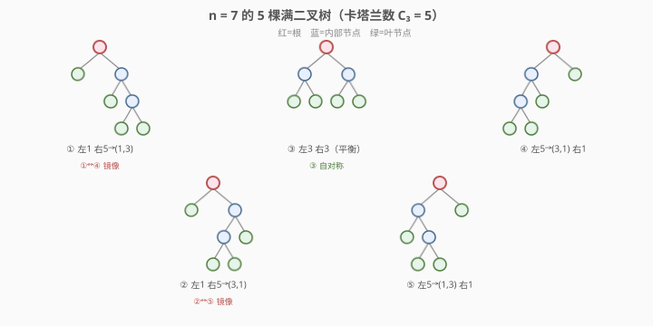

# LeetCode 所有可能的满二叉树 题解

## 1. 题目概述

- **标题 / 题号**：所有可能的满二叉树（#894，medium）
- **链接**：https://leetcode.cn/problems/all-possible-full-binary-trees/
- **难度**：中等
- **标签**：树、二叉树、递归、分治、动态规划

**题意**：给定一个整数 `n`，请生成并返回包含 `n` 个节点的**所有可能的满二叉树**（full binary tree）。每个节点的值均为 `0`。

**满二叉树**的定义：每个节点要么有 **0 个子节点**（叶节点），要么有 **2 个子节点**（内部节点）——不存在只有一个孩子的节点。

**示例 1**：

```text
输入：n = 7
输出：[[0,0,0,null,null,0,0,null,null,0,0],
       [0,0,0,null,null,0,0,0,0],
       [0,0,0,0,0,0,0],
       [0,0,0,0,0,null,null,null,null,0,0],
       [0,0,0,0,0,null,null,0,0]]
解释：共有 5 种不同的满二叉树（层序表示）
```

**示例 2**：

```text
输入：n = 3
输出：[[0,0,0]]
```

**约束**：

- `1 <= n <= 20`

> 💡 本题核心是发现满二叉树的**奇偶性约束**（节点数必为奇数），并利用**递归分治 + 记忆化**枚举所有合法的左右子树拆分。结果数恰为卡塔兰数，与 [96. 不同的二叉搜索树](../0001-0100/96_不同的二叉搜索树.md) 共享同一递推结构。

## 2. 解题思路

### 2.1 暴力思路：枚举所有二叉树再筛选

最朴素的想法是枚举 `n` 个节点的所有二叉树形态，再过滤出满二叉树。但 `n` 个节点的二叉树形态数本身就是卡塔兰数量级，且大量树不满足满二叉树约束，暴力枚举会产生巨量无效分支，效率极差。

### 2.2 核心观察：奇偶性 + 递归分解



**观察一：满二叉树的节点数必为奇数。**

满二叉树中每个内部节点贡献恰好 2 个子节点。设内部节点数为 $k$，则：

- 总节点数 $n = 1 + 2k$（根节点 1 个 + 每个内部节点延伸 2 条边各贡献 1 个子节点）
- 叶节点数 $= k + 1$

因此 $n$ 恒为奇数。**偶数 $n$ 直接返回空列表**。

**观察二：递归分解——根占 1 个节点，剩余 $n-1$ 个分给左右子树。**

去掉根节点后，剩余 $n-1$ 个节点需要分配给左右子树。由于左右子树各自也是满二叉树，它们的节点数也必须是奇数。设左子树有 $i$ 个节点，则右子树有 $n - 1 - i$ 个节点，其中 $i$ 和 $n-1-i$ 均为奇数。

> 💡 $n-1$ 是偶数，$i$ 取奇数时 $n-1-i$ 自动也是奇数。因此 $i$ 的取值为 $1, 3, 5, \ldots, n-2$（步长 2）。

**观察三：左右子树的笛卡尔积。**

对每个合法的 $i$，递归获取左子树的**所有形态** `lefts = build(i)` 和右子树的**所有形态** `rights = build(n-1-i)`，然后做笛卡尔积——每对 `(l, r)` 组合出一棵新树。

### 2.3 记忆化：子问题重叠



以 $n=7$ 为例，递归分解如下：

| 拆分 $(i, n{-}1{-}i)$ | 左子树 | 右子树 | 组合数 |
|------------------------|--------|--------|--------|
| $(1, 5)$ | `dp[1]`：1 棵 | `dp[5]`：2 棵 | $1 \times 2 = 2$ |
| $(3, 3)$ | `dp[3]`：1 棵 | `dp[3]`：1 棵 | $1 \times 1 = 1$ |
| $(5, 1)$ | `dp[5]`：2 棵 | `dp[1]`：1 棵 | $2 \times 1 = 2$ |

总计 $2 + 1 + 2 = 5$ 棵。

> ⚠️ 注意 `dp[3]` 在 $(3,3)$ 拆分中被左右各调用一次，`dp[5]` 在 $(1,5)$ 和 $(5,1)$ 中各调用一次。**不加记忆化则重复计算**，加上记忆化后每个子问题只求解一次。

### 2.4 示例演算：n=7 的 5 棵满二叉树



5 棵树按拆分方式分为三组：

- **$(1,5)$ 拆分**（2 棵）：左子树为单个叶节点，右子树（5 节点）有两种形态
  - ① 右子树再拆 $(1,3)$：右-右子树为 3 节点满二叉树
  - ② 右子树再拆 $(3,1)$：右-左子树为 3 节点满二叉树
- **$(3,3)$ 拆分**（1 棵）：
  - ③ 左右各 3 节点，完全对称平衡
- **$(5,1)$ 拆分**（2 棵）：左子树（5 节点）有两种形态，右子树为单个叶节点
  - ④ 左子树拆 $(3,1)$：① 的镜像
  - ⑤ 左子树拆 $(1,3)$：② 的镜像

> 💡 ①↔④、②↔⑤ 互为镜像，③ 自身对称。5 棵树恰好是卡塔兰数 $C_3 = \frac{1}{4}\binom{6}{3} = 5$。

## 3. 参考代码

### C++（记忆化递归）

```cpp
class Solution {
  public:
    vector<TreeNode*> allPossibleFBT(int n) {
        if (n % 2 == 0) return {};
        memo.clear();
        return build(n);
    }

  private:
    unordered_map<int, vector<TreeNode*>> memo;

    vector<TreeNode*>& build(int n) {
        if (memo.count(n)) return memo[n];
        vector<TreeNode*> res;
        if (n == 1) {
            res.push_back(new TreeNode(0));
            return memo[n] = move(res);
        }
        for (int i = 1; i < n; i += 2) {       // i 取奇数：1, 3, ..., n-2
            vector<TreeNode*>& lefts  = build(i);
            vector<TreeNode*>& rights = build(n - 1 - i);
            for (TreeNode* l : lefts) {
                for (TreeNode* r : rights) {
                    TreeNode* root = new TreeNode(0);
                    root->left  = l;
                    root->right = r;
                    res.push_back(root);
                }
            }
        }
        return memo[n] = move(res);
    }
};
```

### Python

```python
class Solution:
    def allPossibleFBT(self, n: int) -> List[Optional[TreeNode]]:
        if n % 2 == 0:
            return []
        memo: Dict[int, List[Optional[TreeNode]]] = {}

        def build(k: int) -> List[Optional[TreeNode]]:
            if k in memo:
                return memo[k]
            if k == 1:
                memo[1] = [TreeNode(0)]
                return memo[1]
            res = []
            for i in range(1, k, 2):              # i 取奇数：1, 3, ..., k-2
                for left in build(i):
                    for right in build(k - 1 - i):
                        res.append(TreeNode(0, left, right))
            memo[k] = res
            return res

        return build(n)
```

> 💡 **记忆化共享指针**：`memo[k]` 中缓存的 `TreeNode*` 会被多棵树共享引用（如 `dp[3]` 的节点同时出现在 $(3,3)$ 的左右子树中）。LeetCode 判题不释放节点，因此共享安全。若需独立所有权，可在组合时深拷贝子树。

## 4. 复杂度分析

| 维度 | 复杂度 | 说明 |
|------|--------|------|
| 时间复杂度 | $O(n \cdot C_m)$ | $m = (n-1)/2$，$C_m$ 为第 $m$ 个卡塔兰数；生成 $C_m$ 棵树每棵 $n$ 个节点，记忆化保证每个子问题只算一次 |
| 空间复杂度 | $O(n \cdot C_m)$ | `memo` 存储所有子问题的树列表；递归栈 $O(n)$ |

> 💡 $n \le 20$ 时最大奇数为 19，$m = 9$，$C_9 = 4862$，总节点数约 $19 \times 4862 \approx 9.2 \times 10^4$，完全可控。

## 5. 扩展：迭代 DP 与卡塔兰数

### 5.1 迭代 DP（自底向上）

将记忆化递归改为自底向上的迭代 DP，思路完全等价：

```cpp
vector<TreeNode*> allPossibleFBT(int n) {
    if (n % 2 == 0) return {};
    vector<vector<TreeNode*>> dp(n + 1);
    dp[1] = {new TreeNode(0)};
    for (int k = 3; k <= n; k += 2) {
        for (int i = 1; i < k; i += 2) {
            for (TreeNode* l : dp[i]) {
                for (TreeNode* r : dp[k - 1 - i]) {
                    TreeNode* root = new TreeNode(0);
                    root->left = l;
                    root->right = r;
                    dp[k].push_back(root);
                }
            }
        }
    }
    return dp[n];
}
```

### 5.2 与卡塔兰数的联系

满二叉树（$n = 2m+1$ 个节点）的形态数等于第 $m$ 个卡塔兰数：

$$C_m = \frac{1}{m+1}\binom{2m}{m}, \quad C_0 = 1, \quad C_{m+1} = \sum_{i=0}^{m} C_i \cdot C_{m-i}$$

这与 [96. 不同的二叉搜索树](../0001-0100/96_不同的二叉搜索树.md) 的递推结构完全一致：

| 题目 | 节点数 | 递推 | 结果 |
|------|--------|------|------|
| 96 | $n$ 个节点 | $f(n) = \sum_{i=0}^{n-1} f(i) \cdot f(n{-}1{-}i)$ | $C_n$（计数） |
| 894 | $2m{+}1$ 个节点 | $f(2m{+}1) = \sum_{i=0}^{m-1} f(2i{+}1) \cdot f(2(m{-}1{-}i){+}1)$ | $C_m$（生成） |

区别在于：96 只需计数（返回整数），894 需要生成所有树（返回节点列表）；894 的奇偶约束使得等效"卡塔兰下标"为 $m = (n-1)/2$。

## 6. 面试要点

1. **为什么偶数 n 返回空列表？**
   - 满二叉树每个内部节点恰好 2 个子节点，总节点数 $n = 1 + 2k$ 恒为奇数。偶数 $n$ 不可能构成满二叉树。

2. **为什么要记忆化？不加记忆化的复杂度如何？**
   - 不加记忆化时，`build(3)` 在 $n=7$ 的 $(3,3)$ 拆分中被调用两次，`build(5)` 在 $(1,5)$ 和 $(5,1)$ 中各调一次——子问题大量重叠。不加记忆化是指数级重复计算；加上后每个子问题只算一次。

3. **记忆化共享指针会有问题吗？**
   - `memo` 中的 `TreeNode*` 被多棵树共享。LeetCode 判题不释放节点故安全。若调用方可能释放树，则需深拷贝。面试中说明这一点即可。

4. **为什么 i 步长为 2？**
   - 左子树 $i$ 必须是奇数（满二叉树约束），$n-1$ 是偶数，$i$ 奇则 $n-1-i$ 也奇。因此 $i = 1, 3, 5, \ldots, n-2$。

5. **递归与迭代 DP 哪个更好？**
   - 两者等价。递归更直观（自然表达分治），迭代 DP 避免递归栈开销。$n \le 20$ 时递归栈最多 10 层，两者均可。

## 同类练习题

| # | 题目 | 与本题的关联 |
|---|------|-------------|
| 96 | [不同的二叉搜索树](https://leetcode.cn/problems/unique-binary-search-trees/)（[题解](../0001-0100/96_不同的二叉搜索树.md)） | 同卡塔兰数递推，只计数不生成 |
| 95 | [不同的二叉搜索树 II](https://leetcode.cn/problems/unique-binary-search-trees-ii/) | 生成所有 BST，结构与本题最接近（分治 + 笛卡尔积） |
| 241 | [为运算表达式设计优先级](https://leetcode.cn/problems/different-ways-to-add-parentheses/)（[题解](../0201-0300/241_为运算表达式设计优先级.md)） | 分治 + 笛卡尔积组合所有结果 |
| 89 | [格雷编码](https://leetcode.cn/problems/gray-code/)（[题解](../0001-0100/89_格雷编码.md)） | 构造型递归，镜像反射生成 |
