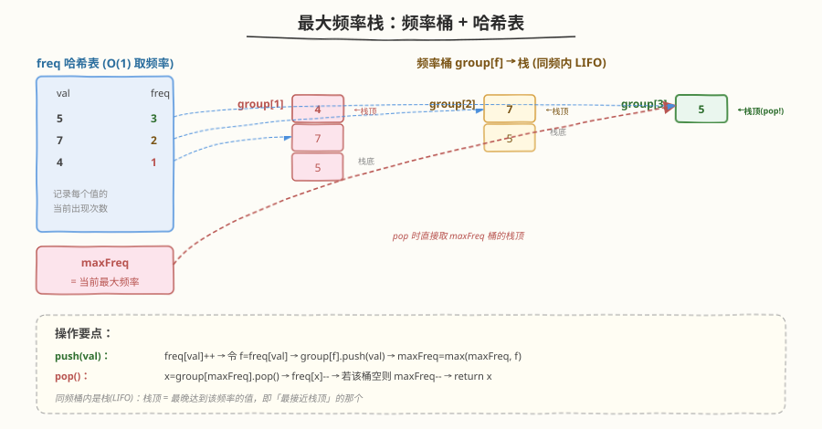
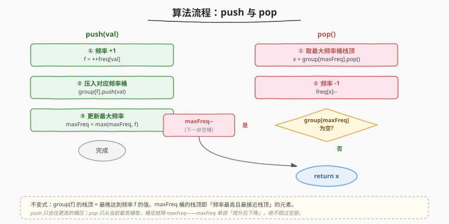
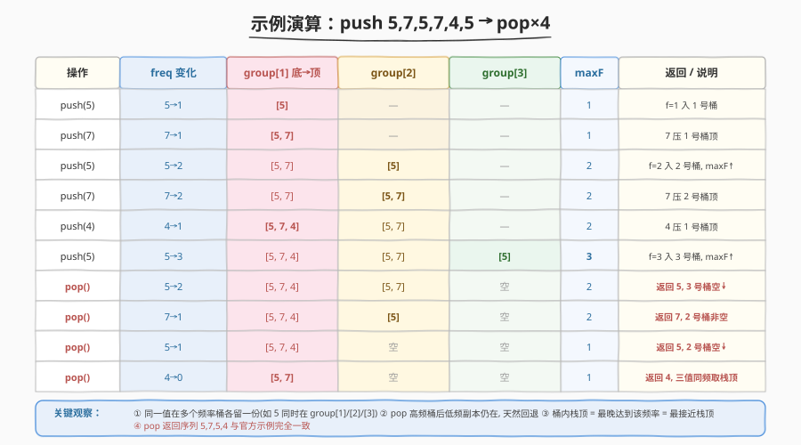

# LeetCode 最大频率栈 题解

## 1. 题目概述

- **标题 / 题号**：最大频率栈（#895，hard）
- **链接**：https://leetcode.cn/problems/maximum-frequency-stack/
- **难度**：困难
- **标签**：设计、栈、哈希表

**题意**：设计一个类似栈的数据结构 `FreqStack`，将元素压入栈，并**弹出出现频率最高的元素**。

- `FreqStack()`：构造一个空的频率栈
- `void push(int val)`：将整数 `val` 压入栈顶
- `int pop()`：删除并返回栈中**出现频率最高**的元素；若频率最高的元素不止一个，则移除并返回**最接近栈顶**的那个

**示例 1**：

```text
输入：
["FreqStack","push","push","push","push","push","push","pop","pop","pop","pop"],
[[],[5],[7],[5],[7],[4],[5],[],[],[],[]]
输出：[null,null,null,null,null,null,null,5,7,5,4]

解释：
push(5) → 栈 [5]
push(7) → 栈 [5,7]
push(5) → 栈 [5,7,5]
push(7) → 栈 [5,7,5,7]
push(4) → 栈 [5,7,5,7,4]
push(5) → 栈 [5,7,5,7,4,5]      // 5 出现 3 次（频率最高）
pop()   → 返回 5，栈 [5,7,5,7,4] // 5 频率最高
pop()   → 返回 7，栈 [5,7,5,4]   // 5、7 频率均为 2，7 最接近栈顶
pop()   → 返回 5，栈 [5,7,4]     // 5 频率最高（2 次）
pop()   → 返回 4，栈 [5,7]       // 4、5、7 频率均为 1，4 最接近栈顶
```

**约束**：

- $0 \leq \text{val} \leq 10^9$
- `push` 和 `pop` 的总操作数不超过 $2 \times 10^4$
- 调用 `pop` 时栈中至少有一个元素

## 2. 解题思路

### 2.1 暴力思路：每次扫描找最高频

最直观的做法：用一个数组模拟栈，`push` 直接追加。`pop` 时扫描整个数组，统计每个值的频率，找到频率最高的值；频率并列时取下标最大的（最接近栈顶）。然后从数组中删掉该元素。

```text
stack = []
push(val): stack.append(val)               // O(1)

pop():
    freq = 统计 stack 中每个值出现次数      // O(n)
    maxF = max(freq.values())
    从右往左找第一个 freq[v]==maxF 的下标 i  // O(n)
    return stack.pop(i)                    // O(n) 删除中间元素
```

每次 `pop` 需要 $O(n)$ 统计 + $O(n)$ 查找 + $O(n)$ 删除，总计 $O(n)$。操作数 $2 \times 10^4$、$n$ 也达 $2 \times 10^4$ 时，最坏 $O(n^2) \approx 4 \times 10^8$，**会超时**。

> ⚠️ 暴力法的问题在于：每次 `pop` 都从头统计频率，**重复计算了不变的信息**。而且「频率最高 + 最接近栈顶」这个复合条件，如果每次都现算，无法利用之前的结构。我们需要一种能**把「频率」和「时序」同时维护好**的数据结构。

### 2.2 核心观察：频率桶 + 哈希表 + maxFreq



这道题的「频率」维度让人联想到 [LFU 缓存（460）](../0401-0500/460_LFU缓存.md)——两者都用**频率桶**思想。但本题是「取最高频」而非「淘汰最低频」，且桶内只需 **LIFO（栈）** 而非 LRU。关键洞察是：

**把「达到某一频率」的值，按到达顺序压入对应频率的栈。**

具体来说，维护三个数据结构：

| 数据结构 | 职责 | 复杂度 |
|---------|------|--------|
| `freq` 哈希表 | `val → 当前频率` | $O(1)$ 查/改 |
| `group` 哈希表 | `频率 f → 栈`，栈中存达到频率 f 的值（按 push 时序） | $O(1)$ 压/弹 |
| `maxFreq` | 当前最大频率，pop 时直接定位目标桶 | $O(1)$ 取 |

**为什么 `group[f]` 用栈（LIFO）就能解决「最接近栈顶」？**

> 💡 这是本题最精妙的一点。当一个值 `val` 被 push，它的频率从 `f-1` 变成 `f`，我们把它压入 `group[f]`。**`group[f]` 的栈顶，就是「最晚达到频率 f」的那个值**。而「最晚达到频率 f」恰恰意味着它在整体栈中最靠后（最接近栈顶）——因为 push 是按时间顺序追加的，越晚 push 的越靠顶。所以 `group[maxFreq]` 的栈顶，天然就是「频率最高 + 最接近栈顶」的元素，一步 `pop` 即可。

**关键细节：同一值在多个频率桶各留一份。** 例如 push 5 三次，则 5 同时存在于 `group[1]`、`group[2]`、`group[3]` 中。`pop` 从 `group[3]` 取走 5 后，`group[1]`、`group[2]` 里的 5 **仍然保留**——它们代表「5 在频率为 1、2 时被 push 过」。当高频桶被掏空、`maxFreq` 下降后，低频桶里的 5 自然成为候选，实现「频率回退」。

> 💡 **与 LFU（460）的对比**：两者都是「频率桶 + 哈希表」。LFU 桶内是**双向链表（LRU）**，淘汰最低频+最久未用，`min_freq` 只增或重置；FreqStack 桶内是**栈（LIFO）**，弹出最高频+最新，`maxFreq` 可升可降。可以说 **FreqStack 是 LFU 的镜像版**——把「最小频率 + 最旧」换成「最大频率 + 最新」。

### 2.3 算法流程



**`push(val)`**：

1. `f = ++freq[val]`（频率先 +1）
2. `group[f].push(val)`（压入新频率对应的桶）
3. `maxFreq = max(maxFreq, f)`（更新最大频率）

**`pop()`**：

1. `x = group[maxFreq].pop()`（取最高频桶的栈顶）
2. `freq[x]--`（该值频率 -1）
3. 若 `group[maxFreq]` 变空 → `maxFreq--`（下降到下一非空桶）
4. `return x`

> ⚠️ **`maxFreq` 下降的正确性**：pop 后若 `group[maxFreq]` 为空，`maxFreq--` 即可。为什么不用跳很远？因为频率是「逐次累加」的——一个值要达到频率 `f`，必然先经过 `f-1, f-2, ..., 1`，所以 `group[1..maxFreq-1]` 这些桶**一定非空**（只要栈里还有元素）。`maxFreq--` 后新桶必有元素，最多连续减几次就能命中非空桶。其实更严格地说：因为最高频的值被弹掉一份后，它在该频率的副本没了，但它在 `maxFreq-1` 桶里还有副本，所以 `group[maxFreq-1]` 必非空——**减一次就够**。

### 2.4 示例演算

以 `push 5,7,5,7,4,5` 后连续 `pop` 四次为例，跟踪各频率桶状态：



几个值得关注的瞬间：

- **push(5) 第 3 次**（第 6 步）：`freq[5]=3`，5 被压入 `group[3]`，`maxFreq` 升到 3。此时 5 同时存在于三个桶中。
- **第 1 次 pop**（第 7 步）：从 `group[3]` 栈顶取 5，`group[3]` 变空 → `maxFreq` 降到 2。注意 `group[1]`、`group[2]` 里的 5 都还在。
- **第 2 次 pop**（第 8 步）：`group[2]` 栈顶是 7（因为 7 比 5 晚达到频率 2），返回 7。`group[2]` 非空（还剩 5），`maxFreq` 不变。
- **第 4 次 pop**（第 10 步）：此时 4、5、7 频率都是 1，`group[1]` 栈顶是 4（最晚 push 进 1 号桶），返回 4。完美符合「同频取最接近栈顶」。

> 💡 **「最接近栈顶」的本质**：`group[f]` 中元素的入栈顺序，就是它们在整体栈中被 push 的时间顺序。栈顶 = 最晚入 = 最接近栈顶。所以「取 `group[maxFreq]` 栈顶」一步就同时满足了「频率最高」和「最接近栈顶」两个条件，无需额外比较。

## 3. 参考代码

### C++

```cpp
// 最大频率栈.cpp —— 频率桶 + 哈希表 + maxFreq
// 编译: g++ -O2 -std=c++17 最大频率栈.cpp -o freqstack
#include <unordered_map>
#include <stack>
#include <vector>
using namespace std;

class FreqStack {
    unordered_map<int, int> freq;                 // val -> 当前频率
    unordered_map<int, stack<int>> group;         // 频率 f -> 栈(达到该频率的值)
    int maxFreq = 0;
  public:
    FreqStack() {}

    void push(int val) {
        int f = ++freq[val];                      // 频率 +1
        group[f].push(val);                       // 压入对应频率桶
        if (f > maxFreq) maxFreq = f;             // 更新最大频率
    }

    int pop() {
        int x = group[maxFreq].top();             // 最高频桶的栈顶
        group[maxFreq].pop();
        freq[x]--;
        if (group[maxFreq].empty()) {             // 桶空则下降 maxFreq
            maxFreq--;
        }
        return x;
    }
};
```

### Python

```python
from collections import defaultdict


class FreqStack:
    def __init__(self):
        self.freq = defaultdict(int)              # val -> 当前频率
        self.group = defaultdict(list)            # 频率 f -> 栈(list 模拟)
        self.max_freq = 0

    def push(self, val: int) -> None:
        f = self.freq[val] + 1
        self.freq[val] = f
        self.group[f].append(val)                 # 压入对应频率桶
        if f > self.max_freq:
            self.max_freq = f

    def pop(self) -> int:
        x = self.group[self.max_freq].pop()       # 最高频桶的栈顶
        self.freq[x] -= 1
        if not self.group[self.max_freq]:         # 桶空则下降 max_freq
            self.max_freq -= 1
        return x
```

> 💡 Python 用 `defaultdict(list)` 让 `group[f]` 不存在时自动建空 list，无需手动判空初始化。`list.pop()` 默认弹末尾即栈顶。注意 `__init__` 里要把 `max_freq` 初始化为 0——设计题的常见易错点。

## 4. 复杂度分析

| 维度 | 复杂度 | 说明 |
|------|--------|------|
| **时间复杂度** | $O(1)$ 每次 | `push`：哈希表改 + 栈压 + 常数比较；`pop`：栈弹 + 哈希表改 + `maxFreq` 至多 `-1`。均无扫描无排序 |
| **空间复杂度** | $O(n)$ | `freq` 存每个不同值一项；`group` 中所有栈的元素总数 = 总 push 次数 $n$（同一值的多次 push 分布在不同频率桶，总数不变） |

> ⚠️ **空间细节**：虽然同一值在多个频率桶各留一份，看起来有「冗余」，但每个 push 操作恰好往某个桶压一个元素，所以 `group` 中元素总数严格等于历史 push 次数，空间 $O(n)$ 无浪费。`freq` 表只存「不同值」的数量 $\leq n$。

## 5. 扩展：FreqStack 与 LFU 的镜像关系

### 5.1 频率桶家族对比

| 维度 | FreqStack（895） | LFU（460） | LRU（146） |
|------|------------------|-----------|-----------|
| 桶内结构 | 栈（LIFO） | 双向链表（LRU） | 单条双向链表 |
| 取出/淘汰依据 | **最大**频率 + **最新** | **最小**频率 + **最旧** | **最久未访问** |
| 指针维护 | `maxFreq`（可升可降） | `min_freq`（只增或重置 1） | 无（直接取 tail） |
| 同频内排序 | push 时序（栈顶=最新） | 访问时序（head=最近） | 全局访问时序 |
| 单次复杂度 | $O(1)$ | $O(1)$ | $O(1)$ |

> 💡 三者同属「**用哈希 + 有序容器把复合条件查询降到 $O(1)$**」的设计范式。FreqStack 和 LFU 是频率维度的正反两面：一个取最高频最新，一个淘汰最低频最旧。LRU 则是退化版——没有频率维度，只看时序。

### 5.2 为什么 FreqStack 的桶用栈而 LFU 用链表？

- **FreqStack** 要「最接近栈顶」= 最晚 push 的。栈的 LIFO 天然让栈顶 = 最晚入栈，无需移动节点，`push`/`pop` 都 $O(1)$。
- **LFU** 要「同频中最久未访问」= 最早访问的。访问一个节点后要把它「移到最近端」，需要 $O(1)$ 摘除+插头，只有双向链表能做到。FreqStack 不需要在访问后重排——push 就是唯一改变频率的操作，直接压新桶即可。

### 5.3 如果要求「频率最高时取最旧」呢？

把 `group[f]` 换成队列（FIFO）即可——队首 = 最早达到频率 f。这说明「桶内数据结构」的选择由「同频内的优先级方向」决定：取最新用栈、取最旧用队列、需要动态重排用双向链表。

## 6. 面试要点

1. **为什么 `group[f]` 用栈就能保证「最接近栈顶」？**

   - `group[f]` 中元素的入栈顺序 = 它们达到频率 f 的时间顺序（即 push 顺序）。栈顶 = 最晚达到频率 f = 在整体栈中最靠后 = 最接近栈顶。
   - 所以 `group[maxFreq]` 的栈顶同时满足「频率最高」和「最接近栈顶」，一次 pop 即可，无需额外比较。

2. **同一值在多个频率桶都有副本，会不会出错或浪费空间？**

   - **不会出错**：每个副本代表「该值在某次 push 时达到频率 f」这一历史事实。pop 高频桶后低频副本仍在，自然成为低 maxFreq 时的候选——这正是「频率回退」的正确行为。
   - **不浪费空间**：每次 push 恰好往一个桶压一个元素，`group` 总元素数 = push 总次数 $n$，空间 $O(n)$。

3. **`maxFreq` 下降时为什么 `--` 一次就够，不用循环找下一非空桶？**

   - 一个值要达到频率 `maxFreq`，必然先经过 `maxFreq-1, ..., 1`，所以它在每个更低频率桶都留有副本。pop 掉 `group[maxFreq]` 的栈顶后，该值在 `group[maxFreq-1]` 仍有副本，`group[maxFreq-1]` 必非空。
   - 因此 `maxFreq--` 一步就能落到非空桶，无需 while 循环。这是频率「逐次累加」性质的直接推论。

4. **能否不用 `maxFreq`，每次 pop 扫描所有桶找最高频？**

   - 可以但退化为 $O(\text{频率数})$，最坏 $O(n)$。`maxFreq` 把找最高频桶压到 $O(1)$。维护成本极低：push 时取 `max`，pop 桶空时 `--`。

5. **与 LFU（460）的核心差异是什么？面试时如何一句话概括？**

   - 一句话：**FreqStack 是「最高频+最新」的 LFU 镜像**——LFU 淘汰最低频+最旧（桶内 LRU 双向链表，`min_freq` 只增），FreqStack 弹出最高频+最新（桶内 LIFO 栈，`maxFreq` 可降）。
   - 桶内数据结构的选择由「同频优先级方向」决定：取最新→栈，取最旧→链表/队列。

> 💡 **一句话总结**：最大频率栈用「频率桶 + 哈希表 + maxFreq」三件套，把「频率最高且最接近栈顶」这个复合查询降到 $O(1)$。精髓在于——桶内用栈（LIFO）天然让栈顶 = 最晚达到该频率 = 最接近栈顶，同一值在多个桶留副本实现频率回退。它与 LFU 是频率维度的正反两面，是「哈希 + 有序容器降阶复合查询」范式的经典案例。

## 同类练习题

| # | 题目 | 与本题的关联 |
|---|------|-------------|
| 460 | [LFU 缓存](https://leetcode.cn/problems/lfu-cache/)（[题解](../0401-0500/460_LFU缓存.md)） | 频率桶的姐妹题，桶内双向链表（LRU），淘汰最低频+最旧，建议对比学习 |
| 146 | [LRU 缓存](https://leetcode.cn/problems/lru-cache/)（[题解](../0101-0200/146_LRU缓存.md)） | 无频率维度，单链表维护访问时序，频率桶家族的退化基础版 |
| 232 | [用栈实现队列](https://leetcode.cn/problems/implement-queue-using-stacks/)（[题解](../0201-0300/232_用栈实现队列.md)） | 双栈倒换的设计题，栈作为底层容器的另一经典用法 |
| 901 | [股票价格跨度](https://leetcode.cn/problems/online-stock-span/)（[题解](../0901-1000/901_股票价格跨度.md)） | 在线栈设计题，单调栈 + 跨度合并，另一种「栈内聚合信息」的范式 |
| 432 | [全 O(1) 数据结构](https://leetcode.cn/problems/all-oone-data-structure/) | 频率桶 + 双向链表，同时要求取最大和最小，LFU 的进阶变体 |
