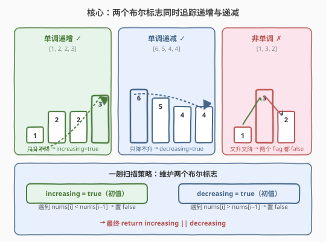
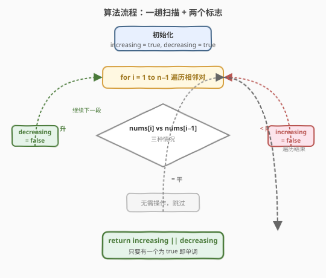
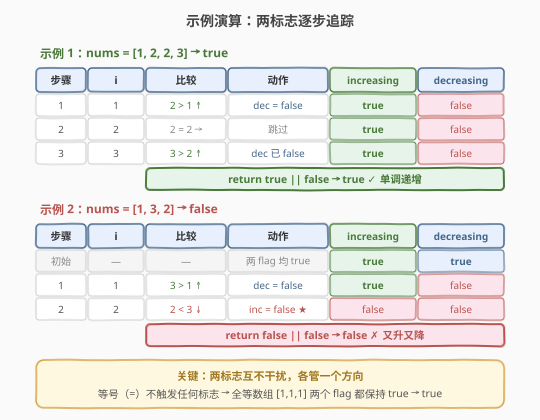

# LeetCode 单调数列 题解

## 1. 题目概述

- **标题 / 题号**：单调数列（#896，easy）
- **链接**：https://leetcode.cn/problems/monotonic-array/
- **难度**：简单
- **标签**：数组

**题意**：如果数组是**单调递增**或**单调递减**的，那么它是**单调**的。

- 对于所有 $i \le j$，若 $\text{nums}[i] \le \text{nums}[j]$，则数组单调递增。
- 对于所有 $i \le j$，若 $\text{nums}[i] \ge \text{nums}[j]$，则数组单调递减。

当给定的数组 `nums` 是单调数组时返回 `true`，否则返回 `false`。

**示例 1**：

```text
输入：nums = [1,2,2,3]
输出：true
解释：数组单调递增（含相等元素）。
```

**示例 2**：

```text
输入：nums = [6,5,4,4]
输出：true
解释：数组单调递减（含相等元素）。
```

**示例 3**：

```text
输入：nums = [1,3,2]
输出：false
解释：先升后降，不单调。
```

**约束**：

- $1 \le \text{nums.length} \le 10^5$
- $-10^5 \le \text{nums}[i] \le 10^5$

> 💡 **关键点**：题目允许相等元素——单调递增是「非严格」（$\le$），单调递减也是「非严格」（$\ge$）。全等数组如 `[1,1,1]` 同时满足两种单调性，返回 `true`。

## 2. 解题思路

### 2.1 暴力思路：分别检查两个方向

最直接的做法是写两个辅助函数，一个检查「是否非递减」，一个检查「是否非递增」，只要有一个满足就返回 `true`。每个函数都是一趟扫描，总共扫描两遍。

> ⚠️ 暴力法的瓶颈在于**两趟扫描有冗余**——两个方向在同一对相邻元素上做了重复的比较。破局思路：**一趟扫描同时追踪两个方向**，用两个布尔标志各管一个方向。

### 2.2 核心观察：两个布尔标志同时追踪递增与递减



**关键直觉**：

- 维护两个标志 `increasing` 和 `decreasing`，初始都为 `true`（乐观假设数组两种单调性都满足）。
- 遍历相邻对 `(nums[i-1], nums[i])`：
  - 若 $\text{nums}[i] > \text{nums}[i-1]$：出现「上升」，**排除递减** → `decreasing = false`。
  - 若 $\text{nums}[i] < \text{nums}[i-1]$：出现「下降」，**排除递增** → `increasing = false`。
  - 若 $\text{nums}[i] == \text{nums}[i-1]$：相等，**两标志都不变**（相等不破坏任何单调性）。
- 最终 `return increasing || decreasing`——只要有一个方向未被排除，数组就是单调的。

> 💡 **为什么两个标志互不干扰？** `increasing` 只被「下降」否定，`decreasing` 只被「上升」否定。一次「上升」不可能否定 `increasing`（上升恰好是递增的证据），一次「下降」不可能否定 `decreasing`。因此两个标志各自独立地收集「反方向证据」，最终取或即可。

**三种情况的标志终值**：

| 数组形态 | 出现的相邻关系 | `increasing` | `decreasing` | 结果 |
|----------|---------------|-------------|-------------|------|
| 单调递增 `[1,2,2,3]` | 只升或相等 | `true` | `false` | `true` |
| 单调递减 `[6,5,4,4]` | 只降或相等 | `false` | `true` | `true` |
| 全等 `[1,1,1]` | 只相等 | `true` | `true` | `true` |
| 非单调 `[1,3,2]` | 既升又降 | `false` | `false` | `false` |

### 2.3 算法流程图



**完整步骤**：

1. 初始化 `increasing = true`，`decreasing = true`。
2. `i` 从 $1$ 扫到 $n-1$：
   - 若 $\text{nums}[i] > \text{nums}[i-1]$：`decreasing = false`。
   - 若 $\text{nums}[i] < \text{nums}[i-1]$`：`increasing = false`。
   - （相等时无操作。）
3. 返回 `increasing || decreasing`。

> ⚠️ **不需要提前剪枝**：当两个标志都变 `false` 时理论上可以立即返回 `false`，但写不写都行——剩余元素的比较只是做无意义的赋值，不会改变结果。省略剪枝代码更简洁；加上剪枝可略微加速。下文参考代码给出含剪枝的版本。

### 2.4 示例演算

以 `nums = [1,2,2,3]`（返回 `true`）和 `nums = [1,3,2]`（返回 `false`）为例：



**示例 1**（`[1,2,2,3]`）：

| 步骤 | i | 比较 | 动作 | increasing | decreasing |
|------|---|------|------|-----------|-----------|
| 1 | 1 | $2 > 1$ ↑ | `dec = false` | `true` | `false` |
| 2 | 2 | $2 = 2$ → | 跳过 | `true` | `false` |
| 3 | 3 | $3 > 2$ ↑ | `dec` 已 `false` | `true` | `false` |

`return true || false` → `true`（单调递增）。

**示例 2**（`[1,3,2]`）：

| 步骤 | i | 比较 | 动作 | increasing | decreasing |
|------|---|------|------|-----------|-----------|
| 初始 | — | — | 两 flag 均 `true` | `true` | `true` |
| 1 | 1 | $3 > 1$ ↑ | `dec = false` | `true` | `false` |
| 2 | 2 | $2 < 3$ ↓ | `inc = false` ★ | `false` | `false` |

`return false || false` → `false`（又升又降，不单调）。

> 💡 **全等数组的特殊性**：`[1,1,1]` 每对相邻元素都相等，两个标志始终保持 `true`，`return true || true` → `true`。这正是「非严格单调」的体现——相等元素不破坏任何方向的单调性。

## 3. 参考代码

### 方法一：两标志一趟扫描（推荐）

### C++

```cpp
class Solution {
public:
    bool isMonotonic(vector<int>& nums) {
        bool increasing = true, decreasing = true;
        for (int i = 1; i < (int)nums.size(); ++i) {
            if (nums[i] > nums[i - 1]) {
                decreasing = false;
            } else if (nums[i] < nums[i - 1]) {
                increasing = false;
            }
        }
        return increasing || decreasing;
    }
};
```

### Python

```python
class Solution:
    def isMonotonic(self, nums: List[int]) -> bool:
        increasing = decreasing = True
        for i in range(1, len(nums)):
            if nums[i] > nums[i - 1]:
                decreasing = False
            elif nums[i] < nums[i - 1]:
                increasing = False
        return increasing or decreasing
```

### 方法二：含提前剪枝

### C++

```cpp
class Solution {
public:
    bool isMonotonic(vector<int>& nums) {
        bool increasing = true, decreasing = true;
        for (int i = 1; i < (int)nums.size(); ++i) {
            if (nums[i] > nums[i - 1]) {
                decreasing = false;
            } else if (nums[i] < nums[i - 1]) {
                increasing = false;
            }
            if (!increasing && !decreasing) return false; // 两方向都被排除
        }
        return true;
    }
};
```

### Python

```python
class Solution:
    def isMonotonic(self, nums: List[int]) -> bool:
        increasing = decreasing = True
        for i in range(1, len(nums)):
            if nums[i] > nums[i - 1]:
                decreasing = False
            elif nums[i] < nums[i - 1]:
                increasing = False
            if not increasing and not decreasing:
                return False
        return True
```

> 💡 **实现要点**：① 用 `if ... else if ...` 而非两个独立 `if`——同一段相邻关系不可能既「上升」又「下降」，互斥分支更清晰。② 相等情况（`nums[i] == nums[i-1]`）自然落入「既不升也不降」，不触发任何赋值。③ 剪枝版本在两标志同时为 `false` 时提前返回，但最坏情况仍需遍历全数组。

## 4. 复杂度分析

| 维度 | 复杂度 | 说明 |
|------|--------|------|
| **时间复杂度** | $O(n)$ | 单趟扫描，每个相邻对 $O(1)$ 比较 |
| **空间复杂度** | $O(1)$ | 仅两个布尔变量 `increasing`、`decreasing` |

> 💡 本题已达时间下界 $O(n)$——必须至少检查所有相邻关系才能判定单调性（单点采样无法推断全局趋势）。空间为常数，是最优解。

## 5. 扩展：方向先行法

除了两标志法，还有一种思路：**先确定方向，再验证一致性**。

1. 跳过开头的相等元素，找到第一个「非平」相邻对，确定方向（`direction = sign(nums[i] - nums[i-1])`，值为 $+1$ 或 $-1$）。
2. 后续所有相邻对的差值符号必须与 `direction` 一致（或为 $0$）。

```cpp
class Solution {
public:
    bool isMonotonic(vector<int>& nums) {
        int n = nums.size();
        int i = 1;
        while (i < n && nums[i] == nums[i - 1]) ++i; // 跳过相等前缀
        if (i >= n) return true;                      // 全等数组
        int direction = nums[i] > nums[i - 1] ? 1 : -1;
        for (++i; i < n; ++i) {
            int diff = nums[i] - nums[i - 1];
            if (direction == 1 && diff < 0) return false;
            if (direction == -1 && diff > 0) return false;
        }
        return true;
    }
};
```

> 💡 **与两标志法的对比**：方向先行法需要先确定方向再验证，逻辑分两阶段但语义更直观（「确定趋势 → 验证趋势」）。两标志法单趟同时追踪两个方向，代码更简洁。两者复杂度相同（$O(n)$ / $O(1)$），面试首选两标志法。

## 6. 面试要点

1. **为什么用两个布尔标志而不是先判断方向再验证？**

   > 两标志法无需先确定方向，一趟扫描即可，代码更简洁且不易出错。方向先行法需要先跳过相等前缀确定方向，再验证后续——多了一个「确定方向」的前置阶段，逻辑分叉更多。两者复杂度相同，面试推荐两标志法。

2. **全等数组 `[1,1,1]` 应该返回什么？为什么？**

   > 返回 `true`。题目定义的单调性是**非严格**的（$\le$ 和 $\ge$），相等元素不破坏任何方向的单调性。全等数组同时满足单调递增和单调递减，两标志均保持 `true`，`true || true` → `true`。

3. **相等元素（`nums[i] == nums[i-1]`）为什么不需要操作？**

   > 相等既不提供「上升」证据也不提供「下降」证据——它不否定 `increasing`（相等满足 $\le$），也不否定 `decreasing`（相等满足 $\ge$）。因此两标志都不变，等号被自然跳过。

4. **能否提前剪枝？什么时候有意义？**

   > 当 `increasing` 和 `decreasing` 同时为 `false` 时，数组既非单调递增也非单调递减，可立即返回 `false`。剪枝在最坏情况（数组确实单调或最后才出现反方向）无效，但在「早期就出现又升又降」的情况能省去剩余遍历。实际意义有限，写不写都行。

5. **这题和 [665. 非递减数组](../0601-0700/665_非递减数组.md) 有什么区别？**

   > 665 允许**修改一个元素**后判断是否非递减，核心是「遇降即修」的贪心策略与修法选择；896 是**纯粹判断**当前数组是否单调（递增或递减），无需修改。896 更简单——只需一趟扫描收集方向证据，而 665 需要考虑修复后的连锁影响。

> 💡 **一句话总结**：896 是数组单调性判定的招牌题——两个布尔标志 `increasing`/`decreasing` 各管一个方向，一趟扫描收集反方向证据，最终取或。核心直觉：相等不破坏单调性，一次「上升」只否定递减、一次「下降」只否定递增，两标志互不干扰。

## 同类练习题

| # | 题目 | 与本题的关联 |
|---|------|-------------|
| 665 | [非递减数组](https://leetcode.cn/problems/non-decreasing-array/)（[题解](../0601-0700/665_非递减数组.md)） | 允许修改一个元素后判断非递减，896 的进阶版——从「判定单调」升级为「修复单调」，需贪心选择修法 |
| 845 | [数组中的最长山脉](https://leetcode.cn/problems/longest-mountain-in-array/)（[题解](845_数组中的最长山脉.md)） | 寻找先升后降的最长子数组，与 896 的「单调段判定」互补——896 判定整体单调，845 寻找单调转折点 |
| 977 | [有序数组的平方](https://leetcode.cn/problems/squares-of-a-sorted-array/)（[题解](../0901-1000/977_有序数组的平方.md)） | 利用数组的单调性结构做对撞双指针，与 896 同为「单调性是数组的重要结构性质」的体现 |
| 941 | [有效的山脉数组](https://leetcode.cn/problems/valid-mountain-array/) | 判断数组是否恰为「严格升后严格降」的山形，896 的变体——从「全单调」到「单调转折一次」 |
| 540 | [有序数组中的单一元素](https://leetcode.cn/problems/single-element-in-a-sorted-array/) | 利用有序数组的单调性做二分查找，展示单调性如何支持高效查询 |
