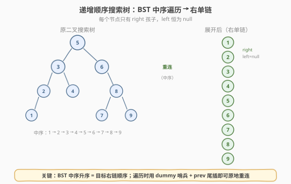
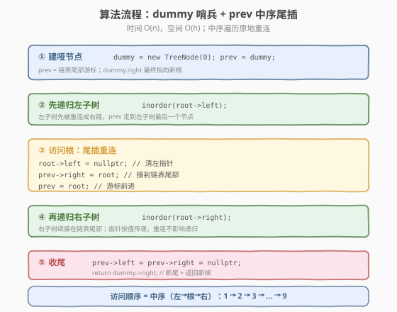
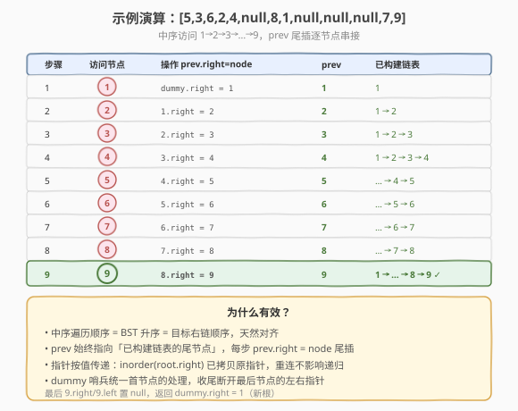

# LeetCode 递增顺序搜索树 题解

## 1. 题目概述

- **标题 / 题号**：递增顺序搜索树（#897，easy）
- **链接**：https://leetcode.cn/problems/increasing-order-search-tree/
- **难度**：简单
- **标签**：树、BST、深度优先搜索、中序遍历

**题意**：给你一棵**二叉搜索树**的 `root`，请你按**中序遍历**将其重新排列为一棵使最左节点成为根节点，且每个节点**没有左子节点**、**只有一个右子节点**的树。

**示例 1**：

```text
输入：root = [5,3,6,2,4,null,8,1,null,null,null,7,9]
输出：[1,null,2,null,3,null,4,null,5,null,6,null,7,null,8,null,9]

        5                          1
       / \                          \
      3   6                          2
     / \   \                          \
    2   4   8           →              3
   /       / \                          \
  1       7   9                          4
                                         \
                                          5
                                           \
                                            6
                                             \
                                              7
                                               \
                                                8
                                                 \
                                                  9
```

**示例 2**：

```text
输入：root = [5,1,7]
输出：[1,null,5,null,7]
```

**约束**：

- 树中节点数目范围 `[1, 100]`
- `0 <= Node.val <= 1000`
- 给定树是一棵合法 BST

> 💡 本题本质是「**BST 中序遍历** + **原地指针重连**」。BST 中序遍历得到升序序列，而目标右链的顺序也是升序——两者天然对齐。难点不在遍历，而在于遍历过程中如何**边访问边重连**，把原树的指针改造成一条只有 `right` 的链。与 [114. 二叉树展开为链表](./114_二叉树展开为链表.md)（前序展开为右链）是同族问题，区别在于本题用**中序**而非前序，且不需要 `O(1)` 空间（进阶才要求）。

## 2. 解题思路

### 2.1 暴力思路：中序遍历收集节点 + 重建右链

最直观的做法：先做一次中序遍历，把所有节点按升序存进列表，再遍历列表依次把每个节点的 `right` 指向下一个、`left` 置 `null`。

```text
order = []
inorder(root)                    # 收集到 order
for i in range(len(order)-1):
    order[i].left  = null
    order[i].right = order[i+1]
order[-1].left  = null
order[-1].right = null
return order[0]
```

时间 `O(n)`，但空间 `O(n)`（列表存所有节点）+ `O(h)` 递归栈。能过，但**多了一份 `O(n)` 的额外列表**。

> ⚠️ 暴力法的浪费：必须用 `O(n)` 列表保存中序顺序，再二次遍历串接。其实中序遍历的**访问顺序本身就是目标链表的顺序**，完全可以在「访问根」的瞬间直接重连，省掉列表。

### 2.2 核心观察：中序重连 + dummy 哨兵



**关键洞察**：BST 的中序遍历是升序的，而目标右链也是升序——所以**中序访问顺序 = 目标链表顺序**。我们不必先收集再串接，只需在中序「访问根」的瞬间，把当前节点**尾插**到已构建的链表尾部即可。

具体地，引入一个**哑节点 `dummy`** 作为链表的虚拟头，维护 `prev` 指针指向链表当前尾节点。中序遍历到节点 `root` 时：

1. `root.left = null` —— 清空左指针（目标链表无左孩子）
2. `prev.right = root` —— 把当前节点接到链表尾部
3. `prev = root` —— 游标前进

遍历结束后，`prev` 指向最后一个节点，断开它的左右指针，返回 `dummy.right` 即新根。

> 💡 **为什么 dummy 哨兵有用？** 没有哑节点时，第一个节点（最左节点）需要特殊处理：它没有前驱，要单独记为新根。有了 `dummy`，**每个节点的处理逻辑完全统一**——都执行 `prev.right = root`，首节点不过是 `dummy.right = 首节点`。这是链表题中消除首节点特判的通用技巧（参见 [21. 合并两个有序链表](./21_合并两个有序链表.md) 的哑节点）。

> ⚠️ **重连不影响递归**：`inorder(root->right)` 是按值传递指针——调用时拷贝了 `root->right` 的值。即使后续 `root->right` 被重连修改（当 `root` 充当 `prev` 时，下一个节点会执行 `prev.right = nextNode`），递归内部已持有原始指针副本，不受影响。这是本题能「边遍历边重连」的安全保障。

### 2.3 算法流程图



**完整步骤**：

1. **建哑节点**：`dummy = new TreeNode(0); prev = dummy;`
2. **中序遍历** `inorder(root)`：
   - `inorder(root.left)` —— 先递归左子树（左子树先被重连，`prev` 走到左子树末尾）
   - `root.left = null` —— 清左指针
   - `prev.right = root` —— 尾插到链表
   - `prev = root` —— 游标前进
   - `inorder(root.right)` —— 再递归右子树
3. **收尾**：`prev.left = prev.right = null;` —— 断开最后节点
4. **返回** `dummy.right`（新根）

> ⚠️ **顺序不能错**：必须**先递归左子树**（让左半先入链），**再重连根**，**最后递归右子树**。若先重连根再递归左，`prev` 会先指向根，左子树节点会错误地接在根**后面**，破坏升序。

### 2.4 示例演算

以 `root = [5,3,6,2,4,null,8,1,null,null,null,7,9]` 为例，中序访问顺序为 `1 → 2 → 3 → 4 → 5 → 6 → 7 → 8 → 9`。



| 步骤 | 访问节点 | 操作（prev.right = node） | prev | 已构建链表 |
|------|----------|---------------------------|------|------------|
| ① | 1 | `dummy.right = 1` | 1 | 1 |
| ② | 2 | `1.right = 2` | 2 | 1 → 2 |
| ③ | 3 | `2.right = 3` | 3 | 1 → 2 → 3 |
| ④ | 4 | `3.right = 4` | 4 | 1 → 2 → 3 → 4 |
| ⑤ | 5 | `4.right = 5` | 5 | … → 4 → 5 |
| ⑥ | 6 | `5.right = 6` | 6 | … → 5 → 6 |
| ⑦ | 7 | `6.right = 7` | 7 | … → 6 → 7 |
| ⑧ | 8 | `7.right = 8` | 8 | … → 7 → 8 |
| ⑨ | 9 | `8.right = 9` | 9 | 1 → … → 8 → 9 |

最终 `prev = 9`，执行 `9.left = 9.right = null`，返回 `dummy.right = 1`。链表 `1 → 2 → 3 → 4 → 5 → 6 → 7 → 8 → 9`，与中序升序一致 ✓。

> 💡 **观察步骤①与⑨**：首节点 `1` 的处理是 `dummy.right = 1`——哑节点让首节点无需特判；末节点 `9` 的左右指针在收尾时统一断开。中间每步都是 `prev.right = node` 的尾插，逻辑完全一致。

## 3. 参考代码

### C++

#### 法二：中序重连 + dummy 哨兵（推荐）

```cpp
/**
 * Definition for a binary tree node.
 * struct TreeNode { int val; TreeNode *left; TreeNode *right;
 *                  TreeNode() : val(0), left(nullptr), right(nullptr) {}
 *                  TreeNode(int x) : val(x), left(nullptr), right(nullptr) {} };
 */
class Solution {
    TreeNode* prev;
  public:
    TreeNode* increasingBST(TreeNode* root) {
        TreeNode* dummy = new TreeNode(0);
        prev = dummy;
        inorder(root);
        prev->left  = nullptr;          // 断开最后节点的左
        prev->right = nullptr;          // 断开最后节点的右
        TreeNode* ans = dummy->right;
        delete dummy;                   // 回收哨兵
        return ans;
    }

  private:
    void inorder(TreeNode* root) {
        if (root == nullptr) return;
        inorder(root->left);            // 1. 先递归左子树
        root->left = nullptr;           // 2. 清左指针
        prev->right = root;             // 3. 尾插到链表
        prev = root;                    //    游标前进
        inorder(root->right);           // 4. 再递归右子树
    }
};
```

#### 法一：中序收集节点 + 重建（最简）

```cpp
class Solution {
  public:
    TreeNode* increasingBST(TreeNode* root) {
        vector<TreeNode*> nodes;
        inorder(root, nodes);
        TreeNode* dummy = new TreeNode(0);
        TreeNode* prev = dummy;
        for (TreeNode* node : nodes) {
            node->left  = nullptr;
            node->right = nullptr;
            prev->right = node;
            prev = node;
        }
        TreeNode* ans = dummy->right;
        delete dummy;
        return ans;
    }

  private:
    void inorder(TreeNode* root, vector<TreeNode*>& nodes) {
        if (root == nullptr) return;
        inorder(root->left, nodes);
        nodes.push_back(root);
        inorder(root->right, nodes);
    }
};
```

### Python

#### 法二：中序重连 + dummy 哨兵（推荐）

```python
class Solution:
    def increasingBST(self, root: Optional[TreeNode]) -> Optional[TreeNode]:
        dummy = TreeNode(0)
        self.prev = dummy

        def inorder(node: Optional[TreeNode]) -> None:
            if not node:
                return
            inorder(node.left)            # 1. 先递归左子树
            node.left = None              # 2. 清左指针
            self.prev.right = node        # 3. 尾插到链表
            self.prev = node              #    游标前进
            inorder(node.right)           # 4. 再递归右子树

        inorder(root)
        self.prev.left = self.prev.right = None   # 断尾
        return dummy.right
```

> 💡 Python 用 `self.prev` 作为闭包可写的全局游标（若用普通局部变量，内层 `inorder` 无法对其 `rebind`）。也可把 `prev` 包成 `[dummy]` 单元素列表靠可变对象传引用，效果相同。

## 4. 复杂度分析

| 维度 | 法二 中序重连（推荐） | 法一 收集节点 |
|------|----------------------|--------------|
| **时间复杂度** | $O(n)$ | $O(n)$ |
| **空间复杂度** | $O(h)$（递归栈） | $O(n)$（列表 + 递归栈） |
| **额外结构** | 仅 dummy 哨兵 `O(1)` | 节点列表 `O(n)` |

> ⚠️ 法二的 $O(h)$ 空间来自递归调用栈，$h$ 为树高：平衡 BST 为 $O(\log n)$，退化为链表时 $O(n)$。本题 $n \le 100$，递归栈开销可忽略。要真正做到 $O(1)$ 额外空间，需用扩展中的 Morris 迭代法。

## 5. 扩展：Morris 风格 O(1) 空间迭代

进阶要求 `O(1)` 额外空间时，需消去递归栈。核心思想类似 Morris 中序遍历：**对每个有左子树的节点，把左子树的最右节点（中序前驱）指向当前节点，然后「右旋」——左子树上移代替当前节点位置，当前节点变成左子树前驱的右孩子**。没有左子树的节点直接尾插到链表。

```python
class Solution:
    def increasingBST(self, root: Optional[TreeNode]) -> Optional[TreeNode]:
        dummy = TreeNode(0)
        prev = dummy
        cur = root
        while cur:
            if cur.left:
                # 找左子树最右节点 = 中序前驱
                p = cur.left
                while p.right:
                    p = p.right
                # 前驱右指针指向 cur（旋转）
                p.right = cur
                # 左子树上移，断开 cur 的左指针
                tmp = cur
                cur = cur.left
                tmp.left = None
            else:
                # 无左子树：cur 是下一个中序节点，尾插
                prev.right = cur
                prev = cur
                cur = cur.right
        # 清理所有左指针
        node = dummy.right
        while node:
            node.left = None
            node = node.right
        return dummy.right
```

> 💡 **与标准 Morris 遍历的区别**：标准 Morris 用「临时线索 + 访问后拆除」来模拟栈，本题直接「旋转改结构」——一旦左子树处理完，当前节点就永久变成前驱的右孩子，不需要回头。本质是把 BST 逐步「右偏化」，最终所有节点只剩右指针。时间均摊 $O(n)$，空间 $O(1)$。

## 6. 面试要点

1. **为什么中序遍历顺序就是目标右链顺序？**

   > BST 的中序遍历是升序的，目标右链也要求升序（最左节点为根，逐个右移）。两者顺序天然一致，所以只需在中序「访问根」时把节点尾插到链表即可，无需额外排序或收集。

2. **dummy 哨兵的作用是什么？能不能不用？**

   > dummy 统一首节点的处理逻辑。没有 dummy 时，最左节点（第一个被访问的节点）没有前驱，需要单独记录为新根；有了 dummy，每个节点都执行 `prev.right = node`，首节点即 `dummy.right = 首节点`，消除特判。最后返回 `dummy.right`。这是链表题消除首节点特判的通用技巧。

3. **边遍历边重连，会不会破坏尚未访问的树结构？**

   > 不会。`inorder(root->right)` 按值传递指针，调用时拷贝了 `root->right` 的值。即使后续 `root->right` 被修改（当 `root` 作为 `prev` 时，下一节点执行 `prev.right = nextNode`），递归内部已持有原始指针副本。而 `root->left` 在清空前已经递归完毕（先左后根），不影响未访问的部分。

4. **法二为什么要收尾时断开 `prev` 的左右指针？**

   > 最后一个节点（中序末尾，即原树最右节点）的 `right` 可能仍指向原来的某个节点（若原树中它有右子树，那右子树已重连但指针可能残留）；`left` 也可能未清空。统一执行 `prev.left = prev.right = null` 确保链表末尾干净终止。

5. **本题和 114（二叉树展开为链表）的异同？**

   > 两者都是把树压成右单链。114 要求**前序**顺序，用反向后序（右→左→根）+ `prev` 头插，自底向上构建；897 要求**中序**顺序，用中序（左→根→右）+ `prev` 尾插，自顶向下构建。114 的进阶要求 `O(1)` 空间用 Morris；897 的 Morris 变体则是「旋转右偏化」。核心都是「遍历顺序 = 目标链表顺序 + 全局指针串接」。

> 💡 **一句话总结**：897 的灵魂是「**中序遍历 + dummy 尾插**」——利用 BST 中序升序 = 目标右链顺序，在「访问根」的瞬间用 `prev.right = root` 尾插重连，dummy 哨兵消除首节点特判，$O(n)$ 时间 $O(h)$ 空间。要 $O(1)$ 空间则上 Morris 旋转。这个「遍历即重连 + 哑节点统一逻辑」模板在「树转链表」类问题中反复出现。

## 同类练习题

| # | 题目 | 与本题的关联 |
|---|------|-------------|
| 114 | [二叉树展开为链表](https://leetcode.cn/problems/flatten-binary-tree-to-linked-list/)（[题解](./114_二叉树展开为链表.md)） | 前序展开为右链，反向后序 + `prev` 头插，同族「树转链表」问题 |
| 94 | [二叉树的中序遍历](https://leetcode.cn/problems/binary-tree-inorder-traversal/)（[题解](../0001-0100/94_二叉树的中序遍历.md)） | 中序遍历的母题，Morris 遍历的理论基础 |
| 108 | [将有序数组转换为二叉搜索树](https://leetcode.cn/problems/convert-sorted-array-to-binary-search-tree/)（[题解](./108_将有序数组转换为二叉搜索树.md)） | BST 与升序序列的互逆关系，中序是桥梁 |
| 230 | [二叉搜索树中第K小的元素](https://leetcode.cn/problems/kth-smallest-element-in-a-bst/) | BST 中序升序性质的直接应用，第 k 个即中序第 k 步 |
| 21 | [合并两个有序链表](https://leetcode.cn/problems/merge-two-sorted-lists/)（[题解](../0001-0100/21_合并两个有序链表.md)） | 哑节点消除首节点特判的母题，本题 dummy 的同一技巧 |
