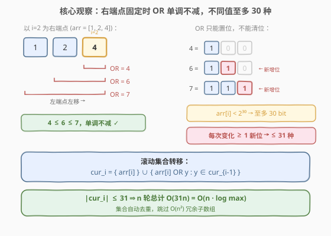
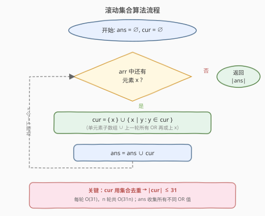

# LeetCode 子数组按位或操作 题解

## 1. 题目概述

- **标题 / 题号**：子数组按位或操作（#898，medium）
- **链接**：https://leetcode.cn/problems/bitwise-ors-of-subarrays/
- **难度**：中等
- **标签**：位运算、数组、动态规划

**题意**：给定一个整数数组 `arr`，返回所有**非空子数组**的按位或结果的**不同值**的数量。

子数组的按位或即子数组中所有整数的按位或；只含一个整数的子数组，其按位或就是该整数本身。子数组是数组内连续的非空元素序列。

**示例 1**：

```text
输入：arr = [0]
输出：1
解释：唯一可能的按位或结果是 0。
```

**示例 2**：

```text
输入：arr = [1,1,2]
输出：3
解释：所有子数组 [1],[1],[2],[1,1],[1,2],[1,1,2] 的按位或分别为 1,1,2,1,3,3，
  去重后 {1,2,3} 共 3 个不同值。
```

**示例 3**：

```text
输入：arr = [1,2,4]
输出：6
解释：可能的按位或结果为 1,2,3,4,6,7，共 6 个不同值。
```

**约束**：

- `1 <= arr.length <= 5 * 10^4`
- `0 <= arr[i] <= 10^9`

> ⚠️ 子数组总数达 $O(n^2) \approx 2.5 \times 10^9$ 个，逐一枚举必然超时。突破口在于**按位或的单调性**——它限制了每个右端点处不同 OR 值的数量。

## 2. 解题思路

### 2.1 暴力思路

枚举所有 $O(n^2)$ 个子数组，对每个子数组计算按位或并加入哈希集合。利用「向右扩展一位只需 OR 上新元素」的增量计算，每个子数组 OR 为 $O(1)$，总时间 $O(n^2)$。但 $n = 5 \times 10^4$ 时 $n^2 \approx 2.5 \times 10^9$，远超时间限制。

瓶颈在于子数组数量本身就是 $O(n^2)$。若能发现「大量子数组共享同一个 OR 值」，就能跳过冗余计算。

### 2.2 核心观察：滚动集合 + 位运算单调性



**观察一：以位置 $i$ 为右端点的子数组 OR 随左端点左移单调不减。**

固定右端点 $i$，考察子数组 $\text{arr}[j..i]$ 的 OR 值（记为 $v_j$）。当 $j$ 从 $i$ 向 $0$ 移动（子数组变长），每加入一个元素 $\text{arr}[j]$ 只会执行 $v_j = \text{arr}[j] \;\text{OR}\; v_{j+1}$。按位或**只能置位、不能清位**，故 $v_j \geq v_{j+1}$，序列 $\{v_i, v_{i-1}, \dots, v_0\}$ 单调不减。

**观察二：每个右端点处不同的 OR 值至多 30 种。**

序列单调不减，每次**值发生变化**意味着至少**多置了一个新位**。而 $\text{arr}[i] \leq 10^9 < 2^{30}$，总共至多 30 个比特位。因此从 $\text{arr}[i]$ 出发，OR 值最多变化 30 次（每变化一次至少新增一个 1 位），即 $\{v_i, v_{i-1}, \dots, v_0\}$ 中**不同值不超过 31 个**。

> 💡 这与 [187. 重复的 DNA 序列](../0001-0100/187_重复的DNA序列.md) 中「窗口内状态有限」的思路同源——状态空间小，就能用集合精确维护而无需枚举全部。

**滚动集合：** 令 $\text{cur}_i$ = 以 $i$ 为右端点的所有子数组 OR 值的集合，则将 $\text{cur}_{i-1}$ 中每个值 $y$ 与 $\text{arr}[i]$ 做按位或，再并入 $\{\text{arr}[i]\}$ 即得 $\text{cur}_i$：

$$
\text{cur}_i = \{\text{arr}[i]\} \;\cup\; \bigl\{\, \text{arr}[i] \;\text{OR}\; y \;:\; y \in \text{cur}_{i-1} \,\bigr\}
$$

即「单元素子数组 $\text{arr}[i]$ 本身」并上「上一轮所有 OR 值再或上 $\text{arr}[i]$」。由于 $|\text{cur}_{i-1}| \leq 31$，构造 $\text{cur}_i$ 只需 $O(31)$。

用一个全局集合 $\text{ans}$ 累积所有 $\text{cur}_i$，最终 $|\text{ans}|$ 即答案。

### 2.3 算法流程图



核心循环：遍历每个元素 $x$，将上一轮集合 $\text{cur}$ 中每个值与 $x$ 按位或，再并入 $\{x\}$ 得到新 $\text{cur}$，最后把 $\text{cur}$ 全部加入 $\text{ans}$。

### 2.4 示例演算

![示例演算：arr=[1,2,4]](../images/bitor_subarray_example_walkthrough.svg)

以 `arr = [1, 2, 4]` 为例（括号内为二进制，便于观察位的累积）：

| 步 | $x$ | 上一轮 cur | 新 cur = $\{x\} \cup \{x \;\text{OR}\; y\}$ | ans 累积 |
|----|-----|-----------|---------------------------------------------|---------|
| 0 | 1 (001) | $\emptyset$ | $\{1\text{(001)}\}$ | $\{1\}$ |
| 1 | 2 (010) | $\{1\text{(001)}\}$ | $\{2\text{(010)},\;1|2{=}3\text{(011)}\}$ | $\{1,2,3\}$ |
| 2 | 4 (100) | $\{2,3\}$ | $\{4\text{(100)},\;4|2{=}6\text{(110)},\;4|3{=}7\text{(111)}\}$ | $\{1,2,3,4,6,7\}$ |

最终 $|\text{ans}| = 6$。注意第 2 步中 $4|2=6$ 与 $4|3=7$ 各新增了一个比特位，体现「每变化一次至少多一个 1」。

## 3. 参考代码

### C++

```cpp
class Solution {
public:
    int subarrayBitwiseORs(vector<int>& arr) {
        unordered_set<int> ans, cur;
        for (int x : arr) {
            unordered_set<int> nxt;
            nxt.insert(x);
            for (int y : cur) nxt.insert(x | y);
            cur = move(nxt);
            ans.insert(cur.begin(), cur.end());
        }
        return ans.size();
    }
};
```

### Python

```python
class Solution:
    def subarrayBitwiseORs(self, arr: List[int]) -> int:
        ans = set()
        cur = set()
        for x in arr:
            cur = {x | y for y in cur} | {x}
            ans |= cur
        return len(ans)
```

> 💡 **去重即优化**：`cur` 用集合而非列表，自动消除「多个左端点产生相同 OR」的冗余，保证 $|\text{cur}| \leq 31$。若用列表则退化为 $O(n^2)$。
>
> ⚠️ **边界**：`arr[i]` 可为 0。$0 \;|\; y = y$，不影响正确性；但要注意第 0 步 `cur` 为空时，集合推导 `{x | y for y in cur}` 得空集，再并 $\{x\}$ 恰为 $\{x\}$，无需特判。

## 4. 复杂度分析

| 维度 | 复杂度 | 说明 |
|------|--------|------|
| 时间复杂度 | $O(n \cdot B)$，$B \leq 30$ | 每轮构造 cur 遍历至多 31 个值，$n$ 轮共 $O(31n)$；ans 插入同样 $O(31n)$ 次 |
| 空间复杂度 | $O(n \cdot B)$ | ans 至多收集 $31n$ 个不同 OR 值；cur 至多 31 个 |

> 💡 $B = \lceil \log_2(\max(\text{arr})) \rceil + 1 \leq 30$（因 $\text{arr}[i] < 2^{30}$）。即便 $n = 5 \times 10^4$，总操作量约 $1.5 \times 10^6$，远低于暴力 $2.5 \times 10^9$。

## 5. 扩展：按位与的对偶问题

按位**与**（AND）具有对偶的单调性：以 $i$ 为右端点，子数组向左扩展时 AND **单调不增**（只能清位、不能置位）。因此每个右端点处的不同 AND 值同样不超过 30 种，可用完全相同的滚动集合求解。

典型应用是 [1521. 找到最接近目标值的函数值](https://leetcode.cn/problems/find-a-value-of-a-mysterious-function-closest-to-target/)：求所有子数组 AND 中最接近目标值 `target` 的那个。用滚动集合维护每轮的 AND 值集合（至多 30 个），逐一比较与 `target` 的差即可，复杂度 $O(30n)$。

> ⚠️ AND 问题中需注意「全 1 掩码」的初始化：空集对应无穷大（不改变 AND 结果），代码中需用 `cur` 为空时跳过或以 `x` 自身为起点，与本题 OR 的写法对称。

## 6. 面试要点

1. **为什么每个右端点至多 30 种 OR 值？**

   - 以 $i$ 为右端点，子数组 $\text{arr}[j..i]$ 的 OR 随 $j$ 左移单调不减。每次值严格增大至少多置一个比特位，而值 $< 2^{30}$ 至多 30 位，故严格变化不超过 30 次，不同值 $\leq 31$。

2. **为什么用集合存 cur 而不是列表？**

   - 列表会保留所有 $O(n)$ 个左端点的 OR 值（含大量重复），使每轮 $O(n)$、总计 $O(n^2)$。集合自动去重，保证 $|\text{cur}| \leq 31$，每轮 $O(31)$。

3. **滚动转移 $\text{cur}_i = \{x\} \cup \{x \;\text{OR}\; y : y \in \text{cur}_{i-1}\}$ 正确性如何保证？**

   - 以 $i$ 为右端点的子数组分两类：长度 1 的 $\{\text{arr}[i]\}$；长度 $\geq 2$ 的，其 OR = $\text{arr}[i] \;\text{OR}\;$（以 $i-1$ 为右端点某子数组的 OR）。后者恰为 $\{x \;\text{OR}\; y : y \in \text{cur}_{i-1}\}$，两者并集完备。

4. **arr[i] = 0 时会有问题吗？**

   - 不会。$0 \;|\; y = y$，0 只是把上一轮值原样保留，集合去重后无副作用。第一步 `cur` 为空时，`{x|y for y in cur}` 为空集，并上 `{x}` 得 `{x}`，无需特判。

5. **能否用有序数组替代哈希集合？**

   - 可以。由于 OR 值随左端点左移单调不减，cur 中的值天然递减（从短子数组到长子数组），可维护去重后的有序列表，每轮二分合并。但集合实现更简洁，且 $|\text{cur}| \leq 31$ 时哈希常数极小，实践中更快。

## 同类练习题

| # | 题目 | 与本题的关联 |
|---|------|-------------|
| 2411 | [按位或最大的最小子数组长度](https://leetcode.cn/problems/smallest-subarrays-with-maximum-bitwise-or/) | 同一「每端点至多 30 种 OR」洞察，改为求达到最大 OR 的最短子数组长度，滚动集合 + 逐位贪心 |
| 1521 | [找到最接近目标值的函数值](https://leetcode.cn/problems/find-a-value-of-a-mysterious-function-closest-to-target/) | 按位**与**的对偶版——子数组 AND 单调不增，滚动集合维护至多 30 种 AND 值，求最接近 target 者 |
| 3171 | [找到按位与最接近 K 的子数组](https://leetcode.cn/problems/find-subarray-with-bitwise-and-closest-to-k/) | 1521 的进阶版，同样用 AND 滚动集合，体会「位运算单调性 → 集合规模有界」的通用范式 |
| 187 | [重复的 DNA 序列](https://leetcode.cn/problems/repeated-dna-sequences/)（[题解](../0001-0100/187_重复的DNA序列.md)） | 同源思想——窗口内状态空间有限（$4^{10}$），用哈希精确维护；对比本题用「比特位数有限」压缩状态 |
