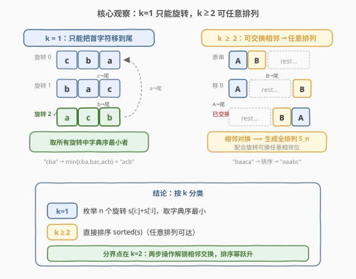
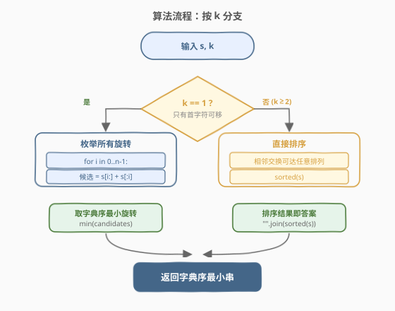
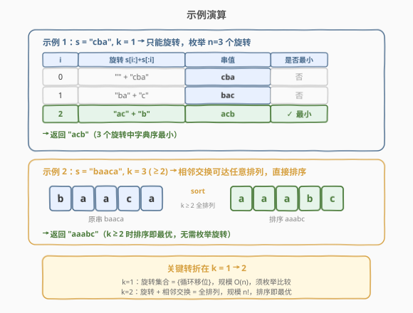

# 有序队列

- **题目名称**：有序队列
- **链接**：[899. 有序队列](https://leetcode.cn/problems/orderly-queue/)
- **难度**：困难
- **标签**：字符串、排序、数学

## 1. 题目概述

给定一个字符串 `s` 和一个整数 `k`。每一步你可以从 `s` 的**前 `k` 个字母**中选择一个，并把它加到字符串的**末尾**。可以对上述步骤应用**任意次数**。

返回应用任意次移动后能得到的**字典序最小**的字符串。

**示例 1**：

```text
输入：s = "cba", k = 1
输出："acb"
解释：
      第一步：将第一个字符 'c' 移到最后，得到 "bac"。
      第二步：将第一个字符 'b' 移到最后，得到 "acb"。
```

**示例 2**：

```text
输入：s = "baaca", k = 3
输出："aaabc"
解释：
      第一步：将第一个字符 'b' 移到最后，得到 "aacab"。
      第二步：将第三个字符 'c' 移到最后，得到 "aaabc"。
```

**约束条件**：

- `1 <= k <= s.length <= 1000`
- `s` 只由小写英文字母组成

> 💡 本题的难点不在实现而在**洞察**：`k` 的取值会让可达字符串的集合发生**质变**。`k = 1` 时只能做循环移位（旋转），可达状态仅有 $n$ 个；而 `k \ge 2` 时一个小小的"多选一"会让可达集瞬间膨胀到**全体排列**，答案直接退化为排序。这道题考的是对"操作能力边界"的刻画，而非搜索或 DP。

---

## 2. 解题思路

### 2.1 暴力思路：BFS 搜索所有可达状态

最朴素的做法是照搬题意：从 `s` 出发做 BFS，每步从当前串的前 `k` 个字符中任选一个移到末尾，得到新状态；用哈希集合去重，直到不再产生新状态，最后在所有可达状态中取字典序最小者。

这个做法有两个问题：

1. **状态空间随 `k` 指数膨胀**：当 `k \ge 2`，可达状态数可达 $n!$（全排列），`n = 1000` 时完全无法枚举。
2. **没有利用结构**：我们其实不关心"如何到达"，只关心"最优能到哪"。盲目搜索浪费了问题本身蕴含的代数结构。

突破口在于：**把"能到哪些状态"这个集合刻画清楚**——它取决于 `k`，而且存在一个干净的二分结论。

### 2.2 核心观察：k = 1 只能旋转，k ≥ 2 可任意排列



**情况一：`k = 1`**。前 `k = 1` 个字符就是第一个字符，每步只能把**首字符**移到末尾——这正是**循环左移**（旋转）。无论操作多少次，得到的串一定是 `s` 的某个旋转 $s[i:] + s[:i]$（$0 \le i < n$）。因此可达集只有 $n$ 个元素，答案就是这 $n$ 个旋转中字典序最小者。

> 💡 这等价于求字符串的**最小字典序旋转**（minimum lexicographic rotation）。`n \le 1000` 时直接枚举 $n$ 个旋转、逐一比较即可（$O(n^2)$）；若追求线性，可用 Booth 算法或倍增 + 后缀排序（见第 5 节）。

**情况二：`k \ge 2`**。此时前两个字符都可被选中移到末尾，这点"自由度"足以让我们**交换任意两个相邻字符**，而相邻对换生成整个对称群 $S_n$——也就是说**任意排列都可达**，答案直接退化为把 `s` 排序。

**如何用 `k = 2` 交换首两个字符**（这是关键构造）：设当前串为 `A B rest`（`A = s[0]`、`B = s[1]`、`rest` 为剩余部分）。

1. 选择把第 2 个字符 `B` 移到末尾：`A rest B`。
2. 再选择把第 1 个字符 `A` 移到末尾：`rest B A`。

`AB` 变成了 `BA`（顺序翻转）并挪到了末尾，而 `rest` 的内部相对顺序保持不变。结合"任意 `k \ge 1` 都能旋转"这一事实，我们可以先把任意相邻位置 $i, i+1$ **旋转到首位**、做上述交换、再**旋转回去**，于是实现了对原串任意相邻位的对换。

> ⚠️ **严谨性补充**：上面的构造把 `AB` 翻转并送到了末尾，并非"原地交换"。但配合旋转可把它精确送回原位：交换后做若干次"首字符移末尾"的旋转，让 `rest` 回到原位置、`BA` 落在 $i, i+1$ 上即可。净效果是仅交换了原串的 $s[i]$ 与 $s[i+1]$，其余不变。由于相邻对换是 $S_n$ 的生成元集，任意排列——包括字典序最小的排序结果——都可达。

因此只需一行结论：**`k \ge 2` 时答案就是 `sorted(s)`**。

### 2.3 算法流程图



**完整步骤**：

1. **分支判断** `k`：
   - 若 `k == 1`：进入旋转枚举分支。
   - 若 `k >= 2`：进入排序分支。
2. **`k == 1` 分支**：枚举 $i = 0, 1, \dots, n-1$，构造候选旋转 $s[i:] + s[:i]$，维护其中的字典序最小者。
3. **`k >= 2` 分支**：返回 `s` 的字符排序结果 `"".join(sorted(s))`。
4. **输出**对应分支的结果。

> 💡 注意 `k` 的上界是 `s.length`，所以 `k >= 2` 这一分支总是合法的；不存在 `k = 0`。两个分支互斥，整体只需 $O(n^2)$（`k=1` 时）或 $O(n \log n)$（`k>=2` 时）。

### 2.4 示例演算



**示例 1**（`s = "cba"`, `k = 1`）：枚举 3 个旋转。

| $i$ | 旋转 $s[i:]+s[:i]$ | 串值 | 是否最小 |
|-----|--------------------|------|----------|
| 0 | `"" + "cba"` | `cba` | 否 |
| 1 | `"ba" + "c"` | `bac` | 否 |
| 2 | `"ac" + "b"` | `acb` | ✓ 最小 |

三个旋转中 `"acb"` 字典序最小（首字符 `a < b < c`），返回 `"acb"`。

**示例 2**（`s = "baaca"`, `k = 3`，即 `k >= 2`）：无需枚举旋转，`k >= 2` 蕴含全排列可达，直接排序：

$$\text{baaca} \xrightarrow{\text{sort}} \text{aaabc}$$

返回 `"aaabc"`。

> 💡 注意 `k = 3` 比串长 `5` 小，但只要 `k >= 2` 结论就成立——`k` 再大不会带来新的"超过排序"的能力，因为排序结果已是字典序全局最小，无可超越。

---

## 3. 参考代码

### C++

```cpp
class Solution {
  public:
    string orderlyQueue(string s, int k) {
        if (k == 1) {
            // 只能旋转：枚举所有循环移位，取字典序最小
            string best = s;
            int n = s.size();
            for (int i = 1; i < n; ++i) {
                string rot = s.substr(i) + s.substr(0, i);  // s[i:] + s[:i]
                if (rot < best) best = rot;
            }
            return best;
        }
        // k >= 2：相邻交换可达任意排列，排序即最优
        sort(s.begin(), s.end());
        return s;
    }
};
```

### Python

```python
class Solution:
    def orderlyQueue(self, s: str, k: int) -> str:
        if k == 1:
            n = len(s)
            return min(s[i:] + s[:i] for i in range(n))
        return "".join(sorted(s))
```

> 💡 Python 版用生成器表达式 + `min` 一行搞定 `k = 1` 分支：`min(s[i:] + s[:i] for i in range(n))` 自然取到字典序最小的旋转。C++ 版逻辑一致，用 `substr` 拼接旋转串并维护 `best`。两版都对 `k >= 2` 直接 `sort`——这是全题最反直觉却最正确的结论。

---

## 4. 复杂度分析

| 维度 | 复杂度 | 说明 |
|------|--------|------|
| **时间复杂度** | $k=1$：$O(n^2)$；$k \ge 2$：$O(n \log n)$ | `k=1` 枚举 $n$ 个旋转，每次构造与比较各 $O(n)$；`k>=2` 对长度 $n$ 的串排序 |
| **空间复杂度** | $O(n)$ | `k=1` 构造旋转串需 $O(n)$ 临时串；`k>=2` 原地排序为 $O(1)$ 额外空间（Python 排序产生新串为 $O(n)$） |

> ⚠️ $n \le 1000$ 时 `k=1` 的 $O(n^2)$ 约 $10^6$ 量级，绰绰有余。若 $n$ 高达 $10^5$，需用 Booth 算法把最小旋转降到 $O(n)$（见第 5 节）。

---

## 5. 扩展：最小字典序旋转的线性算法

`k = 1` 分支本质是求**字符串的最小字典序旋转**。枚举法 $O(n^2)$ 在 $n \le 1000$ 足够，但当 $n$ 很大时有两种经典线性做法。

**方法一：倍增 + 排序（后缀数组思想）**。把串翻倍 $ss = s + s$，则 `s` 的所有旋转恰是 $ss$ 中长度为 $n$ 的前缀中起始位置在 $[0, n)$ 的子串。用倍增对 $ss$ 的所有后缀排序后，按排名扫描、取首个起始位置 $< n$ 的后缀，截取前 $n$ 位即为最小旋转。复杂度 $O(n \log n)$，常数小、实现直观。

**方法二：Booth 算法**。用最小表示法思想，维护两个候选起点 $i, j$ 和匹配长度 $k$，逐字符比较 $ss[i+k]$ 与 $ss[j+k]$，失配时把落后者跳到 $\max(i+k+1,\ j+1)$，最终 $i$ 即最小旋转起点。复杂度严格 $O(n)$、空间 $O(n)$（存翻倍串）。

```python
def min_rotation(s: str) -> str:
    """Booth 算法：返回 s 的字典序最小旋转，O(n)。"""
    ss = s + s
    n = len(s)
    i, j, k = 0, 1, 0
    while i < n and j < n and k < n:
        a, b = ss[i + k], ss[j + k]
        if a == b:
            k += 1
        elif a < b:
            j = j + k + 1
            if j <= i:
                j = i + 1
            k = 0
        else:
            i = i + k + 1
            if i <= j:
                i = j + 1
            k = 0
    start = min(i, j)
    return ss[start:start + n]
```

> 💡 本题 $n \le 1000$ 用不上线性算法，但"最小字典序旋转"是一个独立的经典模型，常出现在环形串匹配、最小表示等问题中（如 [1163. 按字典序排在最后的子串](https://leetcode.cn/problems/last-substring-in-lexicographical-order/) 的对偶问题）。掌握 Booth 算法可一举覆盖这类题型。

---

## 6. 面试要点

1. **为什么 `k = 1` 时只能得到旋转？**

   - `k = 1` 意味着每步只能取第 1 个字符移到末尾，这正是循环左移。反复操作等价于把串左移若干位，所以可达集 $= \{s[i:]+s[:i] \mid 0 \le i < n\}$，共 $n$ 个旋转。答案就是其中字典序最小者。

2. **`k \ge 2` 时为什么排序就够了？请严谨说明"可交换任意相邻位"。**

   - 关键构造：对当前串 `AB rest`，先移第 2 个字符 `B` 到末尾得 `A rest B`，再移第 1 个字符 `A` 到末尾得 `rest B A`——`AB` 翻转为 `BA` 且 `rest` 顺序不变。由于任意 `k \ge 1` 都能旋转（循环移位），可先把目标相邻位 $i, i+1$ 旋转到首位、做上述翻转、再旋转回原位，净效果仅交换 $s[i], s[i+1]$。相邻对换是 $S_n$ 的生成元，故任意排列可达，排序结果自然可达且最优。

3. **`k` 更大（如 `k = n`）会比 `k = 2` 更"优"吗？**

   - 不会。`k = 2` 已能达成**全排列**，可达集达到 $S_n$ 上限；`k` 再大只是"选择更多"，但可达集不会超过全体排列。而排序结果是字典序全局最小，无可超越，所以 `k \ge 2` 一律退化为排序，与具体 `k` 值无关。

4. **`k = 1` 分支能否做到优于 $O(n^2)$？**

   - 可以。最小字典序旋转有 $O(n)$ 的 Booth 算法（最小表示法）或 $O(n \log n)$ 的倍增后缀排序。本题 $n \le 1000$，$O(n^2)$ 已通过；若面试官追问大数据规模，抛出 Booth 算法即可。

5. **这道题的"难点"究竟在哪？为什么标为困难？**

   - 难在**洞察而非编码**：大多数人会往 BFS / DP / 贪心搜索方向想，试图模拟操作过程；而正解要求识破"`k` 从 1 跳到 2 时可达集发生质变"这一代数结构。一旦想通，代码只有几行。这种"看似需要搜索、实则分类即解"的反差，是它被归为困难的原因。

> 💡 **一句话总结**：899 是"操作能力边界刻画"的典型题——`k=1` 可达集是 $n$ 个旋转（取最小），`k>=2` 可达集是 $n!$ 个全排列（直接排序）。分界点在 `k=2`：相邻对换解锁 $S_n$，排序幂跃升。

---

## 7. 同类练习题

- [1163. 按字典序排在最后的子串](https://leetcode.cn/problems/last-substring-in-lexicographical-order/)：求字典序最大子串，同为"字典序极值 + 双指针/Booth 思想"，与本题 `k=1` 的最小旋转互为对偶
- [61. 旋转链表](https://leetcode.cn/problems/rotate-list/)（[题解](../0001-0100/61_旋转链表.md)）：链表版的循环移位，对照本题 `k=1` 分支"旋转即循环移位"的本质
- [189. 轮转数组](https://leetcode.cn/problems/rotate-array/)：数组循环移位的三种写法（翻转/逐位/最大公约数），是 `k=1` 旋转枚举的底层操作
- [859. 亲密字符串](https://leetcode.cn/problems/buddy-strings/)（[题解](./859_亲密字符串.md)）：字符串交换等价判定，对照本题 `k>=2` "相邻交换 ⟹ 全排列"的排列可达性分析
- [31. 下一个排列](https://leetcode.cn/problems/next-permutation/)：排列的字典序操作，与本题 `k>=2` 分支"排序即字典序最小排列"形成排列族对照
