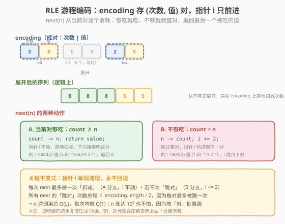
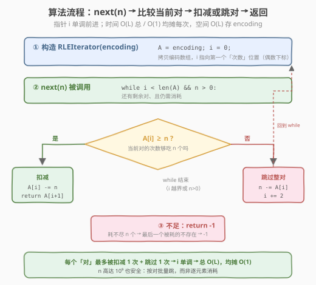

# LeetCode RLE 迭代器 题解

## 1. 题目概述

- **标题 / 题号**：RLE 迭代器（#900，medium）
- **链接**：https://leetcode.cn/problems/rle-iterator/
- **难度**：中等
- **标签**：设计、数组、指针、模拟

**题意**：我们可以使用**游程编码**（Run-Length Encoding, RLE）来编码一个整数序列。在偶数长度的 `encoding` 数组中，对所有偶数下标 `i`，`encoding[i]` 表示值 `encoding[i + 1]` 在序列中**重复的次数**。

- 例如序列 `arr = [8,8,8,5,5]` 可编码为 `encoding = [3,8,2,5]`（3 个 8、2 个 5）。
- `encoding = [3,8,0,9,2,5]` 和 `[2,8,1,8,2,5]` 也都是 `arr` 的合法 RLE（次数为 0 的对不贡献任何元素）。

给定一个游程编码数组，设计一个迭代器遍历它。实现 `RLEIterator` 类：

- `RLEIterator(int[] encoding)`：用编码数组初始化对象。
- `int next(int n)`：**耗尽**接下来的 `n` 个元素，并返回**最后一个被耗尽的元素**。若剩余元素不足 `n` 个，返回 `-1`。

**示例 1**：

```text
输入：
  ["RLEIterator","next","next","next","next"]
  [[[3,8,0,9,2,5]],[2],[1],[1],[2]]
输出：[null,8,8,5,-1]

解释：
  RLEIterator([3,8,0,9,2,5])  // 映射到序列 [8,8,8,5,5]
  next(2) → 耗去 2 个，返回 8。剩下 [8,5,5]
  next(1) → 耗去 1 个，返回 8。剩下 [5,5]
  next(1) → 耗去 1 个，返回 5。剩下 [5]
  next(2) → 第 1 个耗去 5，但第 2 个不存在 → 返回 -1
```

**约束**：

- `2 <= encoding.length <= 1000`
- `encoding.length` 为偶数
- `0 <= encoding[i] <= 10^9`
- `1 <= n <= 10^9`
- `next` 最多被调用 `1000` 次

> 💡 本题是**游程编码 + 单调指针**的设计题。关键在于**绝不在内存里真正展开序列**——`n` 与 `encoding[i]` 都可达 `10^9`，展开会爆内存。正确做法是**在压缩表示上原地扣减次数**：用一个只前进不回退的指针 `i`，每次 `next(n)` 要么在当前对里「扣掉 n 个」（指针不动），要么「整对跳过」（指针 `i += 2`）。这种「按对批量消费」让 `n = 10^9` 也只需 `O(1)` 次操作。

## 2. 解题思路

### 2.1 暴力思路：真正展开序列

最直观但错误的做法：构造时把 `encoding` 展开成完整的整数序列存进数组，`next(n)` 就从头部弹出 `n` 个、返回最后一个。

```text
seq = []
construct(encoding):
    for i in 0, 2, 4, ...:
        seq += [encoding[i+1]] * encoding[i]   // 真正展开
next(n):
    if len(seq) < n: return -1
    for _ in range(n-1): seq.pop_front()
    return seq.pop_front()
```

> ⚠️ 两个致命问题：
> ① **空间爆炸**：`encoding[i]` 高达 `10^9`，展开后的序列可达 `10^9` 量级长度，远超内存限制。
> ② 即便不爆内存，`pop_front` 逐个弹出 `n` 个元素，`n` 高达 `10^9` 时**单次 `next` 就 `O(10^9)`，必超时**。
>
> 根源：暴力把「压缩信息」丢掉了，退回到逐元素处理。正确思路是**保留压缩表示**，在 `(次数, 值)` 对上做**批量算术**——这正是 RLE 编码的意义所在。

### 2.2 核心观察：原地扣减 + 单调指针

**关键定义**：保留 `encoding` 数组的一份拷贝 `A`，维护一个**指针 `i`**（始终指向某个「次数」位置，即偶数下标）。`i` **单调不减、永不回退**——已被跳过的对不再回头。

**核心规则**：每次 `next(n)`：

1. **当** `i < len(A)` 且 `n > 0` 时循环：
   - **若** `A[i] >= n`（当前对的次数够吃 `n` 个）：在当前对里**原地扣减** `A[i] -= n`，**指针不动**，直接 `return A[i+1]`（当前对的值）。`n` 清零。
   - **否则**（当前对不够吃）：`n -= A[i]`（把这一对全吃完，剩余需求减掉这么多），`i += 2`（**跳过整对**，前进到下一对）。
2. 循环结束时若 `n > 0`（跨过所有对仍不够），`return -1`。



**为什么不展开？** RLE 的精髓就是「用 `(次数, 值)` 替换一长串重复值」。迭代器要做的不是还原这一长串，而是**在压缩层做减法**：`A[i] >= n` 时一次扣减等价于「吃掉 n 个重复值」，`A[i] < n` 时 `n -= A[i]` 等价于「整对吃完、需求转移」。两种动作都把 `n` 个元素的消耗压缩成 `O(1)` 次算术，`n = 10^9` 也只做一次比较 + 一次减法。

> 💡 **「0 次对」无需特判**：`encoding` 中可能出现 `A[i] = 0` 的对（如 `[0,9]` 表示 0 个 9）。此时 `A[i] = 0 < n`（因 `n >= 1`），自动走「跳过」分支：`n -= 0`（`n` 不变）、`i += 2`。指针直接越过这个空对，逻辑完全自洽——这正是把循环写成 `while` 而非 `if` 的好处。

### 2.3 算法流程图



**完整步骤**：

1. **构造**：`A = encoding` 的拷贝，`i = 0`。
2. **每次** `next(n)`：
   - `while i < len(A) 且 n > 0`：
     - `if A[i] >= n`：`A[i] -= n`；`return A[i+1]`。
     - `else`：`n -= A[i]`；`i += 2`。
   - `return -1`。
3. **不变式**：`i` 始终指向「第一个尚未完全耗尽的对」的次数位置；`i` 之前的对要么被完全吃掉（次数归 0），要么从未存在（构造时就是 0）。`i` 单调递增。

> ⚠️ **返回值的时机**：只有当 `A[i] >= n`（当前对确实贡献了第 `n` 个被耗元素）才返回 `A[i+1]`。若一路跳过所有对仍未凑够 `n` 个，则返回 `-1`——即便途中已经「部分耗掉」一些对，只要**最后一个被耗的不存在**就算失败（对应题意「第二个项并不存在」）。这与「部分成功也算成功」的直觉相反，是本题最易错的点。

### 2.4 示例演算

以 `encoding = [3,8,0,9,2,5]`（序列逻辑上为 `[8,8,8,5,5]`）、4 次 `next` 为例：


| 步 | next | i 起 | 比较 / 跳对过程 | encoding 变化 | 返回 |
|----|------|------|-----------------|---------------|------|
| 1 | 2 | 0 | `A[0]=3 ≥ 2` → 够吃 | `[1,8,0,9,2,5]`（次数 3→1） | 8 |
| 2 | 1 | 0 | `A[0]=1 ≥ 1` → 够吃 | `[0,8,0,9,2,5]`（次数 1→0） | 8 |
| 3 | 1 | 0 | `A[0]=0<1` 跳 i=2；`A[2]=0<1` 跳 i=4；`A[4]=2≥1` 够吃 | `[0,8,0,9,1,5]`（次数 2→1） | 5 |
| 4 | 2 | 4 | `A[4]=1<2` 跳 i=6；`i=6 ≥ len` 越界 | `[0,8,0,9,0,5]`（第 5 对耗尽） | -1 |

关注 **step 3**：`next(1)` 时第 1 对次数已为 0，第 2 对 `[0,9]` 本来就是 0 次对，指针**连跳两对**才在第 3 对 `[2,5]` 吃到 1 个、返回 5。这正是「按对批量跳」的威力——逐元素展开会浪费大量空间，而压缩层只需 `i += 2` 两次。

关注 **step 4**：`next(2)` 时第 5 对只剩 1 个 5，`1 < 2` 走跳过分支：`n = 2-1 = 1`，`i = 6` 越界，循环结束、`n` 仍为 1 > 0 → 返回 `-1`。注意这里**已经耗掉了最后那个 5**，但题意要求「第 2 个被耗的元素」存在才算成功，故返回 -1。

> 💡 对比暴力法：4 次调用若逐元素展开，序列长度 5，光维护数组就要 `O(5)` 空间；而 `n = 10^9` 时暴力直接崩。压缩层指针 `i` 的轨迹是 `0→0→0→2→4→4→6`，4 次调用总共前进 6 步（跨过 3 对），**均摊每次 1.5 步**，`O(1)` 均摊成立。

## 3. 参考代码

### C++

```cpp
// RLE迭代器.cpp —— 原地扣减次数 + 单调指针
// 编译: g++ -O2 -std=c++17 RLE迭代器.cpp -o rle
#include <vector>
using namespace std;

class RLEIterator {
    vector<int> A;   // encoding 的拷贝，次数会被原地扣减
    int i;           // 指针，指向当前「次数」位置（偶数下标），单调不减
public:
    RLEIterator(vector<int>& encoding) : A(encoding), i(0) {}

    int next(int n) {
        while (i < (int)A.size() && n > 0) {
            if (A[i] >= n) {        // 当前对够吃 n 个：原地扣减，指针不动
                A[i] -= n;
                return A[i + 1];    // 返回当前对的值
            } else {                // 不够吃：整对全吃，需求转移，跳到下一对
                n -= A[i];
                i += 2;
            }
        }
        return -1;                  // 跨过所有对仍不够 n 个
    }
};
```

### Python

```python
class RLEIterator:
    def __init__(self, encoding: list[int]):
        self.A = list(encoding)   # 拷贝，避免修改调用方数组
        self.i = 0                # 指针，指向当前次数位置，单调不减

    def next(self, n: int) -> int:
        while self.i < len(self.A) and n > 0:
            if self.A[self.i] >= n:      # 当前对够吃 n 个：原地扣减，指针不动
                self.A[self.i] -= n
                return self.A[self.i + 1]
            else:                        # 不够吃：整对全吃，需求转移，跳到下一对
                n -= self.A[self.i]
                self.i += 2
        return -1                        # 跨过所有对仍不够 n 个
```

> 💡 两个易错点：① **拷贝 encoding**——构造时务必 `list(encoding)` / `vector(encoding)`，否则原地扣减会污染调用方的数组；② **循环条件写 `while` 而非 `if`**——因为可能连续多个对都不够吃（次数为 0 或残留太少），需要一直跳到「够吃」或「越界」。`if` 只跳一次会漏掉连跳多对的情况。

## 4. 复杂度分析

| 维度 | 复杂度 | 说明 |
|------|--------|------|
| **时间复杂度** | `O(1)` 均摊每次 / `O(L)` 总计 | `L = encoding.length`。指针 `i` 单调递增，每个「对」最多被跳过 1 次，故所有 `next` 的「跳对」总次数 `≤ L/2`；每次 `next` 至多 1 次「扣减」即返回。总操作 `≤ 调用数 + L/2`，均摊 `O(1)` |
| **空间复杂度** | `O(L)` | 存 `encoding` 的一份拷贝 `A`，`L ≤ 1000` |

> ⚠️ **均摊分析的核心**：`i` 是只前进不回退的「单向指针」。每个对 `(A[i], A[i+1])` 在其生命周期里只经历：若干次「扣减」（`A[i]` 递减，`i` 不动）+ 最终一次「跳过」（`i += 2`，此后永不再访问）。因此「跳过」总次数有上界 `L/2`，与 `n` 多大无关——这正是 `n = 10^9` 也安全的原因：`n` 大只影响**减法结果**，不影响**跳过次数**。把 `L/2` 次跳过摊到 `≤ 1000` 次调用上，每次均摊不到 1 步。

## 5. 扩展：游程编码的「压缩层操作」范式

### 5.1 为什么不在内存展开？

游程编码的本质是**用 `(次数, 值)` 替换一长串重复值**，把空间从「序列长度」压到「对数」。本题的陷阱在于：迭代器若试图「还原序列再遍历」，就**主动放弃了压缩带来的优势**，退化成逐元素处理——而 `encoding[i]` 与 `n` 都可达 `10^9`，必然爆内存 / 超时。

正确范式是**在压缩表示上直接做算术**：
- 「吃掉 n 个」⟺ `次数 -= n`（够吃时）或 `需求 n 转移到下一对`（不够吃时）。
- 「跳过一个对」⟺ `i += 2`，`O(1)` 跨过一整段重复值。

这种「压缩层批量操作」思想可迁移到所有 RLE / 段式数据结构。

### 5.2 与同类题的对比

| 维度 | 900 RLE 迭代器 | 880 索引处的解码字符串 | 443 压缩字符串 |
|------|---------------|----------------------|---------------|
| 方向 | **消费**（在线逐次 `next`） | **查询**（给定下标取字符） | **生成**（把原文压成 RLE） |
| 数据形态 | 预编码的 `(次数, 值)` 对 | 字符与数字混合的编码串 | 原始字符数组 |
| 指针方向 | **从左向右**单调前进 | **从左算总长 → 从右反向定位** | 从左向右双指针原地写 |
| 核心技巧 | 原地扣减次数 + 跳对 | 总长取模逆向收缩 | 快慢双指针 + 段计数 |
| 复杂度 | `O(L)` 总 / `O(1)` 均摊 | `O(L)` | `O(n)` |

> 💡 880 是 RLE 家族里最巧的：它要取「展开后第 k 个字符」，但展开后长度可达 `10^10`，于是先**正向累乘算总长**，再**反向用取模把 k 缩回到压缩层**——和 900 一样不展开，但 880 是「离线查询单点」、900 是「在线顺序消费」，指针走向一逆一顺。

### 5.3 如果要支持「随机访问第 k 个元素」？

本题只需顺序消费，指针单调前进即可。若改成「给定 `k` 返回展开后第 `k` 个元素」（类似 880），单调指针就不够了——因为查询可能乱序。此时需：
- **前缀和 + 二分**：预处理每个对的「累积元素数」前缀和，对 `k` 二分找到所属对，再在该对内取值。`O(L)` 预处理、`O(log L)` 查询。
- 这正是把 RLE 当成「分段数组」的通用随机访问套路，与 880 的「总长取模」是两种不同思路（880 利用单调查询、本题乱序则用前缀和二分）。

## 6. 面试要点

1. **为什么不真正展开序列？**

   - `encoding[i]` 与 `n` 都可达 `10^9`，展开后序列长度量级 `10^9`，**爆内存**；逐元素弹出 `n` 个则**单次 `next` 就 `O(10^9)` 超时**。
   - 正确做法是**在压缩表示上做批量算术**：`A[i] >= n` 时一次扣减等价于吃掉 n 个重复值，`A[i] < n` 时 `n -= A[i]` 等价于整对吃完。两种动作都把 n 个消耗压成 `O(1)`。
   - 本质：保留 RLE 的压缩信息，在 `(次数, 值)` 对上操作，而非还原成一长串。

2. **指针 `i` 为什么是单调的？复杂度如何保证？**

   - `i` 只在「不够吃」时 `+= 2` 前进，在「够吃」时原地不动；从不回退。因为已耗尽的对永不再贡献元素，回头无意义。
   - 每个对最多被「跳过」一次，故所有 `next` 的跳过总次数 `≤ L/2`；每次 `next` 至多 1 次扣减即返回。总操作 `≤ 调用数 + L/2`，**均摊 `O(1)`**。
   - 关键：`n` 多大只影响减法结果、不影响跳过次数——这是 `n = 10^9` 也安全的根本原因。

3. **「0 次对」如何处理？需要特判吗？**

   - **不需要特判**。`A[i] = 0` 时，因 `n >= 1`，`0 >= n` 为假，自动走「跳过」分支：`n -= 0`（n 不变）、`i += 2`。
   - 循环写成 `while` 而非 `if` 正是为了**连跳多个 0 次对或残留太少对**。`if` 只跳一次会漏，`while` 跳到「够吃」或「越界」为止。
   - 这是「让循环条件自然处理边界」的范例：不写 `if (A[i] == 0) skip`，而是统一用 `A[i] >= n` 判定，0 自动落入不够吃分支。

4. **什么时候返回 -1？「部分耗掉」算成功吗？**

   - **不算**。题意要求「耗尽 n 个并返回最后一个被耗的」——只要**最后一个不存在**就返回 -1，哪怕前面已耗掉一些。
   - 判定：`while` 结束时若 `n > 0`（跨过所有对仍不够 n 个），返回 -1。注意此时途中已扣减 / 跳过的对**不会回滚**——迭代器状态已被消耗，这是「迭代器」语义（单向、不可逆）。
   - 易错点：有人误以为「部分耗掉就返回最后耗掉的值」，但样例 `next(2)` 在只剩 1 个 5 时返回 -1（而非 5），证明必须凑够 n 个才算成功。

5. **构造时为什么要拷贝 encoding？**

   - `next` 会**原地修改** `A[i]`（扣减次数）。若不拷贝、直接引用调用方数组，会污染外部数据——在 LeetCode 框架里可能没问题，但在工程中是隐蔽 bug。
   - C++ 用 `vector<int> A(encoding)` 调拷贝构造；Python 用 `list(encoding)`。空间 `O(L)`，`L ≤ 1000`，可忽略。
   - 也可改为「不修改 A、另存 `i` 与 `已消耗偏移`」，但原地扣减更直观、且 `A` 是私有成员无外泄风险。

> 💡 **一句话总结**：RLE 迭代器是「游程编码 + 单调指针」的设计题——它用「`A[i] >= n` 则原地扣减、否则 `n -= A[i]` 跳整对」的两分支循环，把 `n` 高达 `10^9` 的批量消费压成 `O(1)` 均摊。核心是**永不展开序列、在压缩层做算术**，配合**只前进不回退的指针**保证均摊复杂度。这个「压缩层批量操作 + 单调指针」骨架可迁移到所有 RLE / 段式数据的在线消费场景，是面试必会的「不展开、按段跳」范式。

## 同类练习题

| # | 题目 | 与本题的关联 |
|---|------|-------------|
| 880 | [索引处的解码字符串](https://leetcode.cn/problems/decoded-string-at-index/)（[题解](../0801-0900/880_索引处的解码字符串.md)） | 同为 RLE 式编码不展开，但用「总长取模反向定位」查单点，对照本题「正向顺序消费」 |
| 443 | [压缩字符串](https://leetcode.cn/problems/string-compression/)（[题解](../0401-0500/443_压缩字符串.md)） | RLE 的**编码方向**（原文→压缩串），快慢双指针原地写，与本题的**解码/消费方向**互补 |
| 1313 | [解码 RLE 编码的数组](https://leetcode.cn/problems/decompress-run-length-encoded-list/) | 把 RLE 一次性**完整展开**成数组（数据规模小可展开），对照本题「不展开、按需消费」的取舍 |
| 604 | [设计压缩字符串迭代器](https://leetcode.cn/problems/design-compressed-string-iterator/) | 本题的**字符串版**（`L3e2t` → `Leeet`），同为「在压缩表示上推进指针、按字符段扣减」，可直接套同一模板 |
