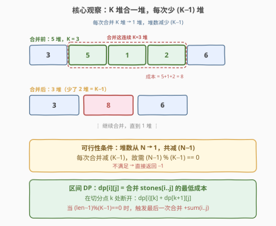
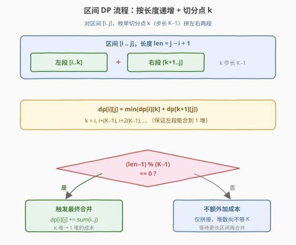
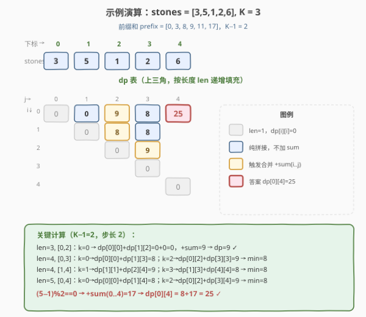

# 合并石头的最低成本

- **题目名称**：合并石头的最低成本
- **链接**：[1000. 合并石头的最低成本](https://leetcode.cn/problems/minimum-cost-to-merge-stones/)
- **难度**：困难
- **标签**：数组、动态规划、区间 DP

## 1. 题目概述

有 `n` 堆石头排成一排，第 `i` 堆中有 `stones[i]` 块石头。每次**移动**需要将**连续的** `K` 堆石头合并为一堆，这次移动的成本为这 `K` 堆中石头的总数。返回把所有石头合并成一堆的最低成本；若无法合并成一堆，返回 `-1`。

**示例 1**：

```text
输入：stones = [3,2,4,1], K = 2
输出：20
解释：
合并 [3, 2]，成本 5，剩下 [5, 4, 1]
合并 [4, 1]，成本 5，剩下 [5, 5]
合并 [5, 5]，成本 10，剩下 [10]
总成本 20，这是可能的最小值。
```

**示例 2**：

```text
输入：stones = [3,2,4,1], K = 3
输出：-1
解释：任何合并后都会剩下 2 堆，无法再合并，任务不可能完成。
```

**示例 3**：

```text
输入：stones = [3,5,1,2,6], K = 3
输出：25
解释：
合并 [5, 1, 2]，成本 8，剩下 [3, 8, 6]
合并 [3, 8, 6]，成本 17，剩下 [17]
总成本 25，这是可能的最小值。
```

**约束条件**：

- `n == stones.length`
- `1 <= n <= 30`
- `1 <= stones[i] <= 100`
- `2 <= K <= 30`

> 💡 本题的标志特征是「**连续 K 堆合一堆**」——这不是任意两堆可合并的石子合并问题（那类用 Huffman/Greedy），而是**位置固定、必须连续 K 堆**的合并，贪心失效，必须用**区间 DP**。突破口有两步：先判定 `(N−1)%(K−1)==0` 的可行性，再用「切分点 + 条件加和」的区间递推求最低成本。

---

## 2. 解题思路

### 2.1 暴力思路

枚举每一步在哪个位置合并哪 K 堆，搜索所有合并顺序，取成本最小值。每一步有约 `n` 个可选位置，共需 $\frac{N-1}{K-1}$ 次合并，搜索树规模 $O(n^{(N-1)/(K-1)})$，$n=30$ 时指数爆炸。同一区间的最优合并成本会被反复求解，天然适合 DP。

### 2.2 核心观察：可行性 + 区间 DP



两个关键观察串成推理链：

**观察一：可行性条件。** 每次合并把 `K` 堆变 `1` 堆，堆数净减 `K−1`。要从 `N` 堆变 `1` 堆，总共需减少 `N−1` 堆。因此合并次数为 $\frac{N-1}{K-1}$，必须是整数：

$$
(N-1) \bmod (K-1) \stackrel{?}{=} 0
$$

不满足直接返回 `-1`（示例 2：$N=4, K=3$，$(4-1)\bmod(3-1)=1\neq 0$，无解）。

**观察二：区间 DP。** 定义 `dp[i][j]` 为合并 `stones[i..j]` 这一段的**最低成本**（合并到该段所能达到的最少堆数）。对区间 `[i..j]`，枚举切分点 `k` 把它拆成左段 `[i..k]` 与右段 `[k+1..j]`，分别求出最低成本后拼接：

$$
\text{dp}[i][j] = \min_{k} \bigl(\text{dp}[i][k] + \text{dp}[k+1][j]\bigr)
$$

> 💡 **切分点 k 的步长为何是 K−1？** 左段 `[i..k]` 若要最终能被完全合并（不留残余），其长度需满足 $(k-i)\bmod(K-1)=0$。所以 `k` 取 $i,\ i+(K-1),\ i+2(K-1),\dots$，步长 `K−1`。这样左段总能独立合并成 `1` 堆，右段继续承担剩余堆数。

**何时追加合并成本？** 当区间长度 `len = j−i+1` 满足 $(\text{len}-1)\bmod(K-1)=0$ 时，该段恰好能合并成 `1` 堆——此时发生「最后一次合并」（把 `K` 堆合为 `1` 堆），需加上这段的石子总和 `sum(i..j)`：

$$
\text{dp}[i][j]\ \texttt{+=}\ \text{sum}(i..j) \quad\text{当 } (\text{len}-1)\bmod(K-1)=0
$$

> ⚠️ 注意 `len=1` 时 $(1-1)\bmod(K-1)=0$ 也成立，但单堆无需合并，成本为 `0`。代码中 `dp[i][i]=0` 作为边界预先填好，主循环从 `len=2` 开始，避免对单堆误加 `sum`。

**前缀和优化**：`sum(i..j) = prefix[j+1] − prefix[i]`，预处理 $O(n)$，每次查询 $O(1)$。

### 2.3 算法流程图



1. **可行性判定**：若 $(n-1)\bmod(K-1)\neq 0$，返回 `-1`。
2. **预处理**：计算前缀和数组 `prefix`，`dp` 初始化为 `+∞`，`dp[i][i] = 0`。
3. **按长度递增** `len = 2..n`：
   - 枚举左端点 `i`，右端点 `j = i+len−1`。
   - 枚举切分点 `k = i, i+(K−1), …`（步长 `K−1`，`k < j`）：`dp[i][j] = min(dp[i][j], dp[i][k] + dp[k+1][j])`。
   - 若 $(\text{len}-1)\bmod(K-1)=0$：`dp[i][j] += sum(i..j)`（触发最终合并）。
4. **返回** `dp[0][n−1]`。

> 💡 **为什么按长度递增？** `dp[i][j]` 依赖更短的子区间 `[i..k]`（长 `k−i+1 < len`）和 `[k+1..j]`（长 `j−k < len`）。按长度从小到大填充，保证计算当前状态时依赖已全部就绪——这是区间 DP 的通用填充顺序（同 [877 石子游戏](../0801-0900/877_石子游戏.md)、[312 戳气球](../0301-0400/312_戳气球.md)）。

### 2.4 示例演算

以示例 3 `stones = [3,5,1,2,6], K = 3` 为例，`K−1 = 2`，步长 `2`，前缀和 `prefix = [0,3,8,9,11,17]`：



关键步骤：

| 长度 | 区间 `[i,j]` | 切分计算 | 加和? | dp 值 |
|------|--------------|----------|-------|-------|
| 1 | `[0,0]`…`[4,4]` | 边界 | — | 0 |
| 2 | `[0,1]`…`[3,4]` | `dp[i][i]+dp[i+1][i+1]=0` | $(1\bmod2\neq0)$ 否 | 0 |
| 3 | `[0,2]` | `k=0`：`dp[0][0]+dp[1][2]=0` | $(2\bmod2=0)$ +sum=9 | 9 |
| 3 | `[1,3]` | `k=1`：`dp[1][1]+dp[2][3]=0` | +sum=8 | 8 |
| 3 | `[2,4]` | `k=2`：`dp[2][2]+dp[3][4]=0` | +sum=9 | 9 |
| 4 | `[0,3]` | `k=0`→8；`k=2`→9 → min=8 | $(3\bmod2\neq0)$ 否 | 8 |
| 4 | `[1,4]` | `k=1`→9；`k=3`→8 → min=8 | 否 | 8 |
| 5 | `[0,4]` | `k=0`→`dp[0][0]+dp[1][4]=8`；`k=2`→`dp[0][2]+dp[3][4]=9` → min=8 | $(4\bmod2=0)$ +sum=17 | **25** |

`dp[0][4] = 8 + 17 = 25` ✓。

---

## 3. 参考代码

### C++

```cpp
// 合并石头的最低成本.cpp —— 区间 DP + 切分点步长 K-1 + 条件加和
// 编译: g++ -O2 -std=c++17 合并石头的最低成本.cpp -o merge
#include <vector>
#include <algorithm>
using namespace std;

class Solution {
  public:
    int mergeStones(vector<int>& stones, int K) {
        int n = stones.size();
        if ((n - 1) % (K - 1) != 0) return -1;          // 可行性判定

        vector<int> prefix(n + 1, 0);
        for (int i = 0; i < n; ++i) prefix[i + 1] = prefix[i] + stones[i];

        const int INF = 1e9;
        vector<vector<int>> dp(n, vector<int>(n, INF));
        for (int i = 0; i < n; ++i) dp[i][i] = 0;       // 单堆成本 0

        for (int len = 2; len <= n; ++len) {            // 按区间长度递增
            for (int i = 0; i + len - 1 < n; ++i) {     // 枚举左端点
                int j = i + len - 1;
                for (int k = i; k < j; k += K - 1) {    // 切分点步长 K-1
                    dp[i][j] = min(dp[i][j], dp[i][k] + dp[k + 1][j]);
                }
                if ((len - 1) % (K - 1) == 0) {         // 可合并成 1 堆
                    dp[i][j] += prefix[j + 1] - prefix[i];
                }
            }
        }
        return dp[0][n - 1];
    }
};
```

### Python

```python
from typing import List


class Solution:
    def mergeStones(self, stones: List[int], K: int) -> int:
        n = len(stones)
        if (n - 1) % (K - 1) != 0:       # 可行性判定
            return -1

        prefix = [0] * (n + 1)
        for i in range(n):
            prefix[i + 1] = prefix[i] + stones[i]

        INF = float('inf')
        dp = [[INF] * n for _ in range(n)]
        for i in range(n):
            dp[i][i] = 0                 # 单堆成本 0

        for length in range(2, n + 1):            # 按区间长度递增
            for i in range(n - length + 1):       # 枚举左端点
                j = i + length - 1
                k = i
                while k < j:                     # 切分点步长 K-1
                    if dp[i][k] + dp[k + 1][j] < dp[i][j]:
                        dp[i][j] = dp[i][k] + dp[k + 1][j]
                    k += K - 1
                if (length - 1) % (K - 1) == 0:   # 可合并成 1 堆
                    dp[i][j] += prefix[j + 1] - prefix[i]

        return dp[0][n - 1]
```

> 💡 **步长优化**：内层 `while k < j` 以 `K−1` 为步长，只枚举能让左段 `[i..k]` 合并成 1 堆的合法切分点，跳过必然为 `+∞` 的无效状态。若改为步长 1 配合 `INF` 判定也正确，但慢约 $K−1$ 倍。

---

## 4. 复杂度分析

| 维度 | 复杂度 | 说明 |
|------|--------|------|
| 时间复杂度 | $O(n^3 / (K-1))$ | 区间 $O(n^2)$ × 切分点 $O(n/(K-1))$；$n\le 30$，最坏约 $30^3/1=27000$，常数级 |
| 空间复杂度 | $O(n^2)$ | 二维 dp 表 + 一维前缀和 |

> ⚠️ 严格说切分点步长 `K−1` 使内层循环次数为 $\lceil(\text{len}-1)/(K-1)\rceil$，总状态转移约 $\sum_{\text{len}}(n-\text{len}+1)\cdot\frac{\text{len}}{K-1}=O(n^3/(K-1))$。当 $K=2$（步长 1）退化为 $O(n^3)$，仍是 $n=30$ 的常数级。

---

## 5. 扩展：三维状态 dp[i][j][m]

上面的二维写法把「合并成几堆」隐式地由区间长度推导（合法堆数 $m\equiv\text{len}\pmod{K-1}$ 唯一确定）。更直观的写法是显式记录目标堆数 $m$：

$$
\text{dp}[i][j][m] = \text{合并 } stones[i..j] \text{ 为 } m \text{ 堆的最低成本}
$$

转移：

- $m=1$：先合并成 $K$ 堆，再把这 $K$ 堆合一，$\text{dp}[i][j][1] = \text{dp}[i][j][K] + \text{sum}(i..j)$。
- $m\ge 2$：切下左段合成 `1` 堆、右段合成 $m-1$ 堆，$\text{dp}[i][j][m] = \min_k(\text{dp}[i][k][1] + \text{dp}[k+1][j][m-1])$，$k$ 步长 `K−1`。

```python
def mergeStones(self, stones: List[int], K: int) -> int:
    n = len(stones)
    if (n - 1) % (K - 1) != 0:
        return -1
    prefix = [0] * (n + 1)
    for i in range(n):
        prefix[i + 1] = prefix[i] + stones[i]

    INF = float('inf')
    dp = [[[INF] * (K + 1) for _ in range(n)] for _ in range(n)]
    for i in range(n):
        dp[i][i][1] = 0                       # 单堆即 1 堆，成本 0

    for length in range(2, n + 1):
        for i in range(n - length + 1):
            j = i + length - 1
            for m in range(2, K + 1):         # 先算 m=2..K
                k = i
                while k < j:
                    cand = dp[i][k][1] + dp[k + 1][j][m - 1]
                    if cand < dp[i][j][m]:
                        dp[i][j][m] = cand
                    k += K - 1
            if dp[i][j][K] < INF:             # 再由 K 堆合一得 m=1
                dp[i][j][1] = dp[i][j][K] + prefix[j + 1] - prefix[i]

    return dp[0][n - 1][1]
```

> 💡 三维版本状态 $O(n^2 K)$、转移 $O(n)$，总 $O(n^3 K)$；二维版本相当于观察到「合法 $m$ 由长度唯一确定」后压掉了第三维，降到 $O(n^3/(K-1))$。二者等价，二维更简洁，三维更便于讲解「为什么这么转移」。

---

## 6. 面试要点

1. **为什么不能用贪心/Huffman？**

   - 经典石子合并（每次合并**任意两堆**）可贪心选最小两堆。但本题要求**连续 K 堆**才能合并，位置约束破坏了贪心的交换论证——局部最小的 K 堆未必连续，且合并后位置改变会影响后续可合并性。必须用区间 DP 枚举所有切分。

2. **可行性条件 `(N−1)%(K−1)==0` 是怎么来的？**

   - 每次合并 `K` 堆→`1` 堆，堆数净减 `K−1`。从 `N` 堆到 `1` 堆需净减 `N−1`，故合并次数 $\frac{N-1}{K-1}$ 必须为整数。不满足则无论怎么合都凑不到 `1` 堆（如 $N=4,K=3$，合一次剩 `2` 堆，不够 `3` 堆再合）。

3. **切分点 k 为什么步长是 K−1 而非 1？**

   - 左段 `[i..k]` 要能独立合并成 `1` 堆，需 $(k-i+1-1)\bmod(K-1)=0$，即 $(k-i)\bmod(K-1)=0$。步长 `K−1` 只枚举合法切分点，跳过必然为 `+∞` 的无效状态，常数优化。步长 `1` 配合 `+∞` 判定也正确，但慢 $K−1$ 倍。

4. **`(len−1)%(K−1)==0` 时为什么加 `sum(i..j)` 而非别的值？**

   - 该条件成立意味着这段恰好能合并到 `1` 堆，最后一步是把 `K` 堆合一，成本就是这 `K` 堆（即整段）的石子总和 `sum(i..j)`。其余切分点的成本已在 `dp[i][k]+dp[k+1][j]` 中累加过子段合并成本，这里只补「最后一步」。

5. **和经典石子合并（每次合并两堆）有什么区别？**

   - 经典版 $K=2$：$(\text{len}-1)\bmod 1=0$ 恒成立，每段都加 `sum`，退化为 $O(n^3)$ 的标准区间 DP（[AcWing 282](https://www.acwing.com/problem/content/284/)）。本题是 $K>2$ 的推广：只有能合到 `1` 堆的段才加 `sum`，其余段只做拼接，等待更长区间再触发合并。

> 💡 **一句话总结**：1000 的核心是「**可行性判定 + 区间 DP 条件加和**」。先判 `(N−1)%(K−1)==0` 滤掉无解，再按长度递增填 `dp[i][j]`：切分点以 `K−1` 为步长拼左右两段，当段长满足 `(len−1)%(K−1)==0` 时加上 `sum(i..j)` 作为最后一次合并的成本。

---

## 7. 同类练习题

- [312. 戳气球](https://leetcode.cn/problems/burst-balloons/)（[题解](../0301-0400/312_戳气球.md)）：区间 DP 经典，按「最后戳的位置」划分区间，对比本题「按切分点拼左右」的另一种切分方式
- [877. 石子游戏](https://leetcode.cn/problems/stone-game/)（[题解](../0801-0900/877_石子游戏.md)）：博弈型区间 DP 母模板，同按长度递增填充，体会不同状态定义下的转移写法
- [375. 猜数字大小 II](https://leetcode.cn/problems/guess-number-higher-or-lower-ii/)：区间 DP 求最小化最坏情况成本，转移同样枚举中间分割点取 min
- [1130. 叶值的最小代价生成树](https://leetcode.cn/problems/minimum-cost-tree-from-leaf-values/)：区间 DP，按切分点拼左右子树，对比本题「拼接 + 条件加和」的转移结构
- [546. 移除盒子](https://leetcode.cn/problems/remove-boxes/)：区间 DP 加额外维度记录附加状态，体会当「合并/移除」规则更复杂时如何扩展状态定义
