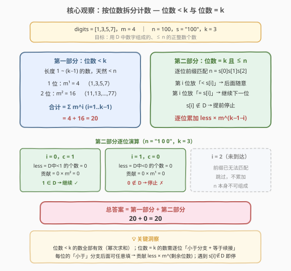
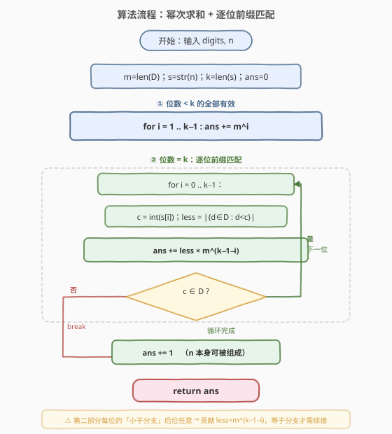
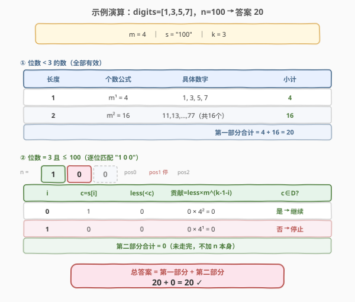

# LeetCode 最大为 N 的数字组合 题解

## 1. 题目概述

- **标题 / 题号**：最大为 N 的数字组合（#902，hard）
- **链接**：https://leetcode.cn/problems/numbers-at-most-n-given-digit-set/
- **难度**：困难
- **标签**：数学、动态规划、数位 DP

**题意**：给定一个按**非递减顺序**排列的数字数组 `digits`（每个元素是 `'1'`~`'9'` 中的字符，互不相同）。你可以**任意次数**地使用 `digits` 中的数字来写正整数。返回能写出的、**小于或等于**给定整数 `n` 的正整数个数。

**示例 1**：

```text
输入：digits = ["1","3","5","7"], n = 100
输出：20
解释：可写出的 20 个数字是
1, 3, 5, 7, 11, 13, 15, 17, 31, 33, 35, 37, 51, 53, 55, 57, 71, 73, 75, 77
```

**示例 2**：

```text
输入：digits = ["1","4","9"], n = 1000000000
输出：29523
解释：3 个一位数、9 个两位数、27 个三位数、…、19683 个九位数，总计 29523 个
```

**示例 3**：

```text
输入：digits = ["7"], n = 8
输出：1
```

**约束**：

- $1 \le \text{digits.length} \le 9$
- `digits[i]` 是 `'1'`~`'9'` 中的字符，互不相同且非递减
- $1 \le n \le 10^9$

> ⚠️ $n$ 可达 $10^9$（10 位数）。逐个枚举所有组合必然超时——当 $m=9$ 时仅 9 位数就有 $9^9 \approx 3.9\times 10^8$ 个。必须从**按位数拆分 + 逐位组合计数**的结构切入，用 $O(k \log m)$（$k$ 为 $n$ 的位数）的数学计数直接算出答案。

## 2. 解题思路

### 2.1 暴力思路：枚举所有组合

最直白的做法：从小到大枚举所有由 `digits` 组成的数，逐个与 $n$ 比较，统计 $\le n$ 的个数。

```text
ans = 0
for length = 1, 2, ...:
    for 每个长度为 length 的组合（digits 中可重复取）:
        num = 组合对应的整数
        if num <= n: ans += 1
        else: 太大，可剪枝
    if length > len(str(n)): break
```

问题：当 $m=9$、$n=10^9$ 时，9 位数组合达 $9^9 \approx 3.9\times 10^8$，遍历超时；且每个组合要转成整数再比较，常数开销大。

> 💡 暴力法的浪费在于：它**逐个生成**数字再比较，丢失了「按位数天然分层」与「同位前缀共享计数」的结构。换视角：位数**少于** $n$ 的数一定都 $< n$，可直接用幂次求和；位数**等于** $n$ 的数才需逐位比较——而每位的比较只需数「比该位小的候选个数」，后面位数任意填，一次组合计数搞定。

### 2.2 核心观察：按位数拆分 + 逐位前缀匹配

设 $m = \text{len}(\text{digits})$，把 $n$ 转成字符串 $s$，记 $k = \text{len}(s)$（$n$ 的位数）。把答案拆成两部分：



**第一部分——位数 $< k$ 的数**：这些数天然 $< n$（位数少必更小）。长度为 $i$ 的数有 $m^i$ 个（每位独立从 $m$ 个数字中选），合计：

$$\text{part1} = \sum_{i=1}^{k-1} m^i$$

**第二部分——位数 $= k$ 且 $\le n$ 的数**：逐位从高到低匹配 $n$ 的前缀。设当前处理第 $i$ 位（0-indexed），$c = s[i]$ 是 $n$ 在该位的数字：

- **「小于」分支**：在第 $i$ 位放一个**严格小于** $c$ 的数字 $d \in \text{digits}$。设这样的 $d$ 有 $\text{less}$ 个，则剩下 $k-1-i$ 位可任意填，贡献 $\text{less} \times m^{k-1-i}$。
- **「等于」分支**：在第 $i$ 位恰好放 $c$。只有当 $c \in \text{digits}$ 时才可行，此时前缀完全匹配，**继续**处理下一位（处理「恰好等于 $n$ 前缀」的尾部）。
- 若 $c \notin \text{digits}$：「等于」分支走不通，后续位无需再算，**提前停止**。
- 若走完所有 $k$ 位都没停，说明 $n$ 本身可被 `digits` 组成，**额外加 1**（即 $n$ 自己）。

> 💡 **为什么「小于」分支后面可以任意填？** 因为第 $i$ 位已经严格小于 $c$，无论后面填什么，整个数都严格小于 $n$（高位已定胜负）。这是数位计数的核心不变式：**高位一旦分出严格小于，低位完全自由**。而「等于」分支则是「高位打平，胜负推迟到低位决定」——这正是逐位续接的意义。

### 2.3 算法流程图



**完整步骤**：

1. **预处理**：$m = \text{len}(\text{digits})$，$s = \text{str}(n)$，$k = \text{len}(s)$。把 `digits` 转成有序整数集合 $D$（便于比较）。
2. **第一部分**：`for i = 1 .. k-1: ans += m^i`。
3. **第二部分**：`for i = 0 .. k-1`：
   - $c = \text{int}(s[i])$
   - $\text{less} = |\\{d \in D : d < c\\}|$（用二分或线性扫描，$m \le 9$ 直接线性即可）
   - `ans += less * m^(k-1-i)`
   - 若 $c \notin D$：`break`（无法续接，提前返回当前 `ans`）
4. **收尾**：若循环正常走完（未 break），`ans += 1`（$n$ 本身可被组成）。
5. 返回 `ans`。

> ⚠️ **预处理幂次**：第二部分反复用到 $m^{k-1-i}$，可预先算好 $m$ 的各次幂存入数组，避免重复计算。由于 $k \le 10$、$m \le 9$，$m^k \le 9^{10} \approx 3.5\times 10^9$，C++ 中用 `long long` 存幂避免溢出。

### 2.4 示例演算

以 `digits = ["1","3","5","7"]`，`n = 100` 为例（$m=4$，$s=\text{"100"}$，$k=3$）：



**第一部分**（位数 $< 3$）：

| 长度 $i$ | 个数 $m^i$ | 具体数字 | 小计 |
|----------|-----------|----------|------|
| 1 | $4^1 = 4$ | 1, 3, 5, 7 | 4 |
| 2 | $4^2 = 16$ | 11,13,…,77 | 16 |

$$\text{part1} = 4 + 16 = 20$$

**第二部分**（位数 $= 3$ 且 $\le 100$，逐位匹配 "100"）：

| $i$ | $c=s[i]$ | less（$D$ 中 $< c$ 的个数） | 贡献 $=\text{less}\times m^{k-1-i}$ | $c \in D$? |
|-----|----------|---------------------------|--------------------------------------|-----------|
| 0 | 1 | 0 | $0 \times 4^2 = 0$ | 是 → 继续 |
| 1 | 0 | 0 | $0 \times 4^1 = 0$ | **否 → 停止** |

循环在第 1 位因 $0 \notin D$ 提前停止，未走完，不加 $n$ 本身。

$$\text{part2} = 0$$

**总答案** $= 20 + 0 = 20$ ✓

**再验示例 3**：`digits = ["7"]`，`n = 8`。$m=1$，$s=\text{"8"}$，$k=1$。第一部分（位数 $<1$）为空 $=0$。第二部分：$i=0$，$c=8$，$\text{less}=1$（$7<8$），贡献 $1\times 1^0 = 1$；$8 \notin D$ → 停止。总答案 $= 0 + 1 = 1$ ✓。

**再验示例 2**：`digits = ["1","4","9"]`，`n = 10^9`。$m=3$，$s=\text{"1000000000"}$，$k=10$。第一部分 $= 3^1+3^2+\dots+3^9 = 29523$。第二部分：$i=0$，$c=1$，$\text{less}=0$，贡献 $0$；$1\in D$ 继续。$i=1$，$c=0$，$\text{less}=0$，贡献 $0$；$0\notin D$ → 停止。总答案 $= 29523 + 0 = 29523$ ✓。

> 💡 三个示例的第二部分都是 0——因为 $n$ 的次高位是 0，而 `digits` 只含 `'1'`~`'9'`（无 0），匹配到第二位必然停止。但第二部分的逻辑在 $n$ 的各位都较大时才真正发挥作用（如 $n=565$，`digits=[1,3,5,7]`：$i=0$ 时 $c=5$，$\text{less}=2$（1,3），贡献 $2\times 4^2=32$；$5\in D$ 继续；$i=1$ 时 $c=6$，$\text{less}=3$（1,3,5），贡献 $3\times 4=12$；$6\notin D$ 停止。第二部分 $=44$，总答案 $= 20+44=64$）。

## 3. 参考代码

### C++

```cpp
// 902.最大为N的数字组合.cpp —— 幂次求和 + 逐位前缀匹配
// 编译: g++ -O2 -std=c++17 902.cpp -o sol
#include <vector>
#include <string>
#include <algorithm>
using namespace std;

class Solution {
  public:
    int atMostNGivenDigitSet(vector<string>& digits, int n) {
        string s = to_string(n);
        int k = s.size();
        int m = digits.size();

        // D 转成有序整数集合
        vector<int> D;
        for (auto& d : digits) D.push_back(d[0] - '0');

        // 预计算 m 的 0..k 次幂（用 long long 防溢出）
        vector<long long> pw(k + 1);
        pw[0] = 1;
        for (int i = 1; i <= k; ++i) pw[i] = pw[i - 1] * m;

        long long ans = 0;

        // 第一部分：位数 < k 的全部有效
        for (int i = 1; i < k; ++i) ans += pw[i];

        // 第二部分：位数 = k，逐位前缀匹配
        for (int i = 0; i < k; ++i) {
            int c = s[i] - '0';
            // less = D 中严格小于 c 的个数
            int less = lower_bound(D.begin(), D.end(), c) - D.begin();
            ans += (long long)less * pw[k - 1 - i];
            // c 不在 D 中 → 无法续接，提前停止
            if (!binary_search(D.begin(), D.end(), c)) return ans;
        }

        // 走完所有位仍未停 → n 本身可被组成
        return ans + 1;
    }
};
```

### Python

```python
class Solution:
    def atMostNGivenDigitSet(self, digits: list[str], n: int) -> int:
        s = str(n)
        k = len(s)
        m = len(digits)
        D = [int(d) for d in digits]          # 已是非递减

        # 预计算 m 的 0..k 次幂
        pw = [1] * (k + 1)
        for i in range(1, k + 1):
            pw[i] = pw[i - 1] * m

        ans = 0

        # 第一部分：位数 < k 的全部有效
        for i in range(1, k):
            ans += pw[i]

        # 第二部分：位数 = k，逐位前缀匹配
        for i in range(k):
            c = int(s[i])
            # less = D 中严格小于 c 的个数（bisect_left 找首个 >= c 的下标）
            import bisect
            less = bisect.bisect_left(D, c)
            ans += less * pw[k - 1 - i]
            # c 不在 D 中 → 无法续接，提前停止
            if c not in D:
                return ans

        # 走完所有位仍未停 → n 本身可被组成
        return ans + 1
```

> 💡 两版逻辑一致。`less` 的计算用 `lower_bound` / `bisect_left`（$D$ 已有序），返回首个 $\ge c$ 的下标，恰为「$< c$ 的元素个数」。判断 $c \in D$ 用 `binary_search` / `in`。注意第二部分一旦发现 $c \notin D$ 就 `return ans`（等价于 break 后直接返回），省去额外标志位。

## 4. 复杂度分析

| 维度 | 复杂度 | 说明 |
|------|--------|------|
| **时间复杂度** | $O(k \log m)$ | 第一部分 $O(k)$ 次幂累加；第二部分 $k$ 位，每位一次 `lower_bound`（$O(\log m)$）。$k \le 10$、$m \le 9$，常数极小 |
| **空间复杂度** | $O(k)$ | 存 $m$ 的幂次数组 $pw$（长度 $k+1$）与 $n$ 的字符串（长度 $k$）；$D$ 数组 $O(m)$ |

> 💡 之所以是对数级，是因为没有生成任何数字，而是按**位数分层 + 每位组合计数**直接算出总数。每位的「小于」分支一次乘法搞定所有后继组合，与 [400. 第 N 位数字](../0301-0400/400_第N位数字.md) 的「按位数分层定位」、[357. 统计各位数字都不同的数字个数](../0301-0400/357_统计各位数字都不同的数字个数.md) 的「按位数分类计数」同属「结构降维」一族。

## 5. 扩展：数位 DP 视角与变体对比

### 5.1 本题就是最朴素的数位 DP

数位 DP 的通用模板是：`dfs(pos, tight, ...)` ——从高到低逐位填，`tight` 标记「前缀是否与 $n$ 完全相等」（相等则当前位上限为 $s[\text{pos}]$，否则上限为 9）。本题中 `digits` 限制了每位可选集合，且「小于分支后位自由」正是 `tight=false` 的体现。

本题之所以能不用记忆化、不用 DFS，是因为**状态极度简单**：

- `tight=true` 的路径只有一条（逐位匹配 $n$ 的前缀），无需记忆化——线性扫一遍即可。
- `tight=false` 的路径贡献可直接用 $\text{less}\times m^{\text{剩余}}$ 公式算出，无需 DFS。

也就是说，本题是数位 DP 的「退化特例」——约束（每位只能选 $D$ 中数字）反而让计数公式化，把通用模板压成了一段循环。

> 💡 **通用数位 DP 模板**（适用于更复杂的约束，如「各位数字之和 ≤ S」「相邻位差 ≥ 2」等）：
> ```text
> dfs(pos, tight, lead):
>     if pos == k: return 1 if not lead else 0
>     up = s[pos] if tight else 9
>     ans = 0
>     for d in 0..up:
>         ans += dfs(pos+1, tight and d==up, lead and d==0)
>     return ans
> ```
> 本题把 `for d in 0..up` 换成 `for d in D if d <= up`，`tight=false` 时直接返回 $m^{\text{剩余}}$ 而不展开循环——这就是「公式化」的由来。

### 5.2 与 357、233 的对比

| 维度 | 357 各位不同数字个数 | 233 数字 1 的个数 | 902 最大为 N 的组合 |
|------|----------------------|-------------------|---------------------|
| 约束 | 各位互不相同 | 统计数字 1 出现次数 | 每位只能选 $D$ 中数字 |
| 可选集合 | 0-9（带「未用过」限制） | 0-9（无限制，按位统计） | $D$（固定子集） |
| 计数方式 | 排列数 $A_9^{i-1}\times 9$ | 按位分解（高位/当前/低位） | 幂次 $m^i$ + 逐位 less |
| 是否需 DP | 否（排列公式） | 否（按位公式） | 否（幂次 + less） |
| 复杂度 | $O(k)$ | $O(\log n)$ | $O(k\log m)$ |

三题同属「按数位分层 + 每位组合计数」，但因约束不同导致计数公式各异。902 的特点是：每位可选集合是固定子集 $D$，所以「小于分支」用 `less`（$D$ 中 $<c$ 的个数）而非 $c$ 本身，且后继自由度为 $m^{\text{剩余}}$ 而非 $10^{\text{剩余}}$。

### 5.3 如果用记忆化 DFS？

可以写标准数位 DP：

```python
from functools import lru_cache
def atMostNGivenDigitSet(digits, n):
    s = str(n); D = set(int(d) for d in digits)
    @lru_cache(None)
    def dfs(i, tight):
        if i == len(s): return 1          # 走完即一个有效数
        up = int(s[i]) if tight else 9
        ans = 0
        for d in D:
            if d <= up:
                ans += dfs(i+1, tight and d == up)
            else: break                    # D 已有序，越界即停
        return ans
    return dfs(0, True)
```

注意需处理「前导零」：本题要求**正整数**，但 `digits` 不含 0，所以前导零天然不会出现（首位必须选 $D$ 中 1-9 的数），无需额外 `lead` 状态。这与含 0 的通用数位 DP（如 357）不同——902 的约束恰好消去了前导零问题。

记忆化版本 $O(k \times 2 \times m)$（状态 $k\times 2$，转移 $m$），与公式版同阶但常数更大。面试中推荐公式版——更快、更直观，且能体现对「数位计数结构」的理解。

## 6. 面试要点

1. **为什么拆成「位数 $<k$」和「位数 $=k$」两部分？**

   > 位数 $<k$ 的数天然 $< n$（位数少必更小），全部有效，直接幂次求和 $\sum_{i=1}^{k-1}m^i$；位数 $=k$ 的数才可能与 $n$ 比较大小，需逐位匹配。这是数位计点的标准切分——把「无约束部分」（位数少）与「有约束部分」（位数相同）分开，前者公式秒杀，后者才需逐位处理。

2. **第二部分每位怎么算贡献？「小于」和「等于」分支各是什么？**

   > 第 $i$ 位 $c=s[i]$。「小于」分支：放一个 $D$ 中严格 $< c$ 的数字（共 $\text{less}$ 个），后位任意，贡献 $\text{less}\times m^{k-1-i}$。「等于」分支：放 $c$ 本身，仅当 $c\in D$ 可行，续接到下一位。若 $c\notin D$，「等于」走不通，后续位无需再算，提前停止。核心不变式：**高位一旦严格小于，低位完全自由**。

3. **什么时候要加 1？为什么？**

   > 当第二部分的循环**正常走完**所有 $k$ 位（即每位的 $c$ 都 $\in D$，全程走「等于」分支）时，说明 $n$ 本身可被 `digits` 组成，要额外 `+1`（计 $n$ 自己）。若中途某位 $c\notin D$ 而 break，则 $n$ 不可被组成，不加。这 `+1` 对应数位 DP 中 `tight` 走到底的那一条「恰好等于 $n$」的路径。

4. **`less` 怎么算？为什么用 `lower_bound`？**

   > $\text{less}=|\\{d\in D:d<c\\}|$。$D$ 已非递减有序，用 `lower_bound(D, c)` 返回首个 $\ge c$ 的下标，恰为「$<c$ 的元素个数」。$m\le 9$ 时线性扫描也行，但 `lower_bound` 更通用、$O(\log m)$，是处理有序集合计数的标准姿势。

5. **C++ 中为什么幂次要开 `long long`？**

   > $m\le 9$、$k\le 10$，$m^k\le 9^{10}\approx 3.5\times 10^9$，超过 `int` 上界 $2.15\times 10^9$。中间乘法 `less * pw[...]` 也可能溢出。幂次数组与累加变量都用 `long long`，最后返回时再转 `int`（答案不超过 $n\le 10^9$，安全）。

6. **本题与通用数位 DP 的关系？为什么不用记忆化搜索？**

   > 本题是数位 DP 的退化特例：约束（每位只能选 $D$）让 `tight=false` 的贡献可直接用 $\text{less}\times m^{\text{剩余}}$ 公式算出，无需 DFS 展开；`tight=true` 的路径只有一条（逐位匹配 $n$），线性扫即可。因此把通用模板压成了一段循环，无需记忆化。但骨架一致——「逐位填 + tight 标记 + 小于分支自由」——理解本题有助于掌握通用数位 DP。

> 💡 **一句话总结**：902 是数位计数的招牌题——按位数拆成「$<k$ 幂次求和」与「$=k$ 逐位前缀匹配」两部分，每位的「小于分支」贡献 $\text{less}\times m^{\text{剩余}}$，「等于分支」续接下一位，遇 $c\notin D$ 即停，走完加 1。核心洞察是「高位严格小于则低位自由」，与 357、233 同属按数位分层计数一族。

## 同类练习题

| # | 题目 | 与本题的关联 |
|---|------|-------------|
| 357 | [统计各位数字都不同的数字个数](https://leetcode.cn/problems/count-numbers-with-unique-digits/)（[站内题解](../0301-0400/357_统计各位数字都不同的数字个数.md)） | 按位数分类计数，1 位 $9$ 个、2 位 $9\times 9$ 个…，与 902 的「位数 $<k$ 幂次求和」同构，只是每位可选数随位变化 |
| 233 | [数字 1 的个数](https://leetcode.cn/problems/number-of-digit-one/) | 按位分解统计 $[1,n]$ 中数字 1 出现次数，同为「按数位分层 + 高位/当前/低位分段计数」的数位计数题 |
| 400 | [第 N 位数字](https://leetcode.cn/problems/nth-digit/)（[站内题解](../0301-0400/400_第N位数字.md)） | 按位数分层定位第 $n$ 位，与 902 共享「按位数分层」的结构降维思想，互为计数与定位的镜像 |
| 1012 | [至少有 1 位重复的数字](https://leetcode.cn/problems/numbers-with-repeated-digits/) | 正难则反，用数位 DP 统计「各位互不相同」的个数再用 $n$ 减，是 902 + 357 思路的综合进阶（含前导零处理） |
| 600 | [不含连续 1 的非负整数](https://leetcode.cn/problems/non-negative-integers-without-consecutive-ones/) | 标准数位 DP（相邻位约束），当约束无法公式化时的通用模板，对照 902 的「公式化特例」理解何时能简化 |
