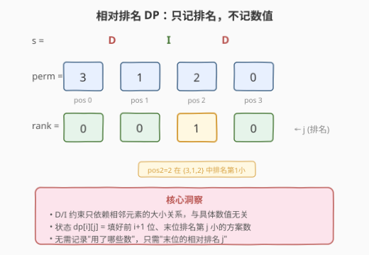
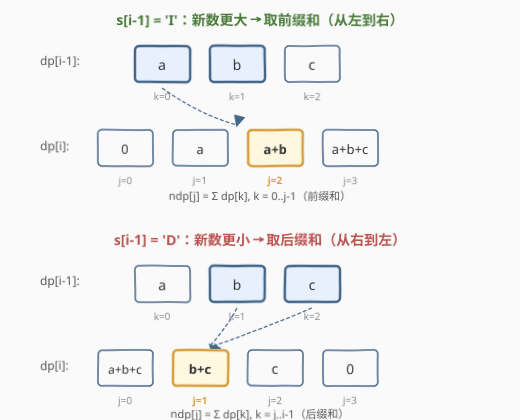
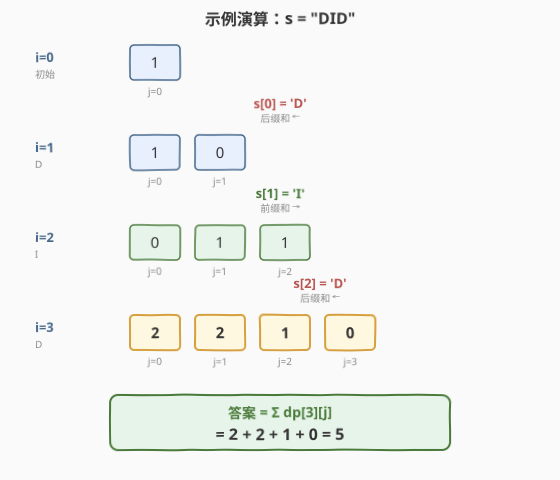

# DI 序列的有效排列

- **题目名称**：DI 序列的有效排列
- **链接**：[903. DI 序列的有效排列](https://leetcode.cn/problems/valid-permutations-for-di-sequence/)
- **难度**：困难
- **标签**：动态规划、前缀和

## 1. 题目概述

给定一个长度为 $n$ 的字符串 $s$，其中 $s[i]$ 为 `'D'`（Decrease，下降）或 `'I'`（Increase，上升）。**有效排列**是对 $\{0, 1, \dots, n\}$ 这 $n+1$ 个整数的一个排列 $\text{perm}$，使得对所有 $i$：

- 若 $s[i] = \texttt{'D'}$，则 $\text{perm}[i] > \text{perm}[i+1]$
- 若 $s[i] = \texttt{'I'}$，则 $\text{perm}[i] < \text{perm}[i+1]$

返回有效排列的**数量**，对 $10^9 + 7$ 取余。

**示例 1**：

```text
输入：s = "DID"
输出：5
解释：{0,1,2,3} 的五个有效排列为：
  (1, 0, 3, 2)
  (2, 0, 3, 1)
  (2, 1, 3, 0)
  (3, 0, 2, 1)
  (3, 1, 2, 0)
```

**示例 2**：

```text
输入：s = "D"
输出：1
解释：唯一有效排列为 (1, 0)
```

**约束条件**：

- $1 \le n \le 200$
- $s[i]$ 不是 `'I'` 就是 `'D'`

> 💡 本题是**排列计数 DP**的经典难题。直觉上，排列有 $(n+1)!$ 种，暴力枚举完全不可行。关键观察是：**D/I 约束只依赖相邻元素的相对大小**，因此我们无需记录"具体放了哪些数"，只需记录"最后一个数的相对排名"——这把指数级状态压缩到 $O(n^2)$。

---

## 2. 解题思路

### 2.1 暴力思路：枚举全排列

枚举 $\{0, 1, \dots, n\}$ 的所有 $(n+1)!$ 种排列，逐一检查是否满足 D/I 约束。当 $n = 200$ 时，$201!$ 是天文数字，完全不可行。

即使加剪枝（逐位填充，不满足约束就回溯），$n = 200$ 时搜索树仍然巨大。需要换一个完全不同的角度——**不枚举具体排列，而是用 DP 统计**。

### 2.2 核心观察：相对排名 DP



关键洞察：**D/I 约束只关心相邻元素的大小关系，与具体数值无关**。因此我们不需要追踪"放了哪些数"，只需追踪"已放置元素的相对排名结构"。

**状态定义**：

$$\text{dp}[i][j] = \text{填好位置 } 0 \dots i \text{ 的合法方案数，其中位置 } i \text{ 的值在已放的 } i+1 \text{ 个数中排名第 } j \text{ 小（0-indexed）}$$

其中 $j \in [0, i]$，"排名第 $j$ 小"意味着这 $i+1$ 个已放置的值中，恰好有 $j$ 个比位置 $i$ 的值更小。

> 💡 **为什么只需记录相对排名？** 因为排列中所有值互不相同，D/I 约束等价于"相邻排名的升降"。任何 $i+1$ 个不同的数，只要相对排名结构相同，满足的 D/I 约束就完全一样。因此"第 $j$ 小"这一信息足以确定它与前一个元素的大小关系，而具体用了哪些数不影响计数——因为剩余可选数的"排名槽位"数量是确定的。

**状态转移**：

从 $\text{dp}[i-1]$ 推到 $\text{dp}[i]$ 时，我们"插入"第 $i+1$ 个数。新数在 $i+1$ 个数中排名第 $j$ 小，它将原来的排名 $0 \dots i-1$ 重新映射：

- 原排名 $< j$ 的数：排名不变
- 原排名 $\ge j$ 的数：排名 $+1$

根据 $s[i-1]$ 的约束：

**若 $s[i-1] = \texttt{'I'}$**（位置 $i-1 <$ 位置 $i$，即新数更大）：

新数排名 $j$ 必须大于前一个数的排名。反推：前一个数在旧的 $i$ 个数中排名 $k < j$（因为 $k < j$ 意味着旧排名 $k$ 的数比新数小，满足 $I$ 约束）。

$$\text{dp}[i][j] = \sum_{k=0}^{j-1} \text{dp}[i-1][k] \quad \text{(前缀和)}$$

**若 $s[i-1] = \texttt{'D'}$**（位置 $i-1 >$ 位置 $i$，即新数更小）：

新数排名 $j$ 必须小于前一个数的排名。前一个数在旧排名中排名 $k \ge j$（因为 $k \ge j$ 意味着旧排名 $k$ 的数比新数大，满足 $D$ 约束）。

$$\text{dp}[i][j] = \sum_{k=j}^{i-1} \text{dp}[i-1][k] \quad \text{(后缀和)}$$

**边界**：$\text{dp}[0][0] = 1$（只放一个数，排名必然为 0，方案数为 1）

**答案**：$\sum_{j=0}^{n} \text{dp}[n][j]$（最后一步所有排名的方案数之和）

### 2.3 算法流程图：前缀和/后缀和优化



转移公式本身是求和，如果直接算每个 $\text{dp}[i][j]$ 需要 $O(n)$，总计 $O(n^3)$。但注意到：

- **'I' 转移是前缀和**：$\text{dp}[i][j] = \text{dp}[i][j-1] + \text{dp}[i-1][j-1]$，即"前一个 $j$ 的累加值 + 新增项"
- **'D' 转移是后缀和**：$\text{dp}[i][j] = \text{dp}[i][j+1] + \text{dp}[i-1][j]$，即"后一个 $j$ 的累加值 + 新增项"

用前缀/后缀和滚动计算，每步 $O(n)$，总计 $O(n^2)$。

**完整步骤**：

1. **初始化**：$\text{dp} = [1]$（只有 1 个数，排名 0，方案 1）
2. **逐位推进** $i = 1, 2, \dots, n$：
   - 创建新数组 $\text{ndp}$ 长度 $i+1$，初始全 0
   - 若 $s[i-1] = \texttt{'I'}$：从左到右扫，维护前缀和 `prefix`，$\text{ndp}[j] = \text{prefix}$，然后 $\text{prefix} \mathrel{+}= \text{dp}[j]$
   - 若 $s[i-1] = \texttt{'D'}$：从右到左扫，维护后缀和 `suffix`，先 $\text{suffix} \mathrel{+}= \text{dp}[j]$，再 $\text{ndp}[j] = \text{suffix}$
   - $\text{dp} = \text{ndp}$
3. **返回** $\sum \text{dp}[j] \bmod (10^9 + 7)$

> ⚠️ **'I' 和 'D' 的扫描方向不同**：'I' 从左到右（前缀和累加方向），'D' 从右到左（后缀和累加方向）。这是因为在 'I' 转移中 $\text{dp}[i][j]$ 依赖 $\text{dp}[i-1][0 \dots j-1]$（左边），而在 'D' 转移中依赖 $\text{dp}[i-1][j \dots i-1]$（右边）。

### 2.4 示例演算

以 $s = \texttt{"DID"}$（$n = 3$，排列 $\{0,1,2,3\}$）为例：



**初始**（$i = 0$，放 1 个数）：

| $j$ | 0 |
|-----|---|
| dp  | 1 |

**$i = 1$，$s[0] = \texttt{'D'}$**（后缀和，从右往左）：

$\text{dp}[1][j] = \sum_{k=j}^{0} \text{dp}[0][k]$

| $j$ | 0 | 1 |
|-----|---|---|
| ndp | 1 | 0 |

计算过程：$j=1$: $\text{suffix}=0$, $\text{ndp}[1]=0$；$j=0$: $\text{suffix} \mathrel{+}= \text{dp}[0]=1$, $\text{ndp}[0]=1$

**$i = 2$，$s[1] = \texttt{'I'}$**（前缀和，从左往右）：

$\text{dp}[2][j] = \sum_{k=0}^{j-1} \text{dp}[1][k]$

| $j$ | 0 | 1 | 2 |
|-----|---|---|---|
| ndp | 0 | 1 | 1 |

计算过程：$j=0$: $\text{ndp}[0]=0$, $\text{prefix} \mathrel{+}= \text{dp}[0]=1$；$j=1$: $\text{ndp}[1]=1$, $\text{prefix} \mathrel{+}= \text{dp}[1]=1$；$j=2$: $\text{ndp}[2]=1$

**$i = 3$，$s[2] = \texttt{'D'}$**（后缀和，从右往左）：

$\text{dp}[3][j] = \sum_{k=j}^{2} \text{dp}[2][k]$

| $j$ | 0 | 1 | 2 | 3 |
|-----|---|---|---|---|
| ndp | 2 | 2 | 1 | 0 |

计算过程：$j=3$: $\text{ndp}[3]=0$；$j=2$: $\text{suffix} \mathrel{+}= \text{dp}[2]=1$, $\text{ndp}[2]=1$；$j=1$: $\text{suffix} \mathrel{+}= \text{dp}[1]=2$, $\text{ndp}[1]=2$；$j=0$: $\text{suffix} \mathrel{+}= \text{dp}[0]=2$, $\text{ndp}[0]=2$

**答案** $= 2 + 2 + 1 + 0 = 5$ ✓

---

## 3. 参考代码

### C++

```cpp
class Solution {
  public:
    int numPermsDISequence(string s) {
        int n = s.size();
        const int MOD = 1e9 + 7;
        // dp[j] = 当前步骤下，最后位置排名为 j 的方案数
        vector<int> dp(n + 1, 0);
        dp[0] = 1;

        for (int i = 1; i <= n; i++) {
            vector<int> ndp(i + 1, 0);
            if (s[i - 1] == 'I') {
                int prefix = 0;
                for (int j = 0; j <= i; j++) {
                    ndp[j] = prefix;
                    if (j < i) prefix = (prefix + dp[j]) % MOD;
                }
            } else {
                int suffix = 0;
                for (int j = i; j >= 0; j--) {
                    if (j < i) suffix = (suffix + dp[j]) % MOD;
                    ndp[j] = suffix;
                }
            }
            dp = move(ndp);
        }

        int ans = 0;
        for (int j = 0; j <= n; j++) ans = (ans + dp[j]) % MOD;
        return ans;
    }
};
```

### Python

```python
class Solution:
    def numPermsDISequence(self, s: str) -> int:
        n = len(s)
        MOD = 10 ** 9 + 7
        dp = [1]

        for i in range(1, n + 1):
            ndp = [0] * (i + 1)
            if s[i - 1] == 'I':
                prefix = 0
                for j in range(i + 1):
                    ndp[j] = prefix
                    if j < i:
                        prefix = (prefix + dp[j]) % MOD
            else:
                suffix = 0
                for j in range(i, -1, -1):
                    if j < i:
                        suffix = (suffix + dp[j]) % MOD
                    ndp[j] = suffix
            dp = ndp

        return sum(dp) % MOD
```

> 💡 **滚动数组优化**：`dp` 只依赖上一步的值，因此用一维数组 + `ndp` 交替更新即可，空间 $O(n)$。注意 `ndp` 长度比 `dp` 多 1（每步多放一个数，排名多一种可能）。

---

## 4. 复杂度分析

| 维度 | 复杂度 | 说明 |
|------|--------|------|
| 时间复杂度 | $O(n^2)$ | 外层 $n$ 步，每步维护前缀/后缀和 $O(n)$，总计 $O(n^2)$ |
| 空间复杂度 | $O(n)$ | 滚动数组，`dp` 和 `ndp` 各 $O(n)$ |

---

## 5. 扩展：转移公式的严格证明

### 5.1 为什么 'I' 转移是 $\sum_{k=0}^{j-1}$？

设位置 $i$ 的新值在 $i+1$ 个数中排名第 $j$ 小。插入后，旧排名 $k < j$ 的数排名不变（仍为 $k$），旧排名 $k \ge j$ 的数排名变为 $k+1$。

$I$ 约束要求 $\text{perm}[i-1] < \text{perm}[i]$，即前一个数的值比新数小。在新排名体系中，前一个数的新排名必须 $< j$。

- 若旧排名 $k < j$：新排名仍为 $k < j$ ✓，满足约束
- 若旧排名 $k \ge j$：新排名为 $k+1 > j$ ✗，不满足

因此前一个数的旧排名 $k \in [0, j-1]$，即 $\text{dp}[i][j] = \sum_{k=0}^{j-1} \text{dp}[i-1][k]$。

### 5.2 为什么 'D' 转移是 $\sum_{k=j}^{i-1}$？

$D$ 约束要求 $\text{perm}[i-1] > \text{perm}[i]$，即前一个数的值比新数大。新排名体系中前一个数的新排名必须 $> j$。

- 若旧排名 $k < j$：新排名为 $k < j$ ✗，不满足
- 若旧排名 $k \ge j$：新排名为 $k+1 > j$ ✓，满足

因此前一个数的旧排名 $k \in [j, i-1]$，即 $\text{dp}[i][j] = \sum_{k=j}^{i-1} \text{dp}[i-1][k]$。

### 5.3 另一种视角：插入 DP

还有一种等价的思路——按**数值从小到大**依次插入。先放 0，再放 1，再放 2……每次插入一个更大的数，它必然满足其两侧约束中的"上升"方向。这种思路也能推导出 $O(n^2)$ DP，但状态定义和转移方向不同。两者本质都是利用"相对排名不变性"压缩状态。

---

## 6. 面试要点

1. **为什么可以用相对排名代替具体数值？**

   - D/I 约束只关心相邻元素的大小关系，与具体数值无关。任意 $i+1$ 个不同的数，只要相对排名结构相同，满足的约束完全一样。因此"排名第 $j$ 小"这一信息足以确定大小关系，而剩余可选数的排名槽位数量是确定的，不影响计数。

2. **'I' 和 'D' 转移的区别是什么？**

   - 'I'（上升）：新数比前一个数大，前一个数的旧排名 $k < j$，取前缀和 $\sum_{k=0}^{j-1}$，从左到右扫描。
   - 'D'（下降）：新数比前一个数小，前一个数的旧排名 $k \ge j$，取后缀和 $\sum_{k=j}^{i-1}$，从右到左扫描。
   - 口诀：**I 取左（前缀），D 取右（后缀）**。

3. **如何从 $O(n^3)$ 优化到 $O(n^2)$？**

   - 转移公式是求和，朴素实现每个状态 $O(n)$。但 'I' 转移是前缀和（$\text{ndp}[j] = \text{ndp}[j-1] + \text{dp}[j-1]$），'D' 转移是后缀和（$\text{ndp}[j] = \text{ndp}[j+1] + \text{dp}[j]$），用滚动前缀/后缀变量将每步降到 $O(n)$，总计 $O(n^2)$。

4. **为什么用滚动数组？空间能优化到多少？**

   - `dp[i]` 只依赖 `dp[i-1]`，不依赖更早的步骤。用两个一维数组 `dp` 和 `ndp` 交替更新，空间从 $O(n^2)$ 降到 $O(n)$。注意 `ndp` 比 `dp` 长 1（每步多一个排名可能）。

5. **边界条件和取模注意？**

   - 基准：`dp[0] = 1`（1 个数排名 0，唯一方案）。每步转移和最终求和都要取模。C++ 中 `prefix + dp[j]` 可能接近 $2 \times 10^9$，需用 `int` 取模后存回（$10^9 + 7 < 2^{31}$，单次加法不溢出 `int`，但乘法需注意）。

---

## 7. 同类练习题

- [526. 优美的排列](https://leetcode.cn/problems/beautiful-arrangement/)（[题解](../0401-0500/526_优美的排列.md)）：排列计数 DP，用 bitmask 记已用集合，与 903 的"相对排名压缩"互补
- [96. 不同的二叉搜索树](https://leetcode.cn/problems/unique-binary-search-trees/)（[题解](../0001-0100/96_不同的二叉搜索树.md)）：卡塔兰数计数 DP，同样是"不枚举具体结构，用子问题计数"
- [940. 不同的子序列 II](https://leetcode.cn/problems/distinct-subsequences-ii/)：计数 DP + 去重，与 903 同属"计数型 DP + 前缀和优化"家族
- [629. K 个逆序对数组](https://leetcode.cn/problems/k-inverse-pairs-array/)：排列计数 DP + 前缀和优化，与 903 的转移结构高度相似（前缀和滚动）
