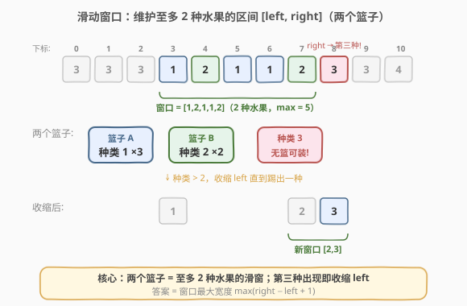
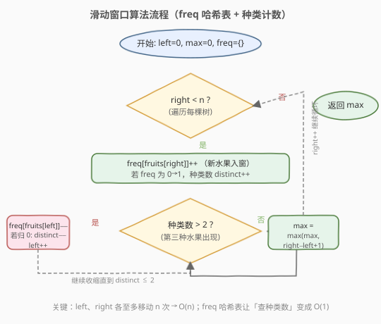

# 水果成篮

- **题目名称**：水果成篮
- **链接**：[904. 水果成篮](https://leetcode.cn/problems/fruit-into-baskets/)
- **难度**：中等
- **标签**：数组、哈希表、滑动窗口

## 1. 题目概述

一排果树从左到右排列，用整数数组 `fruits` 表示，`fruits[i]` 是第 `i` 棵树上的水果**种类**。你只有**两个篮子**，每个篮子只能装**单一类型**的水果（容量不限）。从任意一棵树开始，必须从**每棵**树上**恰好摘一个**水果并向右移动，一旦遇到不符合篮子类型的水果就停止。返回能收集的水果**最大数目**。

> 💡 翻译成算法语言：求一个**最长连续子数组**，使其包含的**不同元素种类数 ≤ 2**。本题与 [159. 至多包含两个不同字符的最长子串](../0101-0200/159_至多包含两个不同字符的最长子串.md) 完全同构，只是把「字符」换成了「整数水果种类」。

**示例 1**：

```text
输入：fruits = [1,2,1]
输出：3
解释：可以采摘全部 3 棵树（两种类 1、2）。
```

**示例 2**：

```text
输入：fruits = [0,1,2,2]
输出：3
解释：可以采摘 [1,2,2] 这三棵树。若从第一棵开始只能采 [0,1]。
```

**示例 3**：

```text
输入：fruits = [1,2,3,2,2]
输出：4
解释：可以采摘 [2,3,2,2] 这四棵树。
```

**示例 4**：

```text
输入：fruits = [3,3,3,1,2,1,1,2,3,3,4]
输出：5
解释：可以采摘 [1,2,1,1,2] 这五棵树。
```

**约束条件**：

- `1 <= fruits.length <= 10^5`
- `0 <= fruits[i] < fruits.length`

---

## 2. 解题思路

### 2.1 暴力思路

枚举所有子数组 `[i, j]`，用集合统计其中不同水果种类数，若 `≤ 2` 则更新答案。时间复杂度 $O(n^2)$（枚举 $O(n^2)$ × 集合判定均摊 $O(1)$），对于 $n = 10^5$ 达到 $10^{10}$ 量级，必然超时。

### 2.2 核心观察：滑动窗口 + 频率哈希表



关键直觉是维护一个**至多含 2 种水果的窗口** `[left, right]`，对应「两个篮子各装一种水果」：

- `right` 指针不断右移，把新水果纳入窗口（`freq[fruits[right]]++`），相当于「试着用某个篮子接住这棵树的水果」。
- 一旦窗口内**不同水果种类数 > 2**（第三种水果出现，两个篮子都装不下），就从 `left` 端逐个收缩（`freq[fruits[left]]--`，归 0 则该种类被彻底踢出窗口），直到种类数恢复 `≤ 2`。
- 窗口在每次收缩后都满足「至多两种」，答案就是窗口宽度的最大值 $\max(\text{right} - \text{left} + 1)$。

> ⚠️ **为什么用频率表而不是像第 3 题那样记录「最新下标」直接跳？** 第 3 题的约束是「无重复字符」——窗口内每种字符最多出现 1 次，遇到重复可精准定位旧位置并跳跃。而本题允许同种水果出现多次，仅靠「最新下标」无法判断「踢掉一个水果后种类数是否降到了 2」——必须用频率表计数，直到某水果 `freq` 归 0 才确认该种类被彻底移出窗口。

### 2.3 算法流程图



整体只有一重 `right` 循环，内层 `while` 收缩 `left`。由于 `left`、`right` 都只增不减，二者各自至多移动 $n$ 次，总移动次数不超过 $2n$，因此时间复杂度为 $O(n)$。

### 2.4 示例演算

![示例演算：[3,3,3,1,2,1,1,2,3,3,4]](../images/fruit_baskets_example_walkthrough.svg)

上表逐步展示了 `fruits = [3,3,3,1,2,1,1,2,3,3,4]` 的关键执行过程：

- 前 4 步窗口不断扩张（种类 3→3→3→1），`max` 达到 `4`。
- 第 5 步 `right=4` 遇到种类 `2`，种类数升到 3，触发收缩：连续移走 `left=0,1,2` 的三个 `3`，直到种类 `3` 频率归 0，窗口变为 `[1,2]`。
- 第 6-8 步继续扩张到 `[1,2,1,1,2]`，`max` 达到 `5`（本题答案）。
- 第 9 步遇到种类 `3` 再次超限，收缩移走所有 `1`，窗口变为 `[2,3]`。
- 最终答案为 `5`，对应子数组 `[1,2,1,1,2]`（下标 3-7）。

---

## 3. 参考代码

### C++（频率哈希表 + 种类计数）

```cpp
class Solution {
  public:
    int totalFruit(vector<int>& fruits) {
        unordered_map<int, int> freq; // 水果种类 -> 窗口内出现次数
        int left = 0, max_len = 0, distinct = 0;

        for (int right = 0; right < fruits.size(); right++) {
            int f = fruits[right];
            if (freq[f]++ == 0) {   // 新种类入窗
                distinct++;
            }

            while (distinct > 2) {  // 种类超限，收缩 left
                int d = fruits[left++];
                if (--freq[d] == 0) { // 该种类频率归 0
                    distinct--;
                }
            }

            max_len = max(max_len, right - left + 1);
        }

        return max_len;
    }
};
```

### Python

```python
class Solution:
    def totalFruit(self, fruits: List[int]) -> int:
        freq = {}            # 水果种类 -> 窗口内出现次数
        left = 0
        max_len = 0
        distinct = 0

        for right, f in enumerate(fruits):
            freq[f] = freq.get(f, 0) + 1
            if freq[f] == 1:         # 新种类入窗
                distinct += 1

            while distinct > 2:      # 种类超限，收缩 left
                d = fruits[left]
                freq[d] -= 1
                if freq[d] == 0:    # 该种类频率归 0
                    distinct -= 1
                left += 1

            max_len = max(max_len, right - left + 1)

        return max_len
```

> ⚠️ **易错点**：`distinct` 的增减必须与 `freq` 归 0 严格绑定——`freq[f]` 从 0→1 时 `distinct++`，从 1→0 时 `distinct--`。若忘记维护 `distinct` 而每次都去数哈希表的大小，单次判定会退化到 $O(|\Sigma|)$，虽然不影响整体复杂度但常数更大。

---

## 4. 复杂度分析

| 维度 | 复杂度 | 说明 |
|------|--------|------|
| 时间复杂度 | $O(n)$ | `left`、`right` 各至多遍历一次，哈希表操作 $O(1)$ |
| 空间复杂度 | $O(|\Sigma|)$ | 哈希表最多存不同水果种类数；由约束 `fruits[i] < n` 故最坏 $O(n)$，实际受窗口内种类数 ≤ 3 约束为 $O(1)$ |

---

## 5. 扩展：数组代替哈希表与泛化至 K 种

### 5.1 数组代替哈希表

由于约束 `0 <= fruits[i] < fruits.length`，水果种类取值在 `[0, n)` 内，可用定长数组代替哈希表，常数更小：

```cpp
class Solution {
  public:
    int totalFruit(vector<int>& fruits) {
        int n = fruits.size();
        vector<int> freq(n, 0);
        int left = 0, max_len = 0, distinct = 0;

        for (int right = 0; right < n; right++) {
            if (freq[fruits[right]]++ == 0) distinct++;
            while (distinct > 2) {
                if (--freq[fruits[left++]] == 0) distinct--;
            }
            max_len = max(max_len, right - left + 1);
        }
        return max_len;
    }
};
```

> ⚠️ 此方案空间为 $O(n)$（需开 `n` 大小的数组）。若内存敏感，哈希表方案空间仅为 $O(1)$（窗口内最多 3 种），可优先选用。

### 5.2 泛化为 K 种水果

把 `while (distinct > 2)` 中的 `2` 换成参数 `k`，即得「至多 K 种水果的最长子数组」通用解法。本题即 `k = 2` 的特例，与 [340. 至多包含 K 个不同字符的最长子串](https://leetcode.cn/problems/longest-substring-with-at-most-k-distinct-characters/) 同构。

> 💡 当 `k = 1` 时退化为「最长同值子数组」；当 `k = 2` 即本题。

---

## 6. 面试要点

1. **本题和第 3 题（无重复字符的最长子串）的区别是什么？**

   - 第 3 题约束「每种字符至多出现 1 次」，等价于 `k = 1` 的「至多 1 种字符」——遇到重复可直接用「最新下标」跳跃。本题允许同种水果出现多次，需要用**频率表**计数，直到某水果频率归 0 才确认踢出该种类，因此收缩是逐个移动而非跳跃。

2. **`distinct` 变量能否省掉，每次直接看哈希表大小？**

   - 可以用 `freq.size()` 判断种类数，但要注意频率归 0 的键需要主动 `erase`（C++）或 `del`（Python），否则 `size()` 会偏大。维护独立的 `distinct` 计数器可以避免频繁删除键，代码更简洁且常数更小。

3. **为什么 `left` 是逐个移动而不是跳跃？**

   - 频率表只记录「窗口内某水果的总数」，不记录每个实例的位置。要知道「踢掉哪种水果后种类数降到 2」，必须逐个减少 `left` 端水果的频率，直到某个水果频率归 0。这与第 3 题能跳跃的本质区别在于：第 3 题的「重复」是精确到位置的，而本题的「种类超限」是集合层面的。

4. **题目故事里的「两个篮子」如何映射到算法？**

   - 两个篮子 = 窗口内至多 2 种水果；每个篮子只装一种类型 = 窗口内每种水果的实例都算入答案；遇到第三种水果必须停止 = 种类数 > 2 时收缩窗口。所谓「从任意树开始」即 `left` 可以任意取值，由滑窗自动寻找最优起点。

5. **如何泛化到 K 个篮子？**

   - 把 `while (distinct > 2)` 的阈值换成 `k` 即可。频率表方案对任意 `k` 都适用，是最通用的模板。

---

## 7. 同类练习题

- [159. 至多包含两个不同字符的最长子串](https://leetcode.cn/problems/longest-substring-with-at-most-two-distinct-characters/)（[题解](../0101-0200/159_至多包含两个不同字符的最长子串.md)）：完全同构，字符版 `k = 2`，本题的字符串镜像
- [340. 至多包含 K 个不同字符的最长子串](https://leetcode.cn/problems/longest-substring-with-at-most-k-distinct-characters/)：泛化版，把阈值 2 换成 `k`
- [3. 无重复字符的最长子串](https://leetcode.cn/problems/longest-substring-without-repeating-characters/)（[题解](../0001-0100/3_无重复字符的最长子串.md)）：`k = 1` 的对照，用「最新下标」跳跃而非频率表收缩
- [424. 替换后的最长重复字符](https://leetcode.cn/problems/longest-repeating-character-replacement/)：滑窗 + 频率表变体（允许替换 k 次使窗口全同，窗口合法性由「max_freq + k ≥ 窗口长度」判定）
- [713. 乘积小于 K 的子数组](https://leetcode.cn/problems/subarray-product-less-than-k/)：同向滑窗 + 计数（正数单调性驱动收缩，收缩时累加 `right-left+1` 个子数组）
