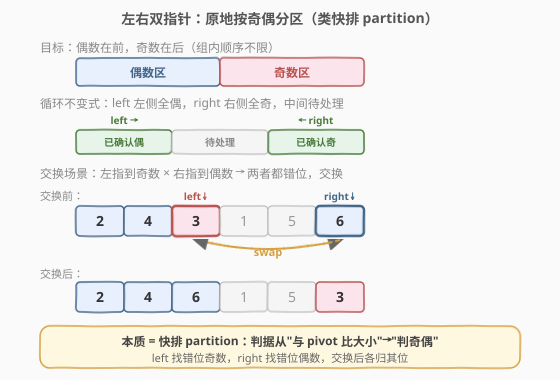

# LeetCode 按奇偶排序数组 题解

## 1. 题目概述

- **标题 / 题号**：按奇偶排序数组（#905，easy）
- **链接**：https://leetcode.cn/problems/sort-array-by-parity/
- **难度**：简单
- **标签**：数组、双指针

**题意**：给定一个整数数组 `nums`，将 `nums` 中的所有偶数元素移动到数组的前面，后跟所有奇数元素。返回满足此条件的**任一数组**作为答案。

**示例 1**：

```text
输入：nums = [3,1,2,4]
输出：[2,4,3,1]
解释：[4,2,3,1]、[2,4,1,3] 和 [4,2,1,3] 也会被视作正确答案。
```

**示例 2**：

```text
输入：nums = [0]
输出：[0]
```

**约束**：

- $1 \le \text{nums.length} \le 5000$
- $0 \le \text{nums[i]} \le 5000$

> 💡 本题只要求偶数在前、奇数在后，**组内顺序不限**。这一"顺序不限"的宽松条件正是双指针原地分区的关键——不需要稳定排序，一次 $O(n)$ 扫描即可完成。

## 2. 解题思路

### 2.1 暴力思路

新建一个数组，遍历 `nums` 两遍：第一遍收集所有偶数，第二遍收集所有奇数。时间 $O(n)$，空间 $O(n)$。能通过但未利用"顺序不限"这一条件做原地优化。

另一种暴力是按 `nums[i] % 2` 排序（自定义比较器），时间 $O(n \log n)$，空间 $O(\log n)$（排序栈）。更慢且同样不是原地。

### 2.2 核心观察：左右双指针原地分区（类快排 partition）



本题的本质是**分区（partition）**——把数组分成"偶数区 | 奇数区"两段，和快速排序的 partition 步骤同构，只是判据从"与 pivot 比大小"变成了"判奇偶"。

维护两个指针：

- **`left`**：从左端出发，向右扫描，寻找**奇数**（放错位置的元素——偶数应该在左边）。
- **`right`**：从右端出发，向左扫描，寻找**偶数**（放错位置的元素——奇数应该在右边）。

当 `left` 找到一个奇数、`right` 找到一个偶数时，**两者都放错了位置**，交换即可各归其位。

> 💡 **循环不变式**：在每轮迭代开始时，`[0, left)` 内全为偶数，`(right, n-1]` 内全为奇数，`[left, right]` 为待处理区间。每轮交换或跳过后，不变式保持成立，区间缩小，最终 `left >= right` 时整个数组分区完毕。

### 2.3 算法流程图


1. 初始化 `left = 0`、`right = n - 1`。
2. 当 `left < right`：
   - **跳过正确元素**：若 `nums[left]` 为偶数，`left++`（已在偶数区，正确）。
   - **跳过正确元素**：若 `nums[right]` 为奇数，`right--`（已在奇数区，正确）。
   - **交换错位元素**：否则 `nums[left]` 为奇数且 `nums[right]` 为偶数，交换两者，`left++`、`right--`。
3. `left >= right` 时结束，返回 `nums`。

### 2.4 示例演算

![示例演算：nums = [3,1,2,4]](../images/sort_parity_walkthrough.svg)

以 `nums = [3,1,2,4]` 为例：

| 步骤 | left | right | nums[left] | nums[right] | 操作 | 数组状态 |
|------|------|-------|------------|-------------|------|----------|
| 1 | 0 | 3 | 3（奇） | 4（偶） | 交换 → left=1, right=2 | `[4,1,2,3]` |
| 2 | 1 | 2 | 1（奇） | 2（偶） | 交换 → left=2, right=1 | `[4,2,1,3]` |
| — | 2 | 1 | — | — | left >= right，结束 | `[4,2,1,3]` |

最终结果 `[4,2,1,3]`：前两个为偶数（4, 2），后两个为奇数（1, 3），满足题意。

> 💡 第 1 步中 `left=0` 指向 3（奇数，应在右侧）、`right=3` 指向 4（偶数，应在左侧），两者恰好互补——交换后各自归位。第 2 步同理。两步交换后指针交叉，分区完成。

## 3. 参考代码

### C++

```cpp
class Solution {
  public:
    vector<int> sortArrayByParity(vector<int>& nums) {
        int left = 0, right = (int)nums.size() - 1;
        while (left < right) {
            while (left < right && nums[left] % 2 == 0) ++left;
            while (left < right && nums[right] % 2 == 1) --right;
            if (left < right) {
                swap(nums[left], nums[right]);
                ++left;
                --right;
            }
        }
        return nums;
    }
};
```

### Python

```python
class Solution:
    def sortArrayByParity(self, nums: List[int]) -> List[int]:
        left, right = 0, len(nums) - 1
        while left < right:
            while left < right and nums[left] % 2 == 0:
                left += 1
            while left < right and nums[right] % 2 == 1:
                right -= 1
            if left < right:
                nums[left], nums[right] = nums[right], nums[left]
                left += 1
                right -= 1
        return nums
```

> ⚠️ **内层 while 的边界检查**：两个内层 `while` 都带 `left < right` 条件，防止 `left` 越过 `right` 后继续扫描。外层 `if (left < right)` 保证只在两指针未交叉时才交换。三个边界检查缺一不可——少了任何一个都可能导致越界或错误交换。

> 💡 **奇偶判定**：`nums[i] % 2 == 0` 判偶，`nums[i] % 2 == 1` 判奇。本题数据范围 $0 \le \text{nums[i]} \le 5000$（全非负），取模结果非负，无需处理负数取模的坑。若数据含负数，C++ 中 `-3 % 2 == -1`，应改用 `nums[i] % 2 != 0` 判奇。

## 4. 复杂度分析

| 维度 | 复杂度 | 说明 |
|------|--------|------|
| 时间复杂度 | $O(n)$ | `left`、`right` 合计最多移动 `n` 步，每个元素只访问一次 |
| 空间复杂度 | $O(1)$ | 仅使用 `left`、`right` 两个指针变量，原地交换 |

## 5. 扩展：快排 partition 的本质

本题是快速排序 **partition 步骤**的退化版——判据从"与 pivot 比大小"简化为"判奇偶"，但双指针收拢的结构完全一致：

| | 快排 partition | 本题 |
|---|---|---|
| 判据 | `nums[i] < pivot` | `nums[i] % 2 == 0` |
| 分区结果 | `[≤ pivot | > pivot]` | `[偶数 | 奇数]` |
| 指针方向 | 左右收拢 | 左右收拢 |
| 是否需要选 pivot | ✅ 需要 | ❌ 不需要（奇偶是固定属性） |

正因如此，本题比快排 partition 更简单：不需要选 pivot，也不需要处理等于 pivot 的元素（奇偶二分，没有"等于"的中间态）。掌握快排 partition 的模板，本题即可秒杀。

**进阶变体**：[922. 按奇偶排序数组 II](https://leetcode.cn/problems/sort-array-by-parity-ii/) 要求偶数在偶下标、奇数在奇下标，约束更强，需要不同的指针策略（双指针分别按索引奇偶性扫描）。

## 6. 面试要点

1. **为什么用左右双指针而不是快慢双指针？**

   快慢双指针（如 [27. 移除元素](../0001-0100/27_移除元素.md)）适合"保序删除"——`slow` 从左到右写入保留元素。但本题要分两个区（偶数区 + 奇数区），且**顺序不限**，从两端收拢更自然：左端找错位的奇数，右端找错位的偶数，交换即完成双向归位。

2. **内层 while 为什么要带 `left < right`？**

   防止指针越界。例如数组全为偶数时，`left` 会一路扫描到 `n`，若无 `left < right` 限制就会越界。加了边界后，`left` 停在 `right` 处，循环自然结束。

3. **交换后为什么 `left++` 和 `right--` 都要做？**

   交换后 `nums[left]` 变为偶数（已正确）、`nums[right]` 变为奇数（已正确），两个位置都已确认，无需再检查，直接各自前进。若只移动一个指针，下一轮会重复检查已正确的元素，虽不影响正确性但增加冗余迭代。

4. **如果数组已经满足条件（全偶在前）会怎样？**

   `left` 一路跳过偶数到 `right`，`right` 不动（因为右端全是奇数），`left >= right` 后直接结束。无交换发生，时间仍为 $O(n)$。

5. **和 922 题的区别是什么？**

   905 只要求"偶在前、奇在后"，组内顺序和位置索引无关；922 要求"偶数在偶下标、奇数在奇下标"，是**索引约束**而非分区约束。905 用左右双指针，922 用按索引奇偶性分轨的双指针，策略不同。

## 同类练习题

| # | 题目 | 与本题的关联 |
|---|------|-------------|
| 922 | [按奇偶排序数组 II](https://leetcode.cn/problems/sort-array-by-parity-ii/) | 索引约束版（偶数在偶下标、奇数在奇下标），双指针按索引奇偶性分轨扫描 |
| 27 | [移除元素](https://leetcode.cn/problems/remove-element/)（[站内题解](../0001-0100/27_移除元素.md)） | 快慢双指针原地覆写，与本题的左右双指针互补 |
| 283 | [移动零](https://leetcode.cn/problems/move-zeroes/)（[站内题解](../0201-0300/283_移动零.md)） | 把零移到末尾，快慢双指针的分区应用（零与非零分区） |
| 912 | [排序数组](https://leetcode.cn/problems/sort-an-array/)（[站内题解](../0901-1000/912_排序数组.md)） | 快排的完整实现，本题的 partition 是其中的核心步骤 |
| 75 | [颜色分类](https://leetcode.cn/problems/sort-colors/)（[站内题解](../0001-0100/75_颜色分类.md)） | 三路分区（0/1/2 三色），本题的双路分区推广为三指针 |
