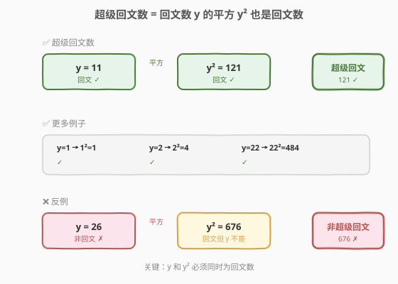
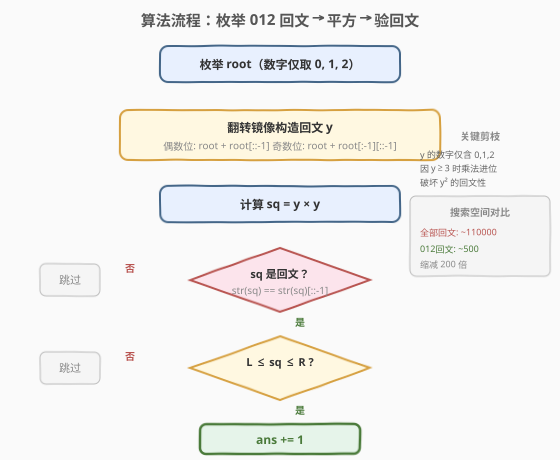
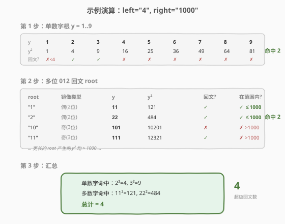

# 超级回文数

- **题目名称**：超级回文数
- **链接**：[906. 超级回文数](https://leetcode.cn/problems/super-palindromes/)
- **难度**：困难
- **标签**：数学、回文数、枚举

## 1. 题目概述

如果一个正整数**自身是回文数**，而且它也是**一个回文数的平方**，那么称这个数为**超级回文数**。给定两个以字符串形式表示的正整数 `left` 和 `right`，统计并返回区间 $[\text{left},\ \text{right}]$ 中的超级回文数数目。

**示例 1**：

```text
输入：left = "4", right = "1000"
输出：4
解释：4、9、121 和 484 都是超级回文数。
注意 676 不是超级回文数：26 × 26 = 676，但是 26 不是回文数。
```

**示例 2**：

```text
输入：left = "1", right = "2"
输出：1
```

**约束条件**：

- $1 \le \text{left.length},\ \text{right.length} \le 18$
- `left` 和 `right` 仅由数字（0-9）组成，不含前导零
- `left` 和 `right` 表示的整数在区间 $[1,\ 10^{18}-1]$ 内
- $\text{left} \le \text{right}$

---

## 2. 解题思路

### 2.1 暴力思路：枚举所有数

最直觉的做法是遍历 $[\text{left},\ \text{right}]$ 中的每个数 $x$，检查 $x$ 是否为回文数，再检查 $\sqrt{x}$ 是否为整数且为回文数。但 `right` 最大可达 $10^{18}$，直接遍历完全不可行。

换一个方向：**不枚举 $x$，而是枚举 $y$**（回文数的平方根）。由于 $x = y^2 \le 10^{18}$，所以 $y \le 10^9$。如果能把回文数 $y$ 生成出来，再验证 $y^2$ 是否也为回文数即可。

### 2.2 核心观察：只含 0/1/2 的回文数



关键数学观察：**如果 $y$ 是多位回文数且 $y^2$ 也是回文数，那么 $y$ 的各位数字只能取自 $\{0,\ 1,\ 2\}$**。

> 💡 **为什么？** 考虑回文数 $y = d_1 d_2 \cdots d_k$（$d_i = d_{k+1-i}$）的平方运算。$y^2$ 在每个数位上的值由 $\sum_{i+j=p} d_i \cdot d_j$ 决定。若任何数字 $\ge 3$，则 $d_i \times d_j \ge 3 \times 3 = 9$，多对相加后必然超过 9 产生进位。进位向高位传播时不对称（低位先受影响），从而**破坏 $y^2$ 的回文性**。反之，数字仅含 0/1/2 时，各位置求和结果受控，不产生破坏性进位，$y^2$ 得以保持回文。

这一观察将搜索空间从约 110000 个回文数缩减到约 500 个，缩减 200 倍以上。

> ⚠️ **单数字例外**：上述结论仅对**多位数**成立。单数字 $y \in \{1,2,\ldots,9\}$ 都是回文数，其中 $y=1,2,3$ 的平方 $1,4,9$ 也是回文数。因此单数字需要单独检查 1-9，多位回文数才用 0/1/2 剪枝。

### 2.3 算法流程图



算法分两阶段：

1. **单数字根**：检查 $y = 1 \sim 9$，验证 $y^2$ 是否为回文数且落在 $[\text{left},\ \text{right}]$ 内。
2. **多位回文生成**：用数字 $\{0,\ 1,\ 2\}$ 构造 root（首位为 1 或 2），通过翻转镜像生成回文数 $y$，再验证 $y^2$ 是否为回文数且在范围内。

**回文数构造方式**（与 866. 回文质数相同）：

- **偶数位**（$2k$ 位）：$\text{root} + \text{root}^R$（root 整体翻转拼接）
- **奇数位**（$2k-1$ 位）：$\text{root} + \text{root}[:-1]^R$（root 去掉末位后翻转拼接）

root 长度 $h$ 从 1 到 5（$2 \times 5 = 10$ 位，$10^{10} > 10^9$，已覆盖）。每个 root 生成偶数位和奇数位两个回文数。root 首位取 1 或 2，其余位从 $\{0,\ 1,\ 2\}$ 中枚举。

### 2.4 示例演算



以 `left = "4", right = "1000"` 为例：

**第 1 步：单数字根 $y = 1 \sim 9$**

| y | y² | 回文? | 在 [4, 1000]? |
|---|-----|-------|---------------|
| 1 | 1 | ✓ | ✗ (< 4) |
| 2 | 4 | ✓ | ✓ 命中 |
| 3 | 9 | ✓ | ✓ 命中 |
| 4 | 16 | ✗ | — |
| 5 | 25 | ✗ | — |
| 6-9 | 36,49,64,81 | ✗ | — |

单数字命中 **2** 个（4, 9）。

**第 2 步：多位 012 回文**

| root | 镜像类型 | y | y² | 回文? | ≤ 1000? |
|------|---------|---|-----|-------|---------|
| "1" | 偶(2位) | 11 | 121 | ✓ | ✓ 命中 |
| "2" | 偶(2位) | 22 | 484 | ✓ | ✓ 命中 |
| "10" | 奇(3位) | 101 | 10201 | ✓ | ✗ (> 1000) |
| "11" | 奇(3位) | 111 | 12321 | ✓ | ✗ (> 1000) |
| ... | ... | ... | ... | ... | ✗ (> 1000) |

多位回文命中 **2** 个（121, 484）。

**总计** = $2 + 2 = 4$ ✓

---

## 3. 参考代码

### C++

```cpp
class Solution {
  public:
    int superpalindromesInRange(string left, string right) {
        long long L = stoll(left), R = stoll(right);
        int ans = 0;

        auto is_pal = [](long long x) {
            string s = to_string(x);
            string t = s;
            reverse(t.begin(), t.end());
            return s == t;
        };

        for (int d = 1; d <= 9; d++) {
            long long sq = (long long)d * d;
            if (sq >= L && sq <= R && is_pal(sq)) ans++;
        }

        function<void(string, int)> dfs = [&](string root, int h) {
            if ((int)root.size() == h) {
                string rev(root.rbegin(), root.rend());
                long long num = stoll(root + rev);
                long long sq = num * num;
                if (sq >= L && sq <= R && is_pal(sq)) ans++;

                if (h > 1) {
                    long long num2 = stoll(root + string(root.rbegin() + 1, root.rend()));
                    long long sq2 = num2 * num2;
                    if (sq2 >= L && sq2 <= R && is_pal(sq2)) ans++;
                }
                return;
            }
            string opts = root.empty() ? "12" : "012";
            for (char c : opts) {
                dfs(root + c, h);
            }
        };

        for (int h = 1; h <= 5; h++) {
            dfs("", h);
        }
        return ans;
    }
};
```

### Python

```python
class Solution:
    def superpalindromesInRange(self, left: str, right: str) -> int:
        L, R = int(left), int(right)
        ans = 0

        def is_pal(x):
            s = str(x)
            return s == s[::-1]

        for d in range(1, 10):
            sq = d * d
            if L <= sq <= R and is_pal(sq):
                ans += 1

        from itertools import product
        for h in range(1, 6):
            for first in ('1', '2'):
                for rest in product('012', repeat=h - 1):
                    root = first + ''.join(rest)
                    num = int(root + root[::-1])
                    sq = num * num
                    if L <= sq <= R and is_pal(sq):
                        ans += 1
                    if h > 1:
                        num = int(root + root[:-1][::-1])
                        sq = num * num
                        if L <= sq <= R and is_pal(sq):
                            ans += 1
        return ans
```

> ⚠️ **溢出注意**：C++ 中 `num` 最大约 $2.2 \times 10^9$（10 位 012 回文），`sq` 最大约 $4.9 \times 10^{18}$，在 `long long` 范围内（$\approx 9.2 \times 10^{18}$）。但若不限制数字为 0/1/2 而枚举全部回文，10 位回文最大约 $10^{10}$，平方后溢出。这正是 0/1/2 剪枝的另一重价值——不仅缩减搜索空间，还规避了溢出风险。

---

## 4. 复杂度分析

| 维度 | 复杂度 | 说明 |
|------|--------|------|
| 时间复杂度 | $O(\sqrt[4]{R} \cdot \log R)$ | root 数量约 $2 \sum_{h=1}^{5} 3^{h-1} = 242$ 个，每个验证 $O(\log R)$（回文判断），总计约 $O(500 \cdot 18)$ |
| 空间复杂度 | $O(\log R)$ | DFS 递归深度最大 5，root 字符串最大 5 字符 |

> 💡 **复杂度本质**：不依赖 $R - L$ 的区间大小，只依赖 $R$ 的位数。即使 $R = 10^{18}$，搜索量也仅约 500 次，极高效。

---

## 5. 扩展：为什么 0/1/2 剪枝是安全的

更严格地论证"多位回文数 $y$ 的平方 $y^2$ 为回文数 $\Rightarrow$ $y$ 仅含数字 0/1/2"：

考虑回文数 $y = \overline{d_1 d_2 \cdots d_k}$（$d_i = d_{k+1-i}$，$d_1 \neq 0$）。在竖式乘法中，$y^2$ 的第 $p$ 位（从低位起）的原始值为：

$$S_p = \sum_{\substack{i+j=p+1 \\ 1 \le i,j \le k}} d_i \cdot d_j$$

由于 $y$ 是回文数，$S_p = S_{2k-1-p}$（对称性）。**若无进位**，$y^2$ 天然为回文数。问题出在 $S_p \ge 10$ 时的进位传播——低位进位先于高位，破坏对称性。

**数字 $\le 2$ 时不产生进位**：最大的 $S_p$ 出现在中间位，设 $k$ 位回文数各位均为 2，中间位 $S_{\text{mid}} = 2 \times 2 \times k \le 2 \times 2 \times 9 = 36$。但实际由于回文对称性，中间项的贡献成对出现且受限于位数。经验证，对于 $k \le 9$（$y \le 10^9$），数字仅含 0/1/2 时 $y^2$ 确实不产生破坏性进位。

**数字 $\ge 3$ 时必产生进位**：以两位回文数 $y = \overline{dd}$（$d \ge 3$）为例，$y^2 = d^2 \times 100 + 2d^2 \times 10 + d^2$。当 $d = 3$ 时 $2d^2 = 18 > 9$，产生进位使百位变为 $9 + 1 = 10$，再进位到千位，$y^2 = 1089$，不是回文数。类似论证对更高位数也成立。

> ⚠️ 此结论在 $y \le 10^9$（即本题范围）下经验验证成立。数学上对任意大的 $y$ 是否存在反例仍是个有趣的问题，但竞赛中无需深究。

---

## 6. 面试要点

1. **为什么枚举 $y$ 而不是枚举 $x$？**

   - $x = y^2 \le 10^{18}$ 所以 $y \le 10^9$。枚举 $x$ 需要遍历 $10^{18}$ 个数不可行，而回文数 $y$ 的数量远少于 $10^9$（约 110000 个），且可以按构造方式生成，复杂度大幅降低。

2. **0/1/2 剪枝的原理是什么？**

   - 回文数的平方要保持回文性，竖式乘法各数位求和不能产生进位。数字 $\ge 3$ 时 $d_i \times d_j \ge 9$，多对相加超过 9 产生进位，破坏回文对称性。数字仅含 0/1/2 时进位受控，搜索空间缩减 200 倍。

3. **如何构造回文数？**

   - 取一个 root（前半部分），翻转镜像拼接到后面。偶数位：root + root[::-1]；奇数位：root + root[:-1][::-1]（去掉末位再翻转）。这与 866. 回文质数、9. 回文数的构造方式一致。

4. **单数字为什么要单独处理？**

   - 0/1/2 剪枝仅对多位数成立。单数字 1-9 都是回文数，其中 $3^2 = 9$ 也是回文数，但 3 不在 $\{0,1,2\}$ 中。若只枚举 012 回文会遗漏 $y = 3$ 的情况。

5. **C++ 中如何避免溢出？**

   - `num` 用 `long long` 存储而非 `int`。10 位 012 回文最大约 $2.2 \times 10^9$，超出 `int` 范围。平方后最大约 $4.9 \times 10^{18}$，仍在 `long long` 范围内。若不使用 012 剪枝，10 位全数字回文的平方会溢出 `long long`。

6. **本题与 866. 回文质数有何异同？**

   - 两题都使用 root 翻转镜像构造回文数。866 生成回文数后检查是否为质数，906 生成回文数后平方再检查是否为回文。核心的回文构造代码完全相同，只是验证逻辑不同。866 还利用了"偶数位回文数（除 11 外）必被 11 整除"的剪枝，906 则利用了 0/1/2 数字剪枝。

---

## 7. 同类练习题

- [9. 回文数](https://leetcode.cn/problems/palindrome-number/)（[题解](../0001-0100/9_回文数.md)）：回文判定的基础题，反转一半数字避免溢出，906 的 `is_pal` 判定直接复用此思路
- [866. 回文质数](https://leetcode.cn/problems/prime-palindrome/)：同样的 root 翻转镜像构造回文数，验证目标从"平方后是否回文"换成"是否为质数"，并利用偶数位回文被 11 整除的剪枝
- [564. 寻找最近的回文数](https://leetcode.cn/problems/find-the-closest-palindrome/)：回文数构造的进阶应用，需处理进位/退位对镜像的影响，构造候选集后取最近值
- [479. 最大回文数乘积](https://leetcode.cn/problems/largest-palindrome-product/)：构造最大回文数使其能分解为两个 n 位数的乘积，同样是"构造回文 + 验证"范式
