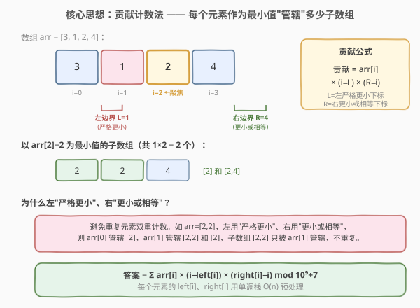
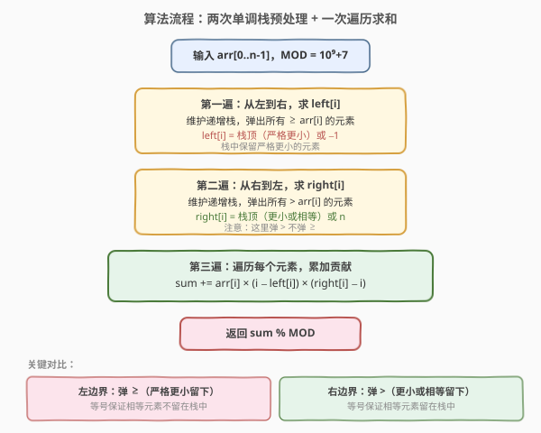
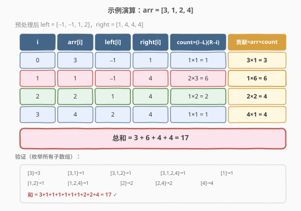

# LeetCode 子数组的最小值之和 题解

## 1. 题目概述

- **标题 / 题号**：子数组的最小值之和（#907，medium）
- **链接**：https://leetcode.cn/problems/sum-of-subarray-minimums/
- **难度**：中等
- **标签**：栈、数组、单调栈、动态规划

**题意**：给定一个整数数组 `arr`，找到所有（连续）子数组 `b` 的最小值之和，即求 $\sum \min(b)$，其中 `b` 遍历 `arr` 的每一个连续子数组。由于结果可能很大，返回对 $10^9 + 7$ 取模后的值。

**示例 1**：

```text
输入：arr = [3,1,2,4]
输出：17
解释：所有子数组及其最小值如下：
[3]→3, [3,1]→1, [3,1,2]→1, [3,1,2,4]→1,
[1]→1, [1,2]→1, [1,2,4]→1,
[2]→2, [2,4]→2,
[4]→4
最小值之和 = 3+1+1+1+1+1+1+2+2+4 = 17
```

**示例 2**：

```text
输入：arr = [11,81,94,43,3]
输出：444
```

**约束**：

- $1 \le \text{arr.length} \le 3 \times 10^4$
- $1 \le \text{arr[i]} \le 3 \times 10^4$

## 2. 解题思路

### 2.1 暴力思路：枚举所有子数组

枚举所有 $O(n^2)$ 个连续子数组，对每个子数组求最小值再累加。对于 $n = 3 \times 10^4$，$O(n^2)$ 约 $9 \times 10^8$ 次操作，会超时。需要换一个角度——不枚举子数组，而是**枚举每个元素作为最小值的贡献**。

### 2.2 核心观察：贡献计数法



关键转化：**不去枚举子数组求最小值，而是对每个元素 `arr[i]`，计算有多少个子数组以它为最小值**。这样 `arr[i]` 对总和的贡献就是 $\text{arr}[i] \times \text{count}(i)$。

> 💡 **为什么这样想？** 枚举子数组是 $O(n^2)$ 个，但元素只有 $n$ 个。如果能对每个元素 $O(1)$ 算出它的"管辖范围"，总复杂度就能降到 $O(n)$。这正是**贡献计数法**的精髓——将"对子数组求 min 再求和"转化为"对元素求 min × 出现次数"。

对元素 `arr[i]`，以它为最小值的子数组需要满足：

- 子数组**包含** `i`
- 子数组中**没有比 `arr[i]` 更小的元素**

因此需要找到 `arr[i]` 左右两侧的"屏障"：

- $\text{left}[i]$：`i` 左边**第一个严格更小**的元素下标（不存在则为 $-1$）
- $\text{right}[i]$：`i` 右边**第一个更小或相等**的元素下标（不存在则为 $n$）

则以 `arr[i]` 为最小值的子数组中，左端点可取 $[\text{left}[i]+1,\ i]$ 共 $(i - \text{left}[i])$ 个位置，右端点可取 $[i,\ \text{right}[i]-1]$ 共 $(\text{right}[i] - i)$ 个位置，两者独立组合：

$$\text{count}(i) = (i - \text{left}[i]) \times (\text{right}[i] - i)$$

> ⚠️ **为什么左"严格更小"、右"更小或相等"？** 当数组中有**重复元素**时，如果两侧都用"严格更小"，包含两个等值元素的子数组会被两个元素同时"管辖"，导致重复计数。一侧用"严格更小"（弹 $\ge$）、另一侧用"更小或相等"（弹 $>$），可以保证每个子数组只被其中一个等值元素管辖，不重不漏。

### 2.3 算法流程图：两次单调栈



分三步完成：

1. **从左到右**遍历，维护递增栈，求 $\text{left}[i]$（左边第一个严格更小的下标）。弹出条件：栈顶元素 $\ge \text{arr}[i]$。
2. **从右到左**遍历，维护递增栈，求 $\text{right}[i]$（右边第一个更小或相等的下标）。弹出条件：栈顶元素 $> \text{arr}[i]$。
3. **遍历**每个元素，累加 $\text{arr}[i] \times (i - \text{left}[i]) \times (\text{right}[i] - i)$，取模返回。

> 💡 **两次遍历的弹出条件不同**：左遍历弹 $\ge$（留严格更小），右遍历弹 $>$（留更小或相等）。这个不对称是处理重复元素的关键，务必记牢。

### 2.4 示例演算



以 `arr = [3,1,2,4]` 为例：

**第一遍（左→右，求 left）**：栈中保留下标，对应值严格递增。

| 步骤 | 当前 arr[i] | 弹出操作 | 栈状态 | left[i] |
|------|------------|----------|--------|---------|
| i=0 | 3 | 栈空，直接入栈 | [0] | −1 |
| i=1 | 1 | 3≥1 弹出 0，栈空 | [1] | −1 |
| i=2 | 2 | 1<2 不弹，入栈 | [1,2] | 1 |
| i=3 | 4 | 2<4 不弹，入栈 | [1,2,3] | 2 |

**第二遍（右→左，求 right）**：

| 步骤 | 当前 arr[i] | 弹出操作 | 栈状态 | right[i] |
|------|------------|----------|--------|----------|
| i=3 | 4 | 栈空，直接入栈 | [3] | 4 |
| i=2 | 2 | 4>2 弹出 3，栈空 | [2] | 4 |
| i=1 | 1 | 2>1 弹出 2，栈空 | [1] | 4 |
| i=0 | 3 | 1<3 不弹，入栈 | [1,0] | 1 |

**第三遍（累加贡献）**：

| i | arr[i] | left | right | count | 贡献 |
|---|--------|------|-------|-------|------|
| 0 | 3 | −1 | 1 | 1×1=1 | 3 |
| 1 | 1 | −1 | 4 | 2×3=6 | 6 |
| 2 | 2 | 1 | 4 | 1×2=2 | 4 |
| 3 | 4 | 2 | 4 | 1×1=1 | 4 |

**总和** = $3 + 6 + 4 + 4 = 17$ ✓

## 3. 参考代码

### C++（两次单调栈预处理）

```cpp
class Solution {
  public:
    int sumSubarrayMins(vector<int>& arr) {
        int n = arr.size();
        vector<int> left(n), right(n);
        stack<int> st;

        // 第一遍：left[i] = 左边第一个严格更小的下标
        for (int i = 0; i < n; i++) {
            while (!st.empty() && arr[st.top()] >= arr[i]) {
                st.pop();
            }
            left[i] = st.empty() ? -1 : st.top();
            st.push(i);
        }

        while (!st.empty()) st.pop();

        // 第二遍：right[i] = 右边第一个更小或相等的下标
        for (int i = n - 1; i >= 0; i--) {
            while (!st.empty() && arr[st.top()] > arr[i]) {
                st.pop();
            }
            right[i] = st.empty() ? n : st.top();
            st.push(i);
        }

        // 第三遍：累加贡献
        long long ans = 0;
        const int MOD = 1e9 + 7;
        for (int i = 0; i < n; i++) {
            long long cnt = (long long)(i - left[i]) * (right[i] - i);
            ans = (ans + (long long)arr[i] * cnt) % MOD;
        }
        return ans;
    }
};
```

### Python

```python
class Solution:
    def sumSubarrayMins(self, arr: List[int]) -> int:
        n = len(arr)
        left = [0] * n
        right = [0] * n
        MOD = 10 ** 9 + 7

        # 第一遍：left[i] = 左边第一个严格更小的下标
        stack = []
        for i in range(n):
            while stack and arr[stack[-1]] >= arr[i]:
                stack.pop()
            left[i] = stack[-1] if stack else -1
            stack.append(i)

        # 第二遍：right[i] = 右边第一个更小或相等的下标
        stack = []
        for i in range(n - 1, -1, -1):
            while stack and arr[stack[-1]] > arr[i]:
                stack.pop()
            right[i] = stack[-1] if stack else n
            stack.append(i)

        # 第三遍：累加贡献
        ans = 0
        for i in range(n):
            cnt = (i - left[i]) * (right[i] - i)
            ans = (ans + arr[i] * cnt) % MOD
        return ans
```

> ⚠️ **取模注意事项**：C++ 中 `arr[i] * cnt` 可能溢出 `int`（最大 $3 \times 10^4 \times 3 \times 10^4 \times 3 \times 10^4 = 2.7 \times 10^{13}$），需先转 `long long` 再乘。Python 原生大整数无此问题，但最终需取模。

## 4. 复杂度分析

| 维度 | 复杂度 | 说明 |
|------|--------|------|
| 时间复杂度 | $O(n)$ | 两次单调栈遍历 + 一次求和遍历，每个元素至多入栈出栈各一次 |
| 空间复杂度 | $O(n)$ | `left`、`right` 数组各 $O(n)$，栈最坏 $O(n)$ |

## 5. 扩展：一次遍历写法

两次预处理也可以合并为**一次遍历**：在单调栈出栈时同时确定该元素的 `left` 和 `right`。当一个元素 `arr[top]` 被弹出时，当前下标 `i` 就是它的 `right`，弹出后的新栈顶就是它的 `left`，可立即计算贡献。

```cpp
class Solution {
  public:
    int sumSubarrayMins(vector<int>& arr) {
        int n = arr.size();
        stack<int> st;
        long long ans = 0;
        const int MOD = 1e9 + 7;

        for (int i = 0; i <= n; i++) {
            // 末尾哨兵 arr[n] = 0，比所有元素小，强制清栈
            int cur = (i == n) ? 0 : arr[i];
            while (!st.empty() && arr[st.top()] > cur) {
                int top = st.top();
                st.pop();
                int L = st.empty() ? -1 : st.top();
                int R = i;
                long long cnt = (long long)(top - L) * (R - top);
                ans = (ans + (long long)arr[top] * cnt) % MOD;
            }
            st.push(i);
        }
        return ans;
    }
};
```

> 💡 **一次遍历法为什么用 `>` 而非 `>=`？** 弹出条件用 `>`（严格大于），等值元素保留在栈中延后结算。这样等值元素出栈时，它的 `left` 是更早的等值元素，`right` 是更晚的更小元素——与两次预处理中"左严格更小、右更小或相等"的分工一致，保证不重不漏。

**两种写法对比**：

| 维度 | 两次预处理 | 一次遍历 |
|------|-----------|---------|
| 可读性 | 逻辑分层清晰，易调试 | 代码更紧凑 |
| 遍历次数 | 3 次 | 1 次（+ 哨兵） |
| 面试推荐 | 先写两次版讲清思路，再优化为一次遍历 | 作为优化展示 |

## 6. 面试要点

1. **贡献计数法的核心思想是什么？**

   - 不枚举子数组（$O(n^2)$），而是对每个元素计算"以它为最小值的子数组有多少个"，用 $\text{arr}[i] \times \text{count}(i)$ 累加贡献。将"对子数组求 min 再求和"转化为"对元素求 min × 出现次数"，复杂度从 $O(n^2)$ 降到 $O(n)$。

2. **为什么左边界用"严格更小"、右边界用"更小或相等"？**

   - 处理重复元素时，如果两侧都严格更小，包含两个等值元素的子数组会被两个元素同时管辖导致重复计数。一侧严格（弹 $\ge$）、另一侧非严格（弹 $>$），每个子数组只被其中一个等值元素管辖，不重不漏。口诀：**左边严格、右边非严格**。

3. **单调栈维护的是递增还是递减？为什么？**

   - 维护**递增栈**（栈底到栈顶对应值递增）。因为要找"左边第一个更小"，只有比栈顶更大或相等的元素才能入栈，更小的元素会弹出栈顶（栈顶的左边更小元素就是新栈顶）。若要找"第一个更大"则改用递减栈。

4. **一次遍历写法中哨兵的作用？**

   - 在末尾追加一个虚拟元素 `arr[n] = 0`（比所有元素都小），强制在遍历结束时清空栈。否则栈中剩余元素的右边界未确定，需额外循环处理。哨兵法让所有元素在循环内统一结算。

5. **本题与 84. 柱状图中最大的矩形有何异同？**

   - 两者都用单调栈找"左右第一个更小"。84 题用单调栈求每根柱子的**最大宽度**，计算面积取 `max`；907 题用单调栈求每个元素的**管辖子数组数**，计算贡献取 `sum`。核心套路相同（单调栈 + 出栈时结算），只是结算目标不同——一个是最大值，一个是累加和。

6. **如果数组中有负数怎么办？**

   - 算法逻辑不变。贡献计数法和单调栈只依赖元素间的相对大小关系，与正负无关。但哨兵法中末尾虚拟值需设为比所有元素都小的值（如 `INT_MIN`），而非固定 `0`。

## 同类练习题

| # | 题目 | 与本题的关联 |
|---|------|-------------|
| 84 | [柱状图中最大的矩形](https://leetcode.cn/problems/largest-rectangle-in-histogram/)（[题解](../0001-0100/84_柱状图中最大的矩形.md)） | 单调栈找"左右第一个更小"求最大面积，907 求最小值之和，核心套路相同 |
| 739 | [每日温度](https://leetcode.cn/problems/daily-temperatures/)（[题解](../0701-0800/739_每日温度.md)） | 单调栈找"右边第一个更大"，与 907 的 right 数组预处理对偶 |
| 2104 | [子数组范围和](https://leetcode.cn/problems/sum-of-subarray-ranges/) | 907 的进阶版，同时求每个子数组的最大值和最小值之差的和，两次贡献计数 |
| 1856 | [子数组最小乘积的最大值](https://leetcode.cn/problems/maximum-subarray-min-product/) | 单调栈 + 前缀和，结合 84 题的面积思想与 907 的贡献计数 |
| 2289 | [使数组按非递减顺序排列](https://leetcode.cn/problems/steps-to-make-array-non-decreasing/) | 单调栈 + 贡献计数思想，计算每个元素被消除的轮数 |
