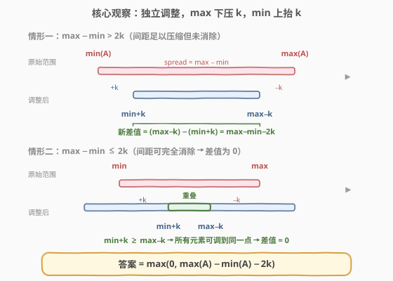
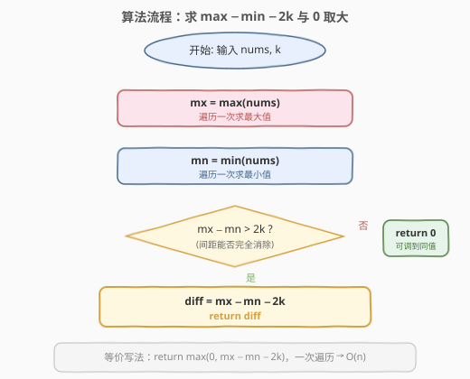
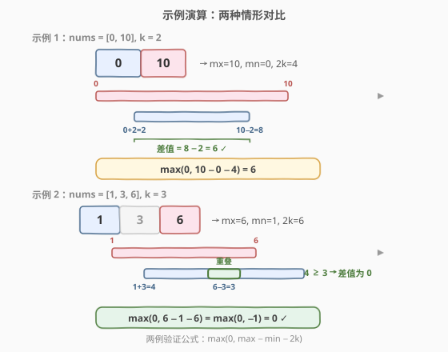

# 最小差值 I

- **题目名称**：最小差值 I
- **链接**：[908. 最小差值 I](https://leetcode.cn/problems/smallest-range-i/)
- **难度**：简单
- **标签**：数组、数学、贪心

## 1. 题目概述

给定一个整数数组 `nums` 和一个整数 `k`。对于数组中的每个元素 `nums[i]`，你可以选择一个整数 $x$ 满足 $-k \le x \le k$，并将 $x$ 加到 `nums[i]` 上，得到新数组 `B`。目标是使 `B` 的**最大值与最小值之差尽可能小**，返回这个最小可能差值。

**示例 1**：

```text
输入：nums = [1], k = 0
输出：0
解释：只有一个元素，最大值 = 最小值 = 1，差值为 0。
```

**示例 2**：

```text
输入：nums = [0,10], k = 2
输出：6
解释：将 0 加 2 得 2，将 10 减 2 得 8，B = [2, 8]，差值 = 8 − 2 = 6。
```

**示例 3**：

```text
输入：nums = [1,3,6], k = 3
输出：0
解释：将 1 加 3 得 4，将 6 减 3 得 3，3 加 0 得 3，B = [4, 3, 3]，差值 = 4 − 3 = 1。
更优：将 1 加 2 得 3，将 3 加 0 得 3，将 6 减 3 得 3，B = [3, 3, 3]，差值 = 0。
```

**约束条件**：

- $1 \le \text{nums.length} \le 10^4$
- $0 \le \text{nums[i]} \le 10^4$
- $0 \le k \le 10^4$

> 💡 每个元素**独立**选择各自的 $x$，互不影响。这一独立性是贪心成立的关键——可以分别把最大值压低、最小值抬高，而无需考虑元素间的耦合。

---

## 2. 解题思路

### 2.1 暴力思路

枚举每个元素的选择 $x_i \in [-k, k]$，共 $n$ 个元素，搜索空间为 $(2k+1)^n$，显然不可行。需要发现问题的**独立可分解性**——最终只关心 `B` 的最大值和最小值，不需要关心中间元素。

### 2.2 核心观察：只需压缩极差，max 下压 k、min 上抬 k



关键洞察：**最终数组的最大值只取决于原始最大值，最小值只取决于原始最小值**。

- 要让 `B` 的最大值尽可能小，应给 `max(A)` 选 $x = -k$，使其变为 $\max(A) - k$。
- 要让 `B` 的最小值尽可能大，应给 `min(A)` 选 $x = +k$，使其变为 $\min(A) + k$。
- 中间元素的选择不影响极值（它们总能落在 $[\min(A)+k,\ \max(A)-k]$ 内或被调整到该范围内）。

因此，压缩后的极差为：

$$\text{diff} = (\max(A) - k) - (\min(A) + k) = \max(A) - \min(A) - 2k$$

但差值不能为负——当 $\max(A) - \min(A) \le 2k$ 时，所有元素可以被调整到**同一个值**，差值为 0。故最终答案为：

$$\boxed{\text{ans} = \max(0,\ \max(A) - \min(A) - 2k)}$$

> 💡 **为什么中间元素不影响？** 设某中间元素 $a$（$\min(A) < a < \max(A)$），它可调整为 $[a-k,\ a+k]$。由于 $a \ge \min(A)$，有 $a + k \ge \min(A) + k$；由于 $a \le \max(A)$，有 $a - k \le \max(A) - k$。所以 $a$ 的可选范围始终覆盖 $[\min(A)+k,\ \max(A)-k]$，总能落在新的极值区间内。

### 2.3 算法流程图



1. 遍历 `nums`，求最大值 `mx = max(nums)`。
2. 遍历 `nums`，求最小值 `mn = min(nums)`。
3. 计算 $\text{diff} = \text{mx} - \text{mn} - 2k$。
4. 返回 $\max(0, \text{diff})$。

> 💡 第 1、2 步可合并为一次遍历同时求 `mx` 和 `mn`，代码更紧凑。

### 2.4 示例演算



以两个示例对比验证：

**示例 1**：`nums = [0, 10]`, `k = 2`

| 步骤 | 计算 | 结果 |
|------|------|------|
| 求 mx | $\max(0, 10) = 10$ | `mx = 10` |
| 求 mn | $\min(0, 10) = 0$ | `mn = 0` |
| 求 diff | $10 - 0 - 2 \times 2 = 6$ | `diff = 6` |
| 取 max(0, diff) | $\max(0, 6) = 6$ | **答案 = 6** |

> 💡 原始极差 $10 - 0 = 10$，可用调整幅度 $2k = 4$，压缩后极差 $10 - 4 = 6 > 0$，无法完全消除。

**示例 2**：`nums = [1, 3, 6]`, `k = 3`

| 步骤 | 计算 | 结果 |
|------|------|------|
| 求 mx | $\max(1, 3, 6) = 6$ | `mx = 6` |
| 求 mn | $\min(1, 3, 6) = 1$ | `mn = 1` |
| 求 diff | $6 - 1 - 2 \times 3 = -1$ | `diff = -1` |
| 取 max(0, diff) | $\max(0, -1) = 0$ | **答案 = 0** |

> 💡 原始极差 $6 - 1 = 5$，可用调整幅度 $2k = 6 > 5$，极差被完全消除——所有元素可调到同一点（如都调到 3），差值为 0。

---

## 3. 参考代码

### C++

```cpp
class Solution {
  public:
    int smallestRangeI(vector<int>& nums, int k) {
        int mx = nums[0], mn = nums[0];
        for (int x : nums) {
            mx = max(mx, x);
            mn = min(mn, x);
        }
        return max(0, mx - mn - 2 * k);
    }
};
```

### Python

```python
class Solution:
    def smallestRangeI(self, nums: List[int], k: int) -> int:
        return max(0, max(nums) - min(nums) - 2 * k)
```

> ⚠️ **数据范围与溢出**：`nums[i]` 和 `k` 均不超过 $10^4$，`mx - mn` 最大 $10^4$，`2 * k` 最大 $2 \times 10^4$，结果在 `int` 范围内，C++ 无溢出风险。

---

## 4. 复杂度分析

| 维度 | 复杂度 | 说明 |
|------|--------|------|
| 时间复杂度 | $O(n)$ | 一次遍历同时求 `mx` 和 `mn`，每个元素访问一次 |
| 空间复杂度 | $O(1)$ | 仅使用 `mx`、`mn` 两个变量 |

---

## 5. 扩展：从"独立调整"到"全局约束"

本题的精髓在于**每个元素的调整完全独立**——各选各的 $x$，互不干扰。这让最优策略可以贪心地只盯住两个极值。

对比同类问题中约束更强的情况：

| 题目 | 约束 | 难度 |
|------|------|------|
| [908. 最小差值 I](https://leetcode.cn/problems/smallest-range-i/) | 每个元素独立选 $x \in [-k, k]$ | 简单 |
| [910. 最小差值 II](https://leetcode.cn/problems/smallest-range-ii/) | 每个元素只能选 $+k$ 或 $-k$（二选一） | 中等 |

910 题中每个元素**只能选 $+k$ 或 $-k$**（不能选中间值），自由度骤降——不能简单地把 max 压低、min 抬高，而需要排序后贪心寻找最优分割点。908 的核心公式 $\max(0, \max - \min - 2k)$ 在 910 中不再适用，这正是约束变化带来的本质区别。

> 💡 **设计思路的递进**：908 是"连续可选"（$[-k, k]$ 区间）→ 最优策略只需看极值；910 是"离散二选一"（$+k$ 或 $-k$）→ 需要排序 + 贪心分割。从连续到离散，难度从简单跳到中等。

---

## 6. 面试要点

1. **为什么只需要关心 max 和 min，不用管中间元素？**

   - 每个元素的调整 $x \in [-k, k]$ 是独立的。最终 `B` 的最大值只受原始 `max(A)` 影响（选 $-k$ 压低），最小值只受原始 `min(A)` 影响（选 $+k$ 抬高）。中间元素的可调范围 $[a-k, a+k]$ 始终覆盖 $[\min+k, \max-k]$，不会突破新的极值边界。

2. **为什么答案要和 0 取 max？**

   - 当 $\max(A) - \min(A) \le 2k$ 时，调整幅度足以让所有元素重叠到同一点（如取中点），此时极差为 0。公式 $\max - \min - 2k$ 会算出负数，但实际差值不可能为负，故用 $\max(0, \cdot)$ 兜底。

3. **如果 k = 0 怎么办？**

   - 无法做任何调整，答案就是原始极差 $\max(A) - \min(A)$。公式退化为 $\max(0, \max - \min) = \max - \min$（因为 $\max \ge \min$ 恒成立），正确。

4. **能否一次遍历同时求 max 和 min？**

   - 可以。初始化 `mx = mn = nums[0]`，遍历时 `mx = max(mx, x)`、`mn = min(mn, x)`，一次遍历搞定，时间仍为 $O(n)$。也可以直接用语言的内置函数 `max(nums)` 和 `min(nums)`（两次遍历，常数因子略大但更简洁）。

5. **和 910 最小差值 II 的区别是什么？**

   - 908 中 $x$ 可取 $[-k, k]$ 内任意值（连续），中间元素总能"居中调和"，只盯极值即可。910 中 $x$ 只能取 $+k$ 或 $-k$（离散二选一），中间元素无法任意居中，必须排序后找最优分割点。约束从连续到离散，解法从 $O(n)$ 公式变为 $O(n \log n)$ 排序贪心。

---

## 7. 同类练习题

- [910. 最小差值 II](https://leetcode.cn/problems/smallest-range-ii/)：约束升级版（每个元素只能 $+k$ 或 $-k$），排序 + 贪心找最优分割点
- [632. 最小区间](https://leetcode.cn/problems/smallest-range-covering-elements-from-k-lists/)：你有 k 个有序列表，取 k 个数使覆盖区间最小，多路归并 + 最小堆
- [2144. 打折购买糖果的最小花费](https://leetcode.cn/problems/minimum-cost-of-buying-candies-with-discount/)：贪心策略选择，和本题同为"独立决策→贪心"范式
- [561. 数组拆分](https://leetcode.cn/problems/array-partition/)：排序后贪心配对取最小值之和，与 910 的排序贪心思路同源
- [881. 救生艇](https://leetcode.cn/problems/boats-to-save-people/)：排序 + 双指针贪心，同样是"排序后找最优配对"的贪心模式
