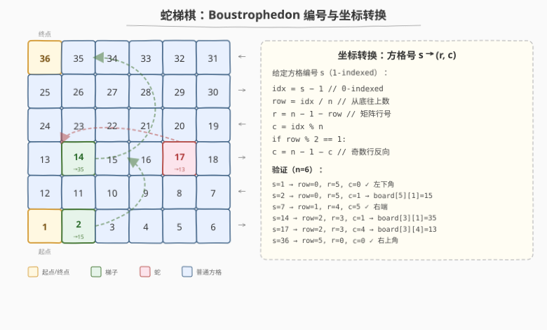
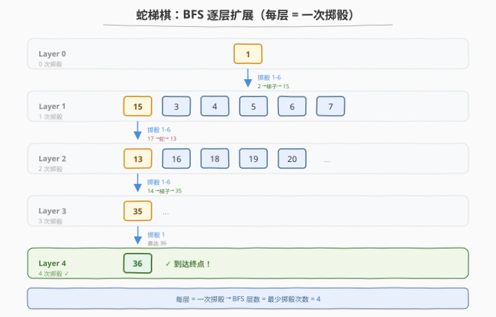
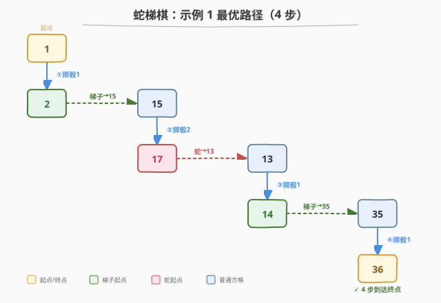

# 蛇梯棋

- **题目名称**：蛇梯棋
- **链接**：[909. 蛇梯棋](https://leetcode.cn/problems/snakes-and-ladders/)
- **难度**：中等
- **标签**：广度优先搜索、矩阵、最短路径

## 1. 题目概述

给定 $n \times n$ 棋盘 `board`，方格按 **Boustrophedon（牛耕式）编号**：从左下角 `board[n-1][0]` 为 1 号，每行交替方向（底行从左到右，上一行从右到左，依此类推），到右上角为 $n^2$ 号。

玩家从 1 号出发，每回合掷六面骰子（1-6 点），从当前方格 `curr` 前进到 `next ∈ [curr+1, min(curr+6, n^2)]`。若 `next` 处有蛇或梯子（`board[r][c] != -1`），则传送到 `board[r][c]`。**每次掷骰最多传送一次**——即便落地处是另一条蛇/梯子的起点，也不能连续跳。到达 $n^2$ 即结束。

返回到达 $n^2$ 的最少掷骰次数，不可能则返回 `-1`。

**示例 1**：

```text
输入：board = [[-1,-1,-1,-1,-1,-1],[-1,-1,-1,-1,-1,-1],[-1,-1,-1,-1,-1,-1],[-1,35,-1,-1,13,-1],[-1,-1,-1,-1,-1,-1],[-1,15,-1,-1,-1,-1]]
输出：4
解释：1 →(掷1)→ 2 →(梯子)→ 15 →(掷2)→ 17 →(蛇)→ 13 →(掷1)→ 14 →(梯子)→ 35 →(掷1)→ 36
```

**示例 2**：

```text
输入：board = [[-1,-1],[-1,3]]
输出：1
解释：从 1 掷 3 点直接到达 4（board[0][0]=-1，无蛇/梯子），仅需 1 次。
```

**约束条件**：

- $n = \text{board.length} = \text{board[i].length}$
- $2 \le n \le 20$
- `board[i][j]` 为 `-1` 或在 $[1, n^2]$ 范围内
- 编号为 1 和 $n^2$ 的方格上没有蛇或梯子

---

## 2. 解题思路

### 2.1 暴力思路（DFS 回溯）

从 1 号出发，尝试所有可能的骰子点数（1-6），递归搜索所有路径，记录到达 $n^2$ 的最小步数。但每步 6 种选择，路径长度可达 $n^2$，最坏时间 $O(6^{n^2})$，完全不可行——需要利用"最短步数"这一目标转向 BFS。

### 2.2 核心观察：BFS 求最短路径



将棋盘建模为**无权图**：每个方格是一个节点，每回合掷骰子（1-6）产生至多 6 条边（从 `curr` 到 `curr+1...curr+6`，遇蛇/梯子则边连到传送终点）。**最少掷骰次数 = 从 1 到 $n^2$ 的最短路径长度**，而无权图最短路径正是 BFS 的招牌应用。

> 💡 **关键转化**：蛇和梯子不是"障碍"而是"捷径"——它们把边重定向到另一个节点。BFS 中遇到蛇/梯子时，直接把传送终点入队即可，无需特殊处理。

### 2.3 坐标转换：Boustrophedon 编号

本题的最大陷阱不在 BFS 本身，而在**方格编号到矩阵坐标的转换**。由于牛耕式编号，行方向交替：

- **偶数行**（从底数，`row_from_bottom` 为偶数）：从左到右 → `c = idx % n`
- **奇数行**（`row_from_bottom` 为奇数）：从右到左 → `c = n - 1 - idx % n`

其中 `idx = s - 1`（0-indexed），`row_from_bottom = idx / n`，`r = n - 1 - row_from_bottom`。

> ⚠️ **易错点**：判断"奇偶行"用的是 `row_from_bottom`（从底往上数），而非矩阵行号 `r`。当 $n$ 为偶数时两者奇偶性相同，当 $n$ 为奇数时奇偶性相反，容易出错。务必用 `row_from_bottom` 判定方向。

### 2.4 算法流程



1. 初始化 BFS：起点 1 入队，`visited[1] = true`
2. BFS 逐层扩展（`moves = 0`）：
   - 取当前队列大小 `size`（当前层 frontier）
   - 逐个 pop 当前方格 `curr`，若 `curr == n²` 返回 `moves`
   - 尝试骰子 1-6：`next = curr + dice`，若 `next > n²` 跳过
   - 将 `next` 转为坐标 `(r, c)`，若 `board[r][c] != -1` 则 `next = board[r][c]`（传送）
   - 若 `!visited[next]`：标记已访问，入队
   - 本轮结束后 `moves++`
3. 队列空仍未到达 → 返回 `-1`

### 2.5 示例演算



以示例 1 为例，最优路径（4 步）：

| 步数 | 当前方格 | 掷骰 | 落地方格 | 传送 | 到达 |
|------|---------|------|---------|------|------|
| 1 | 1 | 1 | 2 | 梯子→15 | 15 |
| 2 | 15 | 2 | 17 | 蛇→13 | 13 |
| 3 | 13 | 1 | 14 | 梯子→35 | 35 |
| 4 | 35 | 1 | 36 | 无 | 36 ✓ |

BFS 逐层找到 36 时恰好在第 4 层，返回 4。

---

## 3. 参考代码

### C++

```cpp
class Solution {
  public:
    int snakesAndLadders(vector<vector<int>>& board) {
        int n = board.size();
        int target = n * n;
        vector<bool> visited(target + 1, false);
        queue<int> q;
        q.push(1);
        visited[1] = true;
        int moves = 0;
        while (!q.empty()) {
            int size = q.size();
            for (int i = 0; i < size; i++) {
                int curr = q.front();
                q.pop();
                if (curr == target) return moves;
                for (int dice = 1; dice <= 6; dice++) {
                    int next = curr + dice;
                    if (next > target) break;
                    auto [r, c] = getCoord(next, n);
                    if (board[r][c] != -1) next = board[r][c];
                    if (!visited[next]) {
                        visited[next] = true;
                        q.push(next);
                    }
                }
            }
            moves++;
        }
        return -1;
    }
  private:
    pair<int, int> getCoord(int s, int n) {
        int idx = s - 1;
        int row = idx / n;
        int r = n - 1 - row;
        int c = idx % n;
        if (row % 2 == 1) c = n - 1 - c;
        return {r, c};
    }
};
```

### Python

```python
class Solution:
    def snakesAndLadders(self, board: List[List[int]]) -> int:
        n = len(board)
        target = n * n

        def get_coord(s):
            idx = s - 1
            row = idx // n
            r = n - 1 - row
            c = idx % n
            if row % 2 == 1:
                c = n - 1 - c
            return r, c

        visited = [False] * (target + 1)
        q = collections.deque([1])
        visited[1] = True
        moves = 0
        while q:
            for _ in range(len(q)):
                curr = q.popleft()
                if curr == target:
                    return moves
                for dice in range(1, 7):
                    nxt = curr + dice
                    if nxt > target:
                        break
                    r, c = get_coord(nxt)
                    if board[r][c] != -1:
                        nxt = board[r][c]
                    if not visited[nxt]:
                        visited[nxt] = True
                        q.append(nxt)
            moves += 1
        return -1
```

> ⚠️ **坐标转换的奇偶判定**：用 `row = idx // n`（从底往上数的行号）判定方向，而非矩阵行号 `r`。`row` 为偶数时左到右，奇数时右到左。如果误用 `r` 判定，当 $n$ 为奇数时方向会全部反掉。

---

## 4. 复杂度分析

| 维度 | 复杂度 | 说明 |
|------|--------|------|
| 时间复杂度 | $O(n^2)$ | 棋盘共 $n^2$ 个方格，每个最多入队一次，每次扩展 6 条边 |
| 空间复杂度 | $O(n^2)$ | `visited` 数组 + BFS 队列，最坏存全部方格 |

---

## 5. 扩展：为什么不能连续跳蛇/梯子？

题目规定每次掷骰**最多传送一次**，即使落地处是另一条蛇/梯子的起点也不继续跳。这一约束实际上**简化了图的结构**——每条边只经过一次传送，不会产生链式跳跃。

如果允许连续跳（即落地后若又是蛇/梯子起点则继续传送），需要在 BFS 中对 `next` 做 **while 循环跟随传送链**，直到落地方格无蛇/梯子为止。此时需注意传送链不能成环（否则死循环），需要额外判环或限制跳跃次数。

> 💡 本题不允许连续跳，所以代码中只需一次 `if (board[r][c] != -1) next = board[r][c]`，不需要 while 循环。

---

## 6. 面试要点

1. **为什么用 BFS 而不是 DFS？**

   BFS 按层扩展，每层 = 一次掷骰，天然求最少步数。DFS 会深入一条路径，无法保证最短，且需要搜索所有路径取最小值，指数级复杂度。

2. **坐标转换怎么写？最容易错在哪？**

   `idx = s-1`，`row = idx/n`（从底往上），`r = n-1-row`，`c = idx%n`（偶数行）或 `n-1-idx%n`（奇数行）。最易错的是用 `r` 而非 `row` 判方向——当 $n$ 为奇数时两者奇偶性相反。

3. **蛇和梯子在 BFS 中怎么处理？**

   不需要特殊处理。掷骰落到 `next` 后，检查 `board[r][c]`：若 `!= -1`，把 `next` 更新为 `board[r][c]`（传送终点），然后照常判 visited 并入队。蛇/梯子只是改变了边的终点。

4. **为什么需要 visited 数组？**

   同一方格可能通过不同路径到达，BFS 第一次到达即为最短距离。标记 visited 后跳过重复入队，保证每个方格只处理一次，时间 $O(n^2)$。

5. **什么时候返回 -1？**

   BFS 队列耗尽仍未到达 $n^2$，说明不可达（可能被蛇循环送回已访问区域）。此时返回 `-1`。

---

## 7. 同类练习题

- [994. 腐烂的橘子](https://leetcode.cn/problems/rotting-oranges/)（[站内题解](../0901-1000/994_腐烂的橘子.md)）：多源 BFS 求最短时间，与本题的单源 BFS 求最短步数同构
- [743. 网络延迟时间](https://leetcode.cn/problems/network-delay-time/)（[站内题解](../0701-0800/743_网络延迟时间.md)）：加权图最短路（Dijkstra），对比本题的无权图 BFS
- [200. 岛屿数量](https://leetcode.cn/problems/number-of-islands/)（[站内题解](../0101-0200/200_岛屿数量.md)）：BFS/DFS 网格遍历基础
- [1293. 网格中的最短路径](https://leetcode.cn/problems/shortest-path-in-a-grid-with-obstacles-elimination/)：BFS + 状态压缩（可消除 k 个障碍），本题的带障碍变体
- [1210. 穿过迷宫的最少移动次数](https://leetcode.cn/problems/minimum-moves-to-reach-target-with-rotations/)：BFS 在特殊网格上的最短路径，状态包含位置和姿态
