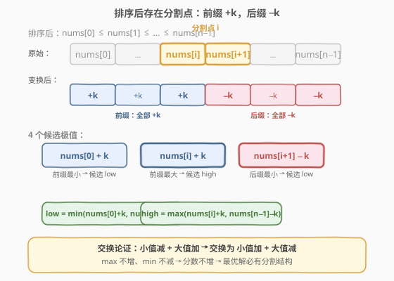
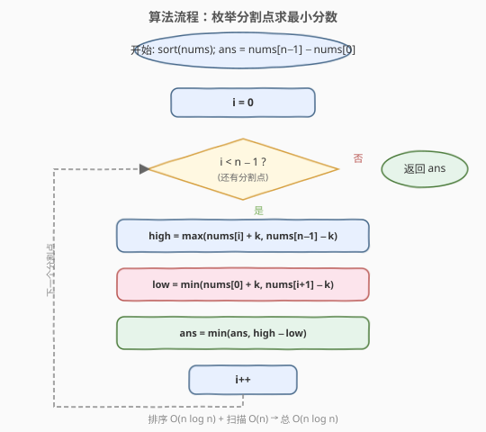

# 最小差值 II

- **题目名称**：最小差值 II
- **链接**：[910. 最小差值 II](https://leetcode.cn/problems/smallest-range-ii/)
- **难度**：中等
- **标签**：贪心、数组、数学、排序

## 1. 题目概述

给定一个整数数组 `nums` 和一个整数 `k`。对于每个下标 `i`，将 `nums[i]` 变成 `nums[i] + k` 或 `nums[i] - k`。数组的**分数**是最大元素与最小元素的差值。在更改每个下标对应的值之后，返回 `nums` 的最小分数。

**示例 1**：

```text
输入：nums = [1], k = 0
输出：0
解释：分数 = max(nums) - min(nums) = 1 - 1 = 0。
```

**示例 2**：

```text
输入：nums = [0,10], k = 2
输出：6
解释：将数组变为 [2, 8]。分数 = 8 - 2 = 6。
```

**示例 3**：

```text
输入：nums = [1,3,6], k = 3
输出：3
解释：将数组变为 [4, 6, 3]。分数 = 6 - 3 = 3。
```

**约束条件**：

- $1 \le \text{nums.length} \le 10^4$
- $0 \le \text{nums[i]} \le 10^4$
- $0 \le k \le 10^4$

> 💡 本题是 [908. 最小差值 I](https://leetcode.cn/problems/smallest-range-i/) 的进阶版。908 题允许每个元素在 $[\text{nums[i]}-k, \text{nums[i]}+k]$ 范围内**任意取值**，因此可以直接把所有元素拉到同一个值附近；而本题每个元素只能取 $\text{nums[i]}+k$ 或 $\text{nums[i]}-k$ **两个端点之一**，选择是离散的，需要更精细的决策。

---

## 2. 解题思路

### 2.1 暴力思路：枚举所有选择

每个元素有 `+k` 和 `-k` 两种选择，$n$ 个元素共有 $2^n$ 种组合。对每种组合计算 `max - min`，取最小值。当 $n = 10^4$ 时，$2^{10000}$ 完全不可行。需要找到贪心结构来压缩搜索空间。

### 2.2 核心观察：排序后存在分割点



**关键观察**：将数组排序后，最优解中一定存在一个**分割点** $i$，使得前缀 `nums[0..i]` 全部 `+k`，后缀 `nums[i+1..n-1]` 全部 `-k`。

> 💡 **为什么？** 排序后 `nums[0] ≤ nums[1] ≤ ... ≤ nums[n-1]`。假设最优解中存在 $i < j$，但 `nums[i]` 取了 `-k`、`nums[j]` 取了 `+k`（即"小值减、大值加"，把两端拉开）。我们交换它们的选择——让 `nums[i]` 取 `+k`、`nums[j]` 取 `-k`：
> - `nums[i]` 的值从 `nums[i]-k` 变为 `nums[i]+k`，**变大**了 → 最小值不会下降；
> - `nums[j]` 的值从 `nums[j]+k` 变为 `nums[j]-k`，**变小**了 → 最大值不会上升。
>
> 交换后最大值不增、最小值不减，分数（差值）不会变大。反复交换，直到不存在"小值减、大值加"的逆序对，最终得到的就是"前缀全加、后缀全减"的分割结构。

确定分割点 $i$ 后，变换后的数组只关心 4 个候选值：

| 候选值 | 来源 | 角色 |
|--------|------|------|
| `nums[0] + k` | 前缀最小值变换后 | 可能的新最小值 |
| `nums[i] + k` | 前缀最大值变换后 | 可能的新最大值 |
| `nums[i+1] - k` | 后缀最小值变换后 | 可能的新最小值 |
| `nums[n-1] - k` | 后缀最大值变换后 | 可能的新最大值 |

因此：

$$\text{high} = \max(\text{nums}[i] + k,\ \text{nums}[n{-}1] - k)$$

$$\text{low} = \min(\text{nums}[0] + k,\ \text{nums}[i{+}1] - k)$$

$$\text{score}(i) = \text{high} - \text{low}$$

遍历所有 $i \in [0, n{-}2]$ 取最小值即可。

> ⚠️ **边界情况**：当所有元素取相同操作时（全 `+k` 或全 `-k`），分数为 `nums[n-1] - nums[0]`（原始范围不变）。这对应分割点 $i = -1$ 或 $i = n{-}1$ 的退化情形，作为初始答案即可覆盖。

### 2.3 算法流程图



1. 对 `nums` 排序。
2. 初始化 `ans = nums[n-1] - nums[0]`（全取相同操作的退化情形）。
3. 遍历分割点 $i$ 从 $0$ 到 $n - 2$：
   - 计算 `high = max(nums[i] + k, nums[n-1] - k)`。
   - 计算 `low = min(nums[0] + k, nums[i+1] - k)`。
   - 更新 `ans = min(ans, high - low)`。
4. 返回 `ans`。

### 2.4 示例演算

![示例演算：nums = [1,3,6], k = 3](../images/smallestrange2_walkthrough.svg)

以 `nums = [1, 3, 6], k = 3` 为例（已排序）：

**初始**：`ans = nums[2] - nums[0] = 6 - 1 = 5`。

| 分割点 i | 前缀 +k | 后缀 -k | high = max(nums[i]+k, nums[2]-k) | low = min(nums[0]+k, nums[i+1]-k) | score |
|---------|---------|---------|----------------------------------|-----------------------------------|-------|
| 0 | [1]→4 | [3,6]→[0,3] | max(4, 3) = 4 | min(4, 0) = 0 | 4 |
| 1 | [1,3]→[4,6] | [6]→3 | max(6, 3) = 6 | min(4, 3) = 3 | 3 |

`ans = min(5, 4, 3) = 3` ✓

> 💡 **i=1 时最优**：前缀 `[1,3]+3 = [4,6]`，后缀 `[6]-3 = [3]`。合并后数组 `[4, 6, 3]`，`max=6, min=3, 分数=3`。注意 `nums[0]+k=4` 和 `nums[2]-k=3` 这两个"极端"值都没有成为瓶颈——瓶颈来自 `nums[1]+k=6`（前缀最大）和 `nums[2]-k=3`（后缀最小），这正是遍历所有分割点的意义：不同的 $i$ 会暴露不同的瓶颈组合。

---

## 3. 参考代码

### C++

```cpp
class Solution {
  public:
    int smallestRangeII(vector<int>& nums, int k) {
        int n = nums.size();
        sort(nums.begin(), nums.end());
        int ans = nums[n - 1] - nums[0];
        for (int i = 0; i < n - 1; i++) {
            int high = max(nums[i] + k, nums[n - 1] - k);
            int low = min(nums[0] + k, nums[i + 1] - k);
            ans = min(ans, high - low);
        }
        return ans;
    }
};
```

### Python

```python
class Solution:
    def smallestRangeII(self, nums: List[int], k: int) -> int:
        nums.sort()
        n = len(nums)
        ans = nums[-1] - nums[0]
        for i in range(n - 1):
            high = max(nums[i] + k, nums[-1] - k)
            low = min(nums[0] + k, nums[i + 1] - k)
            ans = min(ans, high - low)
        return ans
```

> ⚠️ **数据范围安全性**：`nums[i]` 和 `k` 均不超过 $10^4$，`nums[i] + k` 最大为 $2 \times 10^4$，`nums[i] - k` 最小为 $-10^4$，差值最大 $3 \times 10^4$，C++ `int` 完全够用，无需 `long long`。

---

## 4. 复杂度分析

| 维度 | 复杂度 | 说明 |
|------|--------|------|
| 时间复杂度 | $O(n \log n)$ | 排序 $O(n \log n)$ + 一次线性扫描 $O(n)$，瓶颈在排序 |
| 空间复杂度 | $O(\log n)$ | 排序的递归栈空间（C++ `std::sort` 为内省排序），额外变量 $O(1)$ |

---

## 5. 扩展：与 908. 最小差值 I 的对比

| 维度 | 908. 最小差值 I | 910. 最小差值 II |
|------|----------------|-----------------|
| 元素取值范围 | $[\text{nums[i]}-k,\ \text{nums[i]}+k]$ **连续区间** | $\{\text{nums[i]}-k,\ \text{nums[i]}+k\}$ **两个端点** |
| 最优策略 | 所有元素尽量靠拢中位数 | 排序后前缀 `+k`、后缀 `-k` |
| 复杂度 | $O(n)$ | $O(n \log n)$ |
| 核心公式 | $\max(0,\ \text{nums[n-1]}-k - (\text{nums[0]}+k))$ | $\min_i \max(\text{nums[i]}+k,\ \text{nums[n-1]}-k) - \min(\text{nums[0]}+k,\ \text{nums[i+1]}-k)$ |

908 题因为取值连续，可以直接把所有元素拉到 $[\text{nums[0]}+k,\ \text{nums[n-1]}-k]$ 内，分数为 $\max(0,\ \text{nums[n-1]}-\text{nums[0]}-2k)$。910 题取值离散，无法自由居中，必须枚举分割点。

> 💡 **直觉联系**：当 $k$ 足够大时（$k \ge (\text{nums[n-1]}-\text{nums[0]})/2$），908 题答案为 0（所有元素可拉到同一点）；而 910 题因离散选择，即使 $k$ 很大也无法保证所有元素相同，答案未必为 0——这正是离散约束带来的本质难度。

---

## 6. 面试要点

1. **为什么最优解一定有"前缀 +k、后缀 -k"的分割结构？**

   排序后，若最优解中存在 $i < j$ 且 `nums[i]` 取 `-k`、`nums[j]` 取 `+k`（小值减、大值加），交换它们的选择后：`nums[i]` 从减变加（值变大，最小值不降），`nums[j]` 从加变减（值变小，最大值不增）。分数不增。反复交换消除所有逆序对，最终得到分割结构。这是经典的**交换论证（exchange argument）**。

2. **为什么只需要关心 4 个候选值？**

   分割点 $i$ 确定后，前缀 `[0..i]` 全 `+k`，后缀 `[i+1..n-1]` 全 `-k`。前缀中最大值是 `nums[i]+k`（排序后 `nums[i]` 是前缀最大），后缀中最大值是 `nums[n-1]-k`（排序后 `nums[n-1]` 是后缀最大）。同理前缀最小 `nums[0]+k`，后缀最小 `nums[i+1]-k`。全局 max/min 必在这 4 个值中产生。

3. **初始答案为什么是 `nums[n-1] - nums[0]`？**

   这对应所有元素取相同操作（全 `+k` 或全 `-k`）的退化情形——每个元素加（或减）相同的 $k$ 后，相对大小不变，分数仍为原始范围。分割点遍历从 $i=0$ 到 $i=n-2$ 覆盖了所有"非退化"的混合情形，初始值覆盖退化情形。

4. **`k = 0` 时会怎样？**

   每个元素 `+0` 或 `-0` 都不变，变换后数组与原数组相同。`ans = nums[n-1] - nums[0]`，循环中 `high - low = nums[i] - nums[i+1] <= 0`……实际上 `high = max(nums[i], nums[n-1]) = nums[n-1]`，`low = min(nums[0], nums[i+1]) = nums[0]`，`score = nums[n-1] - nums[0]` 不变。最终答案正确为原始范围。

5. **为什么分割点只枚举到 `n-2`？**

   $i = n-1$ 意味着所有元素都在前缀（全 `+k`），$i = -1$ 意味着所有元素都在后缀（全 `-k`），两者都是退化情形，已被初始答案覆盖。非退化的混合分割从 $i=0$（仅 `nums[0]` 加）到 $i=n-2`（仅 `nums[n-1]` 减）共 $n-1$ 种。

---

## 7. 同类练习题

- [908. 最小差值 I](https://leetcode.cn/problems/smallest-range-i/)：连续取值版，公式直接给出 $\max(0,\ \text{range}-2k)$，910 的简化前导题
- [2144. 打折购买糖果的最小花费](https://leetcode.cn/problems/minimum-cost-of-buying-candies-with-discount/)：贪心 + 排序，同样依赖"排序后做决策"的思路
- [881. 救生艇](https://leetcode.cn/problems/boats-to-save-people/)：排序 + 双指针贪心，排序后从两端做决策的范式
- [56. 合并区间](https://leetcode.cn/problems/merge-intervals/)（[站内题解](../0001-0100/56_合并区间.md)）：排序后线性扫描的经典贪心模板
- [435. 无重叠区间](https://leetcode.cn/problems/non-overlapping-intervals/)（[站内题解](../0301-0400/435_无重叠区间.md)）：贪心区间调度，排序 + 交换论证证明贪心正确性的典型
