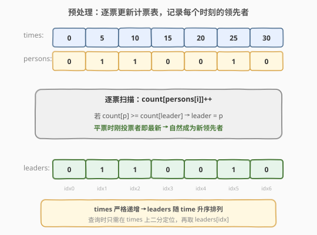
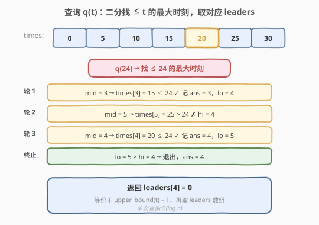
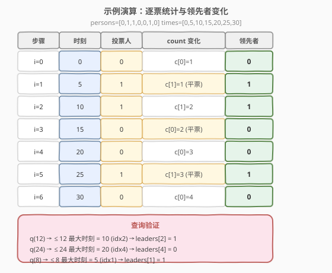

# 在线选举

- **题目名称**：在线选举
- **链接**：[911. 在线选举](https://leetcode.cn/problems/online-election/)
- **难度**：中等
- **标签**：设计、二分查找、哈希表

## 1. 题目概述

给你两个整数数组 `persons` 和 `times`，长度相同且 `times` **严格递增**。在时刻 `times[i]`，编号为 `persons[i]` 的人获得了一票。所有投票按 `times` 顺序发生。

在任意时刻 `t`，**领先者**定义为：截止时刻 `t`（含）已发生的所有投票中，得票最多的人；若多人得票相同，则取**最近一次**投票的那个人。

实现 `TopVotedCandidate`：

- `TopVotedCandidate(int[] persons, int[] times)`：构造时给定全部投票记录。
- `int q(int t)`：返回时刻 `t` 的领先者。保证 `t` 落在 `times` 的合法查询范围内（即 `t >= times[0]`，且 `t` 不会询问未发生的事件之间的无意义区间——题目保证查询的 `t` 满足 `times[0] <= t <= 10^9`）。

**示例 1**：

```text
输入：
["TopVotedCandidate", "q", "q", "q", "q", "q", "q"]
[[[0, 1, 1, 0, 0, 1, 0], [0, 5, 10, 15, 20, 25, 30]], [3], [12], [25], [15], [24], [8]]
输出：[null, 0, 1, 1, 0, 0, 1]

解释：
  persons = [0, 1, 1, 0, 0, 1, 0]
  times   = [0, 5, 10, 15, 20, 25, 30]

  q(3)  → 截止时刻 3 只有 times[0]=0 这一票(人 0)，领先者 = 0
  q(12) → 截止时刻 12 有 times[0,1,2]=0,5,10，人 0 票 1、人 1 票 2 → 领先者 = 1
  q(25) → 截止时刻 25 有 times[0..5]，人 0 票 3、人 1 票 3，平票取最新 → 人 1
  q(15) → 截止时刻 15 有 times[0..3]，人 0 票 2、人 1 票 2，平票取最新 → 人 0
  q(24) → 截止时刻 24 有 times[0..4]，人 0 票 3、人 1 票 2 → 领先者 = 0
  q(8)  → 截止时刻 8 有 times[0,1]=0,5，人 0 票 1、人 1 票 1，平票取最新 → 人 1
```

**约束条件**：

- `1 <= persons.length == times.length <= 5000`
- `0 <= persons[i] < persons.length`
- `times` 严格递增，`times[0] <= t <= 10^9`
- `q` 最多被调用 `10^4` 次

> 💡 这是「**预处理 + 二分查询**」的经典设计题。核心有两点：① **构造时离线预处理**——按投票顺序逐票更新计票表，记录每个时刻的领先者，得到一个随 `time` 升序排列的「领先者序列」；② **查询时在线二分**——`times` 严格递增，所以「截止时刻 `t` 的领先者」等价于「`times` 中 `<= t` 的最大下标」处的领先者，用右边界二分 `O(log n)` 定位即可。与 [基于时间的键值存储](../0901-1000/981_基于时间的键值存储.md) 的「HashMap + 有序数组二分」是同一套骨架。

---

## 2. 解题思路

### 2.1 暴力思路：每次查询重数

最直观的做法：每次 `q(t)` 从头扫描 `times`，找出所有 `times[i] <= t` 的投票，用一个计数表统计每个候选人的票数，再选出票数最多（平票取最新）的人。

```text
q(t):
    count = {}
    leader = -1
    for i in range(n):
        if times[i] > t: break
        count[persons[i]] += 1
        if count[persons[i]] >= count[leader]:
            leader = persons[i]
    return leader
```

每次 `q` 要扫到 `t` 之前的全部投票，最坏 `O(n)`；`q` 调用 `10^4` 次、`n = 5000`，总计 `5 * 10^7`，**勉强能过但很慢**，且浪费了「投票记录一次性给齐」这一关键信息。

> ⚠️ 暴力法的问题：每次查询都**重复统计**了截止 `t` 的全部票数，而这些票数在构造时就已经确定不变。其实「截止任意 `times[i]` 的领先者」可以在构造时**一次性算好**，查询时只需定位到对应下标——这正是预处理的用武之地。

### 2.2 核心观察：预处理领先者序列 + 二分定位

**关键定义**：构造时维护一个计数表 `count`（候选人编号 → 票数）和当前领先者 `leader`。逐票扫描 `persons/times`：

1. `count[persons[i]] += 1`
2. **若 `count[persons[i]] >= count[leader]`**，则 `leader = persons[i]`。
3. 把 `leader` 存进 `leaders[i]`。

这样 `leaders[i]` 就是「截止 `times[i]` 的领先者」。



**为什么用 `>=` 而不是 `>`？** 题目要求平票时取**最近一次**投票的人。当 `count[persons[i]] == count[leader]` 时，`persons[i]` 刚投了票，是最新的一票，所以应当成为新领先者——这正是 `>=` 的语义：相等也更新，让最新投票者上位。若用 `>` 则会保留旧的领先者，平票时取错了人。

> 💡 **平票处理的精髓**：因为投票按 `times` 顺序逐个处理，当前投票者 `persons[i]` 必然是「截止此刻最近的一票」。所以平票时直接令 `leader = persons[i]` 即可，无需额外记录「最近投票时间」。`>=` 一行代码同时覆盖了「反超」和「平票上位」两种情况。

**查询 `q(t)`**：由于 `times` 严格递增，`leaders` 也随 `times` 升序排列。`q(t)` 要返回「截止 `t` 的领先者」，等价于找 `times` 中 `<= t` 的**最大下标** `idx`，返回 `leaders[idx]`——这是经典的**右边界二分**，与 [981. 基于时间的键值存储](../0901-1000/981_基于时间的键值存储.md) 的 `get` 完全同构。



### 2.3 算法流程图

**完整步骤**：

1. **构造** `TopVotedCandidate(persons, times)`：
   - 保存 `times` 数组（供二分）。
   - `count` 哈希表初始化为空，`leader = -1`（哨兵，`count[-1] = 0` 用默认值处理）。
   - 遍历 `i = 0..n-1`：
     - `count[persons[i]] += 1`
     - 若 `count[persons[i]] >= count[leader]`：`leader = persons[i]`
     - `leaders[i] = leader`
   - 保存 `leaders` 数组。
2. **查询** `q(t)`：
   - 在 `times` 上二分找「`<= t` 的最大下标」`idx`（右边界）。
   - 返回 `leaders[idx]`。

> ⚠️ **不是普通二分**：普通二分找「等于 target」，本题找「`<= target` 的最大下标」。即使 `t` 不在 `times` 里也能给出正确答案（如 `q(24)` 时 `times` 是 `[0,5,10,15,20,25,30]`，`24` 不在表中，但仍应返回 `times[4]=20` 对应的领先者）。等价于 `upper_bound(t) - 1`。

### 2.4 示例演算

以 `persons = [0,1,1,0,0,1,0]`，`times = [0,5,10,15,20,25,30]` 为例：



| 步骤 | 时刻 | 投票人 | count 变化 | 领先者 | 说明 |
|------|------|--------|-----------|--------|------|
| i=0 | 0 | 0 | c[0]=1 | 0 | 首票，0 上位 |
| i=1 | 5 | 1 | c[1]=1（平票） | 1 | 1=1 平票，1 最新 → 上位 |
| i=2 | 10 | 1 | c[1]=2 | 1 | 1 反超（2>1），保持 |
| i=3 | 15 | 0 | c[0]=2（平票） | 0 | 2=2 平票，0 最新 → 上位 |
| i=4 | 20 | 0 | c[0]=3 | 0 | 0 反超（3>2），保持 |
| i=5 | 25 | 1 | c[1]=3（平票） | 1 | 3=3 平票，1 最新 → 上位 |
| i=6 | 30 | 0 | c[0]=4 | 0 | 0 反超（4>3），保持 |

最终 `leaders = [0,1,1,0,0,1,0]`，`times = [0,5,10,15,20,25,30]`。

关注 i=1、i=3、i=5 三步：每次都是平票，当前投票者凭借「最新一票」直接上位。这正是 `>=` 比较的巧妙之处——平票时不需要比较「最近投票时间」，因为按序处理时当前投票者天然就是最新的。

> 💡 对比暴力法：`q(24)` 暴力要扫描 `times[0..4]` 共 5 张票重新计数；预处理后只需二分 3 次定位到 idx=4，直接读 `leaders[4] = 0`。`10^4` 次查询从 `O(n·q) ≈ 5*10^7` 降到 `O(q·log n) ≈ 1.3*10^5`，快了近 400 倍。

---

## 3. 参考代码

### C++

```cpp
// 在线选举.cpp —— 预处理领先者序列 + 二分定位
// 编译: g++ -O2 -std=c++17 在线选举.cpp -o election
#include <vector>
#include <unordered_map>
using namespace std;

class TopVotedCandidate {
    vector<int> times;        // 供二分的时间戳数组
    vector<int> leaders;      // leaders[i] = 截止 times[i] 的领先者

  public:
    TopVotedCandidate(vector<int>& persons, vector<int>& times) {
        this->times = times;
        int n = persons.size();
        leaders.resize(n);
        unordered_map<int,int> count;   // 候选人 -> 票数
        int leader = -1;                // 哨兵，count[-1] 视为 0
        count[-1] = 0;
        for (int i = 0; i < n; ++i) {
            int p = persons[i];
            count[p]++;
            // >= 保证平票时最新投票者上位
            if (count[p] >= count[leader]) leader = p;
            leaders[i] = leader;
        }
    }

    int q(int t) {
        // 二分找 times 中 <= t 的最大下标（右边界）
        int lo = 0, hi = (int)times.size() - 1, ans = 0;
        while (lo <= hi) {
            int mid = lo + (hi - lo) / 2;
            if (times[mid] <= t) {
                ans = mid;
                lo = mid + 1;
            } else {
                hi = mid - 1;
            }
        }
        return leaders[ans];
    }
};
```

### Python

```python
from bisect import bisect_right


class TopVotedCandidate:
    def __init__(self, persons: list[int], times: list[int]):
        self.times = times
        self.leaders = []
        count = {}
        leader = -1
        count[-1] = 0
        for p in persons:
            count[p] = count.get(p, 0) + 1
            # >= 保证平票时最新投票者上位
            if count[p] >= count[leader]:
                leader = p
            self.leaders.append(leader)

    def q(self, t: int) -> int:
        # bisect_right 返回 > t 的第一个下标，减 1 即 <= t 的最大下标
        i = bisect_right(self.times, t) - 1
        return self.leaders[i]
```

> 💡 Python 用标准库 `bisect.bisect_right` 一行搞定找右界；C++ 也可用 `std::upper_bound`，但 `vector<int>` 上手写二分同样直观。注意 `leader = -1` 作为哨兵：构造时 `count[-1] = 0`（C++ 显式写入 / Python 字典自然支持），首张票 `count[p] = 1 >= 0` 必然令 `p` 上位，免去对「无领先者」的特判。

---

## 4. 复杂度分析

| 维度 | 复杂度 | 说明 |
|------|--------|------|
| **构造时间** | $O(n)$ | 逐票扫描一次，每票 `count++` 与 `leaders[i]` 赋值均 `O(1)` 均摊 |
| **查询时间** | $O(\log n)$ | `n = persons.length`；二分每次折半，约 $\log_2 5000 \approx 13$ 次比较 |
| **总时间** | $O(n + q \log n)$ | `q` 次查询；最坏 $5000 + 10^4 \times 13 \approx 1.3 \times 10^5$ |
| **空间** | $O(n)$ | `times` 与 `leaders` 各存 `n` 个元素；`count` 最多 `n` 个键 |

> ⚠️ 构造时 `count` 哈希表的均摊 `O(1)` 来自「每张票只增一次」；总键数不超过候选人数 `<= n`。查询不修改任何状态，是**纯只读**的，天然线程安全。

---

## 5. 扩展：与同类设计题的对比

### 5.1 与 981 基于时间的键值存储的异同

| 维度 | 981 TimeMap | 911 在线选举 |
|------|-------------|--------------|
| 数据来源 | 在线 `set` 流式写入 | 构造时一次性给齐 |
| 预处理 | 无（`set` 即追加） | **有**（构造时算 `leaders`） |
| 二分对象 | 单 `key` 的版本时间戳 | 全局 `times` 数组 |
| 查询语义 | `<= t` 的最大版本值 | `<= t` 的最大下标 → 取 `leaders` |
| 二分本质 | 右边界 `upper_bound - 1` | 右边界 `upper_bound - 1`（完全相同） |

> 💡 两题的查询二分**完全同构**——都是「有序时间戳上找 `<= t` 的右边界」。差异在预处理：981 靠 `set` 的严格递增保证天然有序，无需额外计算；911 则要在构造时把「领先者」这个**派生量**预先算好，查询时才能 `O(1)` 读取。这体现了「**离线预处理派生量 + 在线二分定位**」的通用范式。

### 5.2 如果投票记录是流式（在线）的怎么办？

本题投票记录在构造时一次性给齐，所以可以离线预处理。若改为流式——每次 `vote(person, time)` 实时到达，`q(t)` 仍要查任意历史时刻的领先者——则需要：

- **方案 A（朴素）**：`vote` 时追加 `(time, person)`，`q` 时暴力重数截止 `t` 的票，`O(n)` 查询，慢。
- **方案 B（增量维护）**：`vote` 时实时维护 `leaders`（追加当前领先者）和 `times`，仍保证 `times` 递增则 `q` 二分即可，`O(log n)` 查询、`O(1)` 摊还写入。本质与本题相同，只是把构造逻辑搬到 `vote` 里。
- **方案 C（历史可追溯）**：若 `time` 不保证递增，需用平衡树按 `time` 维护「票数前缀」，复杂度上升。本题 `times` 严格递增的约束让最简单的 `vector + 二分` 成为最优解。

> 💡 题目「`times` 严格递增」这一约束的**善意**：它让 `leaders` 数组天然随 `time` 升序，无需排序即可二分。面试时若遇到变体，先确认是否仍有该保证。

---

## 6. 面试要点

1. **为什么构造时要预处理 `leaders`？**

   - 投票记录一次性给齐且不变，截止任意 `times[i]` 的领先者是**确定值**，可以离线算好。
   - 每次查询若重新统计，`q` 调用 `10^4` 次会重复计算，总 `O(n·q)`；预处理后查询 `O(log n)`，用空间换时间。

2. **平票时如何取「最近投票者」？为什么用 `>=`？**

   - 投票按 `times` 顺序逐个处理，当前 `persons[i]` 必然是截止此刻最新的一票。
   - 用 `count[persons[i]] >= count[leader]`：相等时也更新 `leader = persons[i]`，让最新投票者自然上位，无需额外记录「最近投票时间」。
   - 若用 `>` 则平票时保留旧领先者，违背题意。

3. **查询 `q(t)` 的二分找的是什么边界？**

   - 找 `times` 中 `<= t` 的**最大下标**（右边界），等价于 `upper_bound(t) - 1`。
   - 即使 `t` 不在 `times` 中（如 `q(24)`，`times` 含 `20` 和 `25`）也能定位到 `20` 对应的 idx=4，返回 `leaders[4]`。
   - 与 981 的 `get` 完全同构，不是普通「等于 target」的存在性二分。

4. **`leader = -1` 哨兵的作用？**

   - 构造开始时还没有任何票，`leader` 无意义。设 `-1` 并令 `count[-1] = 0`，首张票 `count[p] = 1 >= 0` 必然令 `p` 上位，免去「首票特判」。
   - C++ 中 `unordered_map` 默认 `count[-1]` 不存在需显式置 0；Python 字典直接支持。这是设计题中常见的「哨兵消边界」技巧。

5. **能否不用哈希表，用数组代替 `count`？**

   - 可以。`persons[i]` 范围是 `[0, persons.length)`，所以 `count` 可用 `vector<int>` 下标直接索引，`O(1)` 且常数比哈希更小。
   - 哈希表的优势是候选人编号稀疏时省空间；本题编号范围已知且紧凑，数组更优。两种写法复杂度相同，面试时提到数组版可加分。

> 💡 **一句话总结**：在线选举是「离线预处理 + 在线二分」的经典设计题——构造时逐票更新计票表，用 `>=` 比较把「反超」与「平票取最新」统一成一行，记录每个时刻的领先者；查询时在严格递增的 `times` 上做右边界二分，`O(log n)` 定位下标后 `O(1)` 读取。核心骨架与 981 完全同构，差异只在多了一步「派生量预处理」。

---

## 7. 同类练习题

- [981. 基于时间的键值存储](https://leetcode.cn/problems/time-based-key-value-store/)（[题解](../0901-1000/981_基于时间的键值存储.md)）：严格递增时间戳 + 右边界二分的母题，与本题查询完全同构
- [704. 二分查找](https://leetcode.cn/problems/binary-search/)（[题解](../0701-0800/704_二分查找.md)）：二分母题，先吃透闭区间模板再迁移到边界二分
- [1146. 快照数组](https://leetcode.cn/problems/snapshot-array/)：设计与二分的姊妹题，按 `snap_id` 二分取版本，套路一致
- [2080. 区间内查询数字的频率](https://leetcode.cn/problems/range-frequency-queries/)：预处理 + 二分定位的高频设计题，迁移到「频率区间查询」
- [35. 搜索插入位置](https://leetcode.cn/problems/search-insert-position/)（[题解](../0001-0100/35_搜索插入位置.md)）：`lower_bound` 语义，对比本题的 `upper_bound - 1` 右边界写法
