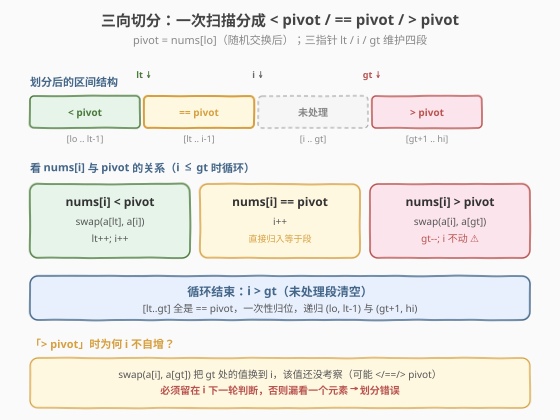
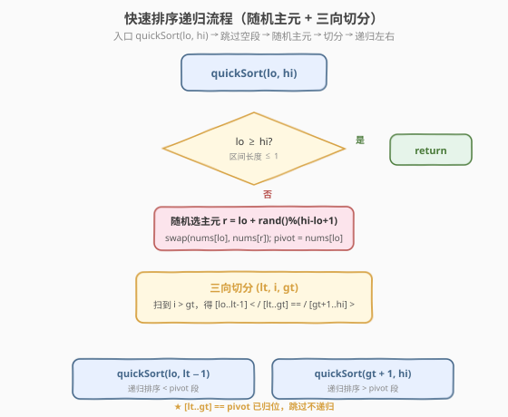
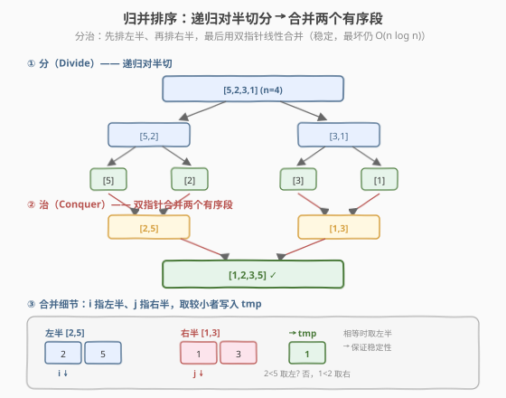

# 排序数组

- **题目名称**：排序数组
- **链接**：[912. 排序数组](https://leetcode.cn/problems/sort-an-array/)
- **难度**：中等
- **标签**：数组、分治、快速排序、归并排序

## 1. 题目概述

给你一个整数数组 `nums`，请你将该数组**升序**排列，并返回排序后的数组。

**示例 1**：

```text
输入：nums = [5,2,3,1]
输出：[1,2,3,5]
```

**示例 2**：

```text
输入：nums = [5,1,1,2,0,0]
输出：[0,0,1,1,2,5]
```

**约束条件**：

- `1 <= nums.length <= 5 * 10^4`
- `-5 * 10^4 <= nums[i] <= 5 * 10^4`

> 💡 这是「手撕排序」的招牌题。题目明确要求**不使用语言内置排序函数**，且数据规模 $n \le 5\times10^4$ 意味着 $O(n^2)$ 的冒泡 / 选择 / 插入排序会超时（$n^2 \approx 2.5\times10^9$），必须实现 $O(n \log n)$ 的排序。面试中**快速排序**和**归并排序**是必考的两大模板，本题同时考察「能否规避快排的最坏情况」——LeetCode 的测试数据包含大量重复元素与近有序数据，朴素快排（固定取首元素做主元）会退化到 $O(n^2)$ 甚至栈溢出，必须**随机化主元 + 三向切分**才能稳定通过。

---

## 2. 解题思路

### 2.1 暴力思路：朴素快速排序

最朴素的快排：每次取区间**第一个元素**作主元（pivot），用一次 `partition` 把数组分成「≤ pivot」和「> pivot」两段，再递归排序左右两段。

```text
quickSort(lo, hi):
    if lo >= hi: return
    pivot = nums[lo]
    p = partition(nums, lo, hi, pivot)   // 返回 pivot 最终位置
    quickSort(lo, p - 1)
    quickSort(p + 1, hi)
```

这套模板在「随机数据」下表现良好，期望 $O(n \log n)$。但它有两个致命缺陷，恰好都被 912 的测试数据命中：

> ⚠️ **缺陷 1：近有序数据退化**。当数组已接近升序（如 `[1,2,3,...,n]`）时，每次 `pivot` 都是最小值，`partition` 后左段为空、右段长度为 `n-1`，递归深度退化到 $n$，时间退化到 $O(n^2)$，且递归深度 $n=5\times10^4$ 直接**栈溢出**。
>
> ⚠️ **缺陷 2：大量重复元素退化**。当数组全为同一个值（如 `[0,0,...,0]`）时，二分划分会让一边始终为空、另一边长度只减 1，同样退化到 $O(n^2)$。示例 2 的 `[5,1,1,2,0,0]` 已含 3 个重复元素，更极端的用例重复率更高。

两个缺陷的根因相同：**划分不平衡**。解决办法也有两个对应方向：

1. **随机化主元**：从 `[lo, hi]` 中随机选一个下标与 `nums[lo]` 交换，再做划分。这样无论输入怎样分布，期望划分都接近平衡，期望 $O(n \log n)$。解决缺陷 1。
2. **三向切分（Dijkstra 荷兰国旗）**：把区间划成「< pivot」「== pivot」「> pivot」三段，等于 pivot 的部分一次性归位、不再参与递归。解决缺陷 2（大量重复）。

两者结合即可让快排在 912 的所有用例下稳定 $O(n \log n)$ 通过。下面以此作为主解法。

### 2.2 核心观察：随机主元 + 三向切分快速排序

**关键点 1：随机化主元**——在 `[lo, hi]` 中均匀随机选一个下标 `r`，把 `nums[r]` 与 `nums[lo]` 交换，再以 `nums[lo]` 为 pivot 做划分。这一步把「输入分布」与「算法行为」解耦：无论数据近有序还是全重复，期望的递归深度都是 $O(\log n)$。

**关键点 2：三向切分**——用三个指针 `lt / i / gt` 一次扫描把区间维护成三段：



```text
维护不变式（pivot = nums[lo]，已在随机交换后固定）：
    [lo .. lt-1]   < pivot      （严格小于）
    [lt .. i-1]    == pivot     （等于）
    [i .. gt]      未处理       （待扫描）
    [gt+1 .. hi]   > pivot      （严格大于）
```

扫描规则（看 `nums[i]` 与 `pivot` 的关系）：

| `nums[i]` vs `pivot` | 动作 | 效果 |
|----------------------|------|------|
| `< pivot` | `swap(nums[lt], nums[i])`；`lt++`；`i++` | 小值换到左段，等于段整体右移一格 |
| `== pivot` | `i++` | 直接归入等于段 |
| `> pivot` | `swap(nums[i], nums[gt])`；`gt--` | 大值换到右段；`i` 不动，因为换来的新值还没看 |

循环到 `i > gt` 时，未处理段清空，最终 `[lt..gt]` 全是等于 pivot 的元素。然后只递归 `(lo, lt-1)` 与 `(gt+1, hi)`——**等于 pivot 的整段一次性跳过**，这正是处理大量重复的关键。

> 💡 **为什么 `> pivot` 时 `i` 不自增？** 因为 `swap(nums[i], nums[gt])` 把 `gt` 位置的值换到了 `i`，而这个换来的值**还没被考察过**——它可能小于、等于或大于 pivot，必须留在 `i` 等下一轮再判断。若贸然 `i++` 就会漏看一个元素，导致划分错误。这是三向切分最容易写错的地方，面试时务必讲清。

### 2.3 算法流程图



**完整步骤**：

1. **入口** `quickSort(lo, hi)`：若 `lo >= hi`（区间长度 ≤ 1）直接返回。
2. **随机选主元**：`r = lo + rand() % (hi - lo + 1)`，`swap(nums[lo], nums[r])`，令 `pivot = nums[lo]`。
3. **三向切分**：初始化 `lt = lo, i = lo, gt = hi`，按上表规则扫描直到 `i > gt`。
4. **递归**：`quickSort(lo, lt - 1)` 与 `quickSort(gt + 1, hi)`，跳过已归位的 `[lt..gt]`。
5. 全过程结束后 `nums` 即为升序。

> ⚠️ **随机数种子**：C++ 在 `Solution` 外或构造函数里 `srand(time(nullptr))` 可能因评测机时间固定而失效，更稳妥的做法是**直接用 `rand()`**（评测机每次进程内 `rand` 序列从固定种子开始，对随机化主元已足够打破最坏情况），或用 `mt19937` 配 `random_device`。Python 用 `random.randint` 即可，无需手动播种。

### 2.4 示例演算

以 `nums = [5,1,1,2,0,0]` 演示**第一次** `quickSort(0, 5)` 的三向切分过程。假设随机选到下标 `3`（值为 `2`）作主元，先与 `nums[0]` 交换得到 `[2,1,1,5,0,0]`，`pivot = 2`：


| 步骤 | `i` 指向 | `nums[i]` vs 2 | 动作 | 数组状态 | 指针 |
|------|---------|----------------|------|----------|------|
| 初值 | — | — | `lt=i=0, gt=5` | `[2,1,1,5,0,0]` | lt0 i0 gt5 |
| 1 | 0 | `2 == 2` | `i++` | `[2,1,1,5,0,0]` | lt0 i1 gt5 |
| 2 | 1 | `1 < 2` | swap(a[0],a[1]); lt++; i++ | `[1,2,1,5,0,0]` | lt1 i2 gt5 |
| 3 | 2 | `1 < 2` | swap(a[1],a[2]); lt++; i++ | `[1,1,2,5,0,0]` | lt2 i3 gt5 |
| 4 | 3 | `5 > 2` | swap(a[3],a[5]); gt-- | `[1,1,2,0,0,5]` | lt2 i3 gt4 |
| 5 | 3 | `0 < 2` | swap(a[2],a[3]); lt++; i++ | `[1,1,0,2,0,5]` | lt3 i4 gt4 |
| 6 | 4 | `0 < 2` | swap(a[3],a[4]); lt++; i++ | `[1,1,0,0,2,5]` | lt4 i5 gt4 |
| 7 | — | `i > gt` | 结束 | `[1,1,0,0,2,5]` | — |

最终 `[lt..gt] = [4..4]` 即下标 4 的 `2` 已归位；左段 `[0..3] = [1,1,0,0]`、右段 `[5..5] = [5]` 分别递归。注意 `5` 一次性被换到末尾，后续左段递归时不再触碰它。如果用朴素二分快排，全相等的 `[0,0,0,0]` 段会退化；三向切分把所有等于 pivot 的元素一次性归位，重复越多反而越快。

---

## 3. 参考代码

### C++

```cpp
// 排序数组.cpp —— 随机主元 + 三向切分快速排序
// 编译: g++ -O2 -std=c++17 排序数组.cpp -o sortarray
#include <vector>
#include <cstdlib>
using namespace std;

class Solution {
  public:
    vector<int> sortArray(vector<int>& nums) {
        quickSort(nums, 0, (int)nums.size() - 1);
        return nums;
    }

  private:
    void quickSort(vector<int>& nums, int lo, int hi) {
        if (lo >= hi) return;
        // 随机选主元，交换到 lo
        int r = lo + rand() % (hi - lo + 1);
        swap(nums[lo], nums[r]);
        int pivot = nums[lo];

        // 三向切分：[lo..lt-1] < pivot, [lt..gt] == pivot, [gt+1..hi] > pivot
        int lt = lo, i = lo, gt = hi;
        while (i <= gt) {
            if (nums[i] < pivot) {
                swap(nums[lt], nums[i]);
                lt++;
                i++;
            } else if (nums[i] > pivot) {
                swap(nums[i], nums[gt]);
                gt--;          // i 不动：换来的值还没看
            } else {
                i++;
            }
        }
        quickSort(nums, lo, lt - 1);
        quickSort(nums, gt + 1, hi);
    }
};
```

### Python

```python
import random

class Solution:
    def sortArray(self, nums: List[int]) -> List[int]:
        self._nums = nums
        self._quick(0, len(nums) - 1)
        return nums

    def _quick(self, lo: int, hi: int) -> None:
        if lo >= hi:
            return
        nums = self._nums
        r = random.randint(lo, hi)          # 随机主元
        nums[lo], nums[r] = nums[r], nums[lo]
        pivot = nums[lo]

        lt, i, gt = lo, lo, hi
        while i <= gt:
            if nums[i] < pivot:
                nums[lt], nums[i] = nums[i], nums[lt]
                lt += 1
                i += 1
            elif nums[i] > pivot:
                nums[i], nums[gt] = nums[gt], nums[i]
                gt -= 1                    # i 不动
            else:
                i += 1
        self._quick(lo, lt - 1)
        self._quick(gt + 1, hi)
```

> 💡 **Python 栈深**：随机主元下期望递归深度 $O(\log n) \approx 16$，远低于默认限制 1000，无需 `setrecursionlimit`。若担心极端用例，可把外层改成「循环 + 显式栈」模拟，或直接换用下文归并排序（迭代版天然无栈深问题）。

---

## 4. 复杂度分析

| 维度 | 复杂度 | 说明 |
|------|--------|------|
| **时间复杂度（期望）** | $O(n \log n)$ | 随机主元使每次划分期望平衡，递归树期望深度 $O(\log n)$，每层合计 $O(n)$ |
| **时间复杂度（最坏）** | $O(n^2)$ | 理论最坏仍为 $O(n^2)$，但随机化后出现概率极低；三向切分使大量重复数据反而更快（等于段直接跳过） |
| **空间复杂度** | $O(\log n)$ | 递归调用栈的期望深度；最坏 $O(n)$ 但随机化后期望 $O(\log n)$。原地排序，无需额外数组 |

> ⚠️ 快排是**不稳定**排序：相等元素的相对顺序可能因 `swap` 而改变。若题目或面试官要求稳定排序（如「按年龄排序，同年龄保持原序」），必须用归并排序（见下节）。

---

## 5. 扩展：归并排序（稳定且保证 $O(n \log n)$）

快排虽期望 $O(n \log n)$，但最坏仍 $O(n^2)$。若要**严格保证** $O(n \log n)$ 且**稳定**，归并排序是首选——它不受输入分布影响，最坏、平均、最好都是 $O(n \log n)$，且相等元素不会改变相对顺序。面试中常作为「快排的最坏情况如何规避？」的标准答案。



**思路**：分治——把数组从中间切成左右两半，递归排序两半，再用双指针把两个有序段合并成一个有序段。合并是「两个有序数组的归并」操作，线性 $O(n)$。

### 归并排序 C++ 代码

```cpp
class Solution {
    vector<int> tmp;   // 辅助数组，合并时用
  public:
    vector<int> sortArray(vector<int>& nums) {
        tmp.resize(nums.size());
        mergeSort(nums, 0, (int)nums.size() - 1);
        return nums;
    }

  private:
    void mergeSort(vector<int>& nums, int lo, int hi) {
        if (lo >= hi) return;
        int mid = lo + (hi - lo) / 2;
        mergeSort(nums, lo, mid);
        mergeSort(nums, mid + 1, hi);
        merge(nums, lo, mid, hi);
    }

    void merge(vector<int>& nums, int lo, int mid, int hi) {
        int i = lo, j = mid + 1, k = lo;
        while (i <= mid && j <= hi) {
            // 取较小者；相等时取左半的，保证稳定性
            if (nums[i] <= nums[j]) tmp[k++] = nums[i++];
            else                     tmp[k++] = nums[j++];
        }
        while (i <= mid)  tmp[k++] = nums[i++];
        while (j <= hi)   tmp[k++] = nums[j++];
        for (int p = lo; p <= hi; p++) nums[p] = tmp[p];
    }
};
```

### 三种排序对比

| 维度 | 快速排序（随机+三向） | 归并排序 | 堆排序 |
|------|----------------------|----------|--------|
| 平均时间 | $O(n \log n)$ | $O(n \log n)$ | $O(n \log n)$ |
| 最坏时间 | $O(n^2)$（概率极低） | $O(n \log n)$ | $O(n \log n)$ |
| 空间 | $O(\log n)$ 栈 / 原地 | $O(n)$ 辅助数组 | $O(1)$ 原地 |
| 稳定性 | 不稳定 | **稳定** | 不稳定 |
| 实际速度 | 最快（缓存友好） | 中等 | 最慢（跳跃访问） |
| 适用场景 | 通用排序、面试默认 | 需稳定 / 需保证最坏 | 空间受限、Top-K |

> 💡 **堆排序**（`std::make_heap` + `pop_heap` 手写版）也是 $O(n \log n)$ 且原地，但常数大、缓存不友好，实际比快排慢 2-3 倍，912 中可用但非首选。它的核心价值在「**Top-K 问题**」（如 [215. 数组中的第K个最大元素](https://leetcode.cn/problems/kth-largest-element-in-an-array/)），只需维护大小为 K 的堆而非全排序。

---

## 6. 面试要点

1. **快排为什么选随机主元？不选会怎样？**
   - 固定取首元素作主元时，对近有序数组每次划分都极不平衡（左空右长），退化到 $O(n^2)$ 且递归深度 $n$ 导致栈溢出。
   - 随机化后，无论输入分布如何，期望划分比例接近 $1:1$，期望时间 $O(n \log n)$、期望栈深 $O(\log n)$。这是「打破输入与算法行为耦合」的通用技巧。

2. **三向切分解决了什么？和二分快排的区别？**
   - 二分快排（Lomuto/Hoare）把数组划成「≤ pivot」和「> pivot」两段，遇到大量重复元素时等于 pivot 的元素会堆积在某一段，导致退化。
   - 三向切分把「== pivot」单独成段并一次性归位，重复元素越多归位越快，全重复数组一次切分即完成。代价是常数略大（三个指针），但对抗重复数据更鲁棒，是 912 能 AC 的关键。

3. **`> pivot` 时为什么 `i` 不自增？**
   - `swap(nums[i], nums[gt])` 把 `gt` 位置的值换到了 `i`，而该值尚未考察（可能 <、==、> pivot），必须留在 `i` 下一轮判断。若 `i++` 会漏看，导致划分错误。这是三向切分最易踩的坑。

4. **快排和归并各自的适用场景？**
   - 快排：原地、缓存友好、常数小，是通用排序的默认选择；但不稳定、最坏 $O(n^2)$。
   - 归并：稳定、最坏仍 $O(n \log n)$，适合需要稳定排序（如多关键字排序）或链表排序（[148. 排序链表](https://leetcode.cn/problems/sort-list/)）；但需 $O(n)$ 额外空间。
   - 一句话：**追速度用快排，追稳定 / 最坏保证用归并，追空间用堆排**。

5. **能否把快排改成迭代（非递归）？**
   - 可以：用一个显式栈保存待排序的 `(lo, hi)` 区间，循环弹出处理并压入新的子区间。能规避栈溢出，但代码更繁琐。912 在随机主元下递归深度 $O(\log n)$，通常无需迭代；若面试官追问栈溢出，迭代版是加分项。

> 💡 **一句话总结**：912 是排序算法的「全家桶」检验场——掌握**随机主元 + 三向切分快排**（主解）应对重复与近有序，再用**归并排序**兜底稳定性与最坏保证，就覆盖了面试手撕排序的全部考点。核心心法是「**让划分保持平衡**」：随机化打破输入依赖，三向切分吸收重复，两者合力把快排从「最坏 $O(n^2)$」拉到「期望 $O(n \log n)$ 且实测稳定」。

---

## 7. 同类练习题
- [215. 数组中的第K个最大元素](https://leetcode.cn/problems/kth-largest-element-in-an-array/)（[题解](../0201-0300/215_数组中的第K个最大元素.md)）：快排 partition 的 Top-K 应用，掌握快速选择
- [148. 排序链表](https://leetcode.cn/problems/sort-list/)（[题解](../0101-0200/148_排序链表.md)）：归并排序在链表上的天然实现，$O(1)$ 空间
- [75. 颜色分类](https://leetcode.cn/problems/sort-colors/)（[题解](../0001-0100/75_颜色分类.md)）：三向切分的特例（荷兰国旗），只排 0/1/2 三种值
- [88. 合并两个有序数组](https://leetcode.cn/problems/merge-sorted-array/)（[题解](../0001-0100/88_合并两个有序数组.md)）：归并排序中 `merge` 步骤的独立考察，原地后向填充
