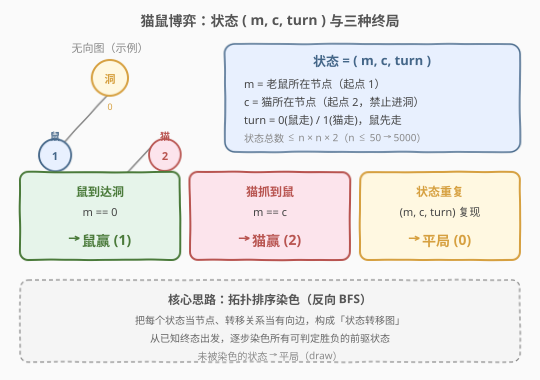
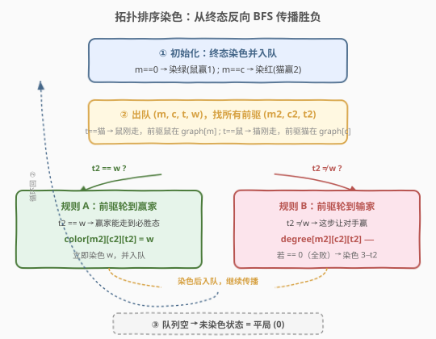
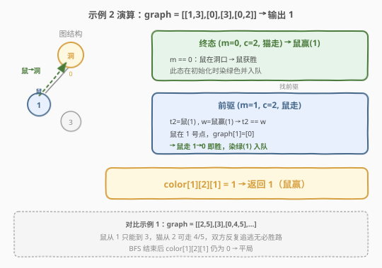

# 猫和老鼠

- **题目名称**：猫和老鼠
- **链接**：[913. 猫和老鼠](https://leetcode.cn/problems/cat-and-mouse/)
- **难度**：困难
- **标签**：图、博弈论、广度优先搜索、拓扑排序、动态规划

## 1. 题目概述

猫和老鼠在一张**无向图**上博弈，轮流行动。`graph[a]` 给出节点 `a` 的所有邻居。老鼠从节点 `1` 出发且**先手**，猫从节点 `2` 出发且**后手**，节点 `0` 是洞。每回合玩家**必须**沿一条边移动；猫**不能进入洞**（节点 `0`）。游戏在三种情形下结束：

- 猫鼠同格 → 猫赢（返回 `2`）
- 鼠到洞 → 鼠赢（返回 `1`）
- 同一状态重复 → 平局（返回 `0`）

假设双方都采取**最优策略**，返回游戏结果。

**示例 1**：

```text
输入：graph = [[2,5],[3],[0,4,5],[1,4,5],[2,3],[0,2,3]]
输出：0
```

**示例 2**：

```text
输入：graph = [[1,3],[0],[3],[0,2]]
输出：1
解释：鼠在 1 号点，graph[1] = [0]，鼠直接走入洞 → 鼠赢。
```

**约束条件**：

- `3 <= graph.length <= 50`
- `1 <= graph[i].length < graph.length`
- `graph[i]` 互不相同，`graph[i][j] != i`
- 猫和老鼠在游戏中总是可以移动

> ⚠️ 本题是经典的**博弈 + 状态空间搜索**问题。朴素 Minimax DFS 会因「平局判定」困难而超时，主流最优解是**拓扑排序染色**——从已知终态出发反向 BFS，逐步推导每个状态的胜负。

---

## 2. 解题思路

### 2.1 暴力思路：Minimax 递归

最直觉的做法是 DFS：从初始状态 `(鼠=1, 猫=2, 鼠走)` 出发，鼠方尝试最大化自己的收益（赢 > 平 > 输），猫方反之。每个状态枚举当前玩家的所有走法，递归求解子状态。

问题在于**平局的判定**：游戏可能无限循环，何时判定平局？朴素地设一个步数上限（如 `2n`）并不严谨——超过 `2n` 步未必真的出现了状态重复。严格做法需要记录整条搜索路径上的状态集合来检测环，这让记忆化变得困难（状态依赖于路径而非仅当前 `(m, c, turn)`）。状态总数 $O(n^2)$，朴素递归 $O(n^n)$ 必超时。

### 2.2 核心观察：拓扑排序染色（反向 BFS）



关键转换视角：**不要从初始状态「正向搜索」，而是从已知终态「反向推导」**。将每个状态 `(m, c, turn)` 看作状态转移图中的一个节点，终态的胜负已知，通过**反向 BFS（拓扑排序）**逐步染色所有前驱状态。

**状态定义**：

> `color[m][c][t]`：0 = 未定（平局），1 = 鼠赢，2 = 猫赢。其中 `t = 1` 表示鼠的回合，`t = 2` 表示猫的回合。

**终态**（胜负已知，直接染色入队）：

| 条件 | 色值 | 含义 |
|------|------|------|
| `m == 0` | 1（鼠赢） | 鼠到达洞 |
| `m == c` | 2（猫赢） | 猫鼠同格 |

**出度 `degree`**：每个状态当前玩家可走的步数（子状态数）。鼠的出度 = `len(graph[m])`；猫的出度 = `len(graph[c])` 去掉洞（猫不能进洞）。

**前驱关系**：状态 `(m, c, t)` 的前驱是「能一步转移到它」的状态：

- 若 `t == 2`（当前猫回合，说明上一手鼠走）：前驱 `(m2, c, 1)`，其中 `m2 ∈ graph[m]`（鼠从 `m2` 走到 `m`）。
- 若 `t == 1`（当前鼠回合，说明上一手猫走）：前驱 `(m, c2, 2)`，其中 `c2 ∈ graph[c]` 且 `c2 ≠ 0`（猫从 `c2` 走到 `c`，猫不可能在洞）。

**两条染色规则**：出队一个已染色状态 `(m, c, t, w)` 后，对每个未染色的前驱 `(m2, c2, t2)`：

> 💡 核心口诀：**轮到赢家 → 必胜（规则 A）；轮到输家 → 看是否全败（规则 B）**。

- **规则 A**（`t2 == w`，前驱轮到赢家走）：赢家只要找到一条走向必胜态的路即可 → 前驱必胜，染色 `w`，入队。
- **规则 B**（`t2 ≠ w`，前驱轮到输家走）：这步让对手赢，前驱出度 `−1`。若出度降到 `0`，说明**所有走法都让对手赢** → 前驱必败，染色 `3 − t2`（对手赢），入队。

> ⚠️ **为什么 degree == 0 才染色？** 当 `t2 ≠ w` 时，这一步对当前玩家不利，但也许还有别的走法能赢或平局。只有当**所有**走法都已被判定为对手赢（出度耗尽），才能确定当前玩家必败。未被染色的子状态（平局）不会消耗出度，所以出度永远降不到 0，前驱保持未染色 → 平局。这正是算法正确处理平局的关键。

### 2.3 算法流程图



整体流程：终态入队 → 反复出队 → 对每个前驱尝试规则 A / 规则 B 染色 → 新染色的状态入队 → 队列空时结束。最终 `color[1][2][1]` 即为答案，未染色则默认 `0`（平局）。

### 2.4 示例演算

以示例 2 `graph = [[1,3],[0],[3],[0,2]]` 为例：



| 步骤 | 出队状态 | 前驱 | 判定 | 操作 |
|------|---------|------|------|------|
| 初始化 | — | — | `m==0` 或 `m==c` 的终态全部染色入队 | 队列含 `(0,2,2,1)` 等 |
| 1 | `(0, 2, 2, 鼠赢1)` | `t=2` → 鼠刚走，前驱 `(m2, 2, 1)`，`m2 ∈ graph[0] = {1, 3}` | `(1, 2, 1)`：`t2=1=鼠`，`w=1=鼠赢` → `t2==w` → **规则 A** | 染色 `color[1][2][1] = 1`，入队 |
| — | — | — | `(3, 2, 1)` 同理 → 鼠在 3 可走 0 → 染色 1 | — |

`color[1][2][1] = 1` → 返回 **1**（鼠赢）。鼠在 1 号点唯一的邻居就是洞，一步即胜。

---

## 3. 参考代码

### C++

```cpp
class Solution {
  public:
    int catMouseGame(vector<vector<int>>& graph) {
        int n = graph.size();
        // color[m][c][t]: 0=未定(平局), 1=鼠赢, 2=猫赢; t=1 鼠回合, t=2 猫回合
        vector<vector<vector<int>>> color(n, vector<vector<int>>(n, vector<int>(3, 0)));
        vector<vector<vector<int>>> degree(n, vector<vector<int>>(n, vector<int>(3, 0)));

        for (int m = 0; m < n; m++) {
            for (int c = 0; c < n; c++) {
                degree[m][c][1] = graph[m].size();
                degree[m][c][2] = graph[c].size();
                for (int v : graph[c])
                    if (v == 0) { degree[m][c][2]--; break; }
            }
        }

        queue<array<int, 4>> q;
        for (int i = 0; i < n; i++) {
            for (int t = 1; t <= 2; t++) {
                color[0][i][t] = 1;  q.push({0, i, t, 1});
                color[i][i][t] = 2;  q.push({i, i, t, 2});
            }
        }

        while (!q.empty()) {
            int m = q.front()[0], c = q.front()[1], t = q.front()[2], w = q.front()[3];
            q.pop();
            if (t == 2) {                       // 猫回合 → 鼠刚走，前驱鼠在 graph[m]
                for (int m2 : graph[m]) {
                    if (color[m2][c][1] == 0) {
                        if (w == 1) {           // 规则 A: 前驱轮到鼠，鼠能走到必胜
                            color[m2][c][1] = 1;  q.push({m2, c, 1, 1});
                        } else if (--degree[m2][c][1] == 0) {  // 规则 B
                            color[m2][c][1] = 2;  q.push({m2, c, 1, 2});
                        }
                    }
                }
            } else {                            // 鼠回合 → 猫刚走，前驱猫在 graph[c]
                for (int c2 : graph[c]) {
                    if (c2 == 0) continue;
                    if (color[m][c2][2] == 0) {
                        if (w == 2) {           // 规则 A: 前驱轮到猫，猫能走到必胜
                            color[m][c2][2] = 2;  q.push({m, c2, 2, 2});
                        } else if (--degree[m][c2][2] == 0) {  // 规则 B
                            color[m][c2][2] = 1;  q.push({m, c2, 2, 1});
                        }
                    }
                }
            }
        }
        return color[1][2][1];
    }
};
```

### Python

```python
class Solution:
    def catMouseGame(self, graph: List[List[int]]) -> int:
        n = len(graph)
        DRAW, MOUSE, CAT = 0, 1, 2
        # color[m][c][t]: 0=未定, 1=鼠赢, 2=猫赢; t=1 鼠回合, t=2 猫回合
        color = [[[0] * 3 for _ in range(n)] for _ in range(n)]
        degree = [[[0] * 3 for _ in range(n)] for _ in range(n)]

        for m in range(n):
            for c in range(n):
                degree[m][c][1] = len(graph[m])
                degree[m][c][2] = len(graph[c]) - (1 if 0 in graph[c] else 0)

        from collections import deque
        q = deque()
        for i in range(n):
            for t in (1, 2):
                color[0][i][t] = MOUSE              # 鼠在洞 → 鼠赢
                q.append((0, i, t, MOUSE))
                color[i][i][t] = CAT                # 鼠猫同格 → 猫赢
                q.append((i, i, t, CAT))

        def parents(m, c, t):
            if t == 2:                               # 猫回合 → 上一手鼠走
                for m2 in graph[m]:
                    yield m2, c, 1
            else:                                    # 鼠回合 → 上一手猫走
                for c2 in graph[c]:
                    if c2 != 0:
                        yield m, c2, 2

        while q:
            m, c, t, w = q.popleft()
            for m2, c2, t2 in parents(m, c, t):
                if color[m2][c2][t2] == DRAW:
                    if t2 == w:                      # 规则 A: 轮到赢家 → 必胜
                        color[m2][c2][t2] = w
                        q.append((m2, c2, t2, w))
                    else:                            # 规则 B: 轮到输家 → 出度减一
                        degree[m2][c2][t2] -= 1
                        if degree[m2][c2][t2] == 0:  # 全败 → 必败
                            color[m2][c2][t2] = 3 - t2
                            q.append((m2, c2, t2, 3 - t2))

        return color[1][2][1]
```

> 💡 **代码要点**：
> - 终态初始化时 `color[0][0][t]` 会被先设 `1`（鼠赢）再覆盖为 `2`（猫赢），但 `(0,0)` 是不可达状态（猫不能进洞），不影响结果。
> - `3 - t2` 巧妙表达「对手赢」：`t2=1`(鼠) → `2`(猫赢)；`t2=2`(猫) → `1`(鼠赢)。

---

## 4. 复杂度分析

| 维度 | 复杂度 | 说明 |
|------|--------|------|
| 时间复杂度 | $O(n^3)$ | 状态数 $O(n^2)$（`m × c × 2`），每个状态出队一次，枚举前驱 $O(n)$，总计 $O(n^3)$ |
| 空间复杂度 | $O(n^2)$ | `color` 与 `degree` 各为 $n \times n \times 3$ 的三维数组；队列最多存 $O(n^2)$ 个状态 |

> 💡 `n ≤ 50` 时 $n^3 = 125000$，远在时限内。对比朴素 Minimax DFS 的 $O(n^n)$ 指数爆炸，拓扑排序将博弈问题降为多项式复杂度。

---

## 5. 扩展：Minimax DFS + 记忆化

若不使用拓扑排序，也可用 Minimax DFS，但需要处理平局的循环判定。常见做法是用 `turn`（步数）同时充当回合指示（偶数=鼠走，奇数=猫走），设步数上限检测平局：

```python
from functools import lru_cache

class Solution:
    def catMouseGame(self, graph: List[List[int]]) -> int:
        n = len(graph)

        @lru_cache(maxsize=None)
        def dfs(m, c, step):
            if step >= 2 * n:          # 步数上限 → 近似平局
                return 0
            if step % 2 == 0:          # 鼠的回合
                if m == 0:
                    return 1
                if m == c:
                    return 2
                res = 2                # 默认最差（猫赢）
                for nxt in graph[m]:
                    r = dfs(nxt, c, step + 1)
                    if r == 1:
                        return 1       # 鼠找到必胜走法
                    if r == 0:
                        res = 0        # 至少能平局
                return res
            else:                      # 猫的回合
                if m == c:
                    return 2
                res = 1                # 默认最差（鼠赢）
                for nxt in graph[c]:
                    if nxt == 0:
                        continue       # 猫不能进洞
                    r = dfs(m, nxt, step + 1)
                    if r == 2:
                        return 2       # 猫找到必胜走法
                    if r == 0:
                        res = 0
                return res

        return dfs(1, 2, 0)
```

> ⚠️ 此方案的 `2 * n` 步数上限并非严格正确——理论上状态空间有 $2n^2$ 个状态，超过此数才能保证状态重复。`2n` 只是一个经验近似，能通过 LeetCode 测试用例但缺乏理论保证。记忆化键为 `(m, c, step)`，最坏 $O(n^3)$ 空间。**面试时优先讲拓扑排序解法**，DFS 作为补充讨论。

---

## 6. 面试要点

1. **为什么不能直接 Minimax + `lru_cache(m, c, turn)`？**
   - 平局依赖于「状态是否在路径中重复出现」，而 `(m, c, turn)` 的记忆化无法区分不同路径深度。同一状态在不同步数下可能有不同的胜负结论（剩余预算不同），导致缓存值不正确。

2. **拓扑排序染色的两条规则分别什么含义？**
   - 规则 A（`t2 == w`）：前驱轮到赢家走，赢家只需一条走向必胜态的路即可，立即染色。规则 B（`t2 ≠ w`）：前驱轮到输家走，这一步让对手赢；只有当**所有**走法都让对手赢（出度耗尽 `degree == 0`）才判定必败。

3. **为什么 degree == 0 才染色，而不是立刻？**
   - `t2 ≠ w` 只说明「这一步」不利，但当前玩家也许还有别的走法能赢或平。出度记录了「尚未判定的走法数」，降到 0 才表示所有走法都是对手赢。未被染色的子状态（平局）不消耗出度，保证平局状态不会被错误判定为必败。

4. **前驱关系怎么推导？**
   - 当前状态 `(m, c, t)`：若 `t` 是猫回合，说明鼠刚从某 `m2` 走到 `m`，前驱是 `(m2, c, 鼠回合)`；若 `t` 是鼠回合，说明猫刚从某 `c2` 走到 `c`，前驱是 `(m, c2, 猫回合)`（`c2 ≠ 0`）。

5. **未被染色的状态为什么就是平局？**
   - BFS 结束后仍未被染色的状态，说明既无法被判定为必胜（规则 A 未触发），也无法被判定为必败（出度未归零，存在未染色的子状态）。这意味着双方都无法强制获胜，最优结果是平局。

---

## 7. 同类练习题

- [1728. 猫和老鼠 II](https://leetcode.cn/problems/cat-and-mouse-ii/)：本题升级版，引入墙壁、障碍和食物，状态空间更大，但 Minimax + 记忆化思路相通
- [802. 找到最终的安全状态](https://leetcode.cn/problems/find-eventual-safe-states/)（[题解](../0801-0900/802_找到最终的安全状态.md)）：同样从「终态」（安全节点）反向拓扑排序，染色传播的核心范式一致
- [877. 石子游戏](https://leetcode.cn/problems/stone-game/)（[题解](../0801-0900/877_石子游戏.md)）：博弈型区间 DP，Minimax 的另一经典形态，对比「正向递推」与本题「反向 BFS」的思路差异
- [486. 预测赢家](https://leetcode.cn/problems/predict-the-winner/)：零和博弈 Minimax，允许平局时判定改为 `>= 0`，体会博弈 DP 的状态定义
- [207. 课程表](https://leetcode.cn/problems/course-schedule/)：拓扑排序判环模板，本题的状态转移图染色是其「反向」变体
