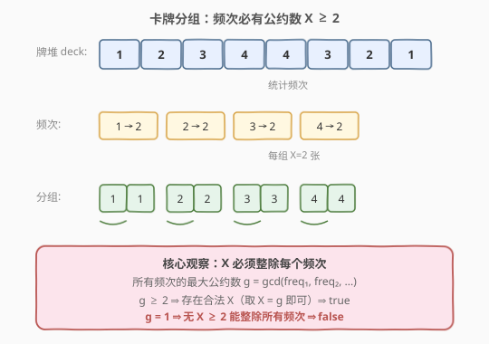
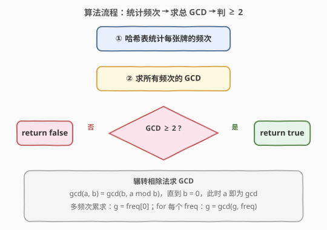
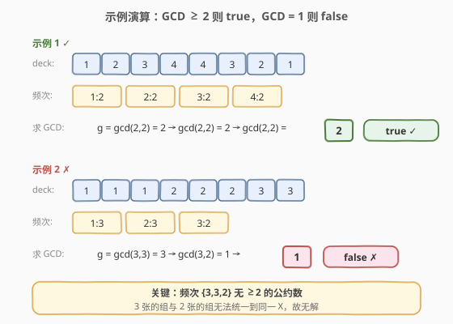

# LeetCode 卡牌分组 题解

## 1. 题目概述

- **标题 / 题号**：卡牌分组（#914，easy）
- **链接**：https://leetcode.cn/problems/x-of-a-kind-in-a-deck-of-cards/
- **难度**：简单
- **标签**：数组、哈希表、数学

**题意**：给定一副牌，每张牌上都写着一个整数。需要选定一个数字 `X`，使整副牌可以分成 1 组或更多组，满足：

- 每组都有 `X` 张牌；
- 组内所有的牌上都写着相同的整数。

仅当你可选的 `X >= 2` 时返回 `true`。

**示例 1**：

```text
输入：deck = [1,2,3,4,4,3,2,1]
输出：true
解释：可行的分组是 [1,1]，[2,2]，[3,3]，[4,4]
```

**示例 2**：

```text
输入：deck = [1,1,1,2,2,2,3,3]
输出：false
解释：没有满足要求的分组。
```

**约束**：

- $1 \le \text{deck.length} \le 10^4$
- $0 \le \text{deck[i]} < 10^4$

> 💡 **题意转化**：同一组内牌面值相同，意味着「牌面值相同的一堆牌」必须被**完整均分**成若干等大的组。设某牌面值出现 $c$ 次，则 $X$ 必须整除 $c$。要让**所有**牌面值都能被同一 $X$ 整除，等价于 $X$ 是所有频次的**公约数**。问题归结为：所有频次是否存在一个 $\ge 2$ 的公约数。

## 2. 解题思路

### 2.1 暴力思路

枚举所有可能的 $X \in [2, n]$，对每个 $X$ 检查「每个牌面值的频次是否都能被 $X$ 整除」。频次统计 $O(n)$，枚举 $X$ 最多 $O(n)$ 个、每次检查所有不同牌面值（最多 $n$ 个），总复杂度 $O(n^2)$，能通过但明显浪费——我们没有利用「公约数」的结构。

### 2.2 核心观察：所有频次的最大公约数 ≥ 2



关键转化：

- **「同一 $X$ 整除所有频次」** ⟺ **$X$ 是所有频次的公约数**。
- 公约数中最大的那个就是**最大公约数 $g = \gcd(\text{freq}_1, \text{freq}_2, \dots)$**。
- 若 $g \ge 2$，则取 $X = g$ 即为合法解（甚至 $g$ 的任意 $\ge 2$ 因子也行）；
- 若 $g = 1$，则不存在任何 $\ge 2$ 的数能同时整除所有频次，无解。

> 💡 **为何只看 GCD 就够？** 公约数的集合 = GCD 的因子集合。GCD 是所有频次共同的「最大公因子」，它 $\ge 2$ 就保证至少有一个 $\ge 2$ 的公约数（它本身）；它 $= 1$ 则说明所有频次互质，没有任何 $\ge 2$ 的公约数。一查定乾坤。

### 2.3 算法流程图



1. **统计频次**：用哈希表遍历 `deck`，记录每个牌面值的出现次数。
2. **求总 GCD**：令 $g$ 初值为第一个频次，依次对所有频次做 $g = \gcd(g, \text{freq}_i)$。多个数的 GCD 满足结合律，逐步归约即可。
3. **判定**：$g \ge 2$ 返回 `true`，否则 `false`。

其中 $\gcd(a, b)$ 用**辗转相除法**：$\gcd(a, b) = \gcd(b, a \bmod b)$，直到 $b = 0$ 时 $a$ 即为结果。

### 2.4 示例演算



**示例 1**：`deck = [1,2,3,4,4,3,2,1]`

| 牌面值 | 1 | 2 | 3 | 4 |
|--------|---|---|---|---|
| 频次   | 2 | 2 | 2 | 2 |

$g = \gcd(2,2)=2 \to \gcd(2,2)=2 \to \gcd(2,2)=2$。$g = 2 \ge 2$，取 $X=2$，分 4 组各 2 张，返回 `true`。

**示例 2**：`deck = [1,1,1,2,2,2,3,3]`

| 牌面值 | 1 | 2 | 3 |
|--------|---|---|---|
| 频次   | 3 | 3 | 2 |

$g = \gcd(3,3)=3 \to \gcd(3,2)=1$。$g = 1$，3 张的组与 2 张的组无法统一到同一 $X \ge 2$，返回 `false`。

## 3. 参考代码

### C++

```cpp
class Solution {
  public:
    bool hasGroupsSizeX(vector<int>& deck) {
        unordered_map<int, int> cnt;
        for (int v : deck) cnt[v]++;

        int g = 0;
        for (auto& [k, v] : cnt) {
            g = gcd(g, v);
        }
        return g >= 2;
    }
};
```

### Python

```python
import math
from collections import Counter
from functools import reduce

class Solution:
    def hasGroupsSizeX(self, deck: List[int]) -> bool:
        cnt = Counter(deck)
        g = reduce(math.gcd, cnt.values())
        return g >= 2
```

> 💡 **两个实现细节**：
> 1. **初始 `g = 0` 的妙用**：$\gcd(0, v) = v$，所以把 `g` 初始化为 0，第一个频次自然把 `g` 拉到自身，无需单独取首元素。C++17 的 `std::gcd(0, v)` 即返回 `v`，行为一致。
> 2. **`reduce` 一行归约**：Python 用 `functools.reduce(math.gcd, cnt.values())` 对所有频次做滚动 GCD，等价于 `g = gcd(gcd(v1, v2), v3)...`，GCD 的结合律保证结果正确。

## 4. 复杂度分析

| 维度 | 复杂度 | 说明 |
|------|--------|------|
| 时间复杂度 | $O(n + k \log m)$ | 频次统计 $O(n)$；求 $k$ 个频次的 GCD，每次辗转相除 $O(\log m)$，$k$ 为不同牌面值数、$m$ 为最大频次 |
| 空间复杂度 | $O(k)$ | 哈希表存储 $k$ 个不同牌面值的频次 |

其中 $k \le n$，$m \le n$，故整体为 $O(n \log n)$ 最坏、实际远更小。

## 5. 扩展：GCD 的结合律与「公约数判定」范式

本题是**「判定一组数是否存在 $\ge 2$ 的公约数」**的经典应用。这一范式可推广到多种场景：

- **能否等分**：$n$ 个物品按值分组，每组等大 $\ge 2$ ⟺ 各值频次的 GCD $\ge 2$。
- **周期判定**：若干事件各以周期 $T_i$ 重复，是否存在 $\ge 2$ 的公共周期 ⟺ $\gcd(T_1, \dots, T_k) \ge 2$。
- **网格切分**：将 $a \times b$ 矩形切成尽可能大的正方形，边长即 $\gcd(a, b)$。

核心都是利用 GCD 的两条性质：

1. **结合律**：$\gcd(a, b, c) = \gcd(\gcd(a, b), c)$，可滚动归约。
2. **公约数 = GCD 的因子**：一组数的公约数集合恰为其 GCD 的因子集合，故只需求 GCD 一次。

> ⚠️ **注意边界**：若所有牌面值相同（只有一种牌面值），频次只有一个值 $c = n$。此时 $g = n$，当 $n \ge 2$ 即返回 `true`（分成一组或 $\frac{n}{g}$ 组）。代码无需特判，`gcd(0, n) = n` 自然处理。

## 6. 面试要点

1. **为什么问题能转化为求 GCD？**

   「同一 $X$ 整除所有频次」等价于「$X$ 是所有频次的公约数」。公约数存在 $\ge 2$ 者 ⟺ 最大公约数 $\ge 2$。因为公约数集合 = GCD 的因子集合，GCD $\ge 2$ 自身就是最大的合法 $X$。

2. **为什么初始 `g = 0` 是安全的？**

   $\gcd(0, v) = v$ 是数论约定（0 能被任何非零数整除）。所以 `gcd(0, v1) = v1`，第一个频次被原样采纳，后续滚动归约，无需特判首元素或空表。

3. **辗转相除法的时间复杂度是多少？**

   $\gcd(a, b)$ 每轮把 $(a, b)$ 变成 $(b, a \bmod b)$，数对规模按斐波那契速度下降，最坏 $O(\log \min(a, b))$。对 $k$ 个频次滚动求 GCD 总计 $O(k \log m)$，$m$ 为最大频次。

4. **如果只有一种牌面值（所有牌相同）会怎样？**

   频次表只有一个条目 $\{v: n\}$，$g = \gcd(0, n) = n$。$n \ge 2$ 时返回 `true`（全放一组或均分），$n = 1$ 时 $g = 1$ 返回 `false`（单张牌无法成组）。代码自然处理，无需特判。

5. **能否不用 GCD，直接枚举 $X$？**

   可以：枚举 $X \in [2, n]$，对每个 $X$ 检查所有频次能否被整除，$O(n^2)$ 最坏。但这是浪费——GCD 一次归约就能得到所有公约数的信息，$O(n \log n)$ 更优且更体现数论洞察。面试官出这道题正是想看你能否想到 GCD 转化。

## 同类练习题

| # | 题目 | 与本题的关联 |
|---|------|-------------|
| 1071 | [字符串的最大公因子](https://leetcode.cn/problems/greatest-common-divisor-of-strings/) | GCD 思想的字符串版，两串能否由同一子串重复构成 ⟺ 长度的 GCD 对应的子串 |
| 365 | [水壶问题](https://leetcode.cn/problems/water-and-jug-problem/) | 用裴蜀定理 $\gcd(a, b)$ 判定能否量出目标水量，GCD 在不定方程中的应用 |
| 912 | [排序数组](https://leetcode.cn/problems/sort-an-array/)（[站内题解](../0901-1000/912_排序数组.md)） | 同区间数组题，对照「统计 + 数论」与「分治排序」两类思路 |
| 204 | [计数质数](https://leetcode.cn/problems/count-primes/)（[站内题解](../0201-0300/204_计数质数.md)） | 数论筛法，与 GCD 同为数论基础工具题 |
