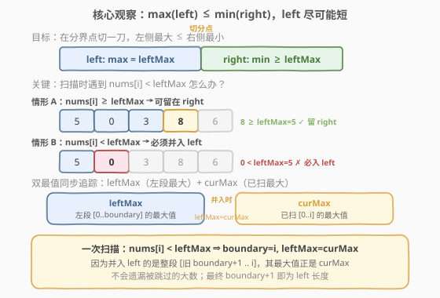
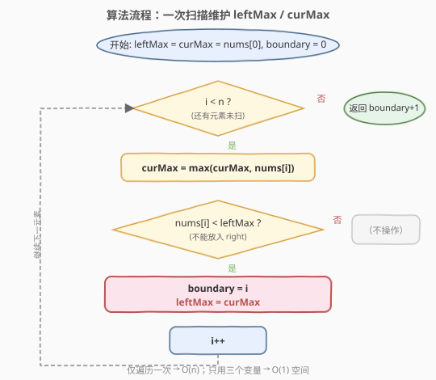

# LeetCode 分割数组 题解

## 1. 题目概述

- **标题 / 题号**：分割数组（#915，medium）
- **链接**：https://leetcode.cn/problems/partition-array-into-disjoint-intervals/
- **难度**：中等
- **标签**：数组、前缀最值、一次遍历

**题意**：给定一个数组 `nums`，将其划分为两个**连续**子数组 `left` 和 `right`，使得：

- `left` 中的每个元素都小于或等于 `right` 中的每个元素。
- `left` 和 `right` 都非空。
- `left` 的长度要尽可能小。

在完成这样的分组后返回 `left` 的**长度**。用例可以保证存在这样的划分方法。

**示例 1**：

```text
输入：nums = [5,0,3,8,6]
输出：3
解释：left = [5,0,3]，right = [8,6]
```

**示例 2**：

```text
输入：nums = [1,1,1,0,6,12]
输出：4
解释：left = [1,1,1,0]，right = [6,12]
```

**约束**：

- $2 \le \text{nums.length} \le 10^5$
- $0 \le \text{nums[i]} \le 10^6$
- 可以保证至少有一种方法能够按题目所描述的那样对 `nums` 进行划分。

> 💡 把条件「`left` 中每个元素 $\le$ `right` 中每个元素」翻译成最值语言：等价于 $\max(\text{left}) \le \min(\text{right})$。于是问题变成——找到**最小的分界下标** `boundary`，使 `nums[0..boundary]` 的最大值不超过 `nums[boundary+1..n-1]` 的最小值。

## 2. 解题思路

### 2.1 暴力思路

枚举每个候选分界点 `i`（从 $1$ 到 $n-1$），对每个 `i` 计算 $\max(\text{nums}[0..i-1])$ 与 $\min(\text{nums}[i..n-1])$，验证 $\max(\text{left}) \le \min(\text{right})$ 是否成立，取第一个满足的 `i` 作为 `left` 长度。每次计算两端最值各需 $O(n)$，共 $n-1$ 个候选点，总时间 $O(n^2)$，空间 $O(1)$。对于 $n = 10^5$ 必然超时。

**优化一步**：预处理**后缀最小值数组** `sufMin[i] = min(nums[i..n-1])`（从右往左一次扫完，$O(n)$），再从左到右维护前缀最大值 `preMax`，找到第一个满足 `preMax <= sufMin[i+1]` 的位置即可。时间 $O(n)$、空间 $O(n)$，能过但多用了 $O(n)$ 空间。

> 💡 能否做到 $O(1)$ 空间？关键在于——**不需要提前知道右段的最小值**，只要在扫描时判断当前元素是否「被迫」进入左段即可。这就是下面的最优解。

### 2.2 核心观察：双最值同步追踪（一次扫描）



设当前左段为 `nums[0..boundary]`，其最大值记为 `leftMax`。我们额外维护一个 `curMax`，表示**已经扫描过的所有元素** `nums[0..i]` 的最大值。从左到右扫描每个 `nums[i]`：

- **情形 A（`nums[i] >= leftMax`）**：当前元素不小于左段最大值，**可以安全留在 right**——即便它进入右段，右段的最小值也不会跌破 `leftMax`，条件 $\max(\text{left}) \le \min(\text{right})$ 仍可满足。此时只需更新 `curMax`，不动 `boundary`。

- **情形 B（`nums[i] < leftMax`）**：当前元素**严格小于左段最大值**。它**绝不能进入 right**——否则右段会出现一个比 `leftMax` 还小的元素，$\min(\text{right}) < \max(\text{left})$ 直接违反条件。因此它**必须并入 left**：把 `boundary` 推到 `i`，并且把 `leftMax` 升级为 `curMax`。

> ⚠️ **为什么 `leftMax` 要升级成 `curMax` 而不是保持原值？** 因为并入 left 的是**一整段** `nums[旧 boundary+1 .. i]`（left 必须连续），这段中可能藏着比原 `leftMax` 更大的数（它们此前以「情形 A」跳过、停留在右段候选区，现在被连锅端进 left）。这段的最大值正是 `curMax`（已扫全程最大值），所以新的 `leftMax = curMax` 才不会漏掉这些大数。

> 💡 **循环不变式**：每次迭代结束后，`leftMax` 始终等于 `nums[0..boundary]` 的真实最大值，`curMax` 始终等于 `nums[0..i]` 的真实最大值。任何「比 `leftMax` 小」的元素都已被收纳进 left，留在右段候选区的元素都 $\ge$ `leftMax`。扫描结束后，`boundary` 即为最优分界点，`left` 长度为 `boundary + 1`。

### 2.3 算法流程图



1. 初始化 `leftMax = curMax = nums[0]`，`boundary = 0`。
2. 从 `i = 1` 到 `n - 1` 遍历：
   - `curMax = max(curMax, nums[i])`（更新已扫最大值）。
   - 若 `nums[i] < leftMax`：`boundary = i`，`leftMax = curMax`。
   - 否则：不操作（该元素留在右段候选区）。
3. 返回 `boundary + 1`。

### 2.4 示例演算

![示例演算：nums = [5, 0, 3, 8, 6]](../images/partition_disjoint_walkthrough.svg)

以 `nums = [5, 0, 3, 8, 6]` 为例：

| 步骤 | 当前元素 | 判定 | 操作 | leftMax | curMax | boundary |
|------|----------|------|------|---------|--------|----------|
| 初始化 | nums[0]=5 | — | — | 5 | 5 | 0 |
| i=1 | 0 | 0 < 5 | 并入 left | 5 | 5 | 1 |
| i=2 | 3 | 3 < 5 | 并入 left | 5 | 5 | 2 |
| i=3 | 8 | 8 ≥ 5 | 留 right | 5 | 8 | 2 |
| i=4 | 6 | 6 ≥ 5 | 留 right | 5 | 8 | 2 |

- 扫描结束，`boundary = 2`，返回 `boundary + 1 = 3`。
- 验证：`left = [5, 0, 3]`，$\max = 5$；`right = [8, 6]`，$\min = 6$；$5 \le 6$ ✓。

> 💡 注意 `i=1` 和 `i=2` 时 `curMax` 始终是 5（0 和 3 都没超过 5），所以并入后 `leftMax` 仍是 5。直到 `i=3` 遇到 8，`curMax` 升到 8，但因 8 ≥ `leftMax` 不触发并入。最终 `leftMax` 锁在 5，正是左段真实最大值。

## 3. 参考代码

### C++

```cpp
class Solution {
  public:
    int partitionDisjoint(vector<int>& nums) {
        int leftMax = nums[0], curMax = nums[0], boundary = 0;
        for (int i = 1; i < (int)nums.size(); ++i) {
            curMax = max(curMax, nums[i]);
            if (nums[i] < leftMax) {
                boundary = i;
                leftMax = curMax;
            }
        }
        return boundary + 1;
    }
};
```

### Python

```python
class Solution:
    def partitionDisjoint(self, nums: List[int]) -> int:
        left_max = cur_max = nums[0]
        boundary = 0
        for i in range(1, len(nums)):
            cur_max = max(cur_max, nums[i])
            if nums[i] < left_max:
                boundary = i
                left_max = cur_max
        return boundary + 1
```

> ⚠️ **`curMax` 必须在判断前更新**：先 `curMax = max(curMax, nums[i])`，再判 `nums[i] < leftMax`。这样一旦触发并入，`leftMax = curMax` 就包含了当前元素 `nums[i]`，与「left 段为 `nums[0..i]`」的语义一致。若把更新放到判断之后，并入时 `leftMax` 会漏掉 `nums[i]`，导致后续误判。

> 💡 **初始值取 `nums[0]` 而非 `INT_MIN`**：因为 `nums[0]` 一定属于 left（left 非空且从下标 0 起算），用它初始化两个最值最自然，避免引入哨兵。`boundary` 初始为 0 表示 left 至少含第一个元素。

## 4. 复杂度分析

| 维度 | 复杂度 | 说明 |
|------|--------|------|
| 时间复杂度 | $O(n)$ | 只遍历数组一次，每次迭代做 $O(1)$ 的最值更新与比较 |
| 空间复杂度 | $O(1)$ | 仅使用 `leftMax`、`curMax`、`boundary` 三个变量，原地完成 |

## 5. 扩展：后缀最小值数组解法

如果不追求 $O(1)$ 空间，**前缀最大 + 后缀最小**的解法更直观、更易想到：

1. 从右到左预处理 `sufMin[i] = min(nums[i], sufMin[i+1])`，其中 `sufMin[n] = +∞`。
2. 从左到右维护 `preMax`，找到第一个下标 `i`（$0 \le i < n-1$）满足 `preMax <= sufMin[i+1]`，返回 `i + 1`。

```cpp
class Solution {
  public:
    int partitionDisjoint(vector<int>& nums) {
        int n = nums.size();
        vector<int> sufMin(n + 1, INT_MAX);
        for (int i = n - 1; i >= 0; --i)
            sufMin[i] = min(nums[i], sufMin[i + 1]);
        int preMax = INT_MIN;
        for (int i = 0; i < n; ++i) {
            preMax = max(preMax, nums[i]);
            if (preMax <= sufMin[i + 1]) return i + 1;
        }
        return n;
    }
};
```

时间 $O(n)$、空间 $O(n)$。两种解法本质同源：**双最值法**是「后缀最小」的**惰性在线版**——不预先算出每个位置的右段最小，而是在遇到「比 `leftMax` 小」的元素时才被动地把分界线右推，并用 `curMax` 折叠掉对后段信息的依赖。

## 6. 面试要点

1. **为什么 `nums[i] < leftMax` 时必须并入 left？**

   条件 $\max(\text{left}) \le \min(\text{right})$ 要求右段每个元素都 $\ge$ `leftMax`。若 `nums[i] < leftMax` 却留在右段，则 $\min(\text{right}) \le \text{nums[i]} < \text{leftMax}$，条件被破坏。所以它只能进 left。

2. **并入 left 时为什么 `leftMax` 要更新成 `curMax`？**

   并入的不是单个 `nums[i]`，而是整段 `nums[旧 boundary+1 .. i]`（left 必须连续）。这段里可能有此前以「情形 A」跳过的大数，其最大值正是已扫描全程的 `curMax`。用 `curMax` 更新 `leftMax` 才能反映 left 段的真实最大值，避免后续漏判。

3. **`curMax` 和 `leftMax` 有何区别？**

   `curMax` 是 `nums[0..i]`（已扫全程）的最大值，**只增不减、永远向前看**；`leftMax` 是 `nums[0..boundary]`（当前左段）的最大值，**只在并入时跳升**。二者在未触发并入时可以不同（`curMax` 可能更大），这正是「右段候选区里藏着比 `leftMax` 大的数」的体现。

4. **为什么返回 `boundary + 1` 而不是 `boundary`？**

   `boundary` 是 left 段的最后一个下标（从 0 起算），left 段长度 = 下标数 + 1 = `boundary + 1`。

5. **如何保证得到的 `boundary` 是最小的（left 最短）？**

   扫描从左到右进行，`boundary` 只在「被迫」时才右推。任何更短的分界都会让某个 `nums[i] < leftMax` 落入右段而违反条件。因此算法自然得到满足条件的最小 left 长度——这是「贪心最早推进」保证的最优性。

6. **和后缀最小数组解法相比，$O(1)$ 空间解法的核心技巧是什么？**

   用 `curMax` **折叠掉对后段最小值的显式依赖**。后缀最小数组需要提前知道「右段最小是否够大」；而双最值法转而判断「当前元素是否被迫进左段」，把对未来的查询转化为对过去的累积（`curMax`），从而省掉后缀数组。

## 同类练习题

| # | 题目 | 与本题的关联 |
|---|------|-------------|
| 53 | [最大子数组和](https://leetcode.cn/problems/maximum-subarray/)（[站内题解](../0001-0100/53_最大子数组和.md)） | 一次扫描维护累积量（Kadane 的 `curMax`），与本题「单遍维护 `curMax`」思路同源 |
| 912 | [排序数组](https://leetcode.cn/problems/sort-an-array/)（[站内题解](../0901-1000/912_排序数组.md)） | 数组分区思想的另一面——快排 partition 按 pivot 分区，本题按最值条件分区 |
| 739 | [每日温度](https://leetcode.cn/problems/daily-temperatures/)（[站内题解](../0701-0800/739_每日温度.md)） | 单遍扫描维护「待匹配」信息，与本题「被动触发并入」的延迟决策结构相似 |
| 152 | [乘积最大子数组](https://leetcode.cn/problems/maximum-product-subarray/)（[站内题解](../0101-0200/152_乘积最大子数组.md)） | 单遍同时维护两个最值（max/min），与本题 `leftMax`/`curMax` 双变量追踪同构 |
