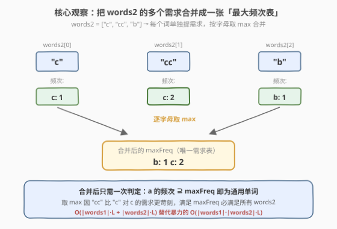
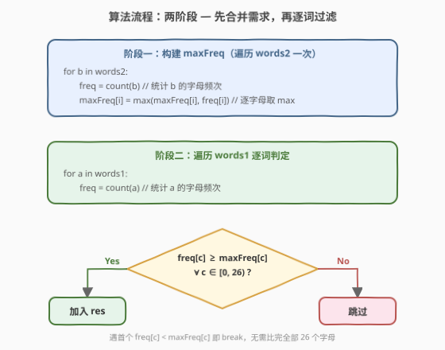

# LeetCode 单词子集 题解

## 1. 题目概述

- **标题 / 题号**：单词子集（#916，medium）
- **链接**：https://leetcode.cn/problems/word-subsets/
- **难度**：中等
- **标签**：数组、哈希表、字符串、计数

**题意**：给你两个字符串数组 `words1` 和 `words2`。如果字符串 `b` 中的每个字母都出现在 `a` 中（**包括重复出现的字母**），则称 `b` 是 `a` 的**子集**。例如 `"wrr"` 是 `"warrior"` 的子集，但不是 `"world"` 的子集。

如果 `words2` 中的**每一个**单词 `b` 都是 `a` 的子集，则称 `words1` 中的 `a` 为**通用单词**。返回 `words1` 中所有通用单词，顺序任意。

**示例 1**：

```text
输入：words1 = ["amazon","apple","facebook","google","leetcode"], words2 = ["e","o"]
输出：["facebook","google","leetcode"]
```

**示例 2**：

```text
输入：words1 = ["amazon","apple","facebook","google","leetcode"], words2 = ["lc","eo"]
输出：["leetcode"]
```

**示例 3**：

```text
输入：words1 = ["acaac","cccbb","aacbb","caacc","bcbbb"], words2 = ["c","cc","b"]
输出：["cccbb"]
```

**约束**：

- $1 \le \text{words1.length}, \text{words2.length} \le 10^4$
- $1 \le \text{words1[i].length}, \text{words2[i].length} \le 10$
- `words1[i]` 和 `words2[i]` 仅由小写英文字母组成
- `words1` 中的所有字符串互不相同

> 💡 本题是 [383. 赎金信](../0301-0400/383_赎金信.md) 的「批量升级版」：383 判定**一个** `ransomNote` 是否是 `magazine` 的子集（单对单），916 要判定 `words1` 中每个词是否同时是 `words2` 中**所有**词的超集（一对多）。关键突破口是把「多个子集条件」合并成「一张最大频次表」，将 $O(|words_1| \times |words_2|)$ 的两两比对降为 $O(|words_1| + |words_2|)$ 的线性扫描。

## 2. 解题思路

### 2.1 暴力思路

对 `words1` 中的每个词 `a`，遍历 `words2` 中的每个词 `b`，逐个判定 `b` 是否是 `a` 的子集——即统计 `a` 的字母频次表 `freqA`，再检查 `b` 中每个字母的频次是否都 $\le \text{freqA}[\text{该字母}]$。

```text
for a in words1:
    ok = true
    for b in words2:
        if not isSubset(b, a):   // 统计 a 的频次，再逐字母比较 b
            ok = false; break
    if ok: res.push(a)
```

时间复杂度 $O(|words_1| \times |words_2| \times L)$，其中 $L$ 为单词平均长度。在 $|words_1| = |words_2| = 10^4$ 时高达 $10^8 \times L$，明显超时。

> ⚠️ 暴力法的根源问题：它把 `words2` 当作「一堆独立需求」反复比对，而没有意识到这些需求可以**合并**——对同一个 `a` 而言，只需关心「每个字母的**最高**需求量」即可。

### 2.2 核心观察：合并 words2 为一张最大频次表



**关键洞察**：`a` 是通用单词 $\iff$ `words2` 中每个 `b` 都是 `a` 的子集 $\iff$ 对每个字母 $c$，`a` 中 $c$ 的数量 $\ge$ `words2` 中**任意一个**词对 $c$ 的需求数量 $\iff$ 对每个字母 $c$，`a` 中 $c$ 的数量 $\ge \max\limits_{b \in words_2} \text{count}_b(c)$。

因此只需做一件事：扫一遍 `words2`，对每个字母 $c$ 取所有词中的**最大频次**，合并成一张 `maxFreq[26]` 表。之后对每个 `a` 只需与这张表做一次比较，`words2` 的信息被完全吸收进 `maxFreq` 中。

> 💡 **为什么取 max 而非 sum？** 因为 `words2` 中的词是「**或**」的关系而非「**且**」——`a` 要同时满足每个 `b`，而每个 `b` 独立提需求。对字母 $c$ 而言，最苛刻的那个 `b`（$c$ 出现最多）决定了门槛；满足它就自动满足所有其他对 $c$ 需求更小的词。若取 sum 则会把不同 `b` 的需求叠加，误判。
>
> 例：`words2 = ["c","cc","b"]`，对 `c` 的需求分别是 1、2、0，$\max = 2$。满足 `c` 出现 $\ge 2$ 次的 `a` 必然同时满足 `"c"`（需 1）和 `"cc"`（需 2）。

### 2.3 算法流程图



**完整步骤**：

1. **阶段一（合并需求）**：初始化 `maxFreq[26] = {0}`。遍历 `words2` 中每个 `b`，统计 `b` 的字母频次 `freq[26]`，对每个字母 `i` 执行 `maxFreq[i] = max(maxFreq[i], freq[i])`。
2. **阶段二（逐词过滤）**：遍历 `words1` 中每个 `a`，统计 `a` 的字母频次 `freq[26]`，检查是否对所有 `i` 都有 `freq[i] >= maxFreq[i]`；遇首个不满足的字母即 `break`。
3. 全部满足则将 `a` 加入结果数组 `res`。

> ⚠️ **提前 break 优化**：阶段二的判定无需比完全部 26 个字母——遇首个 `freq[c] < maxFreq[c]` 即可判定 `a` 非通用，立即 `break` 跳出内层循环。由于单词长度 $\le 10$，`a` 实际只包含至多 10 种字母，多数不匹配的词在前几个字母就会暴露赤字。

### 2.4 示例演算

以**示例 2** 演算：`words2 = ["lc","eo"]`，合并得 `maxFreq = {l:1, c:1, e:1, o:1}`（4 个字母各需至少 1 次）。逐词检查 `words1`：

![示例演算：words2=["lc","eo"] 的逐词判定过程](../images/word_subsets_example_walkthrough.svg)

| word1 | l | c | e | o | 判定 | 缺失字母 |
|-------|---|---|---|---|------|----------|
| amazon | 0 | 0 | 0 | 1 | ✗ | l, c, e |
| apple | 1 | 0 | 1 | 0 | ✗ | c, o |
| facebook | 0 | 1 | 1 | 2 | ✗ | l |
| google | 1 | 0 | 1 | 2 | ✗ | c |
| leetcode | 1 | 1 | 3 | 1 | ✓ | — |

只有 `"leetcode"` 同时含有 $l, c, e, o$ 各至少一次，成为唯一的通用单词。注意 `"facebook"` 虽含 $c, e, o$ 充足，但因缺 $l$ 被淘汰——这正是合并需求的威力：`maxFreq` 把 `"lc"` 对 $l$ 的需求和 `"eo"` 对 $e, o$ 的需求**融合**到一张表里，任何一个字母赤字即出局。

## 3. 参考代码

### C++

```cpp
// 单词子集.cpp —— 合并 words2 为最大频次表，逐词过滤 words1
#include <vector>
#include <string>
using namespace std;

class Solution {
public:
    vector<string> wordSubsets(vector<string>& words1, vector<string>& words2) {
        int maxFreq[26] = {0};
        for (const string& b : words2) {
            int freq[26] = {0};
            for (char c : b) freq[c - 'a']++;
            for (int i = 0; i < 26; i++)
                if (freq[i] > maxFreq[i]) maxFreq[i] = freq[i];
        }
        vector<string> res;
        for (const string& a : words1) {
            int freq[26] = {0};
            for (char c : a) freq[c - 'a']++;
            bool ok = true;
            for (int i = 0; i < 26; i++)
                if (freq[i] < maxFreq[i]) { ok = false; break; }
            if (ok) res.push_back(a);
        }
        return res;
    }
};
```

### Python

```python
class Solution:
    def wordSubsets(self, words1: List[str], words2: List[str]) -> List[str]:
        max_freq = [0] * 26
        for b in words2:
            freq = [0] * 26
            for c in b:
                freq[ord(c) - 97] += 1
            for i in range(26):
                if freq[i] > max_freq[i]:
                    max_freq[i] = freq[i]
        res = []
        for a in words1:
            freq = [0] * 26
            for c in a:
                freq[ord(c) - 97] += 1
            if all(freq[i] >= max_freq[i] for i in range(26)):
                res.append(a)
        return res
```

> 💡 **Python 简写**：可用 `Counter` + `|` 运算符合并频次表（`Counter` 的 `|` 取逐键 max），但常数比手写数组大，$10^4$ 量级下手写数组更稳。简写版：`max_req = Counter(); for b in words2: max_req |= Counter(b)`，判定 `Counter(a) >= max_req`（`Counter` 的 `>=` 即逐键比较）。

## 4. 复杂度分析

| 维度 | 复杂度 | 说明 |
|------|--------|------|
| **时间复杂度** | $O((|words_1| + |words_2|) \cdot L + |words_1| \cdot 26)$ | 阶段一扫 `words2` 统计与合并 $O(|words_2| \cdot L)$；阶段二扫 `words1` 统计 $O(|words_1| \cdot L)$ + 逐词判定 $O(|words_1| \cdot 26)$，其中 $L$ 为单词平均长度（$\le 10$），$26$ 为字母表大小 |
| **空间复杂度** | $O(1)$ | 仅用两个长度 26 的整型数组 `maxFreq` 和 `freq`，与输入规模无关；返回结果不计入空间复杂度 |

> ⚠️ 暴力法 $O(|words_1| \times |words_2| \times L)$ 在 $10^4 \times 10^4$ 时约 $10^9$ 必超时；合并后降为 $O((|words_1| + |words_2|) \cdot (L + 26)) \approx O(2 \times 10^4 \times 36)$，约 $7 \times 10^5$ 次操作，轻松通过。核心是把「乘法」降为「加法」——这是「预处理 + 合并需求」思想的典型应用。

## 5. 扩展：Counter 的 `|` 与 `>=` 语义

Python 的 `collections.Counter` 重载了两个运算符，恰好对应本题的两个核心操作：

| 运算符 | 语义 | 本题对应 |
|--------|------|----------|
| `a \| b` | 逐键取 `max`（并集） | 合并 `words2` 各词频次为 `maxFreq` |
| `a >= b` | 逐键判断 `a[k] >= b[k]`（子集关系） | 判定 `a` 的频次是否覆盖 `maxFreq` |

```python
from collections import Counter

class Solution:
    def wordSubsets(self, words1, words2):
        max_req = Counter()
        for b in words2:
            max_req |= Counter(b)          # 逐键取 max
        return [a for a in words1 if Counter(a) >= max_req]  # 子集判定
```

这版代码仅 4 行，语义清晰但每次 `Counter(a)` 都重新构造哈希表，常数较大。手写数组版用固定 26 槽位替代哈希表，省去哈希开销与内存分配，在 LeetCode 上快约 3-5 倍。面试中可视场景选择：**追可读性用 Counter，追性能用数组**。

## 6. 面试要点

1. **为什么要合并 words2？不合并会怎样？**
   - 不合并则需对每个 `a` 遍历整个 `words2` 逐词判定子集关系，时间 $O(|words_1| \times |words_2| \times L)$，$10^4 \times 10^4$ 必超时。
   - 合并后 `words2` 的信息被吸收进一张 26 槽的 `maxFreq` 表，`words2` 的规模从计算中消失，时间降为 $O((|words_1| + |words_2|) \cdot L)$。这是「**预处理消除乘法**」的通用优化思路。

2. **为什么取 max 而非 sum？**
   - `words2` 中的词是「且」的关系（`a` 要同时满足**所有** `b`），但对每个字母而言，满足最苛刻的那个 `b` 就自动满足所有其他 `b`——所以取 `max`。若取 `sum` 会把不同 `b` 的需求叠加，如 `["c","cc"]` 对 `c` 的需求应为 $\max(1,2)=2$ 而非 $1+2=3$，取 sum 会误杀合法答案。

3. **本题和 383 赎金信的关系？**
   - 383 是单对单子集判定（一个 `ransomNote` vs 一个 `magazine`），916 是一对多（一个 `a` vs **所有** `words2`）。916 的 `maxFreq` 合并本质上是把「多个 383 子集判定」折叠成一次——满足 `maxFreq` 等价于同时通过所有子集判定。可理解为 383 的**批量优化版**。

4. **提前 break 有什么用？**
   - 阶段二判定时，遇首个 `freq[c] < maxFreq[c]` 即 `break`，无需比完全部 26 个字母。由于单词长度 $\le 10$，不匹配的词往往在前几个字母就暴露赤字，实际比较次数远小于 26。这是常数优化，不改变渐进复杂度但实测能快 2-3 倍。

5. **如果 words2 中有重复的词怎么办？**
   - 无影响。重复词的频次表相同，取 `max` 后结果不变。`maxFreq` 只关心每个字母的最大需求，与 `words2` 中词的个数和重复无关——这正是合并的鲁棒性所在。

> 💡 **一句话总结**：916 的核心是「**合并需求**」——把 `words2` 的多个子集条件按字母取 `max` 压缩成一张 `maxFreq` 表，将 $O(|words_1| \times |words_2|)$ 的两两比对降为 $O(|words_1| + |words_2|)$ 的线性扫描。这一「预处理消除乘法」的思路在多条件过滤问题中通用：只要条件可按某维度合并（取 max / min / sum），就应先合并再过滤。

## 同类练习题

| # | 题目 | 与本题的关联 |
|---|------|-------------|
| 383 | [赎金信](https://leetcode.cn/problems/ransom-note/)（[题解](../0301-0400/383_赎金信.md)） | 916 的单对单基础版——判定一个 `ransomNote` 是否是 `magazine` 的子集（频次覆盖），共享同一套字符计数骨架 |
| 242 | [有效的字母异位词](https://leetcode.cn/problems/valid-anagram/)（[题解](../0201-0300/242_有效的字母异位词.md)） | 频次**双向相等**判定（anagram），对比 916 的**单向覆盖**判定——全零 vs 无赤字 |
| 49 | [字母异位词分组](https://leetcode.cn/problems/group-anagrams/)（[题解](../0001-0100/49_字母异位词分组.md)） | 用频次签名做哈希键分组，共享字符计数工具，但用途不同（分组 vs 过滤） |
| 438 | [找到字符串中所有字母异位词](https://leetcode.cn/problems/find-all-anagrams-in-a-string/)（[题解](../0401-0500/438_找到字符串中所有字母异位词.md)） | 滑动窗口 + 频次匹配，在变长的窗口内维护频次覆盖关系，与 916 的定长频次比较形成对照 |
| 1002 | [查找常用字符](https://leetcode.cn/problems/find-common-characters/) | 对多个字符串取每个字母的**最小**公共频次（`min` 而非 `max`），与 916 取 `max` 形成「交集 vs 并集」的镜像对照 |
