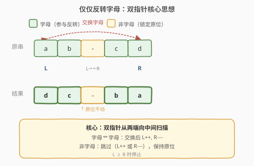
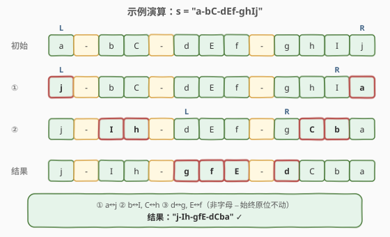

# 仅仅反转字母

- **题目名称**：仅仅反转字母
- **链接**：[917. 仅仅反转字母](https://leetcode.cn/problems/reverse-only-letters/)
- **难度**：简单
- **标签**：双指针、字符串

## 1. 题目概述

给你一个字符串 `s`，根据下述规则反转字符串中的字符：

- 所有**非英文字母**的字符都保留在**原有位置**；
- 所有**英文字母**（大小写）的位置被**反转**。

返回最终结果字符串。

> 💡 换句话说：把字符串中所有字母抽出来翻转，再逐个放回「字母槽位」，非字母字符原地不动。

**示例 1**：

```text
输入：s = "ab-cd"
输出："dc-ba"
解释：字母 a b c d 反转为 d c b a，连字符 − 原位不动。
```

**示例 2**：

```text
输入：s = "a-bC-dEf-ghIj"
输出："j-Ih-gfE-dCba"
```

**示例 3**：

```text
输入：s = "Test1ng-Leet=code-Q!"
输出："Qedo1ct-eeLg=ntse-T!"
```

**约束条件**：

- $1 \le \text{s.length} \le 100$
- `s` 仅由 ASCII 值在 `[33, 122]` 范围内的字符组成
- `s` 不包含 `'\"'` 或 `'\\'`

---

## 2. 解题思路

### 2.1 暴力思路：抽取字母翻转再填回

最直观的做法分三步：遍历 `s` 把所有字母抽到列表 `letters`；翻转 `letters`；再遍历 `s`，遇到字母槽位就依次从翻转后的 `letters` 填入，非字母原样保留。

```text
letters = [c for c in s if c.isalpha()]   # 抽字母
letters.reverse()                           # 翻转
结果 = 逐位填回：字母位取 letters，非字母位取原字符
```

时间 $O(n)$、空间 $O(n)$（需额外存字母列表）。逻辑清晰但多用了一个列表和一个翻转步骤，面试中通常会追问「能不能原地做？」

### 2.2 核心观察：双指针原地交换



关键洞察是：**字母的反转本质上是首尾配对交换**——第 1 个字母和倒数第 1 个字母换、第 2 个和倒数第 2 个换……而非字母字符「不参与交换」只需跳过。

于是用经典**左右双指针**从两端向中间逼近：

- `L` 从左端 `0` 出发，`R` 从右端 `n-1` 出发；
- 若 `s[L]` **不是字母**：`L++`（跳过，保持原位）；
- 若 `s[R]` **不是字母**：`R--`（跳过，保持原位）；
- 若 `s[L]` 和 `s[R]` **都是字母**：交换两者，然后 `L++`、`R--`；
- 当 `L >= R` 时停止。

> 💡 **为什么正确**：双指针保证了**只有字母被配对交换**，且配对顺序恰好是「首 ↔ 尾」的逆序——等价于把字母序列整体翻转。非字母在跳过时从未被修改，天然保持原位。

> ⚠️ **跳过逻辑不能合并**：`L` 和 `R` 的跳过是**独立**的——某一步可能 `L` 跳过而 `R` 不动（`s[L]` 非字母但 `s[R]` 是字母），下一步可能反过来。若把两个判断合并成「同时跳过」会漏掉配对。

### 2.3 算法流程图


流程是一个**带多重跳过的双指针循环**：每次迭代先检查 `L < R`，再依次判断 `s[L]` 和 `s[R]` 是否为字母，三路分支（跳过左 / 跳过右 / 交换），任一路执行后都回到 `L < R` 判断。

### 2.4 示例演算



以 `s = "a-bC-dEf-ghIj"` 为例（下标 `0`~`12`，非字母在位置 `1, 4, 8`）：

| 步骤 | L | R | 操作 | 字符串状态 |
|------|---|---|------|-----------|
| 初始 | 0 | 12 | — | `a-bC-dEf-ghIj` |
| ① | 0 | 12 | `a`↔`j` 均字母，交换 | `j-bC-dEf-ghIa` |
| | 1 | 11 | `s[1]='-'` 非字母，`L++` | `j-bC-dEf-ghIa` |
| ② | 2 | 11 | `b`↔`I` 均字母，交换 | `j-IC-dEf-ghba` |
| | 3 | 10 | `C`↔`h` 均字母，交换 | `j-Ih-dEf-gCba` |
| | 4 | 9 | `s[4]='-'` 非字母，`L++` | `j-Ih-dEf-gCba` |
| ③ | 5 | 9 | `d`↔`g` 均字母，交换 | `j-Ih-gEf-dCba` |
| | 6 | 8 | `s[8]='-'` 非字母，`R--` | `j-Ih-gEf-dCba` |
| | 6 | 7 | `E`↔`f` 均字母，交换 | `j-Ih-gfE-dCba` |
| | 7 | 6 | `L >= R`，停止 | — |

最终结果 `"j-Ih-gfE-dCba"` ✓。注意三个连字符（位置 `1, 4, 8`）自始至终未被修改。

---

## 3. 参考代码

### C++

```cpp
class Solution {
  public:
    string reverseOnlyLetters(string s) {
        int left = 0, right = s.size() - 1;
        while (left < right) {
            if (!isalpha(s[left])) {
                left++;
            } else if (!isalpha(s[right])) {
                right--;
            } else {
                swap(s[left], s[right]);
                left++;
                right--;
            }
        }
        return s;
    }
};
```

### Python

```python
class Solution:
    def reverseOnlyLetters(self, s: str) -> str:
        chars = list(s)
        left, right = 0, len(chars) - 1
        while left < right:
            if not chars[left].isalpha():
                left += 1
            elif not chars[right].isalpha():
                right -= 1
            else:
                chars[left], chars[right] = chars[right], chars[left]
                left += 1
                right -= 1
        return ''.join(chars)
```

> 💡 **语言差异**：C++ 的 `string` 可变，直接原地 `swap` 即可，空间 $O(1)$；Python 的 `str` 不可变，需先转 `list` 操作再 `''.join` 拼回，空间 $O(n)$。`isalpha()` / `isalpha` 在两端都可用，也可手写 `(c >= 'a' && c <= 'z') || (c >= 'A' && c <= 'Z')` 避免库函数开销。

> ⚠️ **if-elif-else 结构**：三个分支互斥——每次循环只走一路。若 `s[L]` 非字母，只 `L++` 不碰 `R`，下一轮重新判断。切勿写成 `if (!letter(L)) L++; if (!letter(R)) R--; swap(...)` 的并列 `if`，否则可能在 `L` 跳过后立即拿新的 `s[L]` 与当前 `s[R]` 交换，逻辑错误。

---

## 4. 复杂度分析

| 维度 | 复杂度 | 说明 |
|------|--------|------|
| 时间复杂度 | $O(n)$ | `L` 和 `R` 每次迭代至少移动一步（`L++` 或 `R--` 或两者都动），合计至多 `n` 次移动，每个字符访问常数次 |
| 空间复杂度 | $O(1)$（C++） / $O(n)$（Python） | C++ 原地修改 `string`；Python 因字符串不可变需拷贝为 `list` |

---

## 5. 扩展：栈解法

若不使用双指针，可用**栈**实现：遍历 `s` 把所有字母压栈（栈顶即「最后一个字母」），再遍历 `s`——遇字母位就从栈顶弹出填入，遇非字母位保留原字符。

```python
def reverseOnlyLetters(self, s: str) -> str:
    letters = [c for c in s if c.isalpha()]
    result = []
    for c in s:
        if c.isalpha():
            result.append(letters.pop())  # 弹出 = 逆序取字母
        else:
            result.append(c)
    return ''.join(result)
```

栈的 LIFO 特性天然实现翻转，逻辑比双指针更「直觉」但多用了 $O(n)$ 空间存字母栈。双指针的优势在于**原地**——无需额外存储。

> 💡 **本质等价**：栈解法 = 暴力抽取翻转填回的变体（用 `pop()` 替代 `reverse()` + 索引）；双指针 = 把「抽取 + 翻转 + 填回」三步合并为原地配对交换。两者产出的字母逆序序列完全相同。

---

## 6. 面试要点

1. **为什么用双指针而不是先抽字母再翻转填回？**

   抽取翻转法逻辑清晰但需 $O(n)$ 额外空间（字母列表 / 栈）。双指针利用「反转 = 首尾配对交换」的性质，在原字符串上直接交换，C++ 中做到 $O(1)$ 空间。面试中先说暴力法展示思路，再优化到双指针展示对「原地」的追求。

2. **跳过非字母时 `L` 和 `R` 的移动是独立的，为什么不能合并？**

   每次循环只应处理一对配对决策。若 `s[L]` 非字母，只需 `L++` 让 `L` 找到下一个字母，`R` 不应动——因为当前 `s[R]` 可能是字母，正等待与下一个有效 `s[L]` 配对。若同时 `R--`，就跳过了一个本应参与交换的字母。用 `if-elif-else` 保证每次只走一路。

3. **循环条件为什么是 `L < R` 而非 `L <= R`？**

   `L == R` 时指向同一个字符，自己和自己交换无意义。`L < R` 保证交换的两端是不同位置，避免无操作。当 `L` 和 `R` 交叉（`L > R`）时所有字母配对完毕。

4. **如何判断一个字符是英文字母？**

   C++ 用 `<cctype>` 的 `isalpha(c)`；Python 用 `str.isalpha()`。也可手写范围判断 `(c >= 'a' && c <= 'z') || (c >= 'A' && c <= 'Z')`。注意题目保证 ASCII `[33, 122]`，不含多字节字符，无需考虑 Unicode 字母。

5. **如果字符串全是非字母或只有一个字母会怎样？**

   全非字母：`L` 一路 `++` 到 `R`，循环自然终止，返回原串。只有一个字母：`L` 和 `R` 最多在它两侧或重合，无有效交换对，返回原串。两种边界都无需特判，双指针逻辑天然处理。

---

## 7. 同类练习题

- [125. 验证回文串](https://leetcode.cn/problems/valid-palindrome/)（[题解](../0101-0200/125_验证回文串.md)）：双指针 + 跳过非字母数字，本题的「跳过」思想基础
- [345. 反转字符串中的元音字母](https://leetcode.cn/problems/reverse-vowels-of-a-string/)：双指针跳过非元音，本题的直接兄弟——把「字母」换成「元音」
- [344. 反转字符串](https://leetcode.cn/problems/reverse-string/)：纯双指针反转（无跳过），本题的退化基础模板
- [392. 判断子序列](https://leetcode.cn/problems/is-subsequence/)（[题解](../0301-0400/392_判断子序列.md)）：双指针匹配 + 跳过不匹配字符，同类双指针范式
