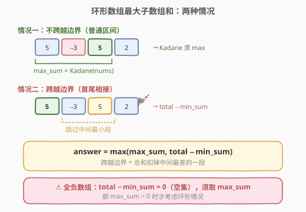
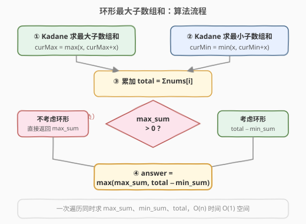

# 最大环形子数组和

- **题目名称**：最大环形子数组和
- **链接**：[918. 环形子数组的最大和](https://leetcode.cn/problems/maximum-sum-circular-subarray/)
- **难度**：中等
- **标签**：数组、动态规划、Kadane 算法

## 1. 题目概述

给定一个长度为 `n` 的**环形整数数组** `nums`（即 `nums[n-1]` 之后是 `nums[0]`），返回该数组的**非空子数组**的最大可能和。

> 💡 环形意味着子数组可以**跨越首尾**——例如 `nums = [5, -3, 5]`，可以取 `[5, 5]`（首尾相接，跳过中间的 `-3`），和为 `10`。

**示例 1**：

```text
输入：nums = [1,-2,3,-2]
输出：3
解释：最大子数组为 [3]，和为 3。环形情况 [1, -2] 和为 -1 不更优。
```

**示例 2**：

```text
输入：nums = [5,-3,5]
输出：10
解释：环形子数组 [5, 5]（首尾相接，跳过 -3）和为 10，优于普通子数组 [5, -3, 5] = 7。
```

**示例 3**：

```text
输入：nums = [-3,-2,-3]
输出：-2
解释：所有元素为负，最大子数组为 [-2]，和为 -2。
```

**约束条件**：

- `n == nums.length`
- `1 <= n <= 3 * 10^4`
- `-3 * 10^4 <= nums[i] <= 3 * 10^4`

---

## 2. 解题思路

### 2.1 暴力思路

枚举所有可能的子数组（包括环形跨越首尾的情况），计算和并取最大值。普通子数组有 $O(n^2)$ 个，环形跨越的子数组也是 $O(n^2)$ 个，每个求和 $O(n)$，总复杂度 $O(n^3)$。对于 $n = 3 \times 10^4$ 完全不可行。

优化求和到 $O(1)$（前缀和）后仍为 $O(n^2)$，依然超时。需要更巧妙的思路。

### 2.2 核心观察：将环形问题拆成两个线性问题



关键洞察是：环形数组的最大子数组和**只有两种来源**：

1. **情况一（不跨越边界）**：最大子数组完全在数组内部，不环绕。这就是普通的 [53. 最大子数组和](../0001-0100/53_最大子数组和.md)——用 Kadane 算法求 `max_sum`。

2. **情况二（跨越边界）**：最大子数组首尾相接。此时它**取了数组的一头一尾**，中间留下了一段**不选的连续区间**。为了让选中的和最大，中间被跳过的那段应该**和尽可能小**（即最小子数组和 `min_sum`）。于是：

$$\text{环形最大和} = \text{total} - \text{min\_sum}$$

其中 `total` 是整个数组的总和，`min_sum` 是用 Kadane 求最小子数组和（把 `max` 换成 `min`）。

最终答案：

$$\text{answer} = \max(\text{max\_sum},\ \text{total} - \text{min\_sum})$$

> 💡 **直觉理解**：跨越边界的子数组 = 整个数组「挖掉」中间一段。挖掉的和越小（`min_sum` 越小，即越负），剩下的和越大。所以「环形最大和」= 总和 - 最小子数组和。

> ⚠️ **全负数组的陷阱**：如果所有元素都为负，`max_sum < 0`，此时 `total - min_sum = total - total = 0`（因为 `min_sum = total`，最小子数组就是整个数组）。但题目要求**非空子数组**，`0` 对应空集不合法。因此当 `max_sum <= 0` 时，直接返回 `max_sum`（即最大的那个负数），不考虑环形情况。

### 2.3 算法流程图



一次遍历同时维护三个值：
- `curMax` / `maxSum`：Kadane 求最大子数组和
- `curMin` / `minSum`：Kadane 求最小子数组和
- `total`：数组总和

遍历结束后，若 `maxSum > 0` 则返回 `max(maxSum, total - minSum)`，否则返回 `maxSum`。

### 2.4 示例演算

![示例演算：nums = [5, −3, 5, 2]](../images/maxcircular_example_walkthrough.svg)

以 `nums = [5, -3, 5, 2]` 为例：

| 步骤 | 元素 | curMax | maxSum | curMin | minSum | total |
|------|------|--------|--------|--------|--------|-------|
| 初始 | — | 0 | −∞ | 0 | +∞ | 0 |
| i=0 | 5 | 5 | 5 | 5 | 5 | 5 |
| i=1 | −3 | 2 | 5 | −3 | −3 | 2 |
| i=2 | 5 | 7 | 7 | 2 | −3 | 7 |
| i=3 | 2 | 9 | **9** | 4 | **−3** | **9** |

- `maxSum = 9 > 0`，考虑环形
- `total - minSum = 9 - (-3) = 12`
- `answer = max(9, 12) = 12`

环形子数组 `[5, 5, 2]`（跳过 `−3`，首尾相接）和为 `12`，优于普通最大子数组 `[5, -3, 5, 2]` 的 `9`。

---

## 3. 参考代码

### C++

```cpp
class Solution {
  public:
    int maxSubarraySumCircular(vector<int>& nums) {
        int total = 0;
        int curMax = 0, maxSum = INT_MIN;
        int curMin = 0, minSum = INT_MAX;

        for (int x : nums) {
            // Kadane 求最大子数组和
            curMax = max(x, curMax + x);
            maxSum = max(maxSum, curMax);

            // Kadane 求最小子数组和
            curMin = min(x, curMin + x);
            minSum = min(minSum, curMin);

            total += x;
        }

        // 全负数组：maxSum <= 0，直接返回（不能取空集）
        if (maxSum <= 0)
            return maxSum;

        return max(maxSum, total - minSum);
    }
};
```

### Python

```python
class Solution:
    def maxSubarraySumCircular(self, nums: List[int]) -> int:
        total = 0
        cur_max = max_sum = float('-inf')
        cur_min = min_sum = float('inf')

        for x in nums:
            cur_max = max(x, cur_max + x)
            max_sum = max(max_sum, cur_max)

            cur_min = min(x, cur_min + x)
            min_sum = min(min_sum, cur_min)

            total += x

        if max_sum <= 0:
            return max_sum

        return max(max_sum, total - min_sum)
```

> ⚠️ **初始化细节**：`curMax` / `curMin` 初始化为 `0` 而非首元素，是因为 Kadane 的 `max(x, curMax + x)` 在第一步会自然取 `x`（`0 + x` vs `x` 取 `x`）。但 `maxSum` 必须初始化为 `INT_MIN`（或 `float('-inf')`），以防第一个元素为负时被 `0` 覆盖。同理 `minSum` 初始化为 `INT_MAX`。

> 💡 **全负判断用 `maxSum <= 0`**：当所有元素为负时，`maxSum` 是最大的那个负数（`< 0`），此时 `total - minSum = 0`（空集），不合法。直接返回 `maxSum`。若 `maxSum > 0`，说明至少有一个正数，`total - minSum` 必然对应一个非空子数组（因为 `minSum` 不可能等于 `total`，否则所有元素非正，矛盾）。

---

## 4. 复杂度分析

| 维度 | 复杂度 | 说明 |
|------|--------|------|
| 时间复杂度 | $O(n)$ | 只遍历数组一次，每次迭代做 $O(1)$ 的 Kadane 更新 |
| 空间复杂度 | $O(1)$ | 仅使用 `curMax`、`maxSum`、`curMin`、`minSum`、`total` 五个变量 |

---

## 5. 扩展：前缀和 + 单调队列解法

除 Kadane 双向扫描外，本题还可用**前缀和 + 单调队列**求解。将数组扩展为长度 `2n` 的拼接数组（`nums + nums`），问题转化为：在该数组中找长度不超过 `n` 的子数组的最大和。

维护前缀和 `pre[i]` 和一个**单调递增的队列**（存下标），队列中下标对应的 `pre` 值从队首到队尾递增。对于每个 `i`：
1. 弹出队首超出窗口 `n` 的下标。
2. 以队首下标 `j` 为起点，`pre[i] - pre[j]` 是一个候选最大和。
3. 弹出队尾所有 `pre` 值 $\ge$ `pre[i]` 的下标（它们不可能成为更优起点）。
4. 将 `i` 入队。

此方法时间 $O(n)$、空间 $O(n)$，比 Kadane 双向法多用一个队列，但思路更通用——能处理「子数组长度有上限」的变体。

---

## 6. 面试要点

1. **为什么环形最大和 = total - min_sum？**

   跨越边界的子数组取了数组的一头一尾，中间留下一段不选的连续区间。整段总和 `total` 减去被跳过段的最小和 `min_sum`，就是环形子数组的最大和。本质是「补集思想」——不直接求跨越边界的最大，而是求中间被跳过的最小。

2. **为什么要判断 max_sum > 0？**

   全负数组时 `min_sum = total`（最小子数组是整个数组），`total - min_sum = 0` 对应空集，但题目要求非空。此时 `max_sum < 0`（最大负数），直接返回它。当 `max_sum > 0` 时，数组中至少有一个正数，`min_sum` 不可能等于 `total`，`total - min_sum` 必对应非空子数组。

3. **能用 max_sum > 0 代替 max_sum <= 0 吗？为什么用 <=？**

   用 `<=` 或 `<` 都可以。当 `max_sum == 0` 时（数组含 0 且其余非正），`total - min_sum` 也可能为 0，两者相等，返回哪个都对。习惯上用 `<= 0` 更安全，语义为「没有正数就不考虑环形」。

4. **Kadane 求最小子数组和怎么写？**

   把求最大的 `max(x, curMax + x)` 对称翻转为 `min(x, curMin + x)`。若 `curMin` 为正（前面的和为正），不如从当前 `x` 重新开始。

5. **和 [53. 最大子数组和](../0001-0100/53_最大子数组和.md) 的关系？**

   53 是本题的线性版（不环形）。本题把环形问题拆成「线性最大」+「补集（total − 线性最小）」两步，每步都是 53 的 Kadane。掌握 53 后，本题的增量在于**环形→补集转换**这个技巧。

6. **如果要求输出最大子数组本身（而非和），怎么做？**

   Kadane 时维护起止下标。对于环形情况（`total - min_sum` 更大时），最大子数组是「跳过 `min_sum` 对应区间」后剩余的元素——即 `[minEnd+1, minStart-1]` 环形展开。

---

## 7. 同类练习题

- [53. 最大子数组和](https://leetcode.cn/problems/maximum-subarray/)（[题解](../0001-0100/53_最大子数组和.md)）：Kadane 基础模板，本题的前置题
- [152. 乘积最大子数组](https://leetcode.cn/problems/maximum-product-subarray/)（[题解](../0101-0200/152_乘积最大子数组.md)）：维护 max/min 两状态的 Kadane 变体
- [2606. 找到最大开销的子数组](https://leetcode.cn/problems/find-the-substring-with-maximum-cost/)：Kadane 变体，元素映射后求最大子数组和
- [1749. 任意子数组和的绝对值的最大值](https://leetcode.cn/problems/maximum-absolute-sum-of-any-subarray/)：同时维护 max_sum 和 min_sum，取 max(|max_sum|, |min_sum|)
