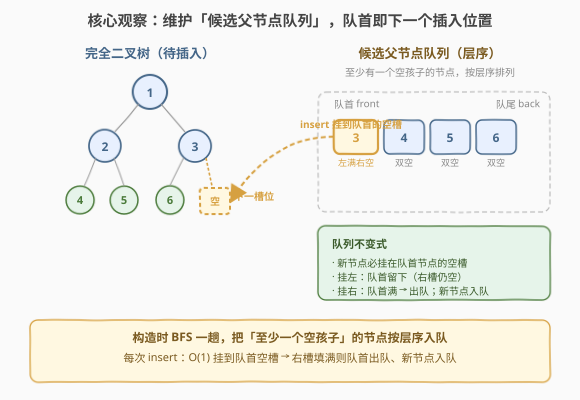
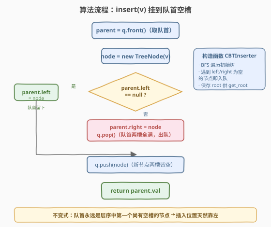

# LeetCode 完全二叉树插入器 题解

## 1. 题目概述

- **标题 / 题号**：完全二叉树插入器（#919，medium）
- **链接**：https://leetcode.cn/problems/complete-binary-tree-inserter/
- **难度**：中等
- **标签**：树、二叉树、广度优先搜索（BFS）、设计

**题意**：设计一个数据结构 `CBTInserter`，在一棵**完全二叉树**上不断插入新节点，并在每次插入后**保持树的完全性**。

> **完全二叉树**：除最后一层外每一层都被完全填满，且最后一层所有节点都**尽可能靠左**（中间无空缺）。

需要实现：

- `CBTInserter(TreeNode root)`：用给定完全二叉树 `root` 初始化数据结构；
- `CBTInserter.insert(int v)`：向树中插入一个值为 `v` 的新节点，保持完全性，**并返回插入节点的父节点值**；
- `CBTInserter.get_root()`：返回树的根节点。

**示例 1**：

```text
输入：
  ["CBTInserter", "insert", "insert", "get_root"]
  [[[1, 2]], [3], [4], []]
输出：
  [null, 1, 2, [1, 2, 3, 4]]

解释：
  CBTInserter cBTInserter = new CBTInserter([1, 2]);
  cBTInserter.insert(3);   // 返回 1
  cBTInserter.insert(4);   // 返回 2
  cBTInserter.get_root();  // 返回 [1, 2, 3, 4]

初始树：       insert(3) 后：     insert(4) 后：
    1              1                1
   /              / \              / \
  2             2   3            2   3
                                /
                               4
```

**约束**：

- 树中节点数量范围为 `[1, 1000]`
- `0 <= Node.val <= 5000`
- `root` 是完全二叉树
- `0 <= val <= 5000`
- 每个测试用例最多调用 `insert` 和 `get_root` 操作 `10^4` 次

> 💡 本题是 [958. 二叉树的完全性检验](../0901-1000/958_二叉树的完全性检验.md) 的「**操作版**」——958 判定一棵树是否完全，919 在已完全的树上**维持**完全性。完全性本质是「层序位置无空洞」，而插入位置恰好是「第一个空槽」。把握住「**队首即下一个空槽的父节点**」这一不变式，就能把每次插入做到 `O(1)`。

## 2. 解题思路

### 2.1 暴力思路：每次插入重新 BFS 找空位

最直观的做法：每次 `insert(v)` 都从根开始做一次 BFS，找到层序遍历中**第一个有空孩子槽的节点**，把 `v` 挂上去。

```text
insert(v):
    BFS 遍历整棵树，找到第一个 left 或 right 为空的节点 parent
    把 v 挂到 parent 的空槽（优先左）
    return parent.val
```

最坏情况下每次 `insert` 都要遍历几乎整棵树，单次 `O(n)`，`m` 次插入总计 `O(mn)`。`n, m` 都到 `10^4` 量级时约 `10^8`，**偏慢且浪费**——每轮重复扫了大量「早已满槽」的节点。

> ⚠️ 暴力法的问题在于「**每次都从头找空位**」，相当于反复重新回答同一个问题：「下一个空槽在哪」。但完全二叉树的插入位置是**严格递推**的——上一次插完，下一次的空位只往前推进一格。我们需要把这个「推进过程」**缓存**下来，避免重复搜索。

### 2.2 核心观察：维护候选父节点队列，队首即下一个插入位置



关键洞察：用一个**队列** `q` 维护所有「**至少有一个空孩子槽**」的节点，按**层序**排列。那么：

> **队首节点永远是下一个待填的父节点**——新节点必挂到队首的空槽上。

维护规则只有两条：

1. **挂左槽**：队首 `parent.left == null` 时，新节点挂到 `parent.left`。此时 `parent` 的**右槽仍空**，所以 `parent` **留在队首**（下次还轮到它填右槽）。
2. **挂右槽**：队首 `parent.left` 已填、`parent.right == null` 时，新节点挂到 `parent.right`。此时 `parent` **两槽全满**，**出队**；同时**新节点入队**（它两槽皆空，成为新的候选父节点）。

> 💡 **为什么这样天然保完全性？** 完全二叉树的层序序列等价于「按满二叉树位置从左到右、从上到下填空」。队列按层序存「未填满的父节点」，且每个父节点**先左后右**地填——这恰好复刻了层序位置的填充顺序。队首总是「层序中第一个还没填满的节点」，把新节点挂到它的空槽，就等价于填到层序序列的下一个空位，完全性自动保持。这与 [958 完全性检验](../0901-1000/958_二叉树的完全性检验.md) 的「实节点连续在前」是同一性质的硬币两面。

### 2.3 算法流程图



**构造函数** `CBTInserter(root)`：

1. 保存 `root`（供 `get_root` 使用）。
2. 一次 BFS 遍历初始树；遇到 `left` 或 `right` 为空的孩子所属节点，就**入队**。队列按层序天然有序。

**插入** `insert(v)`：

1. `parent = q.front()`（取队首，暂不出队）。
2. `node = new TreeNode(v)`。
3. **若 `parent.left == null`**：`parent.left = node`（挂左槽，`parent` 仍留队）。
4. **否则**（`parent.right == null`）：`parent.right = node`；`q.pop()`（`parent` 满了出队）。
5. `q.push(node)`（新节点两槽皆空，入队）。
6. `return parent.val`。

> ⚠️ 注意第 3、4 步是 `if-else` 关系——完全二叉树中一个节点若 `left` 为空，则 `right` 必为空（否则违反靠左性），所以只需判 `left` 是否空即可决定挂哪边。

### 2.4 示例演算

以示例 `root = [1, 2]` 为例，两次 `insert` 的全过程如下：

![示例演算：root = [1,2] → insert(3) → insert(4)](../images/cbt_inserter_example_walkthrough.svg)

| 步骤 | 操作 | 队首 | 挂槽 | 队首去留 | 入队新节点 | 操作后候选队列 | 返回 |
|------|------|------|------|----------|-----------|----------------|------|
| 0 | 构造 | — | — | — | — | `[1, 2]` | — |
| 1 | `insert(3)` | 1 | 右槽（左已满） | **出队**（1 两槽满） | 3 | `[2, 3]` | 1 |
| 2 | `insert(4)` | 2 | 左槽（左空） | **留下**（2 右槽仍空） | 4 | `[2, 3, 4]` | 2 |

- **第 0 步（构造）**：BFS 初始树 `[1, 2]`。节点 1 的右孩子为空 → 入队；节点 2 两槽皆空 → 入队。队列 `[1, 2]`，队首 1。
- **第 1 步 `insert(3)`**：队首 1 的 `left` 已是 2（非空），于是挂到 1 的**右槽**；1 两槽全满 → **出队**；新节点 3 入队。队列变为 `[2, 3]`，返回 1。
- **第 2 步 `insert(4)`**：队首 2 的 `left` 为空，挂到 2 的**左槽**；2 右槽仍空 → **留在队首**；新节点 4 入队。队列变为 `[2, 3, 4]`，返回 2。

最终 `get_root()` 返回 `[1, 2, 3, 4]`，与预期一致。

> 💡 留意第 2 步：插到左槽后队首 **2 不出队**——这正是「先左后右」的体现。下次 `insert` 还会挂到 2 的右槽，那时 2 才出队。这个细节是把单次插入控制在 `O(1)` 的关键：不需要每次都重新搜索空位，队首指针自动指向正确位置。

## 3. 参考代码

### C++

```cpp
// 完全二叉树插入器.cpp —— 候选父节点队列
// 编译: g++ -O2 -std=c++17 完全二叉树插入器.cpp -o cbt
#include <queue>
using namespace std;

struct TreeNode {
    int val;
    TreeNode* left;
    TreeNode* right;
    TreeNode() : val(0), left(nullptr), right(nullptr) {
    }
    TreeNode(int x) : val(x), left(nullptr), right(nullptr) {
    }
    TreeNode(int x, TreeNode* l, TreeNode* r) : val(x), left(l), right(r) {
    }
};

class CBTInserter {
    TreeNode* root;                 // 保存根，供 get_root 使用
    queue<TreeNode*> q;            // 候选父节点：至少有一个空孩子槽，按层序
  public:
    CBTInserter(TreeNode* root) : root(root) {
        // BFS 一趟，把「至少有一个空孩子」的节点按层序入队
        queue<TreeNode*> bfs;
        bfs.push(root);
        while (!bfs.empty()) {
            TreeNode* node = bfs.front();
            bfs.pop();
            if (node->left)  bfs.push(node->left);
            if (node->right) bfs.push(node->right);
            if (!node->left || !node->right) {   // 有空槽 → 是候选父节点
                q.push(node);
            }
        }
    }

    int insert(int v) {
        TreeNode* parent = q.front();          // 队首 = 下一个待填父节点
        TreeNode* node = new TreeNode(v);
        if (!parent->left) {
            parent->left = node;               // 挂左槽，parent 仍留队（右槽待填）
        } else {
            parent->right = node;              // 挂右槽
            q.pop();                           // parent 两槽全满，出队
        }
        q.push(node);                          // 新节点两槽皆空，入队
        return parent->val;
    }

    TreeNode* get_root() {
        return root;
    }
};
```

### Python

```python
from collections import deque
from typing import Optional


class CBTInserter:
    def __init__(self, root: Optional[TreeNode]):
        self.root = root
        self.q = deque()                       # 候选父节点：至少有一个空孩子槽，按层序
        bfs = deque([root])
        while bfs:
            node = bfs.popleft()
            if node.left:
                bfs.append(node.left)
            if node.right:
                bfs.append(node.right)
            if not node.left or not node.right:  # 有空槽 → 是候选父节点
                self.q.append(node)

    def insert(self, v: int) -> int:
        parent = self.q[0]                     # 队首 = 下一个待填父节点
        node = TreeNode(v)
        if not parent.left:
            parent.left = node                 # 挂左槽，parent 仍留队（右槽待填）
        else:
            parent.right = node                # 挂右槽
            self.q.popleft()                   # parent 两槽全满，出队
        self.q.append(node)                    # 新节点两槽皆空，入队
        return parent.val

    def get_root(self) -> Optional[TreeNode]:
        return self.root
```

> 💡 Python 用 `self.q[0]` **窥视队首**而不弹出，等真正挂到右槽后才 `popleft()`——这与 C++ 的 `q.front()` / `q.pop()` 拆分对应。注意构造函数里复用一个临时 `bfs` 队列做遍历，把符合条件的节点**筛入** `self.q`，遍历队列与候选队列职责分离，逻辑更清晰。

## 4. 复杂度分析

| 维度 | 复杂度 | 说明 |
|------|--------|------|
| **构造** `CBTInserter` | 时间 `O(n)` / 空间 `O(n)` | BFS 一趟遍历所有 `n` 个节点；队列最多存约 `n/2` 个候选父节点（末层全部节点） |
| **单次** `insert` | 时间 `O(1)` | 仅队首读写 + 一次入队，无搜索 |
| **单次** `get_root` | 时间 `O(1)` | 直接返回保存的 `root` |
| **总空间** | `O(n)` | 候选队列大小，随插入增长，最坏存全部节点 |

> ⚠️ 候选队列的大小上界：完全二叉树中「至少有一个空槽」的节点只出现在**倒数第二层的右半**与**最后一层全部**。满二叉树时约 `n/2` 个，故空间 `O(n)`。每次 `insert` 队列净增 1（入 1 个新节点，可能出 1 个旧节点），`10^4` 次插入后队列规模仍在 `O(n + m)` 内，不会膨胀失控。

## 5. 扩展：编号法与位运算变体

### 5.1 用满二叉树编号定位

完全二叉树有一个经典性质：若按满二叉树位置给节点编号（根为 `1`，左孩子 `2i`，右孩子 `2i+1`），则 `n` 个节点的完全二叉树**恰好占据编号 `1, 2, …, n`**。因此第 `n+1` 个新节点的父节点编号是 `(n+1) // 2`，挂左还是挂右取决于 `n+1` 的奇偶（奇数挂左、偶数挂右）。

理论上可以维护「节点数 `cnt`」，用编号 `(cnt+1)//2` 配合一个「编号→节点」的哈希表定位父节点。但定位父节点要么需要 `O(log n)` 的二进制逐位下走（从根按编号二进制走左右），要么需要额外哈希表存所有节点。相比之下，**候选父节点队列法**直接 `O(1)` 取队首，更简洁也更省空间，是本题的标准解法。

> 💡 编号法是 [222. 完全二叉树的节点个数](https://leetcode.cn/problems/count-complete-tree-nodes/) 与 [958 完全性检验](../0901-1000/958_二叉树完全性检验.md) 编号解法的同源思路，适合「**给定编号定位节点**」类问题；本题的痛点是「**在线高频插入**」，队列法的 `O(1)` 摊还更契合。

### 5.2 与 LRU/LFU 缓存设计的对比

本题与 [146. LRU 缓存](../0101-0200/146_LRU缓存.md)、[460. LFU 缓存](https://leetcode.cn/problems/lfu-cache/) 同属「**数据结构设计**」题族，核心套路都是：

| 维度 | LRU (146) | LFU (460) | CBT 插入器 (919) |
|------|-----------|-----------|------------------|
| 核心结构 | 哈希 + 双向链表 | 频率桶 + 哈希 | 候选队列 |
| 关键不变式 | 链表序 = 访问时序 | 同频按 FIFO | 队首 = 下一个空槽父节点 |
| 单次操作 | `O(1)` | `O(1)` | `O(1)` |
| 设计精髓 | 哈希定位 + 链表换序 | 频率分桶 + 逐级迁移 | 层序缓存 + 先左后右填充 |

共同点是：**用一个维护好的数据结构把「查找」前置到「插入时」，使热路径操作降到 `O(1)`**。CBT 插入器的「查找」是「下一个空槽在哪」，被队列的队首缓存了。

## 6. 面试要点

1. **为什么用队列而不是每次 BFS 找空位？**

   - 暴力每次 `insert` 重新 BFS 找空位，单次 `O(n)`，`m` 次插入 `O(mn)`，大量重复扫描「早已满槽」的节点。
   - 队列把「未填满的父节点」按层序缓存起来，队首永远指向下一个空槽的父节点，单次 `insert` 退化成 `O(1)` 的队首读写。这是「**把搜索前置成不变式**」的典型设计思想。

2. **队列里存什么样的节点？什么时候入队、出队？**

   - 存「**至少有一个空孩子槽**」的节点，按层序排列。构造时 BFS 一趟筛选入队。
   - 出队时机：当队首的**右槽**被填满时（即两槽全满），它不再是候选父节点，立即出队。
   - 入队时机：**新创建的节点**两槽皆空，必为候选父节点，立即入队。注意挂左槽时队首**不出队**（右槽仍空），下次还轮到它。

3. **为什么只判 `left` 是否为空就能决定挂左还是挂右？**

   - 完全二叉树保证：一个节点若 `left` 为空，则 `right` 必为空（否则末层出现「右有左无」的空缺，违反靠左性）。
   - 因此 `if (!parent->left) 挂左 else 挂右` 是完备的——`else` 分支隐含「`left` 已填、`right` 必空」。这是利用题目「`root` 是完全二叉树」前提简化逻辑的关键。

4. **队列的层序性如何保证？会不会插错位置？**

   - 构造时用 BFS 入队，天然层序。后续每次 `insert` 新节点入队时，它处于当前最末层最右，是层序中「最靠后」的候选父节点，入队到队尾不破坏层序。
   - 队首出队后，下一个队首是层序中紧随其后的候选父节点——填空顺序始终是「层序位置从小到大」，完全性自动保持。无需额外校验。

5. **如果 `insert` 调用次数远大于初始节点数，队列会无限增长吗？**

   - 不会失控。每次 `insert` 净增队列长度至多 1（入 1 个新节点，可能出 1 个旧节点）。`m` 次插入后队列规模 `O(n + m)`，仍在题目 `10^4` 量级的可控范围内。
   - 队列存的是「待填槽父节点」，一旦两槽填满即出队，不会永久堆积。这是 `O(1)` 单次复杂度的前提。

> 💡 **一句话总结**：919 的核心是把「找下一个插入位置」从每次 `O(n)` 搜索降级为 `O(1)` 队首读取——用一个**层序候选父节点队列**缓存「未填满的节点」，队首即下一个空槽。挂左槽队首留下、挂右槽队首出队、新节点入队，三条规则维持不变式，完全性自动保持。这是「数据结构设计把搜索前置成不变式」的典范，与 146/460 同属 `O(1)` 设计题族。

## 同类练习题

| # | 题目 | 与本题的关联 |
|---|------|-------------|
| 958 | [二叉树的完全性检验](https://leetcode.cn/problems/check-completeness-of-a-binary-tree/)（[题解](../0901-1000/958_二叉树的完全性检验.md)） | 完全性的「判定版」，本题是「维持版」，二者共享「层序无空洞」的本质 |
| 222 | [完全二叉树的节点个数](https://leetcode.cn/problems/count-complete-tree-nodes/) | 利用完全性 + 满二叉树编号性质二分求节点数，同属「编号体系」 |
| 146 | [LRU 缓存](https://leetcode.cn/problems/lru-cache/)（[题解](../0101-0200/146_LRU缓存.md)） | 同为 `O(1)` 设计题，哈希 + 链表把查找前置成不变式，思路同源 |
| 102 | [二叉树的层序遍历](https://leetcode.cn/problems/binary-tree-level-order-traversal/)（[题解](../0101-0200/102_二叉树的层序遍历.md)） | 构造函数 BFS 入队的母题模板 |
