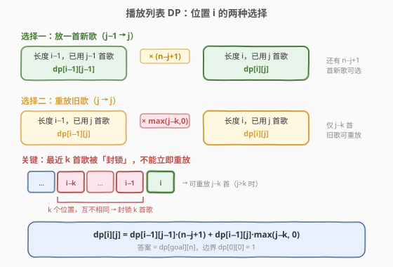
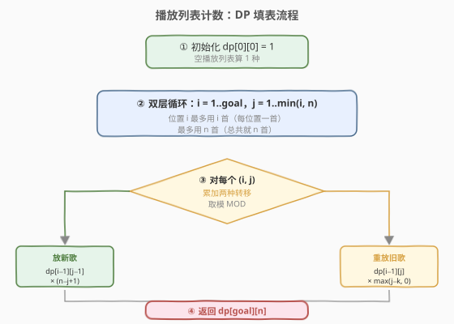
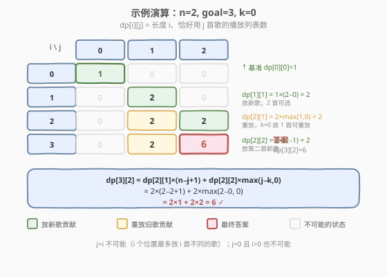

# LeetCode 播放列表的数量 题解

## 1. 题目概述

- **标题 / 题号**：播放列表的数量（#920，hard）
- **链接**：https://leetcode.cn/problems/number-of-music-playlists/
- **难度**：困难
- **标签**：动态规划、数学、组合计数

**题意**：你的音乐播放器里有 `n` 首**不同**的歌，在旅途中计划听 `goal` 首歌（允许重复）。创建播放列表需满足两条规则：

1. **每首歌至少播放一次**；
2. 一首歌只有在**其他 `k` 首歌**播放完之后才能再次播放（即任意两首相同歌之间至少隔 `k` 首不同的歌）。

给定 `n`、`goal` 和 `k`，返回满足要求的播放列表数量，答案对 $10^9 + 7$ 取余。

**示例 1**：

```text
输入：n = 3, goal = 3, k = 1
输出：6
解释：6 种播放列表为 [1,2,3], [1,3,2], [2,1,3], [2,3,1], [3,1,2], [3,2,1]。
      goal = n = 3，每首恰好放一次，即全排列 3! = 6。
```

**示例 2**：

```text
输入：n = 2, goal = 3, k = 0
输出：6
解释：6 种播放列表为 [1,1,2], [1,2,1], [2,1,1], [2,2,1], [2,1,2], [1,2,2]。
      k = 0 不限制重放，只需每首至少一次且长度 3。
```

**示例 3**：

```text
输入：n = 2, goal = 3, k = 1
输出：2
解释：2 种播放列表为 [1,2,1], [2,1,2]。
      k = 1 要求相邻不同，且每首至少一次，故只能首尾相同。
```

**约束**：

- $0 \le k < n \le \text{goal} \le 100$

> 💡 关键约束 $k < n$：可重放的歌曲数 `j - k` 在 $j = n$ 时为 $n - k > 0$，保证不会出现「所有歌都被封锁、无法继续填」的死锁。而 $n \le \text{goal}$ 保证每首至少放一次在长度上可行。

## 2. 解题思路

### 2.1 暴力思路

枚举所有长度为 `goal`、元素取自 `n` 首歌的序列（共 $n^{\text{goal}}$ 种），逐一校验「每首至少一次」和「间隔 `k`」两条规则。$n, \text{goal} \le 100$ 时 $n^{\text{goal}}$ 是天文数字，完全不可行。

> ⚠️ 暴力法的瓶颈在于「**先生成后校验**」——它把两条约束都留到最后检查，导致搜索空间没有任何剪枝。突破口是：把「每首至少一次」编码进状态，把「间隔 `k`」编码进转移，让约束在**填表过程中**被满足。

### 2.2 核心观察：按位置 + 已用歌曲数做二维 DP



定义 `dp[i][j]` 为**长度为 `i`、恰好使用了 `j` 首不同歌**的合法播放列表数量。填到第 `i` 个位置时，只有两种选择：

**选择一：放一首新歌**（从未用过的歌）。前 `i-1` 个位置用了 `j-1` 首，还剩 $n - (j-1) = n - j + 1$ 首新歌可选：

$$\text{新歌贡献} = \text{dp}[i-1][j-1] \times (n - j + 1)$$

**选择二：重放一首旧歌**（已用过的 `j` 首之一）。但最近 `k` 个位置放过的歌被「封锁」，不能立即重放。那么可重放的有几首？

> **关键观察**：在一个合法播放列表中，任意 `k+1` 个连续位置的歌必互不相同（否则某首歌在不到 `k` 首歌之内就重放了）。因此最后 `k` 个位置恰好包含 `k` 首**互不相同**的歌，全部属于已用的 `j` 首。于是可重放的旧歌数为 $j - k$（当 $j > k$，否则为 0）：

$$\text{旧歌贡献} = \text{dp}[i-1][j] \times \max(j - k, 0)$$

合并得**状态转移方程**：

$$\text{dp}[i][j] = \text{dp}[i-1][j-1] \times (n - j + 1) + \text{dp}[i-1][j] \times \max(j - k, 0)$$

> 💡 **为什么 `max(j-k, 0)` 恒正确？** 当 $j \le k$ 时，已用的 `j` 首歌全部落在最近 `k` 个位置的封锁窗内（合法序列保证这 `j` 个位置互异），无一可重放，`j - k ≤ 0` 取 0。当 $j > k$ 时，最近 `k` 个位置恰好封锁 `k` 首，余下 `j - k` 首可重放。两种情况统一为 `max(j-k, 0)`，无需分支。

> ⚠️ 注意 `j > i` 的状态不可能（`i` 个位置最多放 `i` 首不同的歌），`j = 0` 且 `i > 0` 也不可能，这些格子天然为 0，循环上界取 `j = 1..min(i, n)` 即可。

### 2.3 算法流程图



1. **初始化**：`dp[0][0] = 1`（空播放列表算 1 种），其余为 0。
2. **双层循环**：外层 `i = 1..goal`（播放列表位置），内层 `j = 1..min(i, n)`（已用歌曲数）。
3. **状态转移**：对每个 `(i, j)`，累加「放新歌」与「重放旧歌」两种贡献，每次取模 $10^9 + 7$。
4. **返回**：`dp[goal][n]`（长度 `goal`、恰好用全部 `n` 首歌）。

### 2.4 示例演算



以示例 2（`n=2, goal=3, k=0`）为例，`k=0` 意味着不限制重放（相邻可同），逐步填表：

| 步骤 | `(i, j)` | 新歌贡献 `dp[i-1][j-1]×(n-j+1)` | 旧歌贡献 `dp[i-1][j]×max(j-k,0)` | `dp[i][j]` |
|------|----------|----------------------------------|-----------------------------------|------------|
| 0 | `(0, 0)` | — | — | **1**（基准） |
| 1 | `(1, 1)` | `1×(2−1+1) = 1×2 = 2` | `0×1 = 0` | **2** |
| 2 | `(2, 1)` | `0×2 = 0` | `2×max(1,0) = 2×1 = 2` | **2** |
| 3 | `(2, 2)` | `2×(2−2+1) = 2×1 = 2` | `0×2 = 0` | **2** |
| 4 | `(3, 2)` | `2×(2−2+1) = 2×1 = 2` | `2×max(2,0) = 2×2 = 4` | **6** |

- **`(1,1)`**：第 1 个位置必须放新歌，2 首可选 → 2。
- **`(2,1)`**：第 2 个位置重放已有那 1 首（`k=0` 不封锁）→ `2×1 = 2`。
- **`(2,2)`**：第 2 个位置放第二首新歌 → `2×1 = 2`。
- **`(3,2)`**：两种来源——从 `(2,1)` 放第二首新歌（`2×1=2`），或从 `(2,2)` 重放旧歌（`k=0`，2 首都可重放，`2×2=4`）→ 合计 **6**。

最终 `dp[3][2] = 6`，与示例一致。对照 6 种列表 `[1,1,2], [1,2,1], [2,1,1], [2,2,1], [2,1,2], [1,2,2]`，每首至少一次、长度 3、`k=0` 无间隔限制，全部合法。

## 3. 参考代码

### C++

```cpp
// 920. 播放列表的数量.cpp —— 二维计数 DP
// 编译: g++ -O2 -std=c++17 920.cpp -o playlists
class Solution {
  public:
    int numMusicPlaylists(int n, int goal, int k) {
        const int MOD = 1e9 + 7;
        // dp[i][j] = 长度 i、恰好用 j 首歌的合法播放列表数
        vector<vector<long long>> dp(goal + 1, vector<long long>(n + 1, 0));
        dp[0][0] = 1;                                  // 空列表算 1 种
        for (int i = 1; i <= goal; ++i) {
            int jMax = min(i, n);                      // j 不超过 i 也不超过 n
            for (int j = 1; j <= jMax; ++j) {
                // 选择一：放一首新歌，还剩 n - j + 1 首可选
                dp[i][j] = dp[i - 1][j - 1] * (n - j + 1) % MOD;
                // 选择二：重放旧歌，最近 k 首被封锁，可重放 max(j - k, 0) 首
                if (j > k) {
                    dp[i][j] = (dp[i][j] + dp[i - 1][j] * (j - k)) % MOD;
                }
            }
        }
        return dp[goal][n];
    }
};
```

### Python

```python
class Solution:
    def numMusicPlaylists(self, n: int, goal: int, k: int) -> int:
        MOD = 10**9 + 7
        # dp[i][j] = 长度 i、恰好用 j 首歌的合法播放列表数
        dp = [[0] * (n + 1) for _ in range(goal + 1)]
        dp[0][0] = 1                                   # 空列表算 1 种
        for i in range(1, goal + 1):
            for j in range(1, min(i, n) + 1):
                # 选择一：放一首新歌，还剩 n - j + 1 首可选
                dp[i][j] = dp[i - 1][j - 1] * (n - j + 1) % MOD
                # 选择二：重放旧歌，最近 k 首被封锁，可重放 max(j - k, 0) 首
                if j > k:
                    dp[i][j] = (dp[i][j] + dp[i - 1][j] * (j - k)) % MOD
        return dp[goal][n]
```

> 💡 **滚动数组优化**：`dp[i][*]` 只依赖 `dp[i-1][*]`，可压成一维 `dp[j]`，内层 `j` 从大到小更新（保证读到的 `dp[j-1]` 是上一轮的值）。空间降至 $O(n)$。但 `goal, n ≤ 100` 时二维仅 $10^4$ 个元素，直接写二维更清晰、不易出错。

## 4. 复杂度分析

| 维度 | 复杂度 | 说明 |
|------|--------|------|
| **时间复杂度** | $O(\text{goal} \times n)$ | 双层循环，外层 `goal`、内层至多 `n`，每格 $O(1)$ 转移 |
| **空间复杂度** | $O(\text{goal} \times n)$ | 二维 DP 表；滚动数组优化后 $O(n)$ |
| **取模** | 每步 `% MOD` | 中间用 `long long` / Python 大整数避免溢出 |

> ⚠️ C++ 中 `(n - j + 1)` 和 `(j - k)` 都是不超过 100 的整数，但乘以 `dp` 值（可达 $10^9$ 量级）后会溢出 `int`，故 `dp` 用 `long long` 且每步取模。Python 无溢出问题，末尾取模即可。

## 5. 扩展：容斥原理 + 闭合公式

除 DP 外，本题可用**容斥原理**直接推出闭合公式。思路是：先放宽「每首至少一次」的约束，用容斥把「恰好 `n` 首全用上」从「至多 `n` 首」中筛出。

**记** $f(L, N)$ 为「从 `N` 首歌中选、长度 `L`、满足 `k` 间隔约束、**不要求每首至少一次**」的播放列表数。这种「自由用歌」的计数有闭合形式：

$$f(L, N) = N \cdot (N-1) \cdots (N-k+1) \cdot (N-k)^{L-k}, \quad (L \ge k)$$

> 直觉：前 `k` 个位置每放一首就少一首可选（最近 `k` 首互异，第 1 位 `N` 选、第 2 位 `N-1` 选……第 `k` 位 `N-k+1` 选）；从第 `k+1` 位起，每个位置恰有 `N-k` 首可重放（最近 `k` 首被封锁）。

但 $f(\text{goal}, n)$ 允许某些歌**一次都不放**。用容斥把「恰好 `n` 首全用上」筛出来——对「至少漏掉某 `j` 首」做加减交替：

$$\text{answer} = \sum_{j=0}^{n} (-1)^{j} \binom{n}{j} f(\text{goal},\ n - j)$$

其中 $j$ 表示「强制漏掉的歌数」，$\binom{n}{j}$ 选具体漏掉哪 `j` 首，$(-1)^j$ 做容斥符号交替。

**对比两种解法**：

| 维度 | 二维 DP | 容斥闭合公式 |
|------|---------|-------------|
| 时间 | $O(\text{goal} \cdot n)$ | $O(n)$（求和 `n+1` 项，每项 $O(1)$ 配预处理的幂） |
| 空间 | $O(\text{goal} \cdot n)$ 或 $O(n)$ | $O(1)$ |
| 思路难度 | 转移直观，易推导 | 需容斥 + 闭合公式，推导较绕 |
| 通用性 | 状态易扩展（如改约束） | 依赖 `f(L,N)` 有闭合形式 |

> 💡 容斥法快在 $O(n)$，但需要先想到「自由用歌的闭合公式」再套容斥——这道坎比 DP 转移高得多。面试中**先用 DP 拿出正确解**，再提容斥公式作为优化，是更稳的策略。

### 5.1 容斥法参考代码

```python
class Solution:
    def numMusicPlaylists(self, n: int, goal: int, k: int) -> int:
        MOD = 10**9 + 7

        def f(L, N):
            """从 N 首歌选长度 L、满足 k 间隔、不要求每首至少一次的播放列表数"""
            if L == 0:
                return 1
            # 前 min(k, L) 位递减选择，之后每位 N-k 种
            res = 1
            for i in range(min(k, L)):
                res = res * (N - i) % MOD
            res = res * pow(N - k, L - k, MOD) % MOD if L > k else res
            return res

        # 预处理组合数 C(n, j)
        C = [[0] * (n + 1) for _ in range(n + 1)]
        for i in range(n + 1):
            C[i][0] = 1
            for j in range(1, i + 1):
                C[i][j] = (C[i - 1][j - 1] + C[i - 1][j]) % MOD

        ans = 0
        for j in range(n + 1):
            term = C[n][j] * f(goal, n - j) % MOD
            if j % 2 == 0:
                ans = (ans + term) % MOD
            else:
                ans = (ans - term) % MOD
        return ans % MOD
```

## 6. 面试要点

1. **为什么状态要记「恰好用 j 首歌」而不是「至多 j 首」？**

   - 题目要求「每首至少一次」，即最终必须恰好用满 `n` 首。若状态定义为「至多 `j` 首」，转移时无法区分「用了 `j` 首」和「用了 `j-1` 首」，因为重放旧歌不改变已用数。定义「恰好 `j` 首」后，`dp[goal][n]` 直接就是答案，无需再处理「至少」的语义。

2. **`max(j-k, 0)` 这个因子为什么对？最近 k 个位置一定互异吗？**

   - 合法播放列表保证任意 `k+1` 个连续位置互异（否则某首歌在不到 `k` 首内重放，违反规则）。所以最近 `k` 个位置恰含 `k` 首不同的歌，全部属于已用的 `j` 首，封锁 `k` 首。可重放数 = $j - k$（$j > k$ 时）；$j \le k$ 时全部被封锁，取 0。

3. **`j > i` 的格子为什么为 0？循环上界怎么取？**

   - `i` 个位置最多放 `i` 首不同的歌，故 `j > i` 不可能。同理 `j > n` 也不可能（总共只有 `n` 首）。内层循环取 `j = 1..min(i, n)`，既不漏合法状态也不访问无意义格子。

4. **`k < n` 这个约束有什么用？如果 `k >= n` 会怎样？**

   - `k < n` 保证当 `j = n`（全部歌已用）时，可重放数 $n - k > 0$，填表不会卡死。若 `k >= n`，则所有歌放完后全部被封锁、无法重放，`goal > n` 时答案为 0——但题目保证 `k < n`，规避了这种情况。

5. **DP 和容斥公式各有什么优劣？面试怎么选？**

   - DP 转移直观、易推导、易扩展（改约束只改转移），$O(\text{goal} \cdot n)$ 在 $n \le 100$ 时毫无压力。容斥公式 $O(n)$ 更快但需要先想到「自由用歌的闭合形式」再套容斥，推导门槛高。面试建议**先写 DP 保正确**，再口头提容斥作为优化方向。

6. **如何用滚动数组把空间降到 $O(n)$？**

   - `dp[i][*]` 只依赖 `dp[i-1][*]`，压成一维 `dp[j]`。内层 `j` **从大到小**更新：`dp[j] = dp[j-1]*(n-j+1) + dp[j]*max(j-k,0)`。大 `j` 先算，读到的 `dp[j-1]` 仍是上一轮（`i-1`）的值，未被本轮覆盖。注意 `j=0` 的 `dp[0]` 在 `i≥1` 时恒为 0，可忽略。

> 💡 **一句话总结**：920 的核心是**把两条约束分别编码进状态和转移**——「每首至少一次」→ 状态维度 `j`（恰好用 `j` 首），「间隔 `k`」→ 转移因子 `max(j-k, 0)`（最近 `k` 首互异故封锁 `k` 首）。两维 DP $O(\text{goal} \cdot n)$ 拿下，容斥闭合公式是进阶优化。

## 同类练习题

| # | 题目 | 与本题的关联 |
|---|------|-------------|
| 526 | [优美的排列](https://leetcode.cn/problems/beautiful-arrangement/)（[题解](../0501-0600/526_优美的排列.md)） | 同为计数 DP，状态压缩记已用集合，本题用 `j` 维度记已用数量，思路同源 |
| 96 | [不同的二叉搜索树](https://leetcode.cn/problems/unique-binary-search-trees/)（[题解](../0001-0100/96_不同的二叉搜索树.md)） | 卡塔兰计数 DP，与本题同属「计数型 DP」家族 |
| 377 | [组合总和 IV](https://leetcode.cn/problems/combination-sum-iv/)（[题解](../0301-0400/377_组合总和IV.md)） | 完全背包求排列数，外层金额内层硬币，与本题「按位置填、乘以选择数」的计数逻辑同构 |
| 518 | [零钱兑换 II](https://leetcode.cn/problems/coin-change-ii/)（[题解](../0501-0600/518_零钱兑换II.md)） | 完全背包求组合数，对比 377 的排列数，理解「位置有序 vs 物品有序」对计数的影响 |
