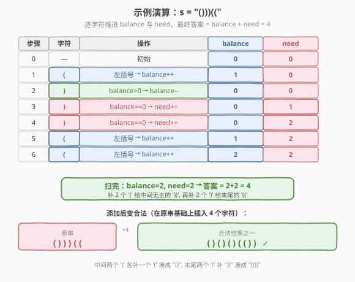

# LeetCode 使括号有效的最少添加 题解

## 1. 题目概述

- **标题 / 题号**：使括号有效的最少添加（#921，medium）
- **链接**：https://leetcode.cn/problems/minimum-add-to-make-parentheses-valid/
- **难度**：中等
- **标签**：栈、贪心、字符串

**题意**：给定一个仅由字符 `'('` 和 `')'` 组成的字符串 `s`，可以在任意位置**插入** `'('` 或 `')'`。返回为使 `s` 成为**有效括号字符串**所需的最少插入次数。

> **有效括号字符串**的定义与 [20. 有效的括号](../0001-0100/20_有效括号.md) 一致：左括号必须用相同类型的右括号闭合、且以正确顺序闭合；通俗讲就是「能完整配对、无悬空括号」。由于本题只有 `(`、`)` 一种括号对，合法当且仅当任意前缀中 `(` 数 ≥ `)` 数，且整串中两者数量相等。

**示例 1**：

```text
输入：s = "())"
输出：1
解释：在开头插入 1 个 '(' 得到 "(())"，或在末尾插入 1 个 '(' ... 但更优是在第 2 个 ')' 前补 '('。
```

**示例 2**：

```text
输入：s = "((("
输出：3
解释：末尾补 3 个 ')' 得到 "((()))"。
```

**示例 3**：

```text
输入：s = "()"
输出：0
```

**示例 4**：

```text
输入：s = "()))(("
输出：4
解释：中间 2 个 ')' 各需补 1 个 '('，末尾 2 个 '(' 各需补 1 个 ')'，共 4 次。
```

**约束**：

- `1 <= s.length <= 10^5`
- `s` 仅由 `'('` 和 `')'` 组成

> 💡 本题是 [20. 有效的括号](../0001-0100/20_有效括号.md) 的「**修补版**」——20 题判定给定串是否合法，921 题问「最少补多少能让它合法」。因为只有单一括号对，栈可以退化为一个 `int` 计数器，把空间从 $O(n)$ 降到 $O(1)$。

## 2. 解题思路

### 2.1 暴力思路：反复消去相邻配对

反复扫描字符串，每次找到相邻的 `()` 就删除，直到无法删除。最终剩下的字符数即为答案（每个剩余括号都需补一个对偶）。

每轮扫描 $O(n)$，最多 $n/2$ 轮，总计 $O(n^2)$，且 $n$ 到 $10^5$ 量级会超时。

> ⚠️ 暴力法的问题在于「**反复扫描已处理过的部分**」。实际上一次从左到右的扫描就能定下每个括号的「配对状态」——只要维护一个「待匹配左括号」的计数即可。

### 2.2 核心观察：两个计数器追踪「未配对」的括号


把 [20 题](../0001-0100/20_有效括号.md) 的**栈**压缩成一个整数 `balance`（栈深度），再补一个 `need` 记录「栈空时硬遇到的右括号」次数：

- **`balance`**：当前**待闭合的左括号数**，等价于栈中 `(` 的数量；
- **`need`**：扫描过程中**无左括号可配的右括号数**，即需要在它们前面补 `(` 的次数。

扫描规则只有三条：

1. 读 `'('` → `balance++`（多一个待闭合）。
2. 读 `')'` 且 `balance > 0` → `balance--`（与某个 `(` 配对消掉）。
3. 读 `')'` 且 `balance == 0` → `need++`（此 `)` 前面没有 `(` 可配，必须补一个 `(`）。

扫描结束后：`balance` 个 `'('` 还缺 `')'`，`need` 个 `')'` 还缺 `'('`。**最少添加数 = `balance + need`**。

> 💡 **为什么这是最少？** 贪心的正确性来自两点：①已配对的括号对**无需再动**（任何修复方案都不可能少于「未配对括号数」，因为每个未配对括号都需要一个对偶）；②每个未配对括号恰好补一个对偶即可，互不影响。这等价于「**未配对的 `(` 数 + 未配对的 `)` 数**」，而 `balance`、`need` 正是这两者的精确计数。

### 2.3 算法流程图


伪代码：

```text
minAddToMakeValid(s):
    balance = 0, need = 0
    for c in s:
        if c == '(':
            balance = balance + 1
        else:                          # c == ')'
            if balance > 0:
                balance = balance - 1  # 配对一个 '('
            else:
                need = need + 1        # 此 ')' 缺一个 '('
    return balance + need
```

### 2.4 示例演算

以示例 4 `s = "()))(("` 为例，逐字符推进两个计数器：



| 步骤 | 字符 | 操作 | balance | need |
|------|------|------|---------|------|
| 0 | — | 初始 | 0 | 0 |
| 1 | `(` | `balance++` | 1 | 0 |
| 2 | `)` | `balance>0` → `balance--` | 0 | 0 |
| 3 | `)` | `balance==0` → `need++` | 0 | 1 |
| 4 | `)` | `balance==0` → `need++` | 0 | 2 |
| 5 | `(` | `balance++` | 1 | 2 |
| 6 | `(` | `balance++` | 2 | 2 |

扫完 `balance=2, need=2`，答案 $= 2+2 = 4$。直观上：中间两个 `)` 没有左括号可配（各补 1 个 `(`），末尾两个 `(` 没有右括号可配（各补 1 个 `)`）。一种合法结果是 `()()()(())`——原串作为子序列保留，插入 4 个字符后完全配对。

> 💡 留意第 2 步：`balance` 从 1 减到 0 表示「第 1 步的 `(` 找到了对偶」，这对括号**已结清**，后续的 `)` 不再消耗它。这正是 `balance` 作为「栈深度」的语义——只有栈非空时 `)` 才能弹栈配对。

## 3. 参考代码

### C++

```cpp
// 使括号有效的最少添加.cpp —— 计数器法（贪心）
// 编译: g++ -O2 -std=c++17 使括号有效的最少添加.cpp -o minadd
#include <string>
using namespace std;

class Solution {
public:
    int minAddToMakeValid(string s) {
        int balance = 0;   // 待闭合的左括号数（栈深度）
        int need = 0;      // 无左括号可配的右括号数
        for (char c : s) {
            if (c == '(') {
                ++balance;
            } else {       // c == ')'
                if (balance > 0) {
                    --balance;        // 与栈顶 '(' 配对
                } else {
                    ++need;           // 此 ')' 缺一个 '('
                }
            }
        }
        return balance + need;
    }
};
```

### Python

```python
class Solution:
    def minAddToMakeValid(self, s: str) -> int:
        balance = 0      # 待闭合的左括号数（栈深度）
        need = 0         # 无左括号可配的右括号数
        for c in s:
            if c == '(':
                balance += 1
            else:        # c == ')'
                if balance > 0:
                    balance -= 1       # 与栈顶 '(' 配对
                else:
                    need += 1          # 此 ')' 缺一个 '('
        return balance + need
```

> 💡 若把 `balance` 换成真正的 `stack<char>`，逻辑完全等价——遇 `(` 入栈，遇 `)` 栈非空则弹、栈空则 `need++`。本题只有一种括号，所以 `int` 计数器足够；多括号场景（如 [20 题](../0001-0100/20_有效括号.md)）才必须用栈记类型。

## 4. 复杂度分析

| 维度 | 复杂度 | 说明 |
|------|--------|------|
| **时间** | $O(n)$ | 单趟扫描，每个字符仅触发一次计数器增减 |
| **空间** | $O(1)$ | 只用 `balance`、`need` 两个整数，与 $n$ 无关 |

> ⚠️ 相比 [20 题](../0001-0100/20_有效括号.md) 的栈解法 $O(n)$ 空间，本题利用「**单括号类型**」把栈压缩成计数器，空间降到 $O(1)$。这是「**单一性 → 计数化**」的典型优化：当只需要记数量而不需要记类型时，栈退化为整数。

## 5. 扩展：与栈解法的等价性及变体

### 5.1 与 20 题栈解法的等价性

把 921 的 `balance` 视作「栈中 `(` 的数量」，则三个分支完全对应 20 题的栈操作：

| 921 计数器法 | 20 题栈法 | 语义 |
|-------------|-----------|------|
| `c == '('` → `balance++` | `stack.push('(')` | 左括号入栈待匹配 |
| `c == ')'` 且 `balance>0` → `balance--` | 栈非空且栈顶匹配 → `stack.pop()` | 配对成功 |
| `c == ')'` 且 `balance==0` → `need++` | 栈空时遇 `)` → 非法（返回 false） | 20 题判非法，921 题记下「需补 `(`」 |

差别仅在于：20 题遇到非法立即返回 `false`；921 题不判非法，而是**统计**非法次数并继续，最终给出「最少修补数」。这正对应「**判定问题** vs **计数问题**」的范式升级。

### 5.2 变体：返回修补后的合法串

若题目改为「**返回任意一个**修补后的合法串」，可在计数基础上重构：

- 对每个 `need` 记录的 `)`，在其前面补一个 `(`；
- 扫描结束后在末尾补 `balance` 个 `)`。

例如 `s = "()))(("`：第 3、4 步的 `)` 触发 `need++`，分别补 `(`；末尾 `balance=2` 补两个 `)`，得到 `()()()(())`。重构时间仍为 $O(n)$，空间 $O(n)$（存结果串）。

### 5.3 与 1249 / 2116 的对照

- [1249. 移除无效的括号](https://leetcode.cn/problems/minimum-remove-to-make-valid-parentheses/)：与 921 互为「**插入 vs 删除**」镜像——921 补字符让串合法，1249 删字符让串合法。两者都用同款计数器扫一遍，只是 1249 标记待删位置。
- [2116. 判断一个括号字符串是否有效](https://leetcode.cn/problems/check-if-a-parentheses-string-can-be-valid/)：带「锁定位置」的括号匹配，引入可变前缀约束，是 921 的进阶版。

> 💡 三题共享「**前缀 `(` 数 ≥ `)` 数**」这一合法性不变式：921 数未配对，1249 标可删，2116 在锁定下判可达。

## 6. 面试要点

1. **为什么 `balance` 和 `need` 加起来就是最少添加数？**

   - `balance` 是扫描结束后**没找到对偶的 `(` 数**，每个都得补一个 `)`。
   - `need` 是扫描过程中**找不到对偶的 `)` 数**，每个都得补一个 `(`。
   - 已配对的括号对无需任何操作；未配对的括号每个恰好补一个对偶。两者相加覆盖所有「欠债」，且无法更少（每个未配对括号至少需要一个对偶），故为最少。

2. **为什么不用真正的栈？**

   - 本题只有 `(`、`)` 一种括号，栈里存的元素类型单一，**只需记数量**即可——`balance` 就是栈深度。
   - 用 `int` 替代 `stack<char>` 把空间从 $O(n)$ 降到 $O(1)$，且常数因子更小。这是「**单类型 → 计数化**」的标准优化，遇到多括号（如 20 题三种括号）才必须用栈记类型。

3. **`need` 为什么不能等到最后再用 `need = max(need, ...)` 一次性算？**

   - `need` 必须在扫描中**实时累计**，因为「栈空时遇 `)`」是一个**时序事件**——某个 `)` 是否有 `(` 可配，取决于它**之前**还有没有未配对的 `(`。
   - 若只统计总数（`cnt_l - cnt_r`），会丢失时序信息：`)))(((` 和 `((()))` 的左/右括号数相同，但前者需要 6 次添加，后者需要 0 次。`balance`/`need` 双计数器正是为了捕捉前缀信息。

4. **贪心策略为什么是最优的？能否举反例？**

   - 贪心策略「能配则配」每步都是局部最优，且配对决策**不可撤销也不会后悔**——早配对的 `()` 不会比晚配对更差，因为配对只消耗一个 `(` 与一个 `)`，与位置无关。
   - 不存在反例：任何修复方案的总次数 $\ge$ 未配对 `(` 数 + 未配对 `)` 数，而贪心恰好等于这个下界，故为全局最优。

5. **如果题目改成多种括号 `()[]{}` 怎么办？**

   - 必须用真正的栈记类型，不能退化为计数器——因为 `[)` 这类跨类型不能配对。
   - 流程同 [20 题](../0001-0100/20_有效括号.md)：左括号入栈，右括号查栈顶类型是否匹配；不匹配时按「补对应左括号」计入 `need`，栈空时同样 `need++`。最终 `need + 栈剩余大小` 即为答案。

> 💡 **一句话总结**：921 的核心是把 [20 题](../0001-0100/20_有效括号.md) 的栈匹配从「**判定**」升级为「**计数修补**」——用 `balance`、`need` 两个 `int` 替代栈，单趟扫描统计未配对的左/右括号，二者之和即最少添加数。这是「单类型括号 → 计数化栈」与「判定 → 计数」双重范式的典范。

## 同类练习题

| # | 题目 | 与本题的关联 |
|---|------|-------------|
| 20 | [有效的括号](https://leetcode.cn/problems/valid-parentheses/)（[题解](../0001-0100/20_有效括号.md)） | 921 的「判定版」母题，栈匹配的入门模板，单括号退化为计数器的源头 |
| 1249 | [移除无效的括号](https://leetcode.cn/problems/minimum-remove-to-make-valid-parentheses/) | 与 921 互为「插入 vs 删除」镜像，同款计数器扫一遍但标记待删位置 |
| 32 | [最长有效括号](https://leetcode.cn/problems/longest-valid-parentheses/)（[题解](../0001-0100/32_最长有效括号.md)） | 在匹配基础上求最长合法子串，栈/DP 进阶 |
| 2116 | [判断一个括号字符串是否有效](https://leetcode.cn/problems/check-if-a-parentheses-string-can-be-valid/) | 带锁定位置的括号匹配变体，921 的约束进阶版 |
| 22 | [括号生成](https://leetcode.cn/problems/generate-parentheses/)（[题解](../0001-0100/22_括号生成.md)） | 回溯生成所有合法括号组合，从「修补」反观「构造」合法性的定义 |
