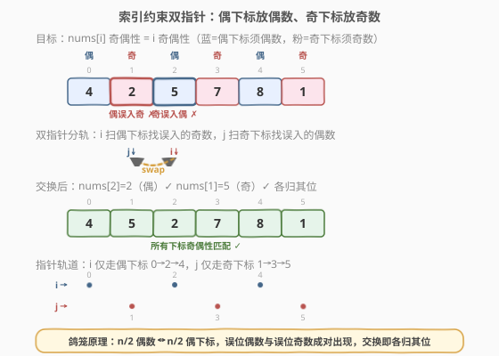
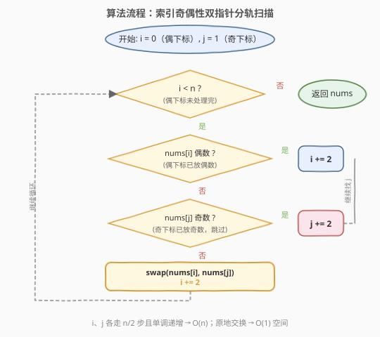

# 按奇偶排序数组 II

- **题目名称**：按奇偶排序数组 II
- **链接**：[922. 按奇偶排序数组 II](https://leetcode.cn/problems/sort-array-by-parity-ii/)
- **难度**：简单
- **标签**：数组、双指针

## 1. 题目概述

给定一个**非负整数**数组 `nums`，其中 `nums.length` 为偶数，且数组中**恰好一半元素是偶数、一半是奇数**。要求重排数组，使得对任意下标 `i`：

- `i` 为偶数时，`nums[i]` 为偶数；
- `i` 为奇数时，`nums[i]` 为奇数。

返回满足条件的**任一**答案数组。

**示例 1**：

```text
输入：nums = [4,2,5,7]
输出：[4,5,2,7]
解释：[4,7,2,5]、[2,5,4,7]、[2,7,4,5] 也会被视作正确答案。
```

**示例 2**：

```text
输入：nums = [2,3]
输出：[2,3]
```

**约束条件**：

- $2 \le \text{nums.length} \le 2 \times 10^4$
- `nums.length` 为偶数
- `nums` 中一半元素为偶数，另一半为奇数
- $0 \le \text{nums[i]} \le 1000$

> 💡 与 [905. 按奇偶排序数组](../0901-1000/905_按奇偶排序数组.md) 的关键区别：905 只要求"偶数在前、奇数在后"（**分区约束**），组内顺序与下标无关；922 要求"偶数在偶下标、奇数在奇下标"（**索引约束**），约束更强、更精确。这一区别直接决定了指针策略不同——905 用左右双指针端点收拢分区，922 用按索引奇偶性分轨的双指针。

---

## 2. 解题思路

### 2.1 暴力思路

新建一个长度为 `n` 的结果数组，遍历 `nums` 两遍：第一遍把偶数依次放到偶下标（0, 2, 4…），第二遍把奇数依次放到奇下标（1, 3, 5…）。时间 $O(n)$，空间 $O(n)$。能通过，但未做到原地。

另一种暴力是遍历偶下标，发现 `nums[i]` 为奇数时，再从头遍历找一个奇下标 `j` 使 `nums[j]` 为偶数并交换。内层最坏 $O(n)$，总 $O(n^2)$，更差。

### 2.2 核心观察：索引奇偶性双指针分轨（鸽笼配对）



本题的约束是**下标奇偶性与值奇偶性一一对应**，因此指针不应在端点收拢（905 的做法），而应**按索引奇偶性分两条轨道**：

- **`i` 轨道**：只走偶下标（0, 2, 4…），寻找"奇数误入偶下标"的位置（`nums[i]` 为奇数）。
- **`j` 轨道**：只走奇下标（1, 3, 5…），寻找"偶数误入奇下标"的位置（`nums[j]` 为偶数）。

当 `i` 找到一个误入的奇数时，必然存在某个奇下标 `j` 误入了一个偶数——**鸽笼原理**保证：

> 数组有 $n/2$ 个偶数和 $n/2$ 个偶下标。若某个偶下标被奇数占用，则偶数"多出一个"挤到了奇下标上。因此"误入偶下标的奇数"与"误入奇下标的偶数"**成对出现**，交换即各归其位。

> 💡 **循环不变式**：每轮处理偶下标 `i` 前，所有小于 `i` 的偶下标均已正确（放偶数）；`j` 始终指向尚未确认的奇下标，且 `j` 之前的奇下标均已正确。每次交换后 `nums[i]`、`nums[j]` 同时归位，`i`、`j` 各前进 2，不变式保持。

### 2.3 算法流程图



1. 初始化 `i = 0`（首个偶下标）、`j = 1`（首个奇下标）。
2. 当 `i < n`：
   - 若 `nums[i]` 为偶数（偶下标放偶数，正确），`i += 2`。
   - 否则 `nums[i]` 为奇数（误入偶下标）：在内层循环中让 `j` 沿奇下标前进，直到 `nums[j]` 为偶数（误入奇下标）；交换 `nums[i]` 与 `nums[j]`，随后 `i += 2`。
3. `i >= n` 时所有偶下标已正确；由鸽笼原理，奇下标也全部正确，返回 `nums`。

> ⚠️ **`j` 单调递增不回退**：`j` 只增不减，整个过程中 `j` 累计最多移动 $n/2$ 步。若让 `j` 每次从 1 重新扫描，会退化到 $O(n^2)$。

### 2.4 示例演算

![示例演算：nums = [4, 2, 5, 7]](../images/sort_parity2_walkthrough.svg)

以 `nums = [4, 2, 5, 7]` 为例（`n = 4`）：

| 步骤 | i | j | nums[i] | 操作 | 数组状态 |
|------|---|---|---------|------|----------|
| 1 | 0 | 1 | 4（偶） | 偶下标放偶数 ✓ → `i = 2` | `[4, 2, 5, 7]` |
| 2 | 2 | 1 | 5（奇） | 误入偶下标 ✗ → `j=1` 处 `nums[1]=2`（偶，误入奇下标）→ 交换 → `i = 4` | `[4, 5, 2, 7]` |
| — | 4 | — | — | `i >= n`，结束 | `[4, 5, 2, 7]` |

最终结果 `[4, 5, 2, 7]`：偶下标（0, 2）放偶数（4, 2），奇下标（1, 3）放奇数（5, 7），满足题意。

> 💡 第 2 步是关键：`i=2` 指向 5（奇数误入偶下标），此时 `j=1` 处的 2 恰好是偶数误入奇下标——两者互补，一次交换同时修复两个位置。这正是鸽笼配对的体现。

---

## 3. 参考代码

### C++

```cpp
class Solution {
  public:
    vector<int> sortArrayByParityII(vector<int>& nums) {
        int n = nums.size();
        int j = 1;
        for (int i = 0; i < n; i += 2) {
            if (nums[i] % 2 == 1) {
                while (nums[j] % 2 == 1) {
                    j += 2;
                }
                swap(nums[i], nums[j]);
            }
        }
        return nums;
    }
};
```

### Python

```python
class Solution:
    def sortArrayByParityII(self, nums: List[int]) -> List[int]:
        n = len(nums)
        j = 1
        for i in range(0, n, 2):
            if nums[i] % 2 == 1:
                while nums[j] % 2 == 1:
                    j += 2
                nums[i], nums[j] = nums[j], nums[i]
        return nums
```

> ⚠️ **内层 `while` 的终止性**：当 `nums[i]` 为奇数（偶下标误入奇数）时，鸽笼原理保证至少存在一个奇下标 `j` 使 `nums[j]` 为偶数，因此内层 `while` 必然终止，不会越界。`j` 无需重置——已确认正确的奇下标无需复查。

> 💡 **奇偶判定**：本题 $0 \le \text{nums[i]} \le 1000$（全非负），`nums[i] % 2` 结果非负，`% 2 == 1` 判奇、`% 2 == 0` 判偶安全。若数据含负数，C++ 中 `-3 % 2 == -1`，判奇应改用 `nums[i] % 2 != 0`。

---

## 4. 复杂度分析

| 维度 | 复杂度 | 说明 |
|------|--------|------|
| 时间复杂度 | $O(n)$ | `i` 走偶下标共 $n/2$ 步，`j` 走奇下标累计最多 $n/2$ 步，每个元素至多访问一次 |
| 空间复杂度 | $O(1)$ | 仅 `i`、`j` 两个指针变量，原地交换 |

---

## 5. 扩展：分区约束 vs 索引约束（905 与 922 对比）

905 与 922 仅一字之差，但约束模型不同，导致指针策略截然不同：

| | 905. 按奇偶排序数组 | 922. 按奇偶排序数组 II |
|---|---|---|
| 约束类型 | **分区约束**：偶数在前、奇数在后 | **索引约束**：偶数在偶下标、奇数在奇下标 |
| 组内顺序 | 不限 | 不限 |
| 位置精确性 | 只关心两段分界 | 关心每个下标的奇偶性 |
| 指针策略 | 左右双指针端点收拢 | 索引奇偶性分轨双指针 |
| 正确性依据 | 分区不变式 | 鸽笼配对（误位成对出现） |
| 空间 | $O(1)$ | $O(1)$ |

两者的共同点是都利用了"**顺序不限**"这一宽松条件做原地交换，避免了稳定排序的代价。区别在于 905 的"区"是连续的一段，而 922 的"区"是离散交错的下标集合——因此 905 的指针沿端点收拢，922 的指针沿下标奇偶性分轨前行。

---

## 6. 面试要点

1. **为什么用按索引奇偶性分轨的双指针，而不用 905 的左右双指针？**

   905 的目标是连续分区（偶数段在前），左右端点收拢天然形成分界。922 的目标是离散交错（偶下标放偶数），正确位置散布在整个数组中，没有连续的"分界线"可收拢。按索引奇偶性分轨——`i` 只看偶下标、`j` 只看奇下标——才能精准定位"值奇偶性与下标奇偶性不匹配"的位置。

2. **为什么 `j` 不用每次从 1 重新扫描？**

   `j` 之前的奇下标在上一轮交换后已确认正确（放奇数），无需复查。让 `j` 单调递增，累计移动不超过 $n/2$ 步，总复杂度保持 $O(n)$。若每次重置 `j = 1`，最坏 $O(n^2)$。

3. **内层 `while` 会不会越界或死循环？**

   不会。当 `nums[i]` 为奇数（偶下标误入奇数）时，由鸽笼原理，偶数比偶下标"少占"了一个位置，必然有偶数被挤到某个奇下标上——即存在 `j` 使 `nums[j]` 为偶数。因此内层 `while` 必在越界前找到目标，自然终止。

4. **只检查偶下标就够了吗？奇下标谁来保证？**

   鸽笼原理保证。偶数总数 = 偶下标总数 = $n/2$。当所有偶下标都放偶数后，$n/2$ 个偶数已全部就位，剩余位置（奇下标）只能是奇数。因此只需修复偶下标，奇下标自动正确。

5. **如果要求稳定（保持偶数之间、奇数之间的原始相对顺序）怎么办？**

   本题"顺序不限"所以能原地交换。若要求稳定，需用 $O(n)$ 辅助数组：一遍收集偶数、一遍收集奇数，再按偶/奇下标交替填回。原地交换会打乱相对顺序，无法保证稳定性。

---

## 7. 同类练习题

- [905. 按奇偶排序数组](https://leetcode.cn/problems/sort-array-by-parity/)（[站内题解](../0901-1000/905_按奇偶排序数组.md)）：分区约束版（偶在前、奇在后），左右双指针端点收拢，本题的前置题
- [283. 移动零](https://leetcode.cn/problems/move-zeroes/)（[站内题解](../0201-0300/283_移动零.md)）：快慢双指针分区（零与非零），双指针分区的另一应用
- [75. 颜色分类](https://leetcode.cn/problems/sort-colors/)（[站内题解](../0001-0100/75_颜色分类.md)）：三路分区（0/1/2），双指针分区的多类推广
- [27. 移除元素](https://leetcode.cn/problems/remove-element/)（[站内题解](../0001-0100/27_移除元素.md)）：快慢双指针原地覆写，与分轨双指针互补的指针范式
