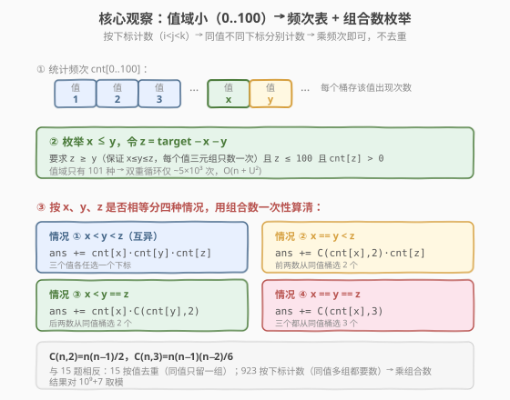
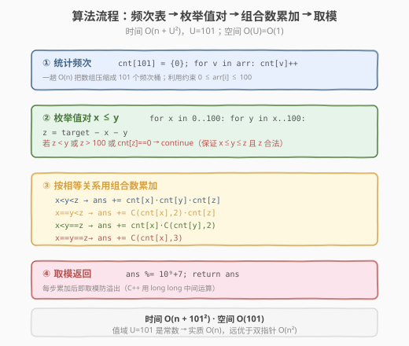

# 三数之和的多种可能

- **题目名称**：三数之和的多种可能
- **链接**：[923. 三数之和的多种可能](https://leetcode.cn/problems/3sum-with-multiplicity/)
- **难度**：中等
- **标签**：数组、哈希表、双指针、组合计数、数学

## 1. 题目概述

给定一个整数数组 `arr` 和一个整数 `target`，返回满足 `i < j < k` 且 `arr[i] + arr[j] + arr[k] == target` 的**下标三元组** `(i, j, k)` 的**个数**。由于结果可能很大，返回 `10^9 + 7` 的模。

**示例 1**：

```text
输入：arr = [1,1,2,2,3,3,4,4,5,5], target = 8
输出：20
解释：
按值枚举 (arr[i], arr[j], arr[k])：
(1, 2, 5) 出现 8 次；
(1, 3, 4) 出现 8 次；
(2, 2, 4) 出现 2 次；
(2, 3, 3) 出现 2 次。
```

**示例 2**：

```text
输入：arr = [1,1,2,2,2,2], target = 5
输出：12
解释：
arr[i] = 1, arr[j] = arr[k] = 2 出现 12 次：
从 [1,1] 中选一个 1，有 2 种；
从 [2,2,2,2] 中选两个 2，有 C(4,2)=6 种；2 × 6 = 12。
```

**约束条件**：

- `3 <= arr.length <= 3000`
- `0 <= arr[i] <= 100`
- `0 <= target <= 300`

> 💡 题名里的「多种可能」即 **multiplicity（多重性）**——同一个值在数组里可能出现多份，而题目要数的是**下标三元组的个数**，不是去重后的值三元组。这是它与 [15. 三数之和](../0001-0100/15_三数之和.md) 的根本分野：15 题按**值**去重（同值只留一组），923 题按**下标**计数（同值多组都要数）。再叠加约束 `arr[i] ∈ [0, 100]`——值域只有 101 种——把数组压成一张频次表后，枚举值对、套组合数即可 `O(n + U²)` 解决，比双指针 `O(n²)` 还快。

---

## 2. 解题思路

### 2.1 暴力思路：三重循环枚举下标

最直接的做法：三重循环枚举所有 `i < j < k`，判断三数之和是否等于 `target`，命中则计数。

```text
for i in 0..n:
    for j in i+1..n:
        for k in j+1..n:
            if arr[i]+arr[j]+arr[k]==target: count++
```

时间复杂度 `O(n^3)`，`n=3000` 时约 `2.7 × 10^10` 次运算，**严重超时**。

> ⚠️ 暴力法的问题在于「逐个下标枚举」——但题目数的是**下标三元组个数**，而非列举每个三元组。既然只数个数，就不必关心具体下标，只需关心「某个值出现了几次」。把视角从「下标」抬升到「值 + 频次」，重复元素就塌缩成一个计数问题。

### 2.2 核心观察：值域小 → 频次表 + 组合数枚举



两个关键转换：

1. **按下标计数 ⇔ 乘频次（组合数）**。题目要数 `i < j < k` 的下标三元组，但只关心三数之和。若三元组的三个值**互不相同**（`x < y < z`），则任选一个值为 `x` 的下标、一个值为 `y` 的、一个值为 `z` 的都合法——共 `cnt[x]·cnt[y]·cnt[z]` 个。若有两个值相同（如 `x == y < z`），前两数必须从同一个值桶里**选 2 个不同下标**，即 `C(cnt[x], 2)` 种，再乘 `cnt[z]`。三个全同则 `C(cnt[x], 3)`。**这正是「multiplicity」的计数本质。**

2. **值域只有 101 种**。约束 `0 <= arr[i] <= 100` 是显式提示：先一趟 `O(n)` 统计 `cnt[0..100]`，再在值域上双重循环枚举 `(x, y)`，令 `z = target - x - y`，校验 `z` 合法后套组合数即可。双重循环仅约 `101² / 2 ≈ 5×10³` 次，比 `O(n²)` 双指针还快一个量级。

**四种情况**（枚举时强制 `x ≤ y`，并要求 `z ≥ y`，保证每个无序值三元组只被数一次）：

| 情况 | 条件 | 贡献 |
|------|------|------|
| ① 互异 | `x < y < z` | `cnt[x]·cnt[y]·cnt[z]` |
| ② 前两同 | `x == y < z` | `C(cnt[x], 2)·cnt[z]` |
| ③ 后两同 | `x < y == z` | `cnt[x]·C(cnt[y], 2)` |
| ④ 三同 | `x == y == z` | `C(cnt[x], 3)` |

其中 $C(n, 2) = \dfrac{n(n-1)}{2}$，$C(n, 3) = \dfrac{n(n-1)(n-2)}{6}$。

> 💡 **为什么强制 `x ≤ y ≤ z` 能避免重复计数？** 一个无序值三元组 `{a, b, c}`（不计顺序）排序后唯一对应 `x ≤ y ≤ z`。我们只枚举这一种排列，于是每组值只被访问一次；相等关系（谁等于谁）由四种情况精确分摊，互不重叠。若不排序枚举，`(1,2,5)`、`(2,1,5)`、`(5,1,2)` 会重复数三遍。

### 2.3 算法流程图



**完整步骤**：

1. **统计频次**：`cnt[101] = {0}`，一趟遍历 `arr`，`cnt[v]++`，`O(n)`。
2. **枚举值对** `x ≤ y`：`x` 从 `0` 到 `100`，`y` 从 `x` 到 `100`。
   - 跳过 `cnt[x] == 0` 或 `cnt[y] == 0`。
   - 令 `z = target - x - y`。
   - **校验**：若 `z < y`（破坏 `x ≤ y ≤ z`）或 `z > 100` 或 `cnt[z] == 0`，`continue`。
3. **按四种情况累加**：依据 `x`、`y`、`z` 的相等关系套对应组合公式。
4. **取模返回**：每步累加后 `ans %= 10^9+7` 防 `long long` 溢出。

### 2.4 示例演算

以示例 1 `arr = [1,1,2,2,3,3,4,4,5,5]`，`target = 8` 为例。频次表每个值 `1..5` 都是 `2`。枚举 `x ≤ y ≤ z` 命中的四组：

![示例演算：arr = [1,1,2,2,3,3,4,4,5,5]，target = 8](../images/3sum_mult_example_walkthrough.svg)

| (x, y, z) | z = 8−x−y | 情况 | 计算 | 贡献 |
|-----------|-----------|------|------|------|
| (1, 2, 5) | 5 | ① 互异 | 2·2·2 | 8 |
| (1, 3, 4) | 4 | ① 互异 | 2·2·2 | 8 |
| (2, 2, 4) | 4 | ② 前两同 | C(2,2)·2 = 1·2 | 2 |
| (2, 3, 3) | 3 | ③ 后两同 | 2·C(2,2) = 2·1 | 2 |

合计 `8 + 8 + 2 + 2 = 20`，与示例一致。其余枚举（如 `(2,4,2)`、`(1,5,2)`）因 `z < y` 不满足 `x ≤ y ≤ z` 而跳过；不存在 `x == y == z` 命中（需 `3x = 8`，无整数解）。

> 💡 留意 `(1,2,5)` 贡献 8 而非 1：数组里有两个 1、两个 2、两个 5，任选其一即 `2·2·2 = 8` 个**下标**三元组。这正是「multiplicity」——同值多份分别计数，与 15 题「同值只留一组」相反。

---

## 3. 参考代码

### C++

```cpp
// 三数之和的多种可能.cpp —— 值域频次表 + 组合数枚举
// 编译: g++ -O2 -std=c++17 三数之和的多种可能.cpp -o tsm
#include <vector>
using namespace std;

class Solution {
    static constexpr long long MOD = 1e9 + 7;
  public:
    int threeSumMulti(vector<int>& arr, int target) {
        long long cnt[101] = {0};
        for (int v : arr) cnt[v]++;                 // ① 频次表
        long long ans = 0;
        for (int x = 0; x <= 100; ++x) {            // ② 枚举 x <= y
            if (cnt[x] == 0) continue;
            for (int y = x; y <= 100; ++y) {
                if (cnt[y] == 0) continue;
                int z = target - x - y;
                if (z < y || z > 100 || cnt[z] == 0) continue;  // 保证 x<=y<=z 且 z 合法
                if (x < y && y < z) {               // ① 互异
                    ans += cnt[x] * cnt[y] * cnt[z];
                } else if (x == y && y < z) {       // ② 前两同
                    ans += cnt[x] * (cnt[x] - 1) / 2 * cnt[z];
                } else if (x < y && y == z) {       // ③ 后两同
                    ans += cnt[x] * cnt[y] * (cnt[y] - 1) / 2;
                } else {                            // ④ x == y == z
                    ans += cnt[x] * (cnt[x] - 1) * (cnt[x] - 2) / 6;
                }
                ans %= MOD;
            }
        }
        return (int)ans;
    }
};
```

### Python

```python
class Solution:
    def threeSumMulti(self, arr: list[int], target: int) -> int:
        MOD = 10**9 + 7
        cnt = [0] * 101
        for v in arr:                       # ① 频次表
            cnt[v] += 1
        ans = 0
        for x in range(101):                # ② 枚举 x <= y
            if cnt[x] == 0:
                continue
            for y in range(x, 101):
                if cnt[y] == 0:
                    continue
                z = target - x - y
                if z < y or z > 100 or cnt[z] == 0:   # 保证 x<=y<=z 且 z 合法
                    continue
                if x < y < z:              # ① 互异
                    ans += cnt[x] * cnt[y] * cnt[z]
                elif x == y < z:           # ② 前两同
                    ans += cnt[x] * (cnt[x] - 1) // 2 * cnt[z]
                elif x < y == z:           # ③ 后两同
                    ans += cnt[x] * cnt[y] * (cnt[y] - 1) // 2
                else:                      # ④ x == y == z
                    ans += cnt[x] * (cnt[x] - 1) * (cnt[x] - 2) // 6
                ans %= MOD
        return ans
```

> ⚠️ Python 的链式比较 `x == y < z` 等价于 `x == y and y < z`，正好对应「前两同且第三更大」，无需写成 `x == y and y < z`。C++ 不支持链式比较，须显式 `&&`。另外 `C(n,3)` 的中间积 `n(n-1)(n-2)` 在 `n=3000` 时约 `2.7×10^10`，超过 32 位 `int` 上界，故 C++ 中 `cnt` 与 `ans` 都用 `long long`。

---

## 4. 复杂度分析

| 维度 | 复杂度 | 说明 |
|------|--------|------|
| **时间复杂度** | `O(n + U²)`，`U = 101` | 统计频次 `O(n)` + 值域双重循环 `O(101²)`；`U` 为常数，实质 `O(n)` |
| **空间复杂度** | `O(U) = O(1)` | 频次数组 `cnt[101]`，定长 |
| **对比双指针** | 双指针 `O(n²)` | `n=3000` 时约 `9×10^6`；频次法 `O(n+10^4)` 更优，得益于值域约束 |

> ⚠️ 能用频次法的前提是**值域小**（本题 `0..100`）。若值域与 `n` 同阶（如 `arr[i]` 到 `10^9`），频次表不可行，应退回排序 + 双指针计数 `O(n²)`，见第 5 节。识别「值域是否小」是本题选型的关键。

---

## 5. 扩展：排序双指针计数法（值域大时退化用）

当 `arr[i]` 取值范围很大、频次表不可行时，可沿用 [15. 三数之和](../0001-0100/15_三数之和.md) 的排序 + 双指针骨架，但把「记录去重三元组」改成「命中时按重复值计数」：

1. **排序** `arr` 升序。
2. **固定** `i`，令 `left = i+1`、`right = n-1`，目标 `t = target - arr[i]`。
3. 双指针夹逼：
   - 若 `arr[left] + arr[right] < t`：`left++`。
   - 若 `arr[left] + arr[right] > t`：`right--`。
   - 若相等：此时 `[left, right]` 间可能有一段连续的相同 `arr[left]` 与相同 `arr[right]`。
     - 若 `arr[left] == arr[right]`：这一段共 `m = right - left + 1` 个同值，可任选 2 个，贡献 `C(m, 2)`，随后 `break`（整段已处理完）。
     - 否则统计左侧同值个数 `cl`、右侧同值个数 `cr`，贡献 `cl * cr`，然后 `left += cl`、`right -= cr`。
4. 全程累加取模。

时间 `O(n²)`，空间 `O(log n)`（排序栈）。与 [611. 有效三角形的个数](https://leetcode.cn/problems/valid-triangle-number/) 的「固定最大边 + 双指针计数」同源，只是 611 数的是 `<` 关系（区间一次性计数），923 数的是 `==` 关系（左右同值段相乘）。

| 题目 | 关系 | 计数方式 | 值域要求 |
|------|------|----------|----------|
| 15 三数之和 | `== 0` | 去重后列举 | 无（排序 + 双指针） |
| 611 有效三角形 | `< nums[k]` | 区间 `right-left` 一次性计数 | 无 |
| 923 三数之和多种可能 | `== target` | 左右同值段 `cl·cr` 相乘 | 小值域可 `O(n+U²)` |

> 💡 923 的双指针版与频次版**结果一致**，只是把「按值枚举」换成「按下标排序后扫描」。频次版利用了小值域，更优雅且更快；双指针版通用，值域大时是首选。

---

## 6. 面试要点

1. **923 与 15 三数之和的本质区别是什么？**

   - 15 题返回**不重复的值三元组**，需按值去重（同值只留一组），用排序 + 双指针 + 跳过相邻重复。
   - 923 题返回**下标三元组的个数**，同值不同下标要分别计数，**不去重**，反而要乘频次（组合数）。这正是题名「multiplicity（多重性）」的含义。理解这一「去重 vs 计数」的分野是本题第一要点。

2. **为什么能 `O(n + U²)` 而不是 `O(n²)`？**

   - 约束 `0 <= arr[i] <= 100` 把值域压到 `U = 101` 种。先 `O(n)` 统计频次，再在值域上 `O(U²)` 枚举值对，每个值对 `O(1)` 套组合数。`U` 是常数，故实质 `O(n)`。双指针法 `O(n²)` 没有利用值域约束，本题不是最优。
   - 识别「值域是否小」是选型关键：值域小用频次法，值域大退回双指针。

3. **四种情况为什么互不重叠、不重不漏？**

   - 枚举强制 `x ≤ y` 并校验 `z ≥ y`，于是 `x ≤ y ≤ z` 唯一确定一个无序值三元组的排序形态。`x`、`y`、`z` 三者的相等关系只有四种：全异、前两同、后两同、全同，恰好对应四种组合公式，逻辑上完备互斥。
   - 排序枚举保证每组值只访问一次，不会把 `(1,2,5)` 和 `(2,1,5)` 重复数。

4. **组合数 `C(n,2)`、`C(n,3)` 的溢出如何处理？**

   - `n` 最多 `3000`，`C(3000,3) = 3000·2999·2998/6 ≈ 4.5×10^9`，超过 32 位 `int` 上界（`~2.1×10^9`），也超过 `10^9+7`。C++ 用 `long long` 存中间积与答案，每步累加后 `% MOD`。因 `n(n-1)` 必为偶、`n(n-1)(n-2)` 必被 6 整除，先做整数除法再取模安全。Python 大整数无溢出，最后取模即可。

5. **校验 `z < y` 那条 `continue` 起什么作用？**

   - 它保证 `z ≥ y`，即维持 `x ≤ y ≤ z` 的枚举顺序。若去掉，`z < y` 的值三元组会在另一轮枚举（以那个更小值为 `x`）时被数到，导致重复。它和「枚举 `y` 从 `x` 开始」一起构成「只数排序形态」的不变式，是避免重复计数的核心。

> 💡 **一句话总结**：923 是「三数之和的计数版」——把「按下标枚举」抬升为「按值 + 频次」，同值多份用组合数 `C(n,2)`/`C(n,3)` 一次性算清；再叠加 `arr[i] ∈ [0,100]` 的小值域，用频次表把 `O(n²)` 压成 `O(n + U²)`。它是「识别值域约束 + 组合计数」的招牌题，与 15 的「去重」、611 的「区间计数」形成三数之和要求三态的经典对照。

---

## 7. 同类练习题

- [15. 三数之和](https://leetcode.cn/problems/3sum/)（[题解](../0001-0100/15_三数之和.md)）：三数之和的「去重列举版」，对照 923 的「计数版」——去重 vs 乘频次
- [611. 有效三角形的个数](https://leetcode.cn/problems/valid-triangle-number/)：排序 + 固定最大边 + 双指针计数，`<` 关系的区间一次性计数，与 923 的 `==` 计数同源
- [1. 两数之和](https://leetcode.cn/problems/two-sum/)：哈希一次遍历的鼻祖，923 是其「三数 + 多重性」的延伸
- [454. 四数相加 II](https://leetcode.cn/problems/4sum-ii/)（[题解](../0401-0500/454_四数相加%20II.md)）：分组 + 哈希 Meet-in-the-Middle 计数，同属「只数个数、不列举」的计数型 k-sum
