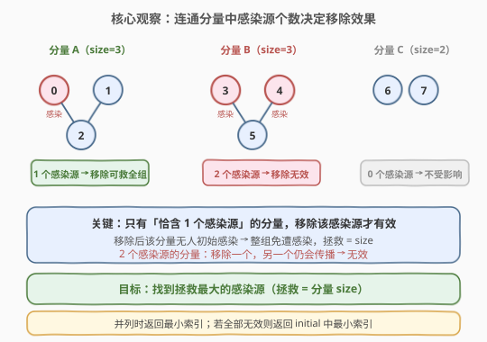
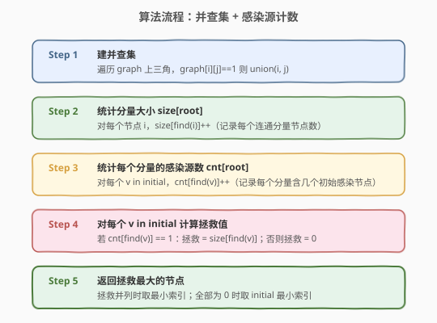
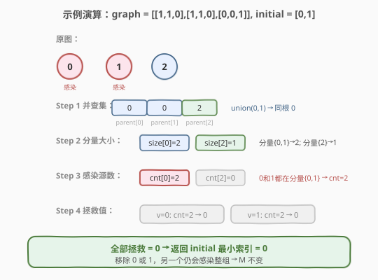

# LeetCode 尽量减少恶意软件的传播 题解

## 1. 题目概述

- **标题 / 题号**：尽量减少恶意软件的传播（#924，hard）
- **链接**：https://leetcode.cn/problems/minimize-malware-spread/
- **难度**：困难
- **标签**：并查集、图、深度优先搜索

**题意**：给出一个由 `n` 个节点组成的网络，用 `n × n` 邻接矩阵 `graph` 表示。当 `graph[i][j] = 1` 时，表示节点 `i` 与节点 `j` **直接连接**。

一些节点 `initial` 最初被恶意软件感染。只要两个节点直接连接且其中至少一个被感染，两个节点都将被感染。传播持续到没有更多节点可被感染为止。

假设 `M(initial)` 是传播停止后整个网络中感染节点的最终数量。如果从 `initial` 中**移除某一节点**能使 `M(initial)` 最小化，返回该节点。如果有多个节点满足条件，返回索引最小的节点。

> ⚠️ 注意：被移除的节点仅从 `initial` 列表中删除，它仍可能因其他感染源传播而被感染。

**示例 1**：

```text
输入：graph = [[1,1,0],[1,1,0],[0,0,1]], initial = [0,1]
输出：0
解释：节点 0、1 相连同属一个分量，节点 2 独立。
     移除 0 → initial=[1]，节点 1 仍感染整组 {0,1}，M=2。
     移除 1 → initial=[0]，节点 0 仍感染整组 {0,1}，M=2。
     两者并列，返回最小索引 0。
```

**示例 2**：

```text
输入：graph = [[1,0,0],[0,1,0],[0,0,1]], initial = [0,2]
输出：0
解释：三个节点各自独立。
     移除 0 → initial=[2]，M=1。
     移除 2 → initial=[0]，M=1。
     两者并列，返回最小索引 0。
```

**示例 3**：

```text
输入：graph = [[1,1,1],[1,1,1],[1,1,1]], initial = [1,2]
输出：1
解释：三个节点全连通，同属一个分量。
     移除 1 → initial=[2]，节点 2 仍感染整组，M=3。
     移除 2 → initial=[1]，节点 1 仍感染整组，M=3。
     两者并列，返回最小索引 1。
```

**约束**：

- `n == graph.length`
- `n == graph[i].length`
- `2 <= n <= 300`
- `graph[i][j]` 为 `0` 或 `1`
- `graph[i][j] == graph[j][i]`
- `graph[i][i] == 1`
- `1 <= initial.length <= n`
- `0 <= initial[i] <= n - 1`
- `initial` 中所有整数均不重复

## 2. 解题思路

### 2.1 暴力思路

对 `initial` 中每个节点 `v`，模拟「移除 `v` 后」的感染传播过程：从 `initial \ {v}` 出发做 BFS/DFS 标记所有可达节点，统计感染总数 `M`，取使 `M` 最小的 `v`。时间复杂度 $O(|\text{initial}| \times n^2)$，当 `n = 300` 时约 $300 \times 300^2 = 2.7 \times 10^7$，勉强能过但**没有利用问题的结构**。

> 💡 关键观察：感染传播的范围恰好是**感染源所在的整个连通分量**。因此我们不需要逐个模拟 BFS，只需分析每个连通分量中含几个感染源即可。

### 2.2 核心观察：连通分量中感染源个数决定移除效果



将网络看作无向图，用**并查集**求出所有连通分量。对每个连通分量，统计其中包含几个 `initial` 感染源：

| 分量含感染源数 | 移除一个感染源的效果 |
|---------------|---------------------|
| **恰好 1 个** | 移除后该分量无初始感染源 → 整组免遭感染，**拯救 = 分量大小** |
| **≥ 2 个** | 移除一个，另一个仍会传播 → 整组仍被感染，**拯救 = 0** |
| **0 个** | 该分量本就不受影响，无需考虑 |

因此，**最优策略**是：在所有「恰含 1 个感染源」的分量中，找到分量最大的那个，移除其感染源。若并列（拯救值相同），返回最小索引。若所有感染源所在分量都含 ≥ 2 个感染源（全部拯救 = 0），返回 `initial` 中最小索引。

> 💡 直觉：这题本质是 547「省份数量」的进阶——先并查集求连通分量，再在分量维度上分析感染源分布。**问题降维**：从「逐节点模拟传播」简化为「逐分量统计感染源个数」。

### 2.3 算法流程图



### 2.4 示例演算



以 `graph = [[1,1,0],[1,1,0],[0,0,1]], initial = [0,1]` 为例：

1. **建并查集**：`union(0,1)` → `parent = [0,0,2]`，两个分量 `{0,1}` 和 `{2}`。
2. **分量大小**：`size[0] = 2`（根 0 代表分量 `{0,1}`），`size[2] = 1`。
3. **感染源计数**：节点 0 的根是 0，节点 1 的根也是 0 → `cnt[0] = 2`；`cnt[2] = 0`。
4. **拯救值**：
   - `v=0`：`cnt[find(0)] = cnt[0] = 2 ≠ 1` → 拯救 = 0
   - `v=1`：`cnt[find(1)] = cnt[0] = 2 ≠ 1` → 拯救 = 0
5. **结果**：全部拯救 = 0，返回 `initial` 最小索引 = **0**。

## 3. 参考代码

### C++（并查集 + 路径压缩 + 按秩合并）

```cpp
class UnionFind {
  public:
    vector<int> parent;
    vector<int> rank_;

    UnionFind(int n) {
        parent.resize(n);
        rank_.assign(n, 0);
        for (int i = 0; i < n; i++) parent[i] = i;
    }

    int find(int x) {
        if (parent[x] != x) parent[x] = find(parent[x]); // 路径压缩
        return parent[x];
    }

    void unite(int x, int y) {
        int rx = find(x), ry = find(y);
        if (rx == ry) return;
        if (rank_[rx] < rank_[ry]) parent[rx] = ry;       // 按秩合并
        else if (rank_[rx] > rank_[ry]) parent[ry] = rx;
        else { parent[ry] = rx; rank_[rx]++; }
    }
};

class Solution {
  public:
    int minMalwareSpread(vector<vector<int>>& graph, vector<int>& initial) {
        int n = graph.size();
        UnionFind uf(n);

        // Step 1: 建并查集
        for (int i = 0; i < n; i++)
            for (int j = i + 1; j < n; j++)
                if (graph[i][j] == 1) uf.unite(i, j);

        // Step 2: 统计每个分量大小
        vector<int> size(n, 0);
        for (int i = 0; i < n; i++) size[uf.find(i)]++;

        // Step 3: 统计每个分量的感染源数
        vector<int> cnt(n, 0);
        for (int v : initial) cnt[uf.find(v)]++;

        // Step 4: 对每个感染源计算拯救值，取最大
        int ans = initial[0], maxSave = -1;
        for (int v : initial) {
            int r = uf.find(v);
            int save = (cnt[r] == 1) ? size[r] : 0;
            if (save > maxSave || (save == maxSave && v < ans)) {
                maxSave = save;
                ans = v;
            }
        }
        return ans;
    }
};
```

### Python（并查集 + 路径压缩）

```python
class Solution:
    def minMalwareSpread(self, graph: List[List[int]], initial: List[int]) -> int:
        n = len(graph)
        parent = list(range(n))

        def find(x):
            while parent[x] != x:
                parent[x] = parent[parent[x]]   # 路径压缩（隔代压缩）
                x = parent[x]
            return x

        def union(x, y):
            rx, ry = find(x), find(y)
            if rx != ry:
                parent[rx] = ry

        # Step 1: 建并查集
        for i in range(n):
            for j in range(i + 1, n):
                if graph[i][j] == 1:
                    union(i, j)

        # Step 2: 统计每个分量大小
        size = [0] * n
        for i in range(n):
            size[find(i)] += 1

        # Step 3: 统计每个分量的感染源数
        cnt = [0] * n
        for v in initial:
            cnt[find(v)] += 1

        # Step 4: 对每个感染源计算拯救值，取最大
        ans, max_save = initial[0], -1
        for v in initial:
            r = find(v)
            save = size[r] if cnt[r] == 1 else 0
            if save > max_save or (save == max_save and v < ans):
                max_save = save
                ans = v
        return ans
```

## 4. 复杂度分析

| 维度 | 复杂度 | 说明 |
|------|--------|------|
| 时间复杂度 | $O(n^2 \alpha(n))$ | 遍历邻接矩阵上三角 $\frac{n(n-1)}{2}$ 对建并查集，每次 `union/find` 均摊 $O(\alpha(n))$；后续统计为 $O(n + |\text{initial}|)$ |
| 空间复杂度 | $O(n)$ | `parent`、`rank`、`size`、`cnt` 数组各 $O(n)$ |

> 💡 由于 $\alpha(n) \le 5$（本题范围内），实际等同于 $O(n^2)$，与暴力 BFS 模拟同阶但常数更小，且代码更简洁。瓶颈在于遍历邻接矩阵，无法回避。

## 5. 扩展：DFS 解法与问题变体

### 5.1 DFS 解法

不用并查集，直接用 DFS/BFS 求连通分量，对每个分量记录大小和感染源数：

```cpp
class Solution {
  public:
    int minMalwareSpread(vector<vector<int>>& graph, vector<int>& initial) {
        int n = graph.size();
        vector<int> vis(n, -1);       // vis[i] = 分量编号
        vector<int> compSize;         // 每个分量的大小
        vector<int> compInit;         // 每个分量的感染源数

        // 感染源集合，快速判定
        vector<bool> isInit(n, false);
        for (int v : initial) isInit[v] = true;

        int compId = 0;
        for (int i = 0; i < n; i++) {
            if (vis[i] == -1) {
                int sz = 0, initCnt = 0;
                dfs(graph, vis, i, compId, sz, initCnt, isInit);
                compSize.push_back(sz);
                compInit.push_back(initCnt);
                compId++;
            }
        }

        int ans = initial[0], maxSave = -1;
        for (int v : initial) {
            int c = vis[v];
            int save = (compInit[c] == 1) ? compSize[c] : 0;
            if (save > maxSave || (save == maxSave && v < ans)) {
                maxSave = save;
                ans = v;
            }
        }
        return ans;
    }
    void dfs(vector<vector<int>>& g, vector<int>& vis, int u,
             int compId, int& sz, int& initCnt, vector<bool>& isInit) {
        vis[u] = compId;
        sz++;
        if (isInit[u]) initCnt++;
        for (int v = 0; v < (int)g.size(); v++)
            if (g[u][v] == 1 && vis[v] == -1)
                dfs(g, vis, v, compId, sz, initCnt, isInit);
    }
};
```

### 5.2 对比 LeetCode 928「尽量减少恶意软件的传播 II」

924 与 928 的区别在于「移除」的语义：

| | 924 | 928 |
|---|-----|-----|
| 移除方式 | 从 `initial` 列表删除 | 从**整个网络**中删除（节点及所有连边） |
| 移除后节点状态 | 仍可被其他感染源传播感染 | 彻底不存在，不会感染也不会传播 |
| 核心策略 | 找「恰含 1 感染源」的最大分量 | 需模拟每个节点移除后对网络结构的影响 |

> ⚠️ 928 更复杂：移除节点会**改变图结构**，可能把一个连通分量切成多个。不能简单用并查集预处理，需要更细致的分析。

## 6. 面试要点

1. **为什么「恰含 1 个感染源」的分量移除后整组免遭感染？**

   - 感染传播的范围 = 感染源所在连通分量。若分量中只有 1 个初始感染源，移除它后该分量内无任何初始感染源，传播无从开始，整组安全。若有 ≥ 2 个，移除一个仍有其他感染源会传播到全组。

2. **为什么不用逐个 BFS 模拟移除后的传播？**

   - BFS 模拟每次 $O(n^2)$，总共 $O(|\text{initial}| \times n^2)$。利用并查集预处理连通分量后，问题降维为「逐分量统计感染源数」，总复杂度 $O(n^2 \alpha(n))$，更高效且代码简洁。

3. **如果所有感染源所在分量都含 ≥ 2 个感染源怎么办？**

   - 此时移除任何单个感染源都不会减少 `M`（拯救全为 0），按题意返回 `initial` 中最小索引。

4. **为什么需要先统计 `size` 再统计 `cnt`，能否合并？**

   - `size` 需要对**所有节点**遍历统计（每个节点属于某个分量），`cnt` 只需对 `initial` 遍历。两者数据源不同，分开统计逻辑更清晰。也可以在建并查集时顺带维护 `size`（按 size 合并），省一次遍历。

5. **并查集在这里相比 DFS 的优势是什么？**

   - 本题图是静态的，DFS 和并查集都能 $O(n^2)$ 求连通分量。并查集的优势在于模板复用性高（547、684、721 等题共用），且代码更短。若图是动态加边的，并查集是唯一选择。

## 同类练习题

| # | 题目 | 与本题的关联 |
|---|------|-------------|
| 547 | [省份数量](https://leetcode.cn/problems/number-of-provinces/) | 并查集求连通分量个数，本题的前置模板题 |
| 684 | [冗余连接](https://leetcode.cn/problems/redundant-connection/) | 并查集判环，union 失败即冗余边 |
| 928 | [尽量减少恶意软件的传播 II](https://leetcode.cn/problems/minimize-malware-spread-ii/) | 本题变体，移除节点改变图结构，难度更高 |
| 1319 | [连通网络的操作次数](https://leetcode.cn/problems/number-of-operations-to-make-network-connected/) | 并查集统计连通分量，求最少接线数 |
| 721 | [账户合并](https://leetcode.cn/problems/accounts-merge/) | 并查集合并同账户邮箱，模板进阶应用 |
