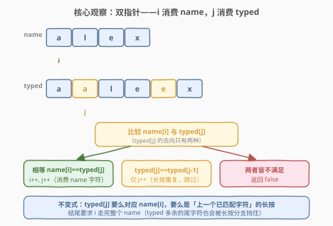
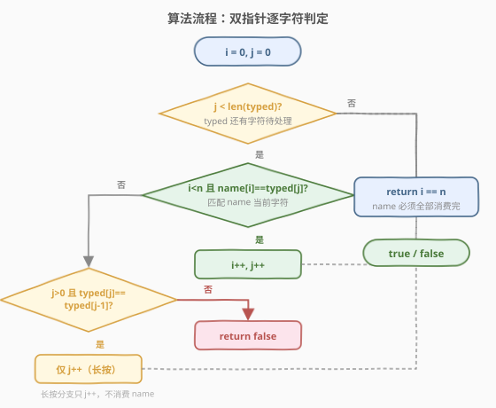
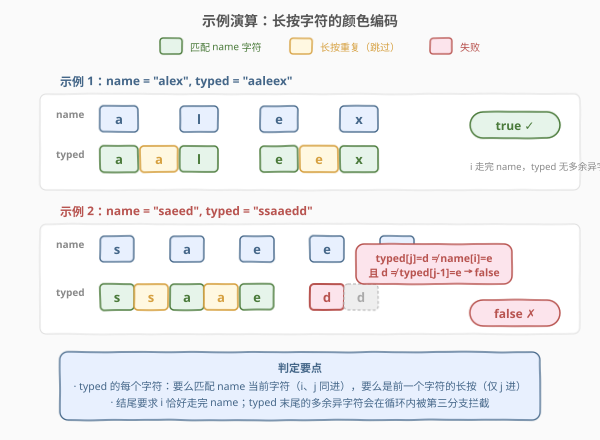

# LeetCode 长按键入 题解

## 1. 题目概述

- **标题 / 题号**：长按键入（#925，easy）
- **链接**：https://leetcode.cn/problems/long-pressed-name/
- **难度**：简单
- **标签**：双指针、字符串

**题意**：你的朋友正在用键盘输入他的名字 `name`。偶尔在键入字符 `c` 时，按键可能被**长按**，导致 `c` 被输入 1 次或多次。给定实际键盘输入 `typed`，判断它是否可能是 `name`（其中某些字符可能被长按），是则返回 `true`。

> **本质**：`typed` 是 `name` 的「**字符保序、允许同字符重复扩展**」版本——每个 `name` 的字符在 `typed` 中至少出现一次，且只能「**多打几个同样的字符**」，不能出现 `name` 中没有的字符，也不能改变字符的相对顺序。

**示例 1**：

```text
输入：name = "alex", typed = "aaleex"
输出：true
解释：'alex' 中的 'a' 和 'e' 被长按（typed 中各自多打了一遍）。

name:  a l e x
typed: a a l e e x
        ^     ^  ← 多打的长按字符
```

**示例 2**：

```text
输入：name = "saeed", typed = "ssaaedd"
输出：false
解释：'e' 一定需要被键入两次，但在 typed 的输出中 'e' 只出现了一次。

name:  s a e e d
typed: s s a a e d d
                 ↑ typed[j]=d 时 name[i]=e，d≠e 且 d≠前一个字符 e → 失败
```

**约束**：

- `1 <= name.length, typed.length <= 1000`
- `name` 和 `typed` 的字符都是小写字母

> 💡 本题与 [844. 比较含退格的字符串](https://leetcode.cn/problems/backspace-string-compare/) 是「双指针处理字符串变形」的姐妹题：844 用退格「删字符」，925 用长按「加字符」。两者都用双指针在线扫描，区别在于 844 逆序跳过被删字符、925 顺序跳过长按重复。把握住「**typed 的字符去向只有两种**」就能把判定做到 `O(n)` 一次扫描。

## 2. 解题思路

### 2.1 暴力思路：逐段切分比较

最直观的做法：把 `name` 和 `typed` 各自按「**连续相同字符**」切分成段，得到两组 `(字符, 出现次数)`，然后逐段比对：

```text
group(name)  = [(a,1), (l,1), (e,1), (x,1)]
group(typed) = [(a,2), (l,1), (e,2), (x,1)]
```

判定条件：两串段数相同、每段字符相同、且 `typed` 每段次数 `>= name` 对应段次数。

这个思路正确且清晰，但需要**预处理出全部段**后再比较，空间 `O(段数)`，且实现上要处理切分逻辑（计数连续相同字符），代码偏长。

> ⚠️ 切分法的问题在于「**先把变形全部展开再比对**」，没有利用「逐字符即时判定」的增量性。其实我们完全可以在扫描 `typed` 的同时**即时**判断每个字符的合法性——能匹配就匹配、是长按就跳过、否则立即失败。这就是双指针的增量判定思路。

### 2.2 核心观察：双指针——i 消费 name，j 消费 typed



关键洞察：用两个指针 `i`（遍历 `name`）、`j`（遍历 `typed`）。对于 `typed[j]` 这个字符，它的**合法去向只有两种**：

1. **匹配 `name[i]`**：`typed[j] == name[i]`，说明这个字符对应 `name` 的当前字符 → `i++`、`j++`（同时推进，消费掉一个 `name` 字符）。
2. **长按重复**：`typed[j] == typed[j-1]`（且 `j > 0`），说明这个字符是前一个字符的长按 → **仅 `j++`**（跳过，不消费 `name` 字符）。

> 如果两种去向都不满足——`typed[j]` 既不等于 `name[i]`，又不等于前一个已处理字符 `typed[j-1]`——说明 `typed` 出现了 `name` 中没有的字符（或顺序错乱），**立即返回 `false`**。

扫描结束后，**要求 `i` 恰好走完整个 `name`**（`i == len(name)`）。因为只有 `name` 的字符全部被消费完，才能保证 `typed` 没有遗漏 `name` 的任何字符。

> 💡 **为什么只检查 `i` 走完，不检查 `j` 走完？** 循环条件本身就是 `j < len(typed)`，循环正常退出时 `j` 一定走完了 `typed`。所以只需补查 `i == len(name)` 即可——若 `i` 没走完，说明 `typed` 比 `name`「短了」（某些 `name` 字符在 `typed` 中根本没出现），应判 `false`。

### 2.3 算法流程图



**主循环**（`while j < len(typed)`）：

1. **若 `i < n` 且 `name[i] == typed[j]`**：匹配成功 → `i++`，`j++`。
2. **否则若 `j > 0` 且 `typed[j] == typed[j-1]`**：长按重复 → 仅 `j++`。
3. **否则**：两种去向都不满足 → `return false`。

**收尾**：循环结束后 `return i == n`（`name` 是否被完整消费）。

> ⚠️ 两个判定顺序不能颠倒：**先判匹配、再判长按**。因为「匹配」会同时推进 `i` 和 `j`，是「正常消费」；而「长按」只推进 `j`，是「跳过冗余」。先尝试正常消费，消费不了再判是否为冗余，逻辑才自洽。若先判长按，会把本该匹配 `name[i]` 的字符误判为长按，导致 `name` 字符被「漏消费」。

### 2.4 示例演算

以两个官方示例对照执行过程，用颜色编码区分每个 `typed` 字符的去向：



**示例 1** `name = "alex"`, `typed = "aaleex"` → `true`：

| 步骤 | `name[i]` | `typed[j]` | 判定 | `i` | `j` |
|------|-----------|------------|------|-----|-----|
| 0 | a | a | 匹配 → i++, j++ | 1 | 1 |
| 1 | l | a | 不匹配；typed[j]==typed[j-1]==a → 长按，仅 j++ | 1 | 2 |
| 2 | l | l | 匹配 → i++, j++ | 2 | 3 |
| 3 | e | e | 匹配 → i++, j++ | 3 | 4 |
| 4 | x | e | 不匹配；typed[j]==typed[j-1]==e → 长按，仅 j++ | 3 | 5 |
| 5 | x | x | 匹配 → i++, j++ | 4 | 6 |
| 结束 | — | j=6 越界退出 | `i==4==n` → **true** | 4 | 6 |

**示例 2** `name = "saeed"`, `typed = "ssaaedd"` → `false`：

| 步骤 | `name[i]` | `typed[j]` | 判定 | `i` | `j` |
|------|-----------|------------|------|-----|-----|
| 0 | s | s | 匹配 → i++, j++ | 1 | 1 |
| 1 | a | s | 不匹配；typed[j]==typed[j-1]==s → 长按，仅 j++ | 1 | 2 |
| 2 | a | a | 匹配 → i++, j++ | 2 | 3 |
| 3 | e | a | 不匹配；typed[j]==typed[j-1]==a → 长按，仅 j++ | 2 | 4 |
| 4 | e | e | 匹配 → i++, j++ | 3 | 5 |
| 5 | e | d | 不匹配；typed[j]=d ≠ typed[j-1]=e → **第三分支，return false** | 3 | 5 |

> 💡 留意示例 2 第 5 步：`typed[5]=d` 既不等于 `name[3]=e`（匹配失败），又不等于 `typed[4]=e`（不是长按重复），两个去向都走不通，立即判 `false`。这正是「`typed` 出现了 `name` 中没有的字符」的典型拦截点。

## 3. 参考代码

### C++

```cpp
// 长按键入.cpp —— 双指针：i 消费 name，j 消费 typed
// 编译: g++ -O2 -std=c++17 长按键入.cpp -o lpn
#include <string>
using namespace std;

class Solution {
  public:
    bool isLongPressedName(string name, string typed) {
        int i = 0, j = 0;
        int n = name.size(), m = typed.size();
        while (j < m) {
            if (i < n && name[i] == typed[j]) {
                i++, j++;                      // 匹配 name 当前字符，同时推进
            } else if (j > 0 && typed[j] == typed[j - 1]) {
                j++;                           // 长按重复，仅推进 j
            } else {
                return false;                  // 两种去向都不满足
            }
        }
        return i == n;                         // name 必须被完整消费
    }
};
```

### Python

```python
class Solution:
    def isLongPressedName(self, name: str, typed: str) -> bool:
        i, j = 0, 0
        n, m = len(name), len(typed)
        while j < m:
            if i < n and name[i] == typed[j]:
                i, j = i + 1, j + 1            # 匹配 name 当前字符，同时推进
            elif j > 0 and typed[j] == typed[j - 1]:
                j += 1                         # 长按重复，仅推进 j
            else:
                return False                   # 两种去向都不满足
        return i == n                          # name 必须被完整消费
```

> 💡 两份代码结构完全对称：主循环用 `j` 驱动（保证 `typed` 全程被扫描完），三分支 `if / elif / else` 对应「匹配 / 长按 / 失败」。注意 `i < n` 的前置守卫写在匹配分支里——当 `name` 已消费完但 `typed` 还有字符时，匹配分支自然短路，转而由长按分支处理 `typed` 末尾的合法重复；若末字符不是重复则走 `else` 返回 `false`。

## 4. 复杂度分析

| 维度 | 复杂度 | 说明 |
|------|--------|------|
| **时间** | `O(n + m)` | `i` 最多推进 `n` 次、`j` 最多推进 `m` 次，两指针单调不回退，总操作数 `O(n + m)` |
| **空间** | `O(1)` | 仅用两个整型指针 `i`、`j`，无额外数据结构 |

> ⚠️ 关键在于两指针**单调递增、互不回退**：每个字符至多被访问一次。这正是双指针判定「保序变形」问题的通用复杂度保证。即便 `typed` 比 `name` 长很多（大量长按），也只是一次线性扫描。

## 5. 扩展：分组切分法与变体对比

### 5.1 分组切分法

另一种正确解法是先把两串按「连续相同字符」分组，再逐段比较：

```python
def isLongPressedName(self, name: str, typed: str) -> bool:
    def groups(s):
        res, cnt = [], 1
        for k in range(1, len(s)):
            if s[k] == s[k - 1]:
                cnt += 1
            else:
                res.append((s[k - 1], cnt))
                cnt = 1
        res.append((s[-1], cnt))
        return res

    g1, g2 = groups(name), groups(typed)
    if len(g1) != len(g2):
        return False
    for (c1, n1), (c2, n2) in zip(g1, g2):
        if c1 != c2 or n2 < n1:           # 字符相同且 typed 段长 >= name 段长
            return False
    return True
```

分组法思路直白（「段对齐 + 段长 ≥」），但需要 `O(段数)` 额外空间且两次预处理。相比之下，**双指针法把分组比较「摊」到单次扫描中即时完成**，空间 `O(1)`，更贴近本题的增量判定本质。

### 5.2 与含退格字符串比较（844）的对比

本题与 [844. 比较含退格的字符串](https://leetcode.cn/problems/backspace-string-compare/) 同属「**双指针处理字符串变形**」题族：

| 维度 | 844 退格比较 | 925 长按键入 |
|------|-------------|-------------|
| 变形方向 | 删字符（退格 `#` 抹掉前一个） | 加字符（长按重复前一个） |
| 扫描方向 | **逆序**（从右向左，跳过被删字符） | **顺序**（从左向右，跳过长按重复） |
| 跳过判据 | 维护 `skip` 计数，遇 `#` 加 1、遇普通字符减 1 | 比较 `typed[j] == typed[j-1]` |
| 终止条件 | 两指针同时越过串首 | `i == n` 且 `j` 走完 |
| 复杂度 | `O(n + m)` / `O(1)` | `O(n + m)` / `O(1)` |

共同点是：**用一个指针扫描「变形后」的串，另一个指针锚定「原始」串，跳过逻辑即时判定每个字符的合法性**。844 的「跳过」是被删字符（逆序计数），925 的「跳过」是冗余字符（顺序查重）。掌握这套「单串变形 + 双指针即时判定」模板，可覆盖一类字符串匹配问题。

## 6. 面试要点

1. **为什么用双指针而不是分组切分？**

   - 分组法需要先预处理出全部 `(字符, 次数)` 段再比较，空间 `O(段数)` 且要两次扫描。
   - 双指针在扫描 `typed` 的同时**即时**判定每个字符的合法性——能匹配就推进 `i`、是长按就跳过、否则立即失败。一次扫描 `O(n + m)`、空间 `O(1)`，更高效也更贴近「在线判定」的增量本质。

2. **`typed[j]` 的合法去向有几种？为什么是这两种？**

   - 两种：①匹配 `name[i]`（`typed[j] == name[i]`，`i`、`j` 同进）；②长按重复（`typed[j] == typed[j-1]`，仅 `j` 进）。
   - 因为 `typed` 是 `name` 的「同字符重复扩展」——每个字符要么对应 `name` 的一个字符，要么是前一个字符的多打。不存在第三种合法去向：若 `typed[j]` 既不等于 `name[i]` 又不等于 `typed[j-1]`，说明出现了 `name` 没有的字符或顺序错乱，必然 `false`。

3. **两个判定分支的顺序能颠倒吗（先判长按再判匹配）？**

   - 不能。**先判匹配、再判长按**：匹配是「正常消费 `name` 字符」，优先消费才不会漏；若先判长按，会把本该匹配 `name[i]` 的字符误判为长按跳过，导致 `name` 该字符被漏消费，最终 `i != n` 误判 `false`，或顺序错乱时漏判。
   - 例：`name="ab"`, `typed="ab"`。若先判长按，`typed[1]=b` 时 `typed[0]=a`，`b≠a` 不算长按，再判匹配 `name[1]=b==b` 才推进——这例恰好没出错。但 `name="aa"`, `typed="aa"`：先判长按则 `typed[1]=a==typed[0]=a` → 仅 `j++`，`i` 卡在 1，循环结束 `i=1≠2` → **误判 false**。可见顺序必须「先匹配后长按」。

4. **结尾为什么只检查 `i == n`，不检查 `j == m`？**

   - 循环条件是 `while j < m`，循环正常退出时 `j` 必然等于 `m`（`typed` 全程扫完），无需重复检查。
   - 只需补查 `i == n`：若 `i < n`，说明 `typed` 比 `name`「短」了——某些 `name` 字符在 `typed` 中一次都没出现，应判 `false`。这是「`typed` 不能漏 `name` 的字符」的兜底校验。

5. **`typed` 末尾有合法长按重复时怎么处理？**

   - 此时 `i` 已等于 `n`（`name` 消费完），匹配分支因 `i < n` 守卫短路，转由长按分支处理：只要 `typed[j] == typed[j-1]` 就继续 `j++` 跳过。若末尾出现非重复字符，则 `typed[j] != typed[j-1]` 且匹配分支也短路 → 走 `else` 返回 `false`。
   - 例：`name="abc"`, `typed="abcc"`：`i` 到 3 后 `typed[3]=c==typed[2]=c` → 长按跳过，`j=4` 退出，`i==3==n` → `true`。而 `name="abc"`, `typed="abcd"`：`typed[3]=d≠c` 且匹配短路 → `false`。

> 💡 **一句话总结**：925 的核心是把「`typed` 是否为 `name` 的长按变形」简化为「双指针即时判定每个 `typed` 字符的两种合法去向」——匹配则 `i`、`j` 同进，长按重复则仅 `j` 进，都不满足立即 `false`，结尾补查 `name` 被完整消费。这是「单串变形 + 双指针在线判定」模板的典型应用，与 844 退格比较互为顺序/逆序的镜像。

## 同类练习题

| # | 题目 | 与本题的关联 |
|---|------|-------------|
| 844 | [比较含退格的字符串](https://leetcode.cn/problems/backspace-string-compare/) | 双指针处理字符串变形的姐妹题，逆序跳过被删字符（`#` 退格），与本题顺序跳过长按重复互为镜像 |
| 68 | [文本左右对齐](https://leetcode.cn/problems/text-justification/) | 字符串的逐字符扫描与分组处理，练习「连续相同/相关字符」的切分逻辑 |
| 161 | [相隔为 1 的编辑距离](https://leetcode.cn/problems/one-edit-distance/) | 双指针判定两串是否「恰好差一处」，与本题同属「双指针逐字符比对 + 增量判定」家族 |
| 443 | [压缩字符串](https://leetcode.cn/problems/string-compression/) | 原地分组统计连续相同字符，与本题分组切分法同源（连续字符段处理） |
