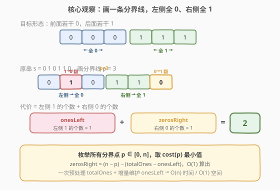
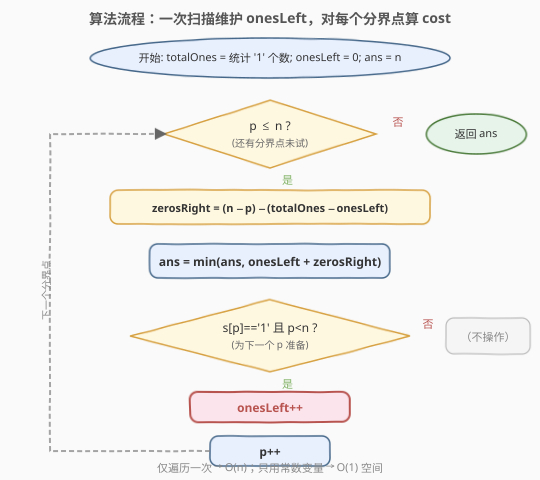
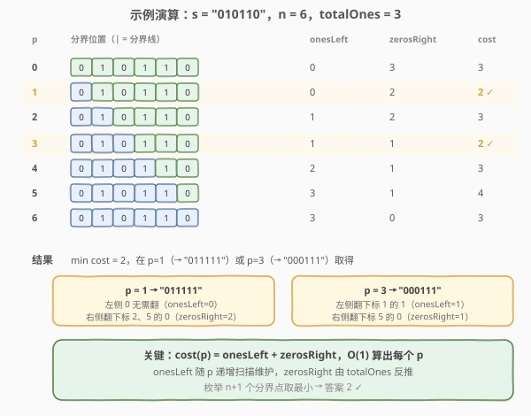

# 将字符串翻转到单调递增

- **题目名称**：将字符串翻转到单调递增
- **链接**：[926. 将字符串翻转到单调递增](https://leetcode.cn/problems/flip-string-to-monotone-increasing/)
- **难度**：中等
- **标签**：字符串、动态规划、前缀和

## 1. 题目概述

给定一个仅由 `'0'` 和 `'1'` 组成的二进制字符串 `s`。称一个字符串是**单调递增**的，当且仅当它由**若干个 `'0'`（可以没有）后接若干个 `'1'`（可以没有）**组成，即形如 `000...0011...11`。

你可以将任意一个字符翻转（`'0'` 变 `'1'`，或 `'1'` 变 `'0'`）。返回使 `s` 单调递增所需的**最小翻转次数**。

> 💡 单调递增只要求「前面全是 0、后面全是 1」，不要求 0 和 1 都出现——全 `'0'`、全 `'1'` 都算合法。

**示例 1**：

```text
输入：s = "00110"
输出：1
解释：翻转最后一个 '0' → "00111"，1 次翻转。
```

**示例 2**：

```text
输入：s = "010110"
输出：2
解释：可翻转为 "011111"（翻转下标 2、5 的 '0'）或 "000111"（翻转下标 1 的 '1'、下标 5 的 '0'），均为 2 次。
```

**示例 3**：

```text
输入：s = "00011000"
输出：2
解释：翻转为 "00000000"（翻转两个 '1'），2 次翻转。
```

**约束条件**：

- $1 \le \text{s.length} \le 10^5$
- `s[i]` 为 `'0'` 或 `'1'`

---

## 2. 解题思路

### 2.1 暴力思路

合法的单调递增串共有 $n+1$ 种形态：前 $p$ 个 `'0'` 后 $n-p$ 个 `'1'`（$p$ 从 $0$ 到 $n$）。对每种目标串，逐位比对原串统计需要翻转的位数，取最小值。每种比对 $O(n)$，共 $n+1$ 种，总复杂度 $O(n^2)$。对于 $n = 10^5$ 必然超时。

> 💡 优化关键：不需要真的「构造出目标串再逐位比对」，而是把翻转代价拆成**左侧代价 + 右侧代价**两段独立计数，用前缀和一次性算出每个分界点的代价。

### 2.2 核心观察：画一条分界线（前后缀分解）



设分界点 $p \in [0, n]$ 表示「前 $p$ 个位置变成 `'0'`，后 $n-p$ 个位置变成 `'1'`」。在此分界下：

- **左侧代价**：`s[0..p-1]` 中已经是 `'1'` 的位置需要翻成 `'0'`，个数记为 $\text{onesLeft}(p)$。
- **右侧代价**：`s[p..n-1]` 中已经是 `'0'` 的位置需要翻成 `'1'`，个数记为 $\text{zerosRight}(p)$。

总代价：

$$\text{cost}(p) = \text{onesLeft}(p) + \text{zerosRight}(p)$$

答案即 $\min_{p=0}^{n} \text{cost}(p)$。

> 💡 **为什么能 $O(1)$ 算出每个 $p$ 的代价？** 关键在于 $\text{zerosRight}(p)$ 可以由「区间长度 − 区间内 1 的个数」推出：右侧区间 `s[p..n-1]` 长度为 $n-p$，其中 1 的个数为 $\text{totalOnes} - \text{onesLeft}(p)$，所以
>
> $$\text{zerosRight}(p) = (n - p) - \bigl(\text{totalOnes} - \text{onesLeft}(p)\bigr)$$
>
> 只需事先统计一次 $\text{totalOnes}$，再在从左到右扫描时**增量维护** $\text{onesLeft}$（遇到 `'1'` 就加一），就能对每个 $p$ 在 $O(1)$ 内算出代价。整体 $O(n)$ 时间、$O(1)$ 空间。

> ⚠️ **边界 $p=0$ 与 $p=n$**：$p=0$ 表示「全部翻成 `'1'`」，代价 = 原串中 `'0'` 的个数；$p=n$ 表示「全部翻成 `'0'`」，代价 = 原串中 `'1'` 的个数。两者都是合法单调串，必须纳入枚举。

### 2.3 算法流程图



1. 统计 `totalOnes`（原串 `'1'` 的总数）。
2. 初始化 `onesLeft = 0`，`ans = n`。
3. 对每个分界点 $p$ 从 $0$ 到 $n$：
   - 计算 `zerosRight = (n - p) - (totalOnes - onesLeft)`。
   - `ans = min(ans, onesLeft + zerosRight)`。
   - 若 $p < n$ 且 `s[p] == '1'`，则 `onesLeft++`（为下一个 $p$ 做准备）。
4. 返回 `ans`。

### 2.4 示例演算



以 `s = "010110"` 为例（$n = 6$，$\text{totalOnes} = 3$）：

| 分界点 $p$ | 含义 | onesLeft | zerosRight | cost |
|------------|------|----------|------------|------|
| 0 | 全 1 | 0 | 3 | 3 |
| 1 | 下标 0 为 0 | 0 | 2 | **2** |
| 2 | 下标 0–1 为 0 | 1 | 2 | 3 |
| 3 | 下标 0–2 为 0 | 1 | 1 | **2** |
| 4 | 下标 0–3 为 0 | 2 | 1 | 3 |
| 5 | 下标 0–4 为 0 | 3 | 1 | 4 |
| 6 | 全 0 | 3 | 0 | 3 |

- 最小代价为 **2**，在 $p=1$（→`"011111"`）或 $p=3$（→`"000111"`）处取得。
- 验证 $p=1$：左侧 `s[0]='0'` 无需翻转（`onesLeft=0`）；右侧 `s[1..5]="10110"` 中 `'0'` 在下标 2、5 共 2 个（`zerosRight=2`），翻转它们得 `"011111"` ✓。

---

## 3. 参考代码

### C++

```cpp
class Solution {
  public:
    int minFlipsMonoIncr(string s) {
        int n = s.size();
        int totalOnes = 0;
        for (char c : s)
            if (c == '1') totalOnes++;

        int ans = n;
        int onesLeft = 0;
        for (int p = 0; p <= n; ++p) {
            int zerosRight = (n - p) - (totalOnes - onesLeft);
            ans = min(ans, onesLeft + zerosRight);
            if (p < n && s[p] == '1') onesLeft++;
        }
        return ans;
    }
};
```

### Python

```python
class Solution:
    def minFlipsMonoIncr(self, s: str) -> int:
        n = len(s)
        total_ones = s.count('1')

        ans = n
        ones_left = 0
        for p in range(n + 1):
            zeros_right = (n - p) - (total_ones - ones_left)
            ans = min(ans, ones_left + zeros_right)
            if p < n and s[p] == '1':
                ones_left += 1
        return ans
```

> 💡 **`onesLeft` 的更新顺序**：先**用**当前 `onesLeft` 计算代价，**再**根据 `s[p]` 递增它。因为 `onesLeft(p)` 统计的是 `s[0..p-1]` 中的 `'1'`，不包含 `s[p]` 本身。若先递增再计算，会把 `s[p]` 错算进左侧，导致 $p$ 与 $p+1$ 的代价错位。

> ⚠️ **`ans` 初始化为 `n`**：最坏情况下整串翻转也不超过 $n$ 次，用它作上界保证第一次 `min` 即被实际代价覆盖。等价地也可初始化为 `n - totalOnes`（即 $p=0$ 的代价）。

---

## 4. 复杂度分析

| 维度 | 复杂度 | 说明 |
|------|--------|------|
| 时间复杂度 | $O(n)$ | 先一次扫描统计 `totalOnes`，再一次扫描枚举 $n+1$ 个分界点，每次 $O(1)$ |
| 空间复杂度 | $O(1)$ | 仅使用 `totalOnes`、`onesLeft`、`ans` 等常数个变量 |

---

## 5. 扩展：两状态滚动 DP（O(1) 空间单遍）

换一个视角——**逐位决定每个位置最终是 `'0'` 还是 `'1'`**，维护两个状态：

- `dp0`：已处理前缀变成「单调递增且**末位为 `'0'`**」的最小翻转数。
- `dp1`：已处理前缀变成「单调递增且**末位为 `'1'`**」的最小翻转数。

对字符 `c`，转移为：

- **新末位为 `'0'`**：前一位也必须是 `'0'`（一旦出现 `'1'` 就不能再回 `'0'`），故 `newDp0 = dp0 + (c == '1')`（若 `c` 本是 `'1'` 需翻成 `'0'`）。
- **新末位为 `'1'`**：前一位可以是 `'0'` 或 `'1'`，取两者较小，再视 `c` 是否需翻成 `'1'`：`newDp1 = min(dp0, dp1) + (c == '0')`。

```cpp
class Solution {
  public:
    int minFlipsMonoIncr(string s) {
        int dp0 = 0, dp1 = 0;
        for (char c : s) {
            int newDp0 = dp0 + (c == '1');
            int newDp1 = min(dp0, dp1) + (c == '0');
            dp0 = newDp0;
            dp1 = newDp1;
        }
        return min(dp0, dp1);
    }
};
```

时间 $O(n)$、空间 $O(1)$，只需一遍扫描且不必预处理 `totalOnes`。两种解法殊途同归：**分界线枚举**是从「宏观切分点」入手，**两状态 DP**是从「微观逐位末态」入手，最终都归结为对每个位置做 $O(1)$ 的前后缀信息合并。

---

## 6. 面试要点

1. **为什么合法形态只有 $n+1$ 种？**

   单调递增串一旦从 `'0'` 切换到 `'1'` 就不能再切回 `'0'`，因此完全由「切换点位置」决定。切换点可在第 $0$ 到第 $n$ 个位置（含两端，对应全 `'1'` 与全 `'0'`），共 $n+1$ 种。

2. **`zerosRight` 为什么不必显式统计？**

   右侧区间长度为 $n-p$，其中 `'1'` 的个数为 $\text{totalOnes} - \text{onesLeft}(p)$。`'0'` 的个数 = 区间长度 − `'1'` 的个数，于是 $\text{zerosRight}(p) = (n-p) - (\text{totalOnes} - \text{onesLeft}(p))$。借助一次预处理 + 增量维护即可 $O(1)$ 得到。

3. **分界线枚举和两状态 DP 有何联系？**

   分界线 $p$ 等价于 DP 中「末位从 `'0'` 切到 `'1'` 的位置」。`dp0` 累积的正是某个 $p$ 下的 `onesLeft`，`dp1` 累积的是 `onesLeft + zerosRight`。`min(dp0, dp1)` 与枚举所有 $p$ 取最小是同一件事的两种表述。

4. **为什么 `newDp0` 只能从 `dp0` 来，不能从 `dp1` 来？**

   末位为 `'0'` 意味着之前所有位也都是 `'0'`（单调递增不允许 `1` 后再出现 `0`），所以前一位必须是 `'0'`，只能承接 `dp0`。若承接 `dp1`（前一位是 `'1'`）再放 `'0'`，就破坏了单调性。

5. **`p=0` 和 `p=n` 这两个边界为什么不能漏？**

   它们分别对应「全部翻成 `'1'`」和「全部翻成 `'0'`」，是合法解。若只在 $1 \le p \le n-1$ 枚举，会漏掉原串接近全 `'0'` 或全 `'1'` 时的最优解（如示例 3 答案就是 $p=n$ 即全翻成 `'0'`）。

6. **如果要求输出翻转后的字符串本身呢？**

   记录取到最小代价的 $p^*$，然后令 `ans[0..p*-1] = '0'`、`ans[p*..n-1] = '1'` 即可。分界线法天然给出切分点；两状态 DP 则需回溯转移来源重建末态序列。

---

## 7. 同类练习题

- [1653. 使字符串平衡的最少删除次数](https://leetcode.cn/problems/minimum-deletions-to-make-string-balanced/)：本题的「删除」孪生题——同样枚举分界点，左删 `'b'`、右删 `'a'`，结构完全同构
- [1888. 使二进制字符串字符交替的最小反转次数](https://leetcode.cn/problems/minimum-number-of-flips-to-make-the-binary-string-alternating/)：翻转 0/1 串达「交替」形态，滑窗 + 反转前缀和，承接本题的翻转计数思想
- [152. 乘积最大子数组](https://leetcode.cn/problems/maximum-product-subarray/)（[站内题解](../0101-0200/152_乘积最大子数组.md)）：单遍维护两状态滚动量，与扩展的两状态 DP 同构
- [918. 环形子数组的最大和](https://leetcode.cn/problems/maximum-sum-circular-subarray/)（[站内题解](../0901-1000/918_最大环形子数组和.md)）：把问题拆成两段线性计数再合并的「前后缀分解」思想，与本题左右两侧分别计数同源
