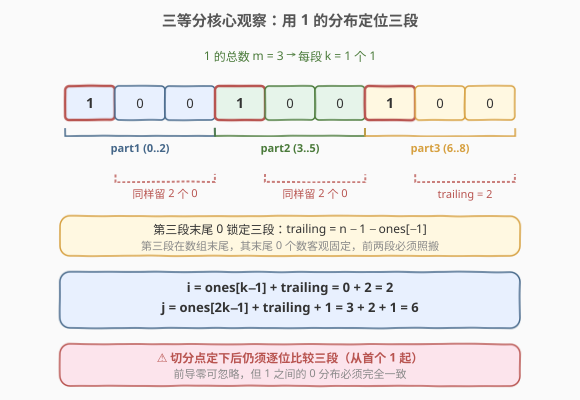
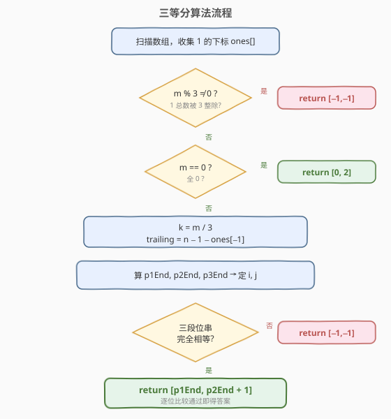

# LeetCode 三等分 题解

## 1. 题目概述

- **标题 / 题号**：三等分（#927，hard）
- **链接**：https://leetcode.cn/problems/three-equal-parts/
- **难度**：困难
- **标签**：数组、数学、双指针

**题意**：给定一个由 `0` 和 `1` 组成的数组 `arr`，将其分成 **3 个非空的部分**，使得所有部分表示相同的二进制值。若可以，返回**任意** `[i, j]`（要求 `i+1 < j`），使得：

- `arr[0], ..., arr[i]` 为第一部分；
- `arr[i+1], ..., arr[j-1]` 为第二部分；
- `arr[j], ..., arr[n-1]` 为第三部分。

若无法做到，返回 `[-1, -1]`。

> 💡 二进制值看作整体：`[1,1,0]` 表示 `6`（不是 `3`）。**前导零被允许**，故 `[0,1,1]` 与 `[1,1]` 表示相同的值 `3`。

**示例 1**：

```text
输入：arr = [1,0,1,0,1]
输出：[0,3]
解释：三部分 [1]、[0,1]、[0,1] 均表示二进制值 1。
```

**示例 2**：

```text
输入：arr = [1,1,0,1,1]
输出：[-1,-1]
解释：1 的总数为 4，不能被 3 整除，无法三等分。
```

**示例 3**：

```text
输入：arr = [1,1,0,0,1]
输出：[0,2]
解释：三部分 [1]、[1]、[0,0,1] 均表示二进制值 1。
```

**约束**：

- `3 <= arr.length <= 3 * 10^4`
- `arr[i]` 是 `0` 或 `1`

## 2. 解题思路

### 2.1 暴力思路

枚举所有切分点 $(i, j)$（共 $O(n^2)$ 个），对每个切分把三段转成二进制整数再比较。转换与比较各 $O(n)$，总复杂度 $O(n^3)$，$n = 3 \times 10^4$ 完全不可行；且二进制整数可能高达 $2^{30000}$ 位，无法用普通整数存储。需要利用 0/1 数组的结构信息。

### 2.2 核心观察：用 1 的分布定位三段



三个二进制值相等，蕴含三条关键性质：

1. **1 的总数必须被 3 整除**：每段含 1 的数量相等（前导零不改变值，但 1 的个数决定数值的"骨架"）。设总 1 数为 $m$，若 $m \bmod 3 \neq 0$，直接返回 `[-1,-1]`。每段恰好 $k = m/3$ 个 1。

2. **前导零可忽略**：比较时各段都从自己的**第一个 1**开始。所以只需关心「首个 1 → 末尾」这段位串。

3. **末尾连续 0 的个数由第三段锁定**：第三段是数组结尾，它最后一个 1 之后的 0 个数是固定的，记为 $\text{trailing} = n - 1 - \text{ones}[-1]$。既然三段值相等，它们末尾的 0 个数必须相同，于是第一、二段末尾也必须各留 $\text{trailing}$ 个 0。

由这三条，切分点被唯一确定：

$$i = \text{ones}[k-1] + \text{trailing}$$

$$j = \text{ones}[2k-1] + \text{trailing} + 1$$

其中 `ones[k-1]` 是第一段最后一个 1 的下标，`ones[2k-1]` 是第二段最后一个 1 的下标。

> ⚠️ 切分点确定后**仍需验证**：1 的个数相等、末尾 0 相等只保证"两端对齐"，但 1 之间的 0 分布可能不同（如 `[1,0,1]` 与 `[1,1]` 值不等）。因此最后要逐位比较三段（从各自首个 1 到末尾）是否完全相同。

### 2.3 算法流程图



### 2.4 示例演算

![示例演算：arr = [1,0,0,1,0,0,1,0,0]](../images/three_equal_parts_example_walkthrough.svg)

以 `arr = [1,0,0,1,0,0,1,0,0]`（含末尾 0，更能体现机制）为例：

| 步骤 | 计算 | 结果 |
|------|------|------|
| 1 的位置 | 扫描得 `ones = [0, 3, 6]` | `m = 3` |
| 整除检查 | `3 % 3 == 0` | `k = 1` |
| 末尾 0 | `trailing = 9 − 1 − 6` | `2` |
| 第一段末 | `ones[0] + 2 = 0 + 2` | `i = 2` |
| 第二段末 | `ones[1] + 2 = 3 + 2`，`j = 末+1` | `j = 6` |
| 三段位串 | `[1,0,0]` / `[1,0,0]` / `[1,0,0]` | 相等 ✓ |

返回 `[2, 6]`：`arr[0..2]=[1,0,0]`、`arr[3..5]=[1,0,0]`、`arr[6..8]=[1,0,0]`，均表示 `4`。

> 💡 对照示例 1 `[1,0,1,0,1]`：`ones=[0,2,4]`，`trailing=0`，`i=0`、`j=3` → `[0,3]`；示例 3 `[1,1,0,0,1]`：`ones=[0,1,4]`，`trailing=0`，`i=0`、`j=2` → `[0,2]`。机制完全一致。

## 3. 参考代码

### C++

```cpp
class Solution {
  public:
    vector<int> threeEqualParts(vector<int>& arr) {
        int n = arr.size();
        vector<int> ones;
        for (int i = 0; i < n; ++i)
            if (arr[i] == 1) ones.push_back(i);

        int m = ones.size();
        if (m % 3 != 0) return {-1, -1};
        if (m == 0) return {0, 2};            // 全 0，任意切分均可

        int k = m / 3;
        int trailing = n - 1 - ones.back();   // 第三段末尾 0 个数，锁定三段
        int p1End = ones[k - 1] + trailing;
        int p2End = ones[2 * k - 1] + trailing;
        int p3End = n - 1;

        int len1 = p1End - ones[0] + 1;
        int len2 = p2End - ones[k] + 1;
        int len3 = p3End - ones[2 * k] + 1;
        if (len1 != len2 || len2 != len3) return {-1, -1};

        for (int d = 0; d < len1; ++d) {
            if (arr[ones[0] + d] != arr[ones[k] + d] ||
                arr[ones[0] + d] != arr[ones[2 * k] + d])
                return {-1, -1};
        }
        return {p1End, p2End + 1};
    }
};
```

### Python

```python
class Solution:
    def threeEqualParts(self, arr: List[int]) -> List[int]:
        n = len(arr)
        ones = [i for i, x in enumerate(arr) if x == 1]

        m = len(ones)
        if m % 3 != 0:
            return [-1, -1]
        if m == 0:
            return [0, 2]                       # 全 0，任意切分均可

        k = m // 3
        trailing = n - 1 - ones[-1]             # 第三段末尾 0 个数，锁定三段
        p1_s, p1_e = ones[0], ones[k - 1] + trailing
        p2_s, p2_e = ones[k], ones[2 * k - 1] + trailing
        p3_s, p3_e = ones[2 * k], n - 1

        if arr[p1_s:p1_e + 1] == arr[p2_s:p2_e + 1] == arr[p3_s:p3_e + 1]:
            return [p1_e, p2_e + 1]
        return [-1, -1]
```

> 💡 **全 0 特判 `return [0, 2]`**：无 1 时任何切分都使三段值为 0。`[0, 2]` 给出 `arr[0..0]`、`arr[1..1]`、`arr[2..n-1]` 三段非空且 `i+1=1 < 2=j`，对任意 `n >= 3` 合法。

> ⚠️ **为何不直接转整数比较**：二进制位可达 $3 \times 10^4$ 位，远超 64 位整数；转大整数再比较既慢又复杂。逐位比较数组切片最直接，且 Python 的切片 `==` 天然支持。

## 4. 复杂度分析

| 维度 | 复杂度 | 说明 |
|------|--------|------|
| 时间复杂度 | $O(n)$ | 一次遍历找 1；三段逐位比较总长 $\le n$ |
| 空间复杂度 | $O(n)$ | `ones` 数组存所有 1 的下标（最坏 $n$ 个） |

> 可做到 $O(1)$ 额外空间：用三趟扫描分别定位第 $k$、$2k$、$3k$ 个 1，再逐位比较，但可读性下降；$O(n)$ 空间已足够。

## 5. 扩展：为何「1 个数相等 + 末尾 0 相等」还不够

切分点由 1 的分布和 `trailing` 唯一确定后，仍可能出现 1 之间 0 分布不同的情况。例如 `arr = [1,0,1, 1,1, 1,0,0,1]`：

- 1 的总数 $m = 6$，$k = 2$，`trailing = 0`，三段各含 2 个 1。
- 但三段位串分别为 `[1,0,1]`、`[1,1]`、`[1,0,0,1]`（长度都不等），值依次为 `5`、`3`、`9`，显然不等。

因此最后一步的**逐位比较不可省略**——它同时校验了长度与 1 之间的 0 分布。这正是本题标为「困难」的陷阱：容易只数 1 就草率返回切分点。

## 6. 面试要点

1. **为什么先数 1 的总数？**

   三段二进制值相等 ⇒ 每段 1 的个数相等 ⇒ 总 1 数被 3 整除。这是必要条件，能 $O(n)$ 快速排除大量无效输入（如示例 2 的 `[1,1,0,1,1]`）。

2. **trailing 为什么由第三段决定？**

   第三段是数组结尾，其末尾 0 个数「客观固定」（`= n − 1 − 末个 1 下标`）。三段值相等要求末尾 0 数相同，于是前两段末尾的 0 数也被这个值锁定，切分点随之唯一。

3. **确定切分点后为什么还要逐位比较？**

   1 的个数相等 + 末尾 0 相等，只保证「两端对齐」，中间 1 与 1 之间的 0 分布可能不同（见第 5 节反例）。逐位比较同时校验长度与中间分布，缺一不可。

4. **全 0 数组怎么处理？**

   无 1 时任何切分三段值都为 0。返回 `[0, 2]` 即可（保证三段非空且 `i+1 < j`）。注意 `m == 0` 必须在 `m % 3` 检查之后单独处理，否则 `ones.back()` 越界。

5. **能否用前缀和/哈希优化？**

   本题是「值相等」而非「和相等」，前缀和不适用。核心是 0/1 数组中 1 的位置这一结构信息，定位 + 逐位比较已是 $O(n)$ 最优。

6. **和 [1013. 将数组分成和相等的三部分](https://leetcode.cn/problems/partition-array-into-three-parts-with-equal-sum/) 的区别？**

   1013 是「三段**和**相等」：总和能被 3 整除，从两端贪心凑出 `total/3` 即可，无需验证中间。本题是「三段**二进制值**相等」，更严：不仅要 1 的个数等，还要 1 之间的 0 分布完全一致，故需逐位校验。

## 同类练习题

| # | 题目 | 与本题的关联 |
|---|------|-------------|
| 1013 | [将数组分成和相等的三部分](https://leetcode.cn/problems/partition-array-into-three-parts-with-equal-sum/) | 三等分的"求和版"——总和被 3 整除 + 双端贪心凑 `total/3`，无需逐位验证 |
| 1712 | [将数组分成三个子数组的方案数](https://leetcode.cn/problems/ways-to-split-array-into-three-subarrays/) | 三段切分计数，前缀和 + 二分定界 |
| 410 | [分割数组的最大值](https://leetcode.cn/problems/split-array-largest-consecutive-sums/)（[题解](../0401-0500/410_分割数组的最大值.md)） | 切分型最优化，二分答案 + 贪心划分 |
| 1011 | [在 D 天内送达包裹的能力](https://leetcode.cn/problems/capacity-to-ship-packages-within-d-days/)（[题解](../1001-1100/1011_在D天内送达包裹的能力.md)） | 切分型问题，二分答案 + 贪心验证 |
