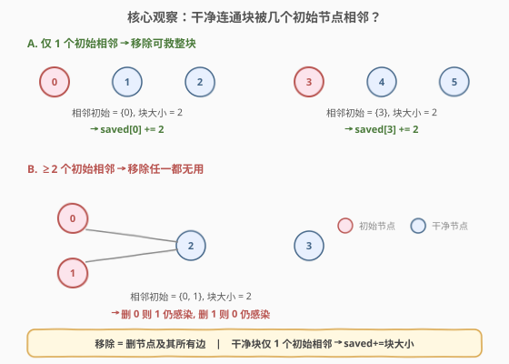
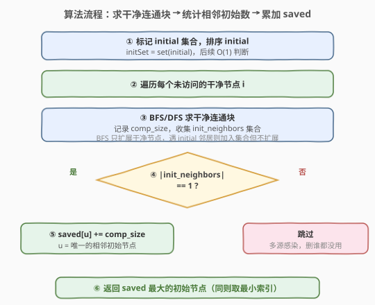
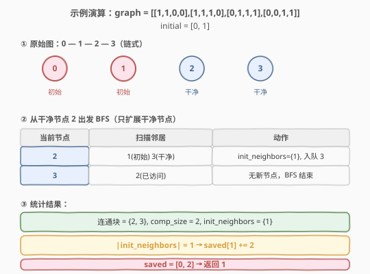

# 尽量减少恶意软件的传播 II

- **题目名称**：尽量减少恶意软件的传播 II
- **链接**：[928. 尽量减少恶意软件的传播 II](https://leetcode.cn/problems/minimize-malware-spread-ii/)
- **难度**：困难
- **标签**：图、BFS、连通分量

## 1. 题目概述

给定 `n` 个节点的网络，用 `n × n` 邻接矩阵 `graph` 表示（`graph[i][j] = 1` 表示节点 `i` 与 `j` 直接相连）。部分节点 `initial` 被恶意软件感染，感染规则：只要两个节点直接相连且至少一个被感染，则两个都感染，传播直到停止。

我们可以从 `initial` 中**删除一个节点**——**完全移除该节点及其所有连接**。返回移除后能使最终感染节点数 `M(initial)` 最小的节点；若有多个则返回**索引最小**的。

> ⚠️ **与 [924. 尽量减少恶意软件的传播](https://leetcode.cn/problems/minimize-malware-spread/) 的关键区别**：924 中「移除」仅取消该节点的初始感染标记，节点本身仍在网络中、可被其他初始节点感染；928 中「移除」是**物理删除**该节点及其所有边，它不再参与传播。这一差异决定了两题的解法不同。

**示例 1**：

```text
输入：graph = [[1,1,0],[1,1,0],[0,0,1]], initial = [0,1]
输出：0
解释：节点 0 和 1 相连且都初始感染，节点 2 独立。无论移除 0 还是 1，
      另一个仍感染自身，节点 2 始终安全。返回索引最小的 0。
```

**示例 2**：

```text
输入：graph = [[1,1,0],[1,1,1],[0,1,1]], initial = [0,1]
输出：1
解释：0—1—2 链式连接。移除 1 后，节点 1 及其边消失，
      节点 2 不再与任何初始节点相连 → 不被感染。移除 0 则 1 仍感染 2。
      移除 1 效果更好（少感染 2），返回 1。
```

**示例 3**：

```text
输入：graph = [[1,1,0,0],[1,1,1,0],[0,1,1,1],[0,0,1,1]], initial = [0,1]
输出：1
解释：0—1—2—3 链式连接。移除 1 后，干净连通块 {2, 3} 不再相邻任何初始节点，
      全部得救。移除 0 则 1 仍感染 {2, 3}。返回 1。
```

**约束条件**：

- `n == graph.length == graph[i].length`
- `2 <= n <= 300`
- `graph[i][j]` 为 `0` 或 `1`
- `graph[i][j] == graph[j][i]`（无向图）
- `graph[i][i] == 1`（自环）
- `1 <= initial.length < n`
- `0 <= initial[i] < n`，`initial` 中元素互不相同

---

## 2. 解题思路

### 2.1 暴力思路

枚举 `initial` 中每个节点 `u`，模拟「移除 `u`（删节点及其边）」后感染传播的过程：

1. 从 `u` 的邻接矩阵中删除第 `u` 行第 `u` 列（或标记 `u` 为已删除）。
2. 从剩余 `initial` 节点出发 BFS 感染传播。
3. 统计最终感染数，取最小。

每次模拟 $O(n^2)$，共 $|\text{initial}|$ 次，总复杂度 $O(|\text{initial}| \times n^2)$。$n = 300$、$|\text{initial}| \approx 300$ 时约 $2.7 \times 10^7$，勉强可行但不优雅。更关键的是**重复计算**：每次模拟都重新跑一遍感染传播。

> 💡 **优化方向**：不逐个模拟移除，而是**反向思考**——一个干净节点在什么条件下会被「救活」？

### 2.2 核心观察：干净连通块 + 相邻初始节点数



移除初始节点 `u` 意味着 `u` 及其所有边消失。一个**干净节点** `v`（不在 `initial` 中）在移除 `u` 后不被感染，当且仅当：**剩余的初始节点都无法到达 `v`**。

等价地，`v` 被 `u` 「唯一感染」的条件是：从 `u` 出发能到达 `v`，但从其他初始节点出发**经过干净节点**的路径都到不了 `v`。

> 💡 **转换为连通块视角**：将所有初始节点「概念性删除」后，剩下的干净节点形成若干**连通块**。对每个干净连通块：
> - 统计它**相邻的初始节点**有哪些（即块中某个干净节点与某个初始节点直接相连）。
> - 若相邻初始节点**恰好 1 个**（记为 `u`），则移除 `u` 后整个块不再与任何初始节点相连 → **整块得救**，`saved[u] += 块大小`。
> - 若相邻初始节点 **≥ 2 个**，则移除任意一个，其余初始节点仍能感染该块 → **移除谁都救不了**。

> ⚠️ **为什么只看「相邻」而非「可达」？** 因为图是无向的，干净连通块内部任意两点互相可达。若初始节点 `u` 与块中任一节点直接相连，则 `u` 能感染整个块。所以「相邻」即「可感染整个块」，不需要额外的可达性判断。

### 2.3 算法流程图



一次遍历即可完成：

1. **标记** `initial` 集合，排序 `initial`（便于后续取最小索引）。
2. **遍历**每个未访问的干净节点，BFS/DFS 求其所在的干净连通块：
   - 记录 `comp_size`（块大小）。
   - 收集 `init_neighbors`（与块相邻的初始节点集合）——BFS 时遇到 `initial` 节点则加入集合但**不扩展**进去。
3. **判定**：若 `|init_neighbors| == 1`，则 `saved[该初始节点] += comp_size`。
4. **取最大**：遍历 `initial`，返回 `saved` 最大的节点（同则取最小索引）。

### 2.4 示例演算



以示例 3 `graph = [[1,1,0,0],[1,1,1,0],[0,1,1,1],[0,0,1,1]], initial = [0,1]` 为例：

**图结构**：`0 — 1 — 2 — 3`（链式），初始节点 `{0, 1}`（红），干净节点 `{2, 3}`（蓝）。

**BFS 从节点 2 出发**（第一个未访问的干净节点）：

| 步骤 | 当前节点 | 扫描邻居 | 动作 |
|------|----------|----------|------|
| 1 | 2 | 1（初始）、3（干净） | `init_neighbors = {1}`，节点 3 入队 |
| 2 | 3 | 2（已访问） | 无新节点，BFS 结束 |

**统计**：

- 干净连通块 = `{2, 3}`，`comp_size = 2`
- `init_neighbors = {1}`，`|init_neighbors| = 1`
- `saved[1] += 2`

**结果**：`saved = [0, 2]`，`initial` 排序后 `[0, 1]`，`saved[1] > saved[0]` → 返回 `1`。

移除节点 1 后，干净块 `{2, 3}` 不再与任何初始节点相邻，全部得救（少感染 2 个节点）。

---

## 3. 参考代码

### C++

```cpp
class Solution {
  public:
    int minMalwareSpread(vector<vector<int>>& graph, vector<int>& initial) {
        int n = graph.size();
        sort(initial.begin(), initial.end());
        unordered_set<int> initSet(initial.begin(), initial.end());

        vector<bool> visited(n, false);
        vector<int> saved(n, 0);

        for (int i = 0; i < n; i++) {
            if (visited[i] || initSet.count(i))
                continue;

            int compSize = 0;
            unordered_set<int> initNeighbors;
            queue<int> q;
            q.push(i);
            visited[i] = true;

            while (!q.empty()) {
                int cur = q.front();
                q.pop();
                compSize++;
                for (int v = 0; v < n; v++) {
                    if (graph[cur][v] == 1) {
                        if (initSet.count(v)) {
                            initNeighbors.insert(v);
                        } else if (!visited[v]) {
                            visited[v] = true;
                            q.push(v);
                        }
                    }
                }
            }

            if (initNeighbors.size() == 1)
                saved[*initNeighbors.begin()] += compSize;
        }

        int ans = initial[0];
        for (int u : initial)
            if (saved[u] > saved[ans])
                ans = u;
        return ans;
    }
};
```

### Python

```python
class Solution:
    def minMalwareSpread(self, graph: List[List[int]], initial: List[int]) -> int:
        n = len(graph)
        initial.sort()
        init_set = set(initial)

        visited = [False] * n
        saved = [0] * n

        for i in range(n):
            if visited[i] or i in init_set:
                continue

            comp_size = 0
            init_neighbors = set()
            q = deque([i])
            visited[i] = True

            while q:
                cur = q.popleft()
                comp_size += 1
                for v in range(n):
                    if graph[cur][v] == 1:
                        if v in init_set:
                            init_neighbors.add(v)
                        elif not visited[v]:
                            visited[v] = True
                            q.append(v)

            if len(init_neighbors) == 1:
                saved[next(iter(init_neighbors))] += comp_size

        ans = initial[0]
        for u in initial:
            if saved[u] > saved[ans]:
                ans = u
        return ans
```

> ⚠️ **BFS 遇到初始节点只收集不扩展**：BFS 从干净节点出发，扫描邻居时若遇到 `initial` 节点，将其加入 `initNeighbors` 但**不入队**（不从初始节点继续扩展）。这保证了我们只统计「干净连通块直接相邻的初始节点」，而非穿过初始节点到达其他区域。

> 💡 **`initNeighbors` 用 `set` 去重**：同一个初始节点可能与块中多个干净节点直接相连（如初始节点同时连接块的两端），`set` 确保每个初始节点只计一次。

---

## 4. 复杂度分析

| 维度 | 复杂度 | 说明 |
|------|--------|------|
| 时间复杂度 | $O(n^2)$ | 每个干净节点访问一次，每次扫描 `n` 个邻居（邻接矩阵）；排序 `initial` 为 $O(k \log k)$，$k < n$ |
| 空间复杂度 | $O(n)$ | `visited` 数组 $O(n)$、`initNeighbors` 集合 $O(n)$、`saved` 数组 $O(n)$、BFS 队列 $O(n)$ |

---

## 5. 扩展：与 924 的对比及暴力解法

### 5.1 924 vs 928 核心差异

| 维度 | 924（移除标记） | 928（物理删除） |
|------|----------------|----------------|
| 移除含义 | 取消初始感染标记，节点仍在网络 | 删除节点及其所有边 |
| 节点可被感染 | 是（可被其他初始节点感染） | 否（节点已不存在） |
| 解法 | 找最大初始节点独占的连通块 | 找干净块仅相邻 1 个初始节点 |
| 关键操作 | 初始节点在块**内**→移除它救整块 | 初始节点在块**外**相邻→移除它救整块 |

### 5.2 暴力模拟解法

逐个尝试移除 `initial` 中每个节点 `u`，模拟感染传播后计数：

```cpp
int bruteForce(vector<vector<int>>& graph, vector<int>& initial) {
    int n = graph.size();
    sort(initial.begin(), initial.end());
    int ans = initial[0], minInfected = n + 1;

    for (int remove : initial) {
        unordered_set<int> infected;
        queue<int> q;
        for (int u : initial)
            if (u != remove) {
                infected.insert(u);
                q.push(u);
            }
        while (!q.empty()) {
            int cur = q.front(); q.pop();
            for (int v = 0; v < n; v++)
                if (cur != remove && graph[cur][v] == 1
                    && !infected.count(v) && v != remove) {
                    infected.insert(v);
                    q.push(v);
                }
        }
        if ((int)infected.size() < minInfected) {
            minInfected = infected.size();
            ans = remove;
        }
    }
    return ans;
}
```

复杂度 $O(|\text{initial}| \times n^2)$，每次模拟都重新传播。连通块解法只需一次遍历 $O(n^2)$，避免了重复计算。

---

## 6. 面试要点

1. **928 和 924 的核心区别是什么？**

   924 移除的是「初始感染标记」，节点仍在网络中可被感染；928 移除的是「节点本身及其所有边」，节点彻底消失。这导致 924 看初始节点在连通块**内部**（独占则移除标记救整块），928 看初始节点在干净块**外部相邻**（唯一相邻则物理删除救整块）。

2. **为什么用「干净连通块 + 相邻初始数」而非暴力模拟？**

   暴力逐个移除并模拟传播，$O(|\text{initial}| \times n^2)$ 重复计算多。连通块视角只需一次 BFS 遍历所有干净节点 $O(n^2)$，通过「相邻初始数是否为 1」直接判定哪些块可被救，避免了重复模拟。

3. **为什么相邻 ≥2 个初始节点时跳过？**

   无向图中干净连通块内部任意两点互相可达。若两个初始节点都与块相邻，移除任一个后，另一个仍能通过相邻的干净节点感染整个块。所以只有**恰好 1 个相邻初始**时，移除它才能救整块。

4. **BFS 遇到初始节点为什么不扩展进去？**

   扩展进初始节点会穿过它到达其他干净区域，导致把不属于当前块的节点也算进来。我们只关心当前干净连通块**直接相邻**的初始节点，所以遇到初始节点只收集到 `initNeighbors` 集合、不入队。

5. **`initial` 为什么要排序？**

   题目要求「有多个满足条件的节点时返回索引最小的」。排序后遍历用 `>` 严格大于比较，第一个达到最大 `saved` 的即为最小索引，逻辑简洁。

6. **如果所有初始节点的 `saved` 都为 0 怎么办？**

   说明每个干净连通块都相邻 ≥2 个初始节点（或没有干净节点），移除谁都救不了任何节点。此时 `saved` 全为 0，遍历时 `>` 不触发，`ans` 保持 `initial[0]`（排序后即最小索引），符合题意。

---

## 7. 同类练习题

- [924. 尽量减少恶意软件的传播](https://leetcode.cn/problems/minimize-malware-spread/)：本题的 I 版，移除标记而非物理删除，对比理解两题差异
- [547. 省份数量](https://leetcode.cn/problems/number-of-provinces/)（[题解](../0501-0600/547_省份数量.md)）：并查集求连通分量，本题的前置基础
- [200. 岛屿数量](https://leetcode.cn/problems/number-of-islands/)（[题解](../0101-0200/200_岛屿数量.md)）：DFS/BFS 求连通分量模板
- [827. 最大人工岛](https://leetcode.cn/problems/making-a-large-island/)（[题解](../0801-0900/827_最大人工岛.md)）：图连通分量 + 标记技巧，与本题同为「连通块 + 统计」范式
