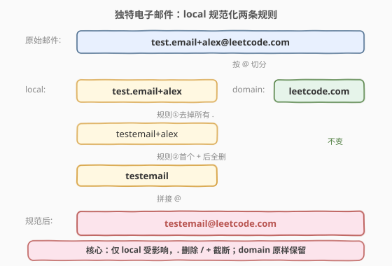
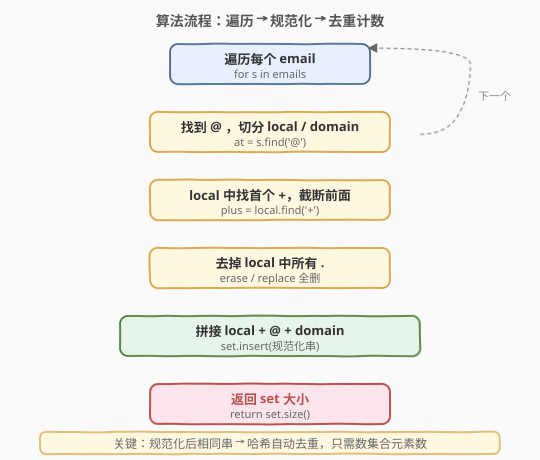
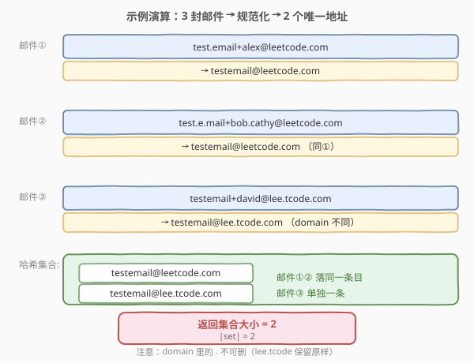

# 独特的电子邮件地址

- **题目名称**：独特的电子邮件地址
- **链接**：[929. 独特的电子邮件地址](https://leetcode.cn/problems/unique-email-addresses/)
- **难度**：简单
- **标签**：数组、哈希表、字符串

## 1. 题目概述

每个电子邮件地址由「本地名 `local`」和「域名 `domain`」组成，二者以 `@` 分隔。在投递邮件时，按以下规则对 **`local`** 做规范化（`domain` 不变）：

1. **忽略所有点 `.`**：`local` 中的 `.` 视作不存在，直接删去；
2. **首个 `+` 后内容忽略**：`local` 中从第一个 `+`（含其本身）到 `@` 之间的所有字符全部丢弃。

给定一个字符串数组 `emails`，求经过上述规范化后**实际能收到邮件的不同地址数**。

**示例 1**：

```text
输入：emails = ["test.email+alex@leetcode.com","test.e.mail+bob.cathy@leetcode.com","testemail+david@lee.tcode.com"]
输出：2
解释：
"test.email+alex@leetcode.com"  → "testemail@leetcode.com"
"test.e.mail+bob.cathy@leetcode.com" → "testemail@leetcode.com"（与上者相同）
"testemail+david@lee.tcode.com" → "testemail@lee.tcode.com"
实际收到 2 个不同地址。
```

**示例 2**：

```text
输入：emails = ["a@leetcode.com","b@leetcode.com","c@leetcode.com"]
输出：3
解释：local 中无 . 也无 +，规范化后地址不变，3 个互不相同。
```

**约束条件**：

- $1 \le \text{emails.length} \le 100$
- $1 \le \text{emails[i].length} \le 100$
- `emails[i]` 由小写英文字母、`'+'`、`'.'` 和 `'@'` 组成
- 每个 `emails[i]` 恰好包含一个 `'@'`
- `local` 和 `domain` 均非空
- `local` 不以 `'+'` 开头

> 💡 **题意要点**：两条规则**只作用于 `@` 左侧的 `local`**，`@` 右侧的 `domain` 原样保留——这是最常见的踩坑点。`domain` 里的 `.`（如 `lee.tcode.com`）不能删。

---

## 2. 解题思路

### 2.1 暴力思路

对每对邮件做「规范化后是否相等」的两两比较，统计不同的等价类个数。规范化本身 $O(L)$，两两比较 $O(n^2 L)$，$n=100$ 时虽能过，但完全没必要——「去重计数」天然适合哈希集合。

### 2.2 核心观察：规范化到标准串 + 哈希去重



关键转化：

- **规范化是确定性映射**：给定一封邮件，按固定规则处理后得到唯一的「标准地址串」。
- **去重 = 求映射后不同像的个数**：把每个标准串塞进哈希集合，集合大小即为答案。
- **规则只改 `local`**：先按 `@` 切分；对 `local` 先截断 `+`、再删 `.`（顺序不敏感，因为 `+` 截断后剩余段也可能含 `.`，统一删净即可）；`domain` 原样拼接。

> 💡 **为何用哈希集合？** 集合的「互异性」直接对应「不同地址」，插入即去重，无需自己维护等价类。$O(1)$ 均摊插入让总复杂度由「规范化每个串」的字符扫描决定。

### 2.3 算法流程图



1. **遍历**：对 `emails` 中每个串 `s`；
2. **切分**：找到 `@` 的位置 `at`，`local = s[0..at-1]`，`domain = s[at+1..]`；
3. **截断 `+`**：在 `local` 中找首个 `+`，若存在则 `local = local[0..plus-1]`（丢弃 `+` 及之后）；
4. **删 `.`**：把 `local` 中所有 `.` 移除；
5. **拼接**：`canonical = local + "@" + domain`；
6. **入集合**：`set.insert(canonical)`；
7. **返回**：`set.size()`。

### 2.4 示例演算



**示例 1**：`emails = ["test.email+alex@leetcode.com","test.e.mail+bob.cathy@leetcode.com","testemail+david@lee.tcode.com"]`

| 输入邮件 | local | 截断 `+` 后 | 删 `.` 后 | domain | 规范化结果 |
|----------|-------|------------|----------|--------|-----------|
| `test.email+alex@leetcode.com` | `test.email+alex` | `test.email` | `testemail` | `leetcode.com` | `testemail@leetcode.com` |
| `test.e.mail+bob.cathy@leetcode.com` | `test.e.mail+bob.cathy` | `test.e.mail` | `testemail` | `leetcode.com` | `testemail@leetcode.com` |
| `testemail+david@lee.tcode.com` | `testemail+david` | `testemail` | `testemail` | `lee.tcode.com` | `testemail@lee.tcode.com` |

集合 `= { "testemail@leetcode.com", "testemail@lee.tcode.com" }`，大小为 **2**。

> ⚠️ **注意**：第三封的 `domain` 是 `lee.tcode.com`，其中的 `.` 不可删——否则会错变成 `leetcodecom` 与第一封混淆。规范化只对 `local` 生效。

---

## 3. 参考代码

### C++

```cpp
class Solution {
  public:
    int numUniqueEmails(vector<string>& emails) {
        unordered_set<string> seen;
        for (const string& s : emails) {
            string local, domain;
            int at = s.find('@');
            local  = s.substr(0, at);
            domain = s.substr(at + 1);

            int plus = local.find('+');
            if (plus != string::npos) local = local.substr(0, plus);

            string clean;
            for (char c : local) if (c != '.') clean.push_back(c);

            seen.insert(clean + "@" + domain);
        }
        return seen.size();
    }
};
```

### Python

```python
class Solution:
    def numUniqueEmails(self, emails: List[str]) -> int:
        seen = set()
        for s in emails:
            local, domain = s.split('@')
            local = local.split('+')[0].replace('.', '')
            seen.add(local + '@' + domain)
        return len(seen)
```

> 💡 **两个实现细节**：
> 1. **Python 一行链式处理**：`local.split('+')[0]` 取首个 `+` 之前部分，`.replace('.', '')` 删净所有点，两步串联即得规范 `local`，无需手写循环。
> 2. **C++ 用 `clean.push_back` 而非 `erase`**：原地 `erase` 删 `.` 每次触发后移 $O(L)$，整体 $O(L^2)$；新建串逐字符追加仅 $O(L)$。小数据量差异不大，但更体现工程意识。

---

## 4. 复杂度分析

| 维度 | 复杂度 | 说明 |
|------|--------|------|
| 时间复杂度 | $O(n \cdot L)$ | $n$ 封邮件，每封扫描长度 $L$ 做规范化 + $O(1)$ 均摊哈希插入 |
| 空间复杂度 | $O(n \cdot L)$ | 最坏 $n$ 个不同规范串，每个长度 $O(L)$，哈希集合存储 |

其中 $n \le 100$、$L \le 100$，规模很小，任何合理实现都能轻松通过。

---

## 5. 扩展：规则只作用于 local 的设计动机

这两条规则源自真实邮件协议（RFC 5336 / Gmail 实践）：

- **`+` 后缀作为标签**：`alice+work@example.com` 与 `alice@example.com` 投递到同一收件人，`+work` 仅作分类标签，方便用户用同一地址注册不同服务并筛选来源。
- **`.` 作为可读性分隔**：Gmail 等服务商忽略 `local` 中的 `.`，`alice.doe` 等价于 `alicedoe`，便于人类阅读而不改变投递目标。

> ⚠️ **协议陷阱**：`+` 和 `.` 的忽略规则**仅限 `local` 部分**，且**因服务商而异**——并非所有域名都忽略 `local` 的 `.`。本题是 LeetCode 简化的统一规则，工程中处理真实邮件时需按域名分别判定。

理解这一点，便能举一反三到「字符串规范化 + 哈希去重」这一通用范式：**把任意等价关系定义为确定性的规范化函数，去重计数就归约为求像集大小**。

---

## 6. 面试要点

1. **为什么 `domain` 里的 `.` 不能删？**

   两条规则明确只作用于 `@` 左侧的 `local`。`domain` 中的 `.` 是真实子域分隔符（如 `lee.tcode.com`），删除会改变投递目标。这是本题最常见的踩坑点。

2. **`+` 截断和 `.` 删除的顺序重要吗？**

   不重要。`+` 截断只丢右侧字符，`.` 删除删所有点；二者作用域不重叠影响（截断后的剩余段含 `.` 也会被删净）。先截断再删、或先删再截断，结果一致。但**必须都在 `local` 内**，不能跨过 `@`。

3. **为什么用哈希集合而非排序去重？**

   集合插入 $O(1)$ 均摊、天然维护互异性，代码最简洁；排序去重需 $O(n \log n)$ 且要处理串比较。本题 $n$ 小差异不大，但哈希集合是「去重计数」类问题的首选范式。

4. **如果 `local` 以 `+` 开头会怎样？**

   约束保证 `local` 不以 `+` 开头，故 `split('+')[0]` 恒非空。若无此约束，需特判 `local` 为空的情况——但题目已限定 `local` 非空且不以 `+` 开头，无需处理。

5. **能否不显式构造规范串，直接用原串 + 元组 `(local_norm, domain)` 作哈希键？**

   可以。把 `(规范化local, domain)` 作为元组键存入集合，等价于拼接成串。Python 中元组可直接哈希；C++ 需自定义 pair 哈希或拼接。最终集合大小相同，只是键的表示形式不同。

---

## 7. 同类练习题

- [205. 同构字符串](https://leetcode.cn/problems/isomorphic-strings/)（[站内题解](../0201-0300/205_同构字符串.md)）：同样是「字符串规范化 + 哈希」范式，用双射哈希把两串归约到同一编码判定同构
- [49. 字母异位词分组](https://leetcode.cn/problems/group-anagrams/)：把每串排序（或计数字典）成规范键后哈希分组，与本题「规范化到标准键」思路一致
- [14. 最长公共前缀](https://leetcode.cn/problems/longest-common-prefix/)（[站内题解](../0001-0100/14_最长公共前缀.md)）：字符串逐字符扫描基础题，对照本题的 `local` 扫描处理
- [819. 最常见的单词](https://leetcode.cn/problems/most-common-word/)：字符串清洗（去标点、小写化）+ 哈希计数，与本题「规范化 + 哈希」同套路
