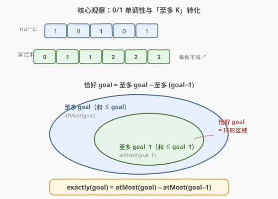
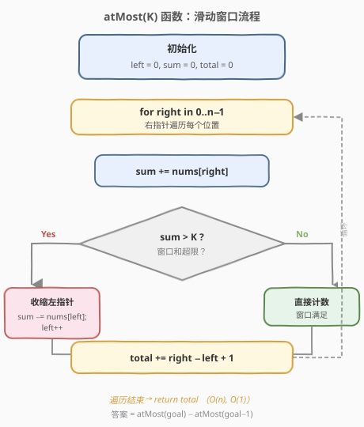
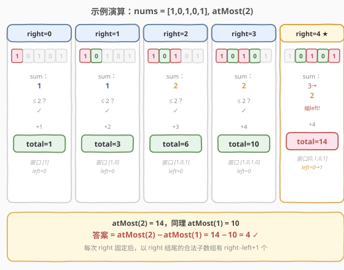
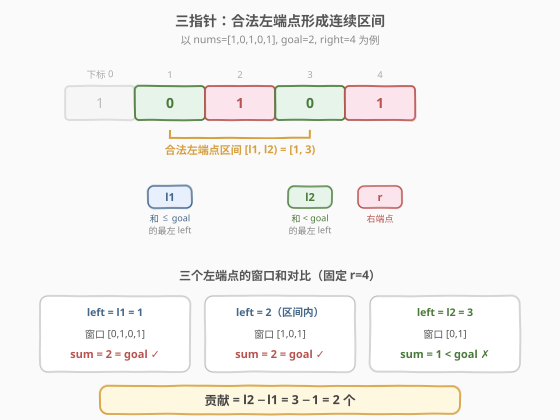

# LeetCode 和相同的二元子数组 题解

## 1. 题目概述

- **标题 / 题号**：和相同的二元子数组（#930，medium）
- **链接**：https://leetcode.cn/problems/binary-subarrays-with-sum/
- **难度**：中等
- **标签**：数组、哈希表、前缀和、滑动窗口

**题意**：给你一个二元数组 `nums`（元素只能是 0 或 1）和一个整数 `goal`，请你统计并返回二元数组中**和等于 `goal`** 的、**连续且非空**的子数组数目。

**示例 1**：

```text
输入：nums = [1,0,1,0,1], goal = 2
输出：4
解释：4 个符合条件的子数组为 [1,0,1]（下标 0-2）、[1,0,1,0]（0-3）、[0,1,0,1]（1-4）、[1,0,1]（2-4）。
```

**示例 2**：

```text
输入：nums = [0,0,0,0,0], goal = 0
输出：15
解释：所有子数组的和都为 0，长度为 5 的数组共有 5×6/2 = 15 个子数组。
```

**约束**：

- `1 <= nums.length <= 3 * 10^4`
- `nums[i]` 为 0 或 1
- `0 <= goal <= nums.length`

> 💡 **0/1 数组的关键性质**：元素非负，故前缀和**单调不减**。这使得滑动窗口可用——而通用版 [560. 和为 K 的子数组](../0501-0600/560_和为K的子数组.md)（元素可负）只能用前缀和 + 哈希。

## 2. 解题思路

### 2.1 暴力思路

枚举所有子数组 `[i, j]` 求和判断是否等于 `goal`。两重循环 `O(n²)`，在 `n = 3×10⁴` 时会超时。

### 2.2 核心观察：0/1 单调性解锁滑动窗口



本题是 [560. 和为 K 的子数组](../0501-0600/560_和为K的子数组.md) 的 0/1 特化版。560 因元素可负、前缀和无单调性，只能用「前缀和 + 哈希」`O(n)` 空间；而本题元素非负，前缀和单调不减，**额外解锁了 `O(1)` 空间的滑动窗口解法**。

有两类经典解法：

**方法一：前缀和 + 哈希**（通用，与 560 同构）

定义前缀和 `prefix[i]` 为 `nums[0..i-1]` 的和。子数组 `nums[i..j]` 的和为 `prefix[j+1] - prefix[i]`，要其等于 `goal`，即：

$$
\text{prefix}[i] = \text{prefix}[j+1] - \text{goal}
$$

对每个结束位置，用哈希表查询之前有多少个起点的 `prefix` 恰好等于 `当前前缀和 - goal`。

**方法二：滑动窗口「至多 K」**（本题推荐）

> 💡 **关键转化**：直接用滑窗求「恰好 goal」很难——窗口和恰好为 goal 时，无法确定该扩还是该缩。但「**至多 goal**」可用标准滑窗求出，于是：

$$
\text{exactly}(\text{goal}) = \text{atMost}(\text{goal}) - \text{atMost}(\text{goal}-1)
$$

`atMost(K)` 统计和 **≤ K** 的子数组数：双指针维护窗口，对每个 `right`，当窗口和 `> K` 时收缩 `left`，然后累加 `right - left + 1`（以 `right` 结尾的合法子数组数）。

这与 [1248. 统计「优美子数组」](../1201-1300/1248_统计优美子数组.md) 完全同构——1248 把奇数二值化后就是本题。

### 2.3 算法流程图



`atMost(K)` 的流程：

1. 初始化 `left = 0, sum = 0, total = 0`
2. 遍历 `right` 从 `0` 到 `n-1`：
   - `sum += nums[right]`
   - **当** `sum > K`：`sum -= nums[left]`，`left++`
   - `total += right - left + 1`
3. 返回 `total`

最终答案为 `atMost(goal) - atMost(goal - 1)`。

> ⚠️ **`goal = 0` 时的边界**：`atMost(-1)` 应返回 0（子数组和不可能 ≤ −1，因为元素非负）。代码中加 `if (K < 0) return 0` 特判。

### 2.4 示例演算

以 `nums = [1,0,1,0,1], goal = 2` 为例，展示 `atMost(2)` 的过程：



| right | nums[right] | sum | left | 窗口 | += right−left+1 | total |
|-------|-------------|-----|------|------|-----------------|-------|
| 0 | 1 | 1 | 0 | [1] | 1 | 1 |
| 1 | 0 | 1 | 0 | [1,0] | 2 | 3 |
| 2 | 1 | 2 | 0 | [1,0,1] | 3 | 6 |
| 3 | 0 | 2 | 0 | [1,0,1,0] | 4 | 10 |
| 4 | 1 | 3→2 | 0→1 | [0,1,0,1] | 4 | 14 |

> 💡 第 5 步 `right=4` 时，加入末尾 `1` 后 `sum=3 > 2`，需收缩：`left=0` 处是 `1`，`sum` 减到 2，`left` 移到 1。窗口 `[0,1,0,1]` 和为 2，累加 `4-1+1=4`。

同理计算 `atMost(1) = 10`，最终答案：

$$
\text{ans} = \text{atMost}(2) - \text{atMost}(1) = 14 - 10 = 4 \quad \checkmark
$$

## 3. 参考代码

### 方法一：前缀和 + 哈希

#### C++

```cpp
class Solution {
  public:
    int numSubarraysWithSum(vector<int>& nums, int goal) {
        unordered_map<int, int> count;
        count[0] = 1;
        int ans = 0, prefix = 0;
        for (int x : nums) {
            prefix += x;
            if (count.count(prefix - goal))
                ans += count[prefix - goal];
            count[prefix]++;
        }
        return ans;
    }
};
```

#### Python

```python
class Solution:
    def numSubarraysWithSum(self, nums: List[int], goal: int) -> int:
        count = {0: 1}
        ans = prefix = 0
        for x in nums:
            prefix += x
            ans += count.get(prefix - goal, 0)
            count[prefix] = count.get(prefix, 0) + 1
        return ans
```

### 方法二：滑动窗口「至多 K」

#### C++

```cpp
class Solution {
  public:
    int numSubarraysWithSum(vector<int>& nums, int goal) {
        return atMost(nums, goal) - atMost(nums, goal - 1);
    }
  private:
    int atMost(vector<int>& nums, int K) {
        if (K < 0) return 0;
        int left = 0, sum = 0, total = 0;
        for (int right = 0; right < nums.size(); right++) {
            sum += nums[right];
            while (sum > K) {
                sum -= nums[left];
                left++;
            }
            total += right - left + 1;
        }
        return total;
    }
};
```

#### Python

```python
class Solution:
    def numSubarraysWithSum(self, nums: List[int], goal: int) -> int:
        def atMost(K: int) -> int:
            if K < 0:
                return 0
            left = total = s = 0
            for right in range(len(nums)):
                s += nums[right]
                while s > K:
                    s -= nums[left]
                    left += 1
                total += right - left + 1
            return total
        return atMost(goal) - atMost(goal - 1)
```

> 💡 **优化提示**：因为 `nums[i]` 仅 0/1，前缀和取值范围为 `[0, n]`，方法一可用 `vector<int>(n + 1, 0)` 代替哈希表加速。

## 4. 复杂度分析

| 方法 | 时间复杂度 | 空间复杂度 | 说明 |
|------|-----------|-----------|------|
| 前缀和 + 哈希 | `O(n)` | `O(n)` | 一次遍历，哈希表最坏存 n+1 个键；可用数组优化到 O(n) 空间但常数更小 |
| 滑动窗口「至多 K」 | `O(n)` | `O(1)` | 调用两次 `atMost`，`left`/`right` 各遍历一次；无需额外空间 |

> 💡 两种方法时间同为 `O(n)`，但滑动窗口法空间仅需 `O(1)`，且代码更简洁。面试中推荐先写滑动窗口法，再提前缀和法作为「元素可负时的通用解」。

## 5. 扩展：三指针单趟解法



利用 0/1 数组的更强性质——**和相同的左端点必连续**——可在单趟 `O(n)` `O(1)` 内直接统计，无需作差：

对每个右端点 `right`，维护两个左指针：
- `l1`：最小的 `left` 使 `sum([l1, right]) <= goal`（窗口和刚降到 ≤ goal 的左边界）
- `l2`：最小的 `left` 使 `sum([l2, right]) < goal`（窗口和刚降到 < goal 的左边界，即恰好越过 goal）

则所有 `left ∈ [l1, l2-1]` 都使 `sum([left, right]) == goal`，贡献 `l2 - l1` 个子数组。

```cpp
class Solution {
  public:
    int numSubarraysWithSum(vector<int>& nums, int goal) {
        int n = nums.size();
        int l1 = 0, l2 = 0, s1 = 0, s2 = 0, ans = 0;
        for (int r = 0; r < n; r++) {
            s1 += nums[r];
            s2 += nums[r];
            while (l1 <= r && s1 > goal) s1 -= nums[l1++];
            while (l2 <= r && s2 >= goal) s2 -= nums[l2++];
            if (s1 == goal) ans += l2 - l1;
        }
        return ans;
    }
};
```

> ⚠️ **`goal = 0` 的正确性**：`while (s2 >= 0)` 恒成立，`l2` 会一直推进到 `r+1`（窗口被掏空、`s2 = 0` 仍 ≥ 0，但 `l2 <= r` 失效而停止）；`s1` 则缩到第一个使窗口和为 0 的位置（即跳过所有 1）。`l2 - l1` 恰好是以 `right` 结尾的全 0 段长度，计数正确。

> 💡 **何时用三指针？** 它是 0/1（或非负整数）数组的专属优化。核心是「前缀和单调 → 相同前缀和值的下标连续 → 合法左端点成一段」。元素可负时此性质失效，只能回退到前缀和 + 哈希。

## 6. 面试要点

1. **为什么不能用滑动窗口直接求「恰好 goal」？**

   - 滑窗靠「不满足时扩张，满足时收缩」驱动。但窗口和恰好为 goal 时，收缩可能丢解（仍恰好 goal）、扩张可能越界（变 goal+1），无法决定指针方向。故转化为 `atMost(goal) - atMost(goal-1)`。

2. **`right - left + 1` 为什么就是以 `right` 结尾的合法子数组数？**

   - 当窗口 `[left, right]` 和 ≤ K 时，以 `right` 为右端点、起点取 `left..right` 的所有子数组都满足（去掉左端元素不会让和增大）。共 `right - left + 1` 个，`O(1)` 搞定。

3. **与 560（和为 K 的子数组）的关系？**

   - 560 是通用版（元素可负，只能前缀和 + 哈希）；930 是 0/1 特化版，前缀和单调不减，额外解锁 `O(1)` 空间的滑窗与三指针解法。方法一与 560 完全同构。

4. **三指针解法中 `l1` 和 `l2` 的区别是什么？**

   - `l1` 停在「和 ≤ goal」的左边界（含等于），`l2` 停在「和 < goal」的左边界（越过等于）。两者之差 `[l1, l2)` 恰好是「和 == goal」的左端点区间，这就是「合法左端点连续」的体现。

5. **`goal = 0` 时有哪些坑？**

   - `atMost` 法需 `atMost(-1) = 0` 特判；三指针法 `s2 >= goal` 恒真，`l2` 会推到 `r+1`，依赖 `l2 <= r` 终止——逻辑正确但需理解边界。另外 `goal=0` 时全是 0 的长段会贡献大量子数组（长 m 的全 0 段贡献 `m(m+1)/2`）。

## 同类练习题

| # | 题目 | 与本题的关联 |
|---|------|-------------|
| 560 | [和为 K 的子数组](https://leetcode.cn/problems/subarray-sum-equals-k/)（[题解](../0501-0600/560_和为K的子数组.md)） | 前缀和 + 哈希的母题，930 的通用版（元素可负） |
| 1248 | [统计「优美子数组」](https://leetcode.cn/problems/count-number-of-nice-subarrays/)（[题解](../1201-1300/1248_统计优美子数组.md)） | 「至多 K」技巧的同构应用，奇偶二值化后即为 930 |
| 974 | [和可被 K 整除的子数组](https://leetcode.cn/problems/subarray-sums-divisible-by-k/)（[题解](../0901-1000/974_和可被K整除的子数组.md)） | 前缀和 + 同余定理，对比「差等于 K」与「差是 K 的倍数」 |
| 992 | [K 个不同整数的子数组](https://leetcode.cn/problems/subarrays-with-k-different-integers/) | 「至多 K」技巧的又一经典应用，把和换成「不同整数个数」 |
| 713 | [乘积小于 K 的子数组](https://leetcode.cn/problems/subarray-product-less-than-k/)（[题解](../0701-0800/713_乘积小于K的子数组.md)） | 同为「至多」类滑窗计数，对比 `right-left+1` 技巧 |
