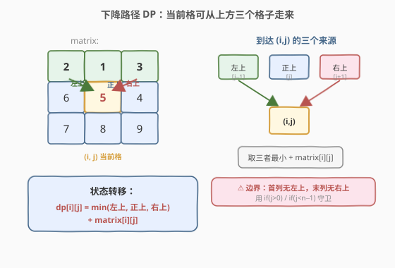
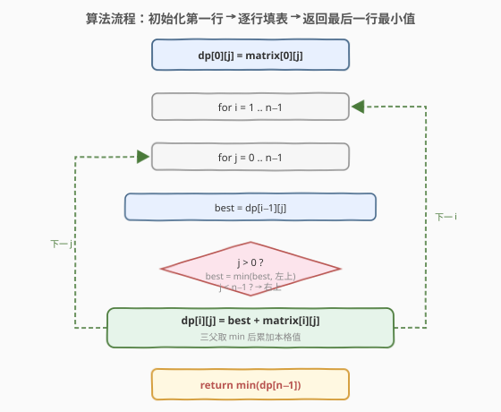
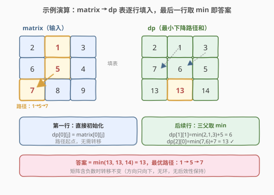

# LeetCode 下降路径最小和 题解

## 1. 题目概述

- **标题 / 题号**：下降路径最小和（#931，medium）
- **链接**：https://leetcode.cn/problems/minimum-falling-path-sum/
- **难度**：中等
- **标签**：数组、动态规划、网格 DP

**题意**：给定一个 `n x n` 的整数矩阵 `matrix`，返回从第一行任一元素出发、**下降到底部**的路径中，路径和的最小值。

下降路径：从 `(row, col)` 可以走到下一行的 `(row+1, col-1)`（左下）、`(row+1, col)`（正下）或 `(row+1, col+1)`（右下）。不能横跨多列或回退。

> ⚠️ 路径必须从第一行出发，到最后一行结束；每一步只能走到下一行相邻的三个格子之一。

**示例 1**：

```text
输入：matrix = [[2,1,3],[6,5,4],[7,8,9]]
输出：13
解释：最小路径为 1 → 5 → 7（或 1 → 4 → 8），和为 13。
```

**示例 2**：

```text
输入：matrix = [[-19,57],[-40,-5]]
输出：-59
解释：最小路径为 -19 → -40，和为 -59。
```

**约束**：

- `n == matrix.length == matrix[i].length`
- `1 <= n <= 100`
- `-100 <= matrix[i][j] <= 100`

> 💡 本题是 [120. 三角形最小路径和](../0101-0200/120_三角形最小路径和.md) 的「方形矩阵扩展」：120 每格有两个子（正下、右下），本题每格有**三个父**（左上、正上、右上），边界处理是关键。

## 2. 解题思路

### 2.1 暴力思路

从第一行每个格子出发 DFS，每步分三支走向左下/正下/右下，走到最后一行时记录路径和取最小。路径数约 $3^{n-1}$，$n=100$ 时指数爆炸。

> 💡 大量重复计算「从第一行到 `(i,j)` 的最小和」——这是**重叠子问题**信号 → 上 DP。

### 2.2 核心观察：网格 DP（三父取 min）



由于只能**向下**走，到达任一格子 `(i, j)` 的最后一步只可能来自**上一行的三个格子**：`(i-1, j-1)`（左上）、`(i-1, j)`（正上）、`(i-1, j+1)`（右上）。这带来两个关键性质：

- **无后效性**：到 `(i,j)` 的最优路径与「之前是怎么到上一行的」无关，只需关心上一行三个格子的最优和；
- **最优子结构**：到 `(i,j)` 的最小和 = `min(左上, 正上, 右上) + matrix[i][j]`。

设 $dp[i][j]$ 表示从第一行走到 `(i,j)` 的最小下降路径和，则：

$$
dp[i][j] = \min(dp[i-1][j-1],\ dp[i-1][j],\ dp[i-1][j+1]) + \text{matrix}[i][j]
$$

> ⚠️ **边界处理**：首列 `j=0` 没有「左上」父格，末列 `j=n-1` 没有「右上」父格。用 `if` 守卫跳过越界的父格即可，无需为整列单独写循环。第一行 `dp[0][j] = matrix[0][j]`（路径起点）。

> 💡 **和 120/64 的区别**：120 每格有 2 个子（正下/右下），64 每格有 2 个父（上/左）；本题每格有 **3 个父**（左上/正上/右上），是「网格下降 DP」从 2 父到 3 父的自然升级。

### 2.3 算法流程图



1. `dp[0][j] = matrix[0][j]`（初始化第一行）。
2. 行 `i` 从 `1` 到 `n-1`：
   - 列 `j` 从 `0` 到 `n-1`：
     - `best = dp[i-1][j]`（正上）
     - 若 `j > 0`：`best = min(best, dp[i-1][j-1])`（左上）
     - 若 `j < n-1`：`best = min(best, dp[i-1][j+1])`（右上）
     - `dp[i][j] = best + matrix[i][j]`
3. 返回 `min(dp[n-1])`（最后一行的最小值）。

> 💡 **空间优化**：每个 `dp[i][j]` 只依赖上一行，可压成一维 `dp[j]`。但注意 `dp[j]` 依赖上一行的 `dp[j-1]`、`dp[j]`、`dp[j+1]`——若从左到右更新，`dp[j-1]` 已被覆盖。需用 `prev` 变量缓存上一行的 `dp[j-1]` 旧值。

### 2.4 示例演算

以 `matrix = [[2,1,3],[6,5,4],[7,8,9]]` 为例，逐行填 dp 表：



| 行 i | dp[0] | dp[1] | dp[2] | 计算说明 |
|------|-------|-------|-------|----------|
| 0 | 2 | 1 | 3 | 初始化 = matrix[0] |
| 1 | 7 | 6 | 5 | dp[0]=min(2,1)+6, dp[1]=min(2,1,3)+5, dp[2]=min(1,3)+4 |
| 2 | 13 | 13 | 14 | dp[0]=min(7,6)+7, dp[1]=min(7,6,5)+8, dp[2]=min(6,5)+9 |

最终 `min(13, 13, 14) = 13`，最优路径为 `1 → 5 → 7`（或 `1 → 4 → 8`）。

## 3. 参考代码

### C++（二维 DP）

```cpp
class Solution {
  public:
    int minFallingPathSum(vector<vector<int>>& matrix) {
        int n = matrix.size();
        vector<vector<int>> dp(n, vector<int>(n));
        for (int j = 0; j < n; ++j) dp[0][j] = matrix[0][j];
        for (int i = 1; i < n; ++i) {
            for (int j = 0; j < n; ++j) {
                int best = dp[i - 1][j];                        // 正上
                if (j > 0) best = min(best, dp[i - 1][j - 1]);  // 左上
                if (j < n - 1) best = min(best, dp[i - 1][j + 1]); // 右上
                dp[i][j] = best + matrix[i][j];
            }
        }
        return *min_element(dp[n - 1].begin(), dp[n - 1].end());
    }
};
```

### C++（一维滚动数组，$O(n)$ 空间）

```cpp
class Solution {
  public:
    int minFallingPathSum(vector<vector<int>>& matrix) {
        int n = matrix.size();
        vector<int> dp(matrix[0]);                         // dp ← 第一行
        for (int i = 1; i < n; ++i) {
            int prev = INT_MAX;                            // 缓存上一行 dp[j-1] 旧值
            for (int j = 0; j < n; ++j) {
                int old = dp[j];                           // 保存旧值，供下一个 j 当 prev
                int best = min(prev, dp[j]);
                if (j + 1 < n) best = min(best, dp[j + 1]);
                dp[j] = best + matrix[i][j];
                prev = old;
            }
        }
        return *min_element(dp.begin(), dp.end());
    }
};
```

### Python

```python
class Solution:
    def minFallingPathSum(self, matrix: List[List[int]]) -> int:
        n = len(matrix)
        dp = matrix[0][:]                          # dp ← 第一行（拷贝）
        for i in range(1, n):
            prev = float('inf')                    # 缓存上一行 dp[j-1] 旧值
            for j in range(n):
                old = dp[j]
                best = min(prev, dp[j])
                if j + 1 < n:
                    best = min(best, dp[j + 1])
                dp[j] = best + matrix[i][j]
                prev = old
        return min(dp)
```

> ⚠️ **一维 `prev` 技巧详解**：从左到右更新 `dp[j]` 时，`dp[j-1]` 已被覆盖为新值，但我们需要的是**旧值**（上一行的 `dp[j-1]`）。因此每次更新前先把 `dp[j]` 存入 `old`，更新后把 `old` 赋给 `prev`——这样处理 `j+1` 时 `prev` 恰好是上一行的 `dp[j]`。首列 `prev = INT_MAX` 表示「没有左上父格」，不参与 `min`。

## 4. 复杂度分析

| 维度 | 复杂度 | 说明 |
|------|--------|------|
| 时间复杂度 | $O(n^2)$ | 每个格子计算一次，共 $n \times n$ 个格子 |
| 空间复杂度（二维） | $O(n^2)$ | 显式维护整张 dp 表 |
| 空间复杂度（一维） | $O(n)$ | 只保留一行 `dp[j]`，加 `prev`/`old` 两个变量 |

## 5. 扩展：原地修改

若允许修改输入，可直接在 `matrix` 上累加，空间降到 $O(1)$：

```cpp
class Solution {
  public:
    int minFallingPathSum(vector<vector<int>>& matrix) {
        int n = matrix.size();
        for (int i = 1; i < n; ++i) {
            for (int j = 0; j < n; ++j) {
                int best = matrix[i - 1][j];
                if (j > 0) best = min(best, matrix[i - 1][j - 1]);
                if (j < n - 1) best = min(best, matrix[i - 1][j + 1]);
                matrix[i][j] += best;
            }
        }
        return *min_element(matrix[n - 1].begin(), matrix[n - 1].end());
    }
};
```

> ⚠️ 原地法会破坏原始数据，**面试需主动询问「能否修改输入」**。

## 6. 面试要点

1. **为什么网格 DP 在这里成立？**

   「只能向下走」保证了**无后效性**：到 `(i,j)` 的最优只取决于上一行三个格子，不依赖具体走法；且**最优子结构**成立。两者齐备即可 DP。

2. **三父取 min 时怎么处理边界？**

   首列 `j=0` 无左上父格，末列 `j=n-1` 无右上父格。用 `if (j > 0)` 和 `if (j < n-1)` 守卫即可，无需为整列单独循环——比 120 的自底向上更直接（120 靠自底向上消除边界，本题靠 `if` 守卫）。

3. **一维滚动数组为什么需要 `prev` 变量？**

   `dp[j]` 依赖上一行的 `dp[j-1]`、`dp[j]`、`dp[j+1]`。从左到右更新时 `dp[j-1]` 已被覆盖，`prev` 缓存其旧值。`dp[j]` 本身是旧值（尚未覆盖），`dp[j+1]` 也是旧值（尚未处理），只有 `dp[j-1]` 需要额外保存。

4. **和 [120. 三角形最小路径和](../0101-0200/120_三角形最小路径和.md) 的异同？**

   都是「只能向下走」的网格最短路径 DP。区别：120 是三角形、每格 2 个子，自底向上零边界特判；931 是方形、每格 3 个父，自顶向下用 `if` 守卫处理边界。931 是 120 的「3 父升级版」。

5. **如果允许向四个方向走，还能用这个 DP 吗？**

   不能。四方向会形成**环**，无后效性被破坏，需改用最短路算法（如 Dijkstra）。

## 同类练习题

| # | 题目 | 与本题的关联 |
|---|------|-------------|
| 120 | [三角形最小路径和](https://leetcode.cn/problems/triangle/)（[题解](../0101-0200/120_三角形最小路径和.md)） | 2 子下降 DP，自底向上零边界，本题的 2 父退化版 |
| 64 | [最小路径和](https://leetcode.cn/problems/minimum-path-sum/)（[题解](../0001-0100/64_最小路径和.md)） | 网格 2 父（上/左）DP，对比转移方向与边界处理 |
| 1289 | [下降路径最小和 II](https://leetcode.cn/problems/minimum-falling-path-sum-ii/) | 下降路径但每行选不同列，从「三父取 min」升级为「全行取 min 但排除同列」 |
| 174 | [地下城游戏](https://leetcode.cn/problems/dungeon-game/) | 网格 DP 反向（从终点推起点）+ 负数，强化「方向选择」与边界处理 |
| 62 | [不同路径](https://leetcode.cn/problems/unique-paths/)（[题解](../0001-0100/62_不同路径.md)） | 网格 DP 计数版，巩固无后效性 + 最优子结构的判定 |
