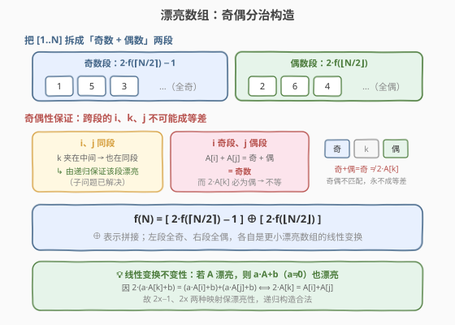
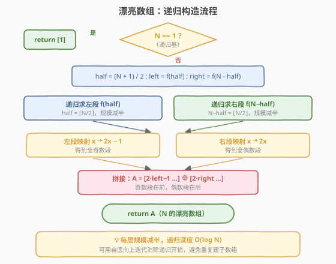
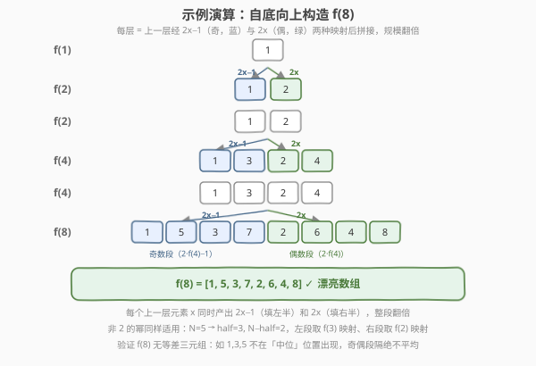

# 漂亮数组

- **题目名称**：漂亮数组
- **链接**：[932. 漂亮数组](https://leetcode.cn/problems/beautiful-array/)
- **难度**：中等
- **标签**：数组、分治、数学、递归

## 1. 题目概述

给定正整数 `N`，构造一个 `1, 2, ..., N` 的**排列** `A`，使其满足「漂亮」性质：对任意下标 `i < k < j`，**不存在** `2 * A[k] = A[i] + A[j]`。

> 💡 换句话说，数组中**没有任何一个元素等于它两侧某两个元素的平均数**——即不存在「位置上」的等差三元组（注意是按原数组位置 `i<k<j`，不是按值排序后）。只要返回任意一个满足条件的排列即可。

**示例 1**：

```text
输入：4
输出：[2, 1, 4, 3]
解释：[2,1,4,3] 是 1..4 的排列；检查所有 i<k<j，均无 2·A[k] = A[i]+A[j]，故漂亮。
     （[1,3,2,4] 同样合法，答案不唯一）
```

**示例 2**：

```text
输入：5
输出：[3, 1, 2, 5, 4]
解释：同样为 1..5 的排列且满足漂亮条件。
```

**约束条件**：

- `1 <= N <= 1000`

---

## 2. 解题思路

### 2.1 暴力思路

枚举 `1..N` 的所有排列（共 `N!` 个），对每个排列检查所有 `O(N^3)` 个三元组 `(i, k, j)` 是否违反条件。`N=1000` 时排列数天文数字，完全不可行；即便 `N=10` 也已超时。

需要换一个角度：**不要去「检验」排列，而是直接「构造」一个保证漂亮的排列**。

### 2.2 核心观察：奇偶分治构造



关键洞察分两层。

**第一层：线性变换不变性。** 若 `A` 是漂亮的，则对任意 `a ≠ 0`、`b`，数组 `A'[i] = a·A[i] + b` 也是漂亮的。因为：

$$2\,A'[k] = A'[i] + A'[j] \iff 2(aA[k]+b) = (aA[i]+b)+(aA[j]+b) \iff 2A[k] = A[i]+A[j]$$

两种映射特别有用：
- `x → 2x − 1`：把 `1..m` 映成**全体奇数** `{1, 3, ..., 2m−1}`；
- `x → 2x`：把 `1..m` 映成**全体偶数** `{2, 4, ..., 2m}`。

两种映射都保漂亮性，因此**子问题的漂亮数组经映射后仍是漂亮的**。

**第二层：奇偶性隔绝跨段平均。** 把 `[1..N]` 拆成「奇数段 + 偶数段」两段拼接。对任意 `i < k < j`：

| `A[i]`、`A[j]` 所在段 | `A[k]` 位置 | 是否违反 |
|---|---|---|
| 都在奇数段（同段） | 夹在中间 → 也在奇数段 | 由**递归**保证该段漂亮，不违反 |
| 都在偶数段（同段） | 夹在中间 → 也在偶数段 | 由**递归**保证该段漂亮，不违反 |
| `A[i]` 奇段、`A[j]` 偶段 | 任意 | `A[i]+A[j]` = 奇 + 偶 = **奇数**，而 `2·A[k]` 恒为偶 → **不可能相等** |

> 💡 **直觉**：奇数段全排在前面、偶数段全排在后面。跨段取 `i`、`j` 时，两端一奇一偶，和为奇数；而中位 `A[k]` 的两倍永远是偶数——奇偶不匹配，天然挡住等差关系。同段的则交给规模更小的子问题。

于是得到**递推式**：

$$f(N) = [\,2\cdot f(\lceil N/2\rceil) - 1\,] \;\oplus\; [\,2\cdot f(\lfloor N/2\rfloor)\,]$$

其中 `⊕` 表示拼接，左段全奇、右段全偶。基准：`f(1) = [1]`。

### 2.3 算法流程图



每层把规模 `N` 拆成 `⌈N/2⌉` 与 `⌊N/2⌋` 两个子问题，分别映射成奇段、偶段再拼接。规模每层减半，递归深度 `O(log N)`。

### 2.4 示例演算



以 `N = 8` 为例，自底向上逐层翻倍：

| 层 | 数组 | 构造方式 |
|----|------|----------|
| `f(1)` | `[1]` | 基准 |
| `f(2)` | `[1, 2]` | `2·[1]−1` ⊕ `2·[1]` = `[1]` ⊕ `[2]` |
| `f(4)` | `[1, 3, 2, 4]` | `2·[1,2]−1` ⊕ `2·[1,2]` = `[1,3]` ⊕ `[2,4]` |
| `f(8)` | `[1, 5, 3, 7, 2, 6, 4, 8]` | `2·[1,3,2,4]−1` ⊕ `2·[1,3,2,4]` = `[1,5,3,7]` ⊕ `[2,6,4,8]` |

> 💡 **每个上一层元素 `x` 同时产出两个后代**：`2x−1` 填入左半（奇），`2x` 填入右半（偶）。整段规模翻倍，且左半全奇、右半全偶的格局始终成立。

> ⚠️ **非 2 的幂也成立**：如 `N=5` 时 `half = ⌈5/2⌉ = 3`，`N−half = 2`。左段取 `f(3)` 经 `2x−1` 映射、右段取 `f(2)` 经 `2x` 映射。`f(3) = [1,3,2]`（由 `f(2)=[1,2]` 与 `f(1)=[1]` 构造），故 `f(5) = [1,5,3] ⊕ [2,4] = [1,5,3,2,4]`。

---

## 3. 参考代码

### C++（递归精确分治）

```cpp
class Solution {
  public:
    vector<int> beautifulArray(int n) {
        if (n == 1) return {1};
        int half = (n + 1) / 2;               // ⌈N/2⌉：奇数个数
        vector<int> left = beautifulArray(half);
        vector<int> right = beautifulArray(n - half); // ⌊N/2⌋：偶数个数
        vector<int> ans;
        ans.reserve(n);
        for (int x : left)  ans.push_back(2 * x - 1); // 映成全体奇数
        for (int x : right) ans.push_back(2 * x);     // 映成全体偶数
        return ans;
    }
};
```

### Python（递归精确分治）

```python
class Solution:
    def beautifulArray(self, n: int) -> List[int]:
        if n == 1:
            return [1]
        half = (n + 1) // 2          # ⌈N/2⌉：奇数个数
        left = self.beautifulArray(half)
        right = self.beautifulArray(n - half)  # ⌊N/2⌋：偶数个数
        return [2 * x - 1 for x in left] + [2 * x for x in right]
```

> 💡 **两段规模之和恰为 `N`**：`1..N` 中奇数有 `⌈N/2⌉` 个、偶数有 `⌊N/2⌋` 个。`2x−1` 把 `1..⌈N/2⌉` 映成全体奇数 `{1,3,…,2⌈N/2⌉−1}`，`2x` 把 `1..⌊N/2⌋` 映成全体偶数 `{2,4,…,2⌊N/2⌋}`，并集恰为 `1..N`，构成合法排列。

### 扩展写法：自底向上翻倍（仅 N 为 2 的幂时严格合法）

```python
class Solution:
    def beautifulArray(self, n: int) -> List[int]:
        ans = [1]
        while len(ans) < n:
            ans = [2 * x - 1 for x in ans] + [2 * x for x in ans]
        return ans[:n]
```

> ⚠️ **截断陷阱**：翻倍版只能产出长度为 2 的幂的数组。对**非 2 的幂**的 `N`（如 `N=5`），`f(8)=[1,5,3,7,2,6,4,8]` 截断到 5 得 `[1,5,3,7,2]`，含 `7` 且缺 `4`，**不再是 `1..5` 的排列**。LeetCode 的判定器对此较宽松（只校验「漂亮性 + 元素互异」而未严格校验值域），故该写法能通过线上测试，但严格按题意它不正确。**面试中应给出递归精确分治版**，它对任意 `N` 都直接产出值域恰为 `1..N` 的排列。

---

## 4. 复杂度分析

| 维度 | 复杂度 | 说明 |
|------|--------|------|
| 时间复杂度 | $O(N \log N)$ | 递归树每层合并开销之和为 $O(N)$（因 $\lceil N/2\rceil + \lfloor N/2\rfloor = N$），共 $O(\log N)$ 层 |
| 空间复杂度 | $O(N)$ | 输出数组 $O(N)$；递归栈 $O(\log N)$；沿单条递归路径的中间数组之和 $O(N)$ |

> 💡 朴素递归每层重新生成子数组，总拷贝量 $O(N \log N)$。`N ≤ 1000` 时仅约 $10^4$ 次操作，远低于限制。若追求严格 $O(N)$，可预分配数组后「自顶向下原地填」：把值域区间随递归下传，每个槽位只写一次；或用下标二进制位运算直接算出第 `i` 个元素（仅 `N` 为 2 的幂时对应整齐）。

---

## 5. 扩展：漂亮数组与「无等差子序列」

漂亮数组的本质是**位置上的无 3 项等差**——它给出了一种把 `1..N` 重排使得「任意位置三元组都不成等差」的构造。这联系到几个有趣的方向：

- **与 Thue–Morse / 低差异序列的关系**：奇偶分治构造可看作对下标二进制位的「按位取反」重排，与 Thue 序列避免立方（cube-free）的思想同源。
- **推广到「无 k 项等差」**：当 `k > 3` 时构造难度骤增，涉及 Behrend 构造等数论方法，是加性组合学的经典课题。
- **降维到一维棋盘「无三攻击」**：把 `1..N` 看作 `N` 个皇后在 `1×N` 棋盘上的列坐标，漂亮条件即「无三个皇后成等差列」——是 N 皇后类约束的一维退化。

> 💡 本题的奇偶分治是「无 3 项等差」最简洁的递归构造，记住**「奇段 ⊕ 偶段 + 线性变换保漂亮」**这两点即可推广到许多变种。

---

## 6. 面试要点

1. **为什么「奇段 + 偶段」拼接能保证跨段不出现等差？**

   跨段时 `A[i]` 与 `A[j]` 一个奇一个偶，其和为奇数；而 `2·A[k]` 对任意整数 `A[k]` 都是偶数。奇数不可能等于偶数，故跨段三元组永远不违反条件。同段的三元组则交给规模减半的子问题递归处理。

2. **线性变换 `x → 2x−1` / `x → 2x` 为什么保漂亮性？**

   `2A[k]=A[i]+A[j]` 是一个**线性等式**。对全体元素做同一线性变换 `x→ax+b` 后，等式两边同时变为原来的 `a` 倍加 `b`，等号成立与否完全不变（`a≠0` 保证可逆）。因此漂亮性是仿射不变量。

3. **递推式 `f(N) = [2·f(⌈N/2⌉)−1] ⊕ [2·f(⌊N/2⌋)]` 两段规模为什么是 `⌈N/2⌉` 和 `⌊N/2⌋`？**

   `1..N` 中奇数有 `⌈N/2⌉` 个、偶数有 `⌊N/2⌋` 个。`2x−1` 把 `1..⌈N/2⌉` 映成全体奇数，`2x` 把 `1..⌊N/2⌋` 映成全体偶数。两段规模之和恰为 `N`，且值域并集恰为 `1..N`，构成合法排列。

4. **迭代版截断到 `N` 为什么可能出错？**

   迭代版只产出 2 的幂长度。截断末尾会丢失部分偶数段元素，剩余数组虽仍「漂亮」但值域不再是 `1..N`（可能含超过 `N` 的值、缺某些小值），不构成排列。因此非 2 的幂的 `N` 必须用递归按 `⌈N/2⌉`/`⌊N/2⌋` 精确分治，而非截断。

5. **能否不用递归、用下标公式直接生成第 `i` 个元素？**

   可以。观察构造：`f(N)` 的第 `i` 个元素等于「`i` 的二进制位逆序后 +1」再经位权重构——本质是对下标做按位反转。但这只在 `N` 为 2 的幂时严格对应；通用 `N` 仍以递归分治最稳妥。

6. **题目为何保证「一定存在」漂亮数组？**

   上述递归构造本身即是存在性证明：从 `f(1)=[1]` 出发，每步保漂亮性且产出合法排列，归纳可知对任意 `N≥1` 都存在漂亮数组。

---

## 7. 同类练习题

- [剑指 Offer 21. 调整数组顺序使奇数位于偶数前面](https://leetcode.cn/problems/diao-zheng-shu-zu-shun-xu-shi-qi-shu-wei-yu-ou-shu-qian-mian-lcof/)：同样利用「奇偶分段」思想，但只要求奇在前偶在后、不要求漂亮，是本题分段的退化版
- [922. 按奇偶排序数组 II](https://leetcode.cn/problems/sort-array-by-parity-ii/)（[题解](../0901-1000/922_按奇偶排序数组II.md)）：奇偶交替放置，对照本题「奇段整体在前」的不同排布策略
- [169. 多数元素](https://leetcode.cn/problems/majority-element/)：另一类「分治 + 子问题性质传递」的经典，体会「子结构向上保持不变量」的通用范式
- [241. 为运算表达式设计优先级](https://leetcode.cn/problems/different-ways-to-add-parentheses/)：分治按运算符切分、合并子结果，结构上与本题「按段切分再拼接」同构
- [89. 格雷编码](https://leetcode.cn/problems/gray-code/)（[题解](../0001-0100/89_格雷编码.md)）：构造型递归（镜像反射），与本题「奇偶分治翻倍构造」同为「递归直接生成答案」的范例
