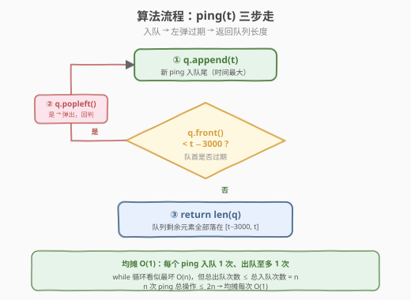
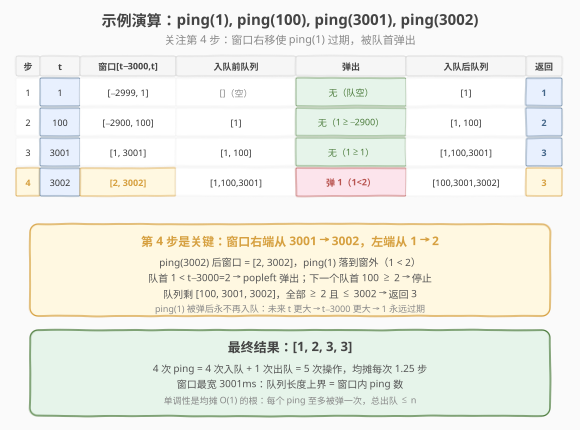

# 最近的请求次数

- **题目名称**：最近的请求次数
- **链接**：[933. 最近的请求次数](https://leetcode.cn/problems/number-of-recent-calls/)
- **难度**：简单
- **标签**：队列、设计、滑动窗口

## 1. 题目概述

设计一个 `RecentCounter` 类，用于统计「最近一段时间」内的请求数量。

- 每次调用 `ping(int t)` 表示在时刻 `t`（毫秒）发生了一次请求。
- 返回**在时间范围 $[t - 3000, t]$ 内**（含两端）发生的请求数目。
- 直观地说：从当前请求向前回看 3000 毫秒，数这窗口里有几次请求（包括本次）。

实现 `RecentCounter`：

- `RecentCounter()`：初始化计数器。
- `int ping(int t)`：在时刻 `t` 增加一次请求，返回 $[t - 3000, t]$ 内的请求数。

**示例 1**：

```text
输入：
  ["RecentCounter","ping","ping","ping","ping"]
  [[],[1],[100],[3001],[3002]]
输出：[null,1,2,3,3]

解释：
  ping(1)    → 窗口 [1−3000, 1]   = [−2999, 1]    ，队列 [1]                       → 1
  ping(100)  → 窗口 [100−3000, 100] = [−2900, 100] ，队列 [1,100]                  → 2
  ping(3001) → 窗口 [1, 3001]      ，队列 [1,100,3001]（1 刚好在窗口左端）         → 3
  ping(3002) → 窗口 [2, 3002]      ，弹掉 1（1<2），队列 [100,3001,3002]           → 3
```

**约束条件**：

- $1 \leq t \leq 10^9$
- 每个测试用例中 `ping` 以**严格递增**的 `t` 顺序调用
- `ping` 最多被调用 $10^4$ 次

> 💡 这是 **队列（FIFO）** 的招牌设计题，也是「在线流式滑动窗口」的最简形态。窗口右端由 `ping` 的 `t` 决定，左端 = $t - 3000$ 随之单调右移；队列只需装下「窗口内的全部 ping」。与 [滑动窗口最大值](../0201-0300/239_滑动窗口最大值.md) 是同源骨架——239 要在窗口里查最大值（需单调队列），而本题只数窗口里有多少个 ping（普通 FIFO 队列足矣）。可以把 933 当作 239 的「入门前置题」。

---

## 2. 解题思路

### 2.1 暴力思路：每次全表回扫

最直观的做法：把所有历史 ping 存进数组，每次 `ping(t)` 先追加 `t`，再从头扫描统计有多少个落进 $[t - 3000, t]$。

```text
pings = []
ping(t):
    pings.append(t)
    cnt = 0
    for p in pings:
        if t - 3000 <= p <= t:
            cnt += 1
    return cnt
```

最坏情况（所有 ping 都挤在 3000ms 窗口内，如 `t = 1,2,3,...,n`），第 `k` 次要扫 `k` 个元素，`n` 次调用的总代价是 $1+2+\dots+n = O(n^2)$。`n = 10^4` 时约 $10^8$，**勉强能过但效率低**，且完全没利用「ping 严格递增」这一关键性质。

> ⚠️ 暴力法的问题：每次都从**最早的 ping** 开始扫，而那些早就落到窗口左侧外（$< t - 3000$）的 ping 会被**反复无效扫描**。例如 `ping(3002)` 时，`ping(1)` 早就过期了，却仍被遍历到。更糟的是，随着 `t` 增大，过期的 ping **只会越来越多、永远不会回到窗口内**——因为未来的 `t` 更大，$t - 3000$ 也更大，窗口左端只往右走。这正是「单调性」给我们的优化空间：**过期的就一次性扔掉，再也不看**。

### 2.2 核心观察：FIFO 队列 + 贪心左弹

**关键性质**：`ping` 的 `t` **严格递增**，因此存进队列的 ping 天然**升序排列**。窗口 $[t - 3000, t]$ 的两个端点都随 `t` **单调右移**。

由此推出三个要点：

1. **队列只装窗口内的 ping**：每次 `ping(t)` 先把 `t` 入队（它一定在窗口内，因为 $t \leq t$）。
2. **只需从队首检查过期**：队首是最小的 ping，如果它都 $\geq t - 3000$，则整队都在窗口内；如果队首 $< t - 3000$，则它过期了。
3. **过期即永不过期 → 贪心弹出**：队首一旦 $< t - 3000$，由于未来 `t` 只增不减，$t - 3000$ 也只增不减，这个 ping **永远不会重新进窗**。所以放心 `popleft()`，循环弹到队首 $\geq t - 3000$ 为止。

![FIFO 队列 = 滑动时间窗口 [t−3000, t] 的内容](../images/recent_counter_queue.svg)

**为什么用 FIFO 队列而不是数组 + 二分？** 数组 + 二分找下界（`lower_bound(t - 3000)`）也能 `O(log n)` 定位窗口左端，但队列把「过期元素」直接丢弃，既省空间又把每次查询降到均摊 `O(1)`——比 `O(log n)` 还快，且代码更短。队列的本质是**把窗口左端的右移过程「摊」到每次入队上**，每个 ping 入队 1 次、出队至多 1 次。

> 💡 **单调性是均摊 O(1) 的根**：暴力法慢在「过期元素被反复扫」；队列法利用「窗口左端单调右移 + ping 严格递增」两条单调性，让每个 ping **只被处理一次**（入队算一次，出队算一次）。这与 [股票价格跨度](../0901-1000/901_股票价格跨度.md) 的「每段至多被合并一次」、[每日温度](../0701-0800/739_每日温度.md) 的「每元素至多入栈出栈一次」是同一种「单调结构 + 均摊分析」范式。

### 2.3 算法流程图



**完整步骤**：

1. **初始化**：空队列 `q`（C++ 用 `std::queue`，Python 用 `collections.deque`）。
2. **每次** `ping(t)`：
   - `q.append(t)`（入队尾，`t` 是当前最大值）
   - `while q 非空 且 q.front() < t - 3000`：`q.popleft()`（弹掉过期队首）
   - `return len(q)`（剩余元素全部落在 $[t - 3000, t]$）
3. **不变式**：循环结束后，队列里每个元素都 $\geq t - 3000$（窗口左端），又都 $\leq t$（因为 `t` 是最大的、且严格递增），故队列内容**恰好等于**窗口内的全部 ping。

> ⚠️ 比较用 `<`（严格小于）而非 `<=`：题意窗口是 $[t - 3000, t]$ **闭区间**，恰好等于 $t - 3000$ 的 ping **算在窗口内**。所以只有严格 $< t - 3000$ 才弹。若误用 `<=` 会把刚好卡在左端的合法 ping 弹掉，少算一个。

### 2.4 示例演算

以官方示例 `ping(1), ping(100), ping(3001), ping(3002)` 为例：



| 步骤 | t | 窗口 $[t{-}3000, t]$ | 入队前队列 | 弹出 | 入队后队列 | 返回 |
|------|---|---------------------|-----------|------|-----------|------|
| 1 | 1 | $[-2999, 1]$ | `[]` | 无（队空） | `[1]` | 1 |
| 2 | 100 | $[-2900, 100]$ | `[1]` | 无（$1 \geq -2900$） | `[1, 100]` | 2 |
| 3 | 3001 | $[1, 3001]$ | `[1, 100]` | 无（$1 \geq 1$，刚好卡在左端） | `[1, 100, 3001]` | 3 |
| 4 | 3002 | $[2, 3002]$ | `[1, 100, 3001]` | 弹 `1`（$1 < 2$） | `[100, 3001, 3002]` | 3 |

关注第 3、4 步的对比：`ping(3001)` 时窗口左端 = 1，`ping(1)` 刚好等于左端，**合法保留**；`ping(3002)` 时窗口左端右移到 2，`ping(1)` 落到窗外，被队首弹出。这一弹是永久性的——未来 `t` 更大，左端更大，`ping(1)` 永不回归。

> 💡 4 次 `ping` = 4 次入队 + 1 次出队 = 5 次操作，均摊每次 $1.25$ 步。若用暴力法，第 4 步要扫 4 个元素，4 步共扫 $1+2+3+4=10$ 次；队列法只用了 5 次，且 `n` 越大差距越明显（队列法总操作 $\leq 2n$，暴力法最坏 $O(n^2)$）。

---

## 3. 参考代码

### C++

```cpp
// 最近的请求次数.cpp —— FIFO 队列 + 贪心左弹
// 编译: g++ -O2 -std=c++17 最近的请求次数.cpp -o recentcounter
#include <queue>
using namespace std;

class RecentCounter {
    queue<int> q;                   // 只装窗口内的 ping，天然升序
  public:
    RecentCounter() {}

    int ping(int t) {
        q.push(t);                  // 入队尾（当前最大值）
        while (q.front() < t - 3000) // 队首过期 → 弹
            q.pop();
        return (int)q.size();       // 剩余全在 [t-3000, t]
    }
};
```

### Python

```python
from collections import deque

class RecentCounter:
    def __init__(self):
        self.q = deque()            # 只装窗口内的 ping，天然升序

    def ping(self, t: int) -> int:
        self.q.append(t)                       # 入队尾（当前最大值）
        while self.q and self.q[0] < t - 3000: # 队首过期 → 弹
            self.q.popleft()
        return len(self.q)                     # 剩余全在 [t-3000, t]
```

> 💡 Python 必须用 `collections.deque` 而非 `list`：`list.pop(0)` 是 `O(n)`（需整体前移），而 `deque.popleft()` 是 `O(1)`。C++ 的 `std::queue` 默认基于 `deque`，`front()`/`pop()`/`push()` 都是 `O(1)`。注意 `while` 条件里要先判 `self.q` 非空再取 `self.q[0]`，避免空队列越界——这是本题最常见的边界坑。

---

## 4. 复杂度分析

| 维度 | 复杂度 | 说明 |
|------|--------|------|
| **时间复杂度** | `O(1)` 均摊每次 / `O(n)` 总计 | 每个 ping 入队 1 次、出队至多 1 次，`n` 次 `ping` 总操作 $\leq 2n$ |
| **空间复杂度** | `O(w)`，最坏 `O(n)` | 队列只装窗口内的 ping，`w` = 窗口内 ping 数；最坏情况所有 ping 都挤在 3000ms 内，$w = n$ |

> ⚠️ 单次 `ping` 内有 `while` 循环，最坏单次确实 `O(n)`（如 `ping(1), ping(2), ..., ping(n)` 全挤在窗口里，最后一次 `ping(n)` 可能连弹多个——但本题窗口宽 3001ms，只要 ping 间距 $\geq 1$，单次最多弹约 3000 个）。**均摊分析**：所有 `ping` 的总入队 = `n`，总出队 $\leq n$，平摊到 `n` 次调用上每次 $\leq 2$ 次操作。关键不变式是「一个 ping 一旦被弹出就永不再入队」，与 [股票价格跨度](../0901-1000/901_股票价格跨度.md) 的均摊论证完全同理。

---

## 5. 扩展：与同类窗口/队列题的对比

### 5.1 为什么队列法比数组 + 二分更优？

数组 + 二分的做法：把所有 ping 存进有序数组（天然有序，因为 `t` 严格递增），每次 `ping(t)` 先 `append`，再 `bisect_left(t - 3000)` 定位窗口左端，返回 `len - idx`。

- 时间：`O(log n)` 每次（二分），`O(n log n)` 总计。
- 空间：`O(n)`，且**从不删除过期元素**，数组无限增长。

队列法把过期元素直接丢弃，换来：① 时间降到均摊 `O(1)`（比 `O(log n)` 还快）；② 空间降到 `O(w)`（窗口大小，而非全部历史）。代价是失去「随机访问任意历史 ping」的能力——但本题根本不需要。**通用原则**：只要查询只关心「窗口内的聚合」且窗口端点单调移动，用队列丢弃过期元素永远比保留全量 + 二分更优。

### 5.2 与滑动窗口家族的对比

| 维度 | 最近的请求次数 (933) | 滑动窗口最大值 (239) | 长度最小子数组 (209) | 乘积小于K的子数组 (713) |
|------|---------------------|---------------------|---------------------|------------------------|
| 数据形态 | 在线流式 `ping` | 离线数组 + 定长窗口 | 离线数组 + 变长窗口 | 离线数组 + 变长窗口 |
| 窗口端点 | 左右端都随 `t` 单调右移 | 固定长度 `k` 滑动 | 右端扩张 / 左端收缩 | 右端扩张 / 左端收缩 |
| 队列结构 | **普通 FIFO 队列** | **单调队列**（存候选最大） | 双指针（无需队列） | 双指针（无需队列） |
| 窗口内查询 | 数个数 → `len(q)` | 查最大值 → 队首 | 求和 → 前缀和/累加 | 计数 → `right-left+1` |
| 复杂度 | `O(1)` 均摊 | `O(n)` | `O(n)` | `O(n)` |

> 💡 933 是这一家族里**最简单**的：窗口内只问「有多少个」，所以普通 FIFO 队列就够。一旦窗口内要问「最大值/最小值」，就得升级到**单调队列**（239）；要问「满足某条件的子数组」，就升级到**双指针 + 不变式**（209/713）。933 → 239 是「FIFO 队列 → 单调队列」的自然进阶路径。

### 5.3 如果窗口左端不单调呢？

本题能贪心左弹的前提是**窗口左端 $t - 3000$ 单调右移**。若题目改成「每次查询给定任意区间 $[l, r]`」（如 [基于时间的键值存储](../0901-1000/981_基于时间的键值存储.md)），左端不再单调，队列就无法丢弃历史，必须用**有序数组 + 二分**保留全量。这说明：**队列法适用区间端点单调移动的场景**，二分法适用任意区间查询——选型取决于端点是否单调。

---

## 6. 面试要点

1. **为什么用队列而不是每次回扫数组？**

   - 暴力每次从头扫，过期 ping 被反复无效遍历，最坏 `O(n²)`。
   - 队列利用「ping 严格递增 + 窗口左端单调右移」两条单调性，把过期 ping 一次性丢弃。每个 ping 入队 1 次、出队至多 1 次，`n` 次调用总 `O(n)`，均摊 `O(1)`。
   - 本质是「单调结构 + 均摊分析」范式：一旦元素过期就永不再用，可放心删除。

2. **为什么从队首检查过期，而不是队尾或任意位置？**

   - ping 严格递增 → 队列天然升序 → **队首是最小值**。
   - 若队首 $\geq t - 3000$，则全队都 $\geq t - 3000$，无人过期；若队首 $< t - 3000$，则队首过期，弹掉后继续看新队首。
   - 因此只需从队首「一边」检查，无需遍历全队——这是「有序 + 单端检查」的标准优化。

3. **比较用 `<` 还是 `<=`？为什么？**

   - 用 `<`（严格小于）。窗口是闭区间 $[t - 3000, t]$，恰好等于 $t - 3000$ 的 ping **合法**。
   - 误用 `<=` 会把卡在左端的合法 ping 弹掉，导致少算。口诀：**闭区间用 `<`，开区间用 `<=`**。

4. **单次 `ping` 最坏 `O(n)`，为什么说均摊 `O(1)`？**

   - 最坏单次确实可能弹很多（如窗口很挤、左端突然右移一大步）。
   - 但**均摊分析**：总入队 = `n`，总出队 $\leq n`（每个 ping 至多被弹一次），平摊到 `n` 次调用上每次 $\leq 2` 次操作。
   - 关键不变式：「一个 ping 一旦被弹出就永不再入队」，故出队总次数有上界 `n`。这是「账本分析法」的典型例子——贵的连弹操作由之前多次便宜的入队「预付」了。

5. **为什么 Python 要用 `deque` 而不是 `list`？**

   - `list.pop(0)` 是 `O(n)`（需把后续元素整体前移），`deque.popleft()` 是 `O(1)`。
   - 用 `list` 会让均摊 `O(1)` 退化成 `O(n)`，失去队列法的全部优势。C++ 的 `std::queue` 默认基于 `deque`，无此坑。
   - 延伸：凡是「频繁头删尾增」的场景，Python 一律用 `collections.deque`，这是语言层面的最佳实践。

> 💡 **一句话总结**：最近的请求次数是「在线流式滑动窗口」的最简形态——用普通 FIFO 队列装下窗口内的 ping，利用「ping 严格递增 + 左端单调右移」两条单调性，把过期元素贪心左弹，实现均摊 `O(1)` 的 `ping`。它是 [滑动窗口最大值](../0201-0300/239_滑动窗口最大值.md)（单调队列）的入门前置题，也是「单调结构 + 均摊分析」范式的最简示例，面试时能讲清「为什么均摊 O(1)」与「比较用 <」两个细节就过关。

---

## 7. 同类练习题
- [239. 滑动窗口最大值](https://leetcode.cn/problems/sliding-window-maximum/)（[题解](../0201-0300/239_滑动窗口最大值.md)）：窗口内查最大值 → 单调队列，本题的进阶版
- [209. 长度最小的子数组](https://leetcode.cn/problems/minimum-size-subarray-sum/)（[题解](../0201-0300/209_长度最小的子数组.md)）：离线数组上的变长滑动窗口，双指针维护
- [713. 乘积小于K的子数组](https://leetcode.cn/problems/subarray-product-less-than-k/)（[题解](../0701-0800/713_乘积小于K的子数组.md)）：变长窗口 + 计数 `right-left+1`，同源骨架
- [901. 股票价格跨度](https://leetcode.cn/problems/online-stock-span/)（[题解](../0901-1000/901_股票价格跨度.md)）：同为在线设计题，单调栈 + 跨度合并，均摊 O(1) 同理
