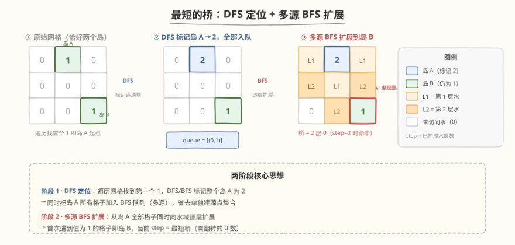
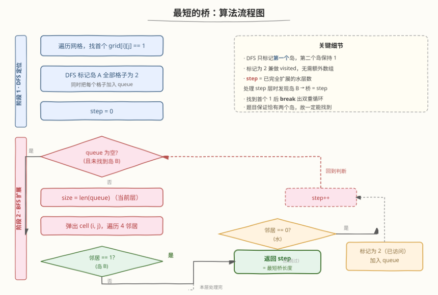
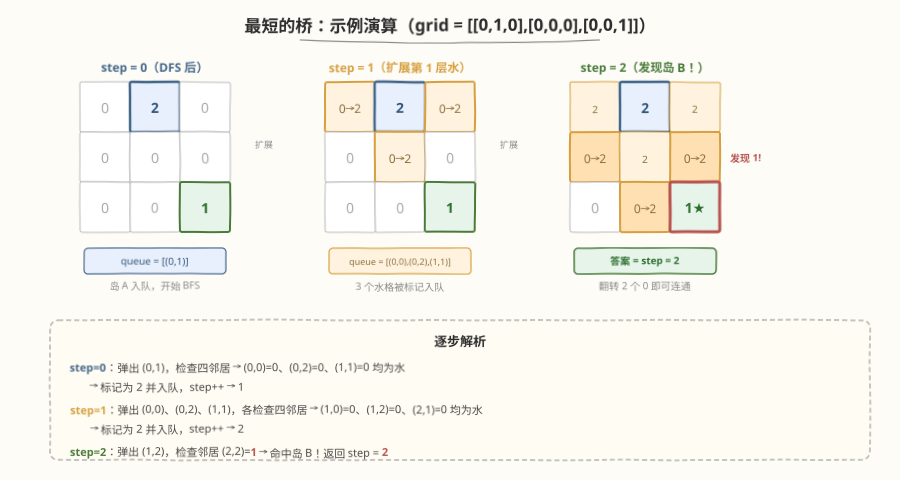

# LeetCode 最短的桥 题解

## 1. 题目概述

- **标题 / 题号**：最短的桥（#934，medium）
- **链接**：https://leetcode.cn/problems/shortest-bridge/
- **难度**：中等
- **标签**：广度优先搜索、深度优先搜索、矩阵、多源 BFS

**题意**：给定 `n × n` 二值矩阵 `grid`，其中恰好有**两个岛屿**（由 `1` 组成的 4-方向连通块，被 `0` 水域分隔）。每次操作可将一个 `0` 翻转为 `1`。求连接两个岛屿所需翻转的**最少 `0` 数量**（即两岛之间的最短桥长度）。

**示例 1**：

```text
输入：grid = [[0,1],[1,0]]
输出：1
解释：翻转 (0,0) 或 (1,1) 即可连通两岛。
```

**示例 2**：

```text
输入：grid = [[0,1,0],[0,0,0],[0,0,1]]
输出：2
解释：翻转 (1,1) 和 (1,2)（或 (2,1)）即可连通两岛。
```

**示例 3**：

```text
输入：grid = [[1,1,1,1,1],[1,0,0,0,1],[1,0,1,0,1],[1,0,0,0,1],[1,1,1,1,1]]
输出：1
解释：外环为岛 A，中心 (2,2) 为岛 B，翻转任意一个内圈 0 即可连通。
```

**约束**：

- `n == grid.length == grid[i].length`
- `2 <= n <= 100`
- `grid[i][j]` 为 `0` 或 `1`
- 恰好有两个岛屿

## 2. 解题思路

### 2.1 暴力思路

枚举两岛所有格子对，计算曼哈顿距离再减 1 取最小值。问题：需先区分两岛（BFS/DFS 标记），且 $O(n^4)$ 效率低，$n = 100$ 时达 $10^8$ 量级。

### 2.2 核心观察：DFS 定位 + 多源 BFS



关键洞察：**两阶段法**——

1. **DFS 定位**：遍历网格找到第一个 `1`（岛 A 起点），DFS 标记整个岛 A 为 `2`，同时把所有格子加入 BFS 队列。
2. **多源 BFS 扩展**：从岛 A 全部格子同时向水域逐层扩展。每层代表翻转一个 `0`，**首次遇到值为 `1` 的格子（岛 B）时**，当前 `step` 即为最短桥长度。

> 💡 与 [994. 腐烂的橘子](https://leetcode.cn/problems/rotting-oranges/) 的多源 BFS 同构——腐烂橘子把所有初始源点同时入队、逐层感染；本题把岛 A 所有格子同时入队、逐层"感染"水域。区别在于：994 的目标是感染全部新鲜橘子（求最大层数），本题的目标是**首次触碰另一个岛**（求到达距离）。两者都是"多源 + 逐层扩展 + 首次命中即最短"的核心模式。

### 2.3 算法流程图



### 2.4 示例演算



以示例 2 `grid = [[0,1,0],[0,0,0],[0,0,1]]` 为例：

| step | 弹出的格子 | 检查邻居 | 新入队 | 状态 |
|------|-----------|----------|--------|------|
| 0 | (0,1) | (0,0)=0, (0,2)=0, (1,1)=0 | (0,0),(0,2),(1,1) | 岛 A 扩展第 1 圈水 |
| 1 | (0,0),(0,2),(1,1) | (1,0)=0, (1,2)=0, (2,1)=0 | (1,0),(1,2),(2,1) | 扩展第 2 圈水 |
| 2 | (1,0),(1,2),... | (1,2) 的邻居 (2,2)=**1** | — | **命中岛 B！返回 step=2** |

`step = 2` 即为答案：翻转 2 个 `0` 即可连通两岛。

> ⚠️ **计数关键**：`step` 表示已完全扩展的水层数。处理第 `step` 层格子时，若其邻居为 `1`（岛 B），说明桥需要穿过 `step` 个 `0`——直接返回 `step`。不要返回 `step + 1` 或 `step - 1`。

## 3. 参考代码

### C++

```cpp
class Solution {
    int n;
    int dirs[4][2] = {{0, 1}, {0, -1}, {1, 0}, {-1, 0}};

    void dfs(vector<vector<int>>& grid, int i, int j, queue<pair<int,int>>& q) {
        if (i < 0 || i >= n || j < 0 || j >= n || grid[i][j] != 1)
            return;
        grid[i][j] = 2;
        q.push({i, j});
        for (auto& d : dirs)
            dfs(grid, i + d[0], j + d[1], q);
    }

  public:
    int shortestBridge(vector<vector<int>>& grid) {
        n = grid.size();
        queue<pair<int, int>> q;

        // 阶段 1：DFS 找到第一个岛，标记为 2，全部入队
        bool found = false;
        for (int i = 0; i < n && !found; i++)
            for (int j = 0; j < n && !found; j++)
                if (grid[i][j] == 1) {
                    dfs(grid, i, j, q);
                    found = true;
                }

        // 阶段 2：多源 BFS 逐层扩展
        int step = 0;
        while (!q.empty()) {
            int size = q.size();
            for (int k = 0; k < size; k++) {
                auto [i, j] = q.front();
                q.pop();
                for (auto& d : dirs) {
                    int ni = i + d[0], nj = j + d[1];
                    if (ni < 0 || ni >= n || nj < 0 || nj >= n)
                        continue;
                    if (grid[ni][nj] == 1)   // 遇到岛 B
                        return step;
                    if (grid[ni][nj] == 0) {  // 水域，扩展
                        grid[ni][nj] = 2;
                        q.push({ni, nj});
                    }
                }
            }
            step++;
        }
        return -1;  // 不会到达（题目保证恰有两个岛）
    }
};
```

### Python

```python
class Solution:
    def shortestBridge(self, grid: List[List[int]]) -> int:
        n = len(grid)
        dirs = [(0, 1), (0, -1), (1, 0), (-1, 0)]

        def dfs(i, j):
            if i < 0 or i >= n or j < 0 or j >= n or grid[i][j] != 1:
                return
            grid[i][j] = 2
            q.append((i, j))
            for di, dj in dirs:
                dfs(i + di, j + dj)

        q = collections.deque()
        # 阶段 1：DFS 找到第一个岛，标记为 2，全部入队
        found = False
        for i in range(n):
            if found:
                break
            for j in range(n):
                if grid[i][j] == 1:
                    dfs(i, j)
                    found = True
                    break

        # 阶段 2：多源 BFS 逐层扩展
        step = 0
        while q:
            for _ in range(len(q)):
                i, j = q.popleft()
                for di, dj in dirs:
                    ni, nj = i + di, j + dj
                    if 0 <= ni < n and 0 <= nj < n:
                        if grid[ni][nj] == 1:    # 遇到岛 B
                            return step
                        if grid[ni][nj] == 0:    # 水域，扩展
                            grid[ni][nj] = 2
                            q.append((ni, nj))
            step += 1
        return -1
```

## 4. 复杂度分析

| 维度 | 复杂度 | 说明 |
|------|--------|------|
| 时间复杂度 | $O(n^2)$ | DFS 遍历岛 A 每格一次；BFS 每格最多入队一次 |
| 空间复杂度 | $O(n^2)$ | BFS 队列最坏存全部格子；DFS 递归栈最坏 $O(n^2)$（大岛可改 BFS/迭代避免栈溢出） |

## 5. 扩展：DFS 改 BFS 标记 + A* 优化

- **DFS 标记改 BFS**：当岛很大时 DFS 递归可能栈溢出（Python 尤甚）。可将阶段 1 的 DFS 换成 BFS：找到首个 `1` 后用队列标记整个岛 A。
- **A\* 启发式搜索**：以曼哈顿距离为启发函数，从岛 A 各格向岛 B 做 A\* 搜索。理论更优但实现复杂，本题 $n \le 100$ 时多源 BFS 已足够高效。
- **双向 BFS**：从两个岛同时扩展，在中间相遇。可将搜索空间从 $O(n^2)$ 降为 $O(d^2)$（$d$ 为桥长度），但需维护两个 visited 集合，实现稍复杂。

## 6. 面试要点

1. **为什么要先 DFS 再 BFS？不能直接 BFS 吗？**

   - 题目有两个岛，但没标记哪个是 A、哪个是 B。DFS 的作用是**定位并标记岛 A**，将其所有格子作为 BFS 的多源起点
   - 若不标记，BFS 不知道从哪里开始扩展——两个岛都是 `1`，无法区分"源"和"目标"

2. **为什么 BFS 首次遇到 `1` 就是最短桥？**

   - BFS 按层扩展，每层代表穿过一个 `0`。首次遇到 `1`（岛 B）时，`step` 恰好等于穿越的水层数 = 需翻转的 `0` 数
   - BFS 的最短路径性质保证不存在更短的桥

3. **`step` 的计数为什么不对？容易差 1。**

   - 关键：`step` 在**每层处理完后** `++`。处理第 `step` 层格子时，若邻居是岛 B，说明从岛 A 出发穿过了 `step` 层水才到达——直接 `return step`
   - 常见错误：在 `return` 时误写 `step + 1`（多算一层）或 `step - 1`（少算一层）

4. **标记为 2 有什么好处？**

   - 兼做 visited 标记，省额外 visited 数组
   - 区分三个状态：`0`=未访问水域、`1`=岛 B（目标）、`2`=已访问（岛 A 或已扩展水域）
   - BFS 扩展时只检查 `==0`（可扩展）和 `==1`（命中目标），`==2` 自动跳过

5. **和 994 腐烂的橘子有什么异同？**

   - 同：都是多源 BFS，所有源点同时入队，逐层扩展
   - 异：994 求感染**全部**目标的最大层数；934 求首次触碰目标的层数
   - 994 的终止条件是队列为空（所有橘子腐烂）；934 的终止条件是遇到 `1`（找到岛 B）

## 同类练习题

| # | 题目 | 与本题的关联 |
|---|------|-------------|
| 994 | [腐烂的橘子](https://leetcode.cn/problems/rotting-oranges/) | 多源 BFS 逐层扩展（同构，求最大层数 vs 首次命中） |
| 542 | [01 矩阵](https://leetcode.cn/problems/01-matrix/) | 多源 BFS 从所有 0 扩展求最近 1 的距离 |
| 200 | [岛屿数量](https://leetcode.cn/problems/number-of-islands/) | DFS/BFS 标记连通块（阶段 1 的基础） |
| 1926 | [迷宫中离入口最近的出口](https://leetcode.cn/problems/nearest-exit-from-entrance-in-maze/) | 单源 BFS 求最短路径（对照多源版） |
