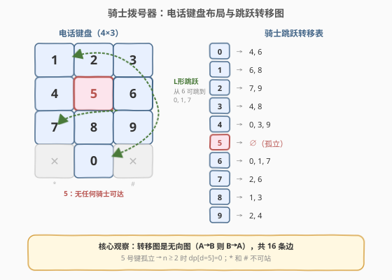
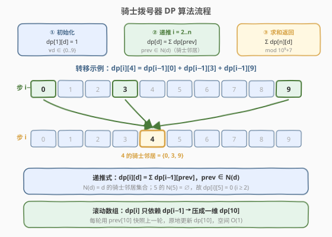
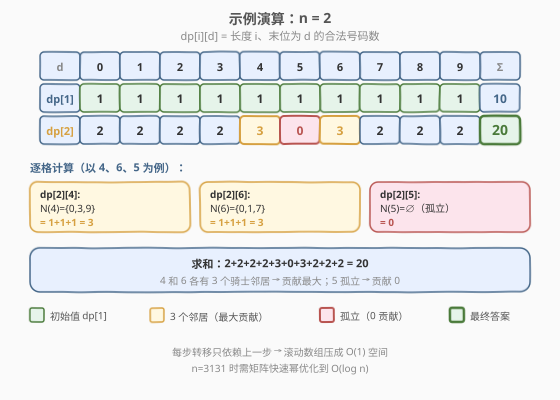

# LeetCode 骑士拨号器 题解

## 1. 题目概述

- **标题 / 题号**：骑士拨号器（#935，medium）
- **链接**：https://leetcode.cn/problems/knight-dialer/
- **难度**：中等
- **标签**：动态规划、矩阵快速幂、图

**题意**：国际象棋的**骑士**以独特的 L 形方式移动：垂直方向走 2 格 + 水平方向走 1 格，或水平方向走 2 格 + 垂直方向走 1 格。给定一个标准电话键盘（如下），骑士**只能站在数字单元格上**（0–9），不能站在 `*` 和 `#` 上。

```text
1  2  3
4  5  6
7  8  9
*  0  #
```

给定整数 $n$，将骑士放置在**任意数字单元格**上，执行 $n - 1$ 次有效的骑士跳跃，得到一个长度为 $n$ 的电话号码。返回可以拨出的**不同号码总数**，对 $10^9 + 7$ 取模。

**示例 1**：

```text
输入：n = 1
输出：10
解释：长度为 1 的号码 = 放在 10 个数字中的任意一个，共 10 种。
```

**示例 2**：

```text
输入：n = 2
输出：20
解释：20 个有效号码为 [04, 06, 16, 18, 27, 29, 34, 38, 40, 43, 49,
      60, 61, 67, 72, 76, 81, 83, 92, 94]
```

**示例 3**：

```text
输入：n = 3131
输出：136006598
解释：注意取模。
```

**约束**：

- $1 \le n \le 5000$

> 💡 $n$ 最大 5000，看似不大，但暴力枚举 $10^{5000}$ 种序列完全不可行。关键是利用骑士跳跃的**固定转移结构**做计数 DP。

## 2. 解题思路

### 2.1 暴力思路

枚举所有长度为 $n$、首位取 0–9、后续每位由骑士跳跃决定的序列。每步从当前数字出发，有 0–3 个可达数字（取决于位置），总方案数最坏 $10 \times 3^{n-1}$，对 $n = 5000$ 是天文数字。

> ⚠️ 暴力的瓶颈在于「逐条序列展开」——但所有序列共享同一套跳跃规则，不同起点的方案数之间有**重叠子结构**。突破口是：按位置步进，只记每个数字上的方案数，不展开具体序列。

### 2.2 核心观察：按位置 + 末位数字做一维计数 DP



定义 $\text{dp}[i][d]$ 为**长度为 $i$、末位数字为 $d$** 的合法号码数量。填到第 $i$ 步时，末位 $d$ 只能从「上一步末位能跳跃到 $d$」的那些数字转移而来。

**第一步：建立骑士跳跃转移表**。将电话键盘视为 $4 \times 3$ 网格（行 0–3，列 0–2），骑士走法为 $(\pm 2, \pm 1)$ 或 $(\pm 1, \pm 2)$。逐一枚举每个数字的可达目标：

| 数字 | 骑士邻居 | 度数 |
|------|----------|------|
| 0 | 4, 6 | 2 |
| 1 | 6, 8 | 2 |
| 2 | 7, 9 | 2 |
| 3 | 4, 8 | 2 |
| 4 | 0, 3, 9 | 3 |
| 5 | ∅（孤立） | 0 |
| 6 | 0, 1, 7 | 3 |
| 7 | 2, 6 | 2 |
| 8 | 1, 3 | 2 |
| 9 | 2, 4 | 2 |

> 💡 **关键观察一**：转移图是**无向图**——若 $A$ 能跳到 $B$，则 $B$ 也能跳到 $A$（L 形跳跃的对称性）。共 16 条边（每条边算两次，度数之和 $= 32 = 2 \times 16$）。

> 💡 **关键观察二**：**5 号键完全孤立**——骑士从 5 出发的所有 8 种 L 形跳跃都落在 `*`、`#` 或网格外。因此 $n \ge 2$ 时 $\text{dp}[i][5] = 0$（无法离开 5，也无法到达 5）。$n = 1$ 时 5 贡献 1（放在 5 上即可）。

**第二步：状态转移方程**。由于图是无向的，$d$ 的骑士邻居集合 $N(d)$ 既是「从 $d$ 能跳到的数字」，也是「能跳到 $d$ 的数字」。因此：

$$\text{dp}[i][d] = \sum_{\text{prev} \in N(d)} \text{dp}[i-1][\text{prev}]$$

即「长度 $i$、末位 $d$」的方案数 = 所有「长度 $i-1$、末位能跳到 $d$」的方案数之和。

**第三步：初始与答案**。

- **初始**：$\text{dp}[1][d] = 1$（$\forall d \in \{0, 1, \ldots, 9\}$），即长度 1 的号码就是放在任意数字上。
- **答案**：$\sum_{d=0}^{9} \text{dp}[n][d] \bmod (10^9 + 7)$。

### 2.3 算法流程图



算法三步走：

1. **初始化**：`dp[d] = 1`（$\forall d \in \{0..9\}$），对应 $i = 1$。
2. **递推**：对 $i = 2, \ldots, n$，先用 `prev` 快照上一轮的 `dp`，再对每个 $d$ 计算 `dp[d] = Σ prev[prev_d]`（`prev_d ∈ N(d)`），每步取模。
3. **求和返回**：`Σ dp[d]` mod $10^9 + 7$。

> 💡 **滚动数组**：`dp[i]` 只依赖 `dp[i-1]`，压成一维 `dp[10]`。每轮开头 `prev = dp` 快照上一轮，再原地更新 `dp`，空间降至 $O(1)$（10 个 `long long`）。

### 2.4 示例演算



以 $n = 2$ 为例，逐步计算 `dp[2]`：

| 末位 $d$ | 邻居 $N(d)$ | $\text{dp}[2][d] = \sum \text{dp}[1][\text{prev}]$ | 值 |
|----------|-------------|-----------------------------------------------------|-----|
| 0 | {4, 6} | 1 + 1 | **2** |
| 1 | {6, 8} | 1 + 1 | **2** |
| 2 | {7, 9} | 1 + 1 | **2** |
| 3 | {4, 8} | 1 + 1 | **2** |
| 4 | {0, 3, 9} | 1 + 1 + 1 | **3** |
| 5 | ∅ | 0 | **0** |
| 6 | {0, 1, 7} | 1 + 1 + 1 | **3** |
| 7 | {2, 6} | 1 + 1 | **2** |
| 8 | {1, 3} | 1 + 1 | **2** |
| 9 | {2, 4} | 1 + 1 | **2** |

求和：$2+2+2+2+3+0+3+2+2+2 = \mathbf{20}$，与示例一致。

> 💡 4 和 6 各有 3 个骑士邻居（度数最大），贡献最大（3）；5 孤立，贡献 0。其余度数为 2 的数字各贡献 2。

## 3. 参考代码

### C++

```cpp
// 935. 骑士拨号器.cpp —— 一维计数 DP + 滚动数组
// 编译: g++ -O2 -std=c++17 935.cpp -o knightdialer
class Solution {
  public:
    int knightDialer(int n) {
        const int MOD = 1e9 + 7;
        // neighbors[d] = 从 d 出发骑士能跳到的数字集合（无向图，也是能跳到 d 的集合）
        const vector<vector<int>> neighbors = {
            {4, 6},       // 0
            {6, 8},       // 1
            {7, 9},       // 2
            {4, 8},       // 3
            {0, 3, 9},    // 4
            {},           // 5（孤立）
            {0, 1, 7},    // 6
            {2, 6},       // 7
            {1, 3},       // 8
            {2, 4}        // 9
        };
        // dp[d] = 当前步末位为 d 的方案数，初始化为 i=1
        vector<long long> dp(10, 1);
        for (int step = 2; step <= n; ++step) {
            vector<long long> prev = dp;           // 快照上一轮
            for (int d = 0; d <= 9; ++d) {
                dp[d] = 0;
                for (int p : neighbors[d]) {
                    dp[d] = (dp[d] + prev[p]) % MOD;
                }
            }
        }
        long long ans = 0;
        for (int d = 0; d <= 9; ++d)
            ans = (ans + dp[d]) % MOD;
        return ans;
    }
};
```

### Python

```python
class Solution:
    def knightDialer(self, n: int) -> int:
        MOD = 10**9 + 7
        neighbors = [
            [4, 6], [6, 8], [7, 9], [4, 8], [0, 3, 9],
            [], [0, 1, 7], [2, 6], [1, 3], [2, 4]
        ]
        dp = [1] * 10                         # i=1: 每个数字 1 种
        for _ in range(2, n + 1):
            prev = dp[:]                      # 快照上一轮
            for d in range(10):
                dp[d] = sum(prev[p] for p in neighbors[d]) % MOD
        return sum(dp) % MOD
```

> ⚠️ **C++ 溢出注意**：`prev[p]` 可达 $10^9$ 量级，多个相加可能溢出 `int`（`3 * 10^9 > INT_MAX`），故 `dp` 用 `long long`，且每次累加后取模。Python 无溢出问题。

> 💡 **`neighbors` 是无向图邻接表**：因为骑士跳跃的对称性（$A \to B$ 则 $B \to A$），`neighbors[d]` 既是「从 $d$ 能跳到的数字」，也是「能跳到 $d$ 的数字」。所以 `dp[d] = Σ prev[p]` 直接用 `neighbors[d]` 即可，无需额外建反向边。

## 4. 复杂度分析

| 维度 | 复杂度 | 说明 |
|------|--------|------|
| **时间复杂度** | $O(n)$ | 外层循环 $n - 1$ 轮，每轮遍历 10 个数字 × 最多 3 个邻居 = $O(1)$ |
| **空间复杂度** | $O(1)$ | 滚动数组：`dp[10]` + `prev[10]`，固定 20 个元素 |
| **取模** | 每步 `% MOD` | C++ 用 `long long` 防溢出；Python 末尾取模即可 |

> 💡 $n \le 5000$ 时 $O(n)$ 毫无压力（5000 轮 × 30 次加法）。但若 $n$ 扩展到 $10^{18}$ 级别，需用第 5 节的矩阵快速幂优化到 $O(\log n)$。

## 5. 扩展：矩阵快速幂优化至 $O(\log n)$

### 5.1 转移矩阵表示

将递推式写成矩阵形式。定义状态向量 $\mathbf{v}_i = [\text{dp}[i][0], \text{dp}[i][1], \ldots, \text{dp}[i][9]]^\top$，则：

$$\mathbf{v}_i = M \cdot \mathbf{v}_{i-1}$$

其中 $M$ 是 $10 \times 10$ 转移矩阵，$M[d][\text{prev}] = 1$ 当且仅当 $\text{prev} \in N(d)$（即骑士能从 prev 跳到 $d$）。展开：

$$M = \begin{pmatrix} 0 & 0 & 0 & 0 & 1 & 0 & 1 & 0 & 0 & 0 \\ 0 & 0 & 0 & 0 & 0 & 0 & 1 & 0 & 1 & 0 \\ 0 & 0 & 0 & 0 & 0 & 0 & 0 & 1 & 0 & 1 \\ 0 & 0 & 0 & 0 & 1 & 0 & 0 & 0 & 1 & 0 \\ 1 & 0 & 0 & 1 & 0 & 0 & 0 & 0 & 0 & 1 \\ 0 & 0 & 0 & 0 & 0 & 0 & 0 & 0 & 0 & 0 \\ 1 & 1 & 0 & 0 & 0 & 0 & 0 & 1 & 0 & 0 \\ 0 & 0 & 1 & 0 & 0 & 0 & 1 & 0 & 0 & 0 \\ 0 & 1 & 0 & 1 & 0 & 0 & 0 & 0 & 0 & 0 \\ 0 & 0 & 1 & 0 & 1 & 0 & 0 & 0 & 0 & 0 \end{pmatrix}$$

第 5 行（对应数字 5）全零，体现 5 的孤立性。

### 5.2 快速幂

由 $\mathbf{v}_n = M^{n-1} \cdot \mathbf{v}_1$（$\mathbf{v}_1 = [1, 1, \ldots, 1]^\top$），用**快速幂**在 $O(\log n)$ 次矩阵乘法内算出 $M^{n-1}$。每次矩阵乘法 $10 \times 10$，代价 $O(10^3) = O(1)$。

最终答案 $= \sum_{d=0}^{9} \mathbf{v}_n[d] = \mathbf{1}^\top \cdot M^{n-1} \cdot \mathbf{v}_1$，即 $M^{n-1}$ 所有元素之和（因为 $\mathbf{v}_1$ 全 1，$\mathbf{1}^\top$ 也全 1）。

**对比两种解法**：

| 维度 | 滚动数组 DP | 矩阵快速幂 |
|------|------------|-----------|
| 时间 | $O(n)$ | $O(\log n)$（$n = 5000$ 时差异不大） |
| 空间 | $O(1)$ | $O(1)$（$10 \times 10$ 矩阵） |
| 思路难度 | 转移直观，易推导 | 需矩阵乘法 + 快速幂模板 |
| 适用场景 | $n \le 10^6$ | $n \le 10^{18}$（如 $n = 10^{18}$ 时 DP 必超时） |

> 💡 **何时用矩阵快速幂？** 当递推是**线性齐次**的（$\mathbf{v}_i = M \cdot \mathbf{v}_{i-1}$，无额外项），且 $n$ 极大时，矩阵快速幂是标准武器。本题 $n \le 5000$ 用 DP 即可，但面试官可能追问「$n$ 很大怎么办」，此时亮出矩阵快速幂。

### 5.3 矩阵快速幂参考代码

```python
class Solution:
    def knightDialer(self, n: int) -> int:
        MOD = 10**9 + 7
        neighbors = [
            [4, 6], [6, 8], [7, 9], [4, 8], [0, 3, 9],
            [], [0, 1, 7], [2, 6], [1, 3], [2, 4]
        ]
        # 构建转移矩阵 M[d][prev] = 1 if prev ∈ N(d)
        M = [[0] * 10 for _ in range(10)]
        for d in range(10):
            for p in neighbors[d]:
                M[d][p] = 1

        def mat_mul(A, B):
            C = [[0] * 10 for _ in range(10)]
            for i in range(10):
                for k in range(10):
                    if A[i][k]:
                        aik = A[i][k]
                        for j in range(10):
                            C[i][j] = (C[i][j] + aik * B[k][j]) % MOD
            return C

        def mat_pow(mat, exp):
            result = [[1 if i == j else 0 for j in range(10)] for i in range(10)]
            while exp:
                if exp & 1:
                    result = mat_mul(result, mat)
                mat = mat_mul(mat, mat)
                exp >>= 1
            return result

        if n == 1:
            return 10
        Mn = mat_pow(M, n - 1)
        # v1 = [1]*10, answer = 1^T · Mn · v1 = sum of all entries of Mn
        return sum(sum(row) for row in Mn) % MOD
```

> ⚠️ **稀疏矩阵优化**：$M$ 每行最多 3 个非零元素（度数 $\le 3$），`mat_mul` 中加 `if A[i][k]` 跳过零元素，将 $10^3$ 降至约 $10 \times 3 \times 10 = 300$ 次乘法，常数优化约 3 倍。

## 6. 面试要点

1. **为什么转移图是无向图？这对代码有什么影响？**

   骑士跳跃的 L 形走法具有对称性：从 $A$ 走 $(\Delta r, \Delta c)$ 到 $B$，则从 $B$ 走 $(-\Delta r, -\Delta c)$ 回到 $A$，两者都是合法骑士走法。因此 $A \to B$ 则 $B \to A$，邻接表 `neighbors[d]` 既是「$d$ 能跳到的数字」也是「能跳到 $d$ 的数字」，代码中 `dp[d] = Σ prev[p]` 直接用 `neighbors[d]` 即可，无需建反向边。

2. **5 号键为什么贡献为 0（$n \ge 2$）？**

   5 在键盘中心 $(1, 1)$，其 8 种 L 形跳跃的目标全部落在 `*` $(3, 0)$、`#` $(3, 2)$ 或网格外。既无法从 5 跳出，也无法跳入 5。因此 $n = 1$ 时 5 贡献 1（原地放），$n \ge 2$ 时 $\text{dp}[i][5] = 0$。

3. **滚动数组怎么写？为什么不需要反向遍历？**

   每轮开头用 `prev = dp` 快照上一轮的完整状态，然后基于 `prev` 计算新的 `dp`。这里不需要像 0-1 背包那样反向遍历——因为 `prev` 是一份独立拷贝，修改 `dp` 不影响 `prev`，正序遍历 0–9 即可。代价是多用 $O(10)$ 空间存 `prev`，但对 10 个元素来说可忽略。

4. **什么时候需要矩阵快速幂？**

   当递推是**线性齐次**的（$\mathbf{v}_i = M \cdot \mathbf{v}_{i-1}$）且 $n$ 极大（如 $n \le 10^{18}$）时，DP 的 $O(n)$ 超时，需用矩阵快速幂的 $O(\log n)$。本题 $n \le 5000$ 用 DP 即可，但面试中可能被追问「$n$ 很大怎么办」，矩阵快速幂是标准答案。

5. **答案为什么是 $M^{n-1}$ 所有元素之和？**

   $\mathbf{v}_1 = [1, 1, \ldots, 1]^\top$（全 1 向量），$\mathbf{v}_n = M^{n-1} \cdot \mathbf{v}_1$。答案 $= \mathbf{1}^\top \cdot \mathbf{v}_n = \mathbf{1}^\top \cdot M^{n-1} \cdot \mathbf{1}$。$\mathbf{1}^\top \cdot M^{n-1}$ 是 $M^{n-1}$ 每列求和（行向量），再右乘 $\mathbf{1}$ 是该行向量求和，等价于 $M^{n-1}$ 所有元素之和。

> 💡 **一句话总结**：935 的核心是**将骑士跳跃规则编码为固定邻接表，做一维计数 DP**。转移图的无向性简化了代码（无需反向边），5 的孤立性是易错点。$O(n)$ DP 解决 $n \le 5000$，矩阵快速幂是 $n \to \infty$ 的升级武器。

## 同类练习题

| # | 题目 | 与本题的关联 |
|---|------|-------------|
| 70 | [爬楼梯](https://leetcode.cn/problems/climbing-stairs/)（[题解](../0001-0100/70_爬楼梯.md)） | 一维线性递推 DP 入门，本题的「退化版」（2 个邻居而非骑士图），同属「按步递推计数」家族 |
| 509 | [斐波那契数](https://leetcode.cn/problems/fibonacci-number/)（[题解](../0001-0100/509_斐波那契数.md)） | 线性递推 + 矩阵快速幂的经典载体，与本题第 5 节的矩阵快速幂优化同源 |
| 920 | [播放列表的数量](https://leetcode.cn/problems/number-of-music-playlists/)（[题解](920_播放列表的数量.md)） | 同为计数 DP，按位置递推、转移有约束，与本题「按步 + 末位状态」的结构同构 |
| 526 | [优美的排列](https://leetcode.cn/problems/beautiful-arrangement/)（[题解](../0501-0600/526_优美的排列.md)） | 计数 DP + 状态压缩，与本题同属「计数型 DP」家族，但状态维度不同（位掩码 vs 末位数字） |
