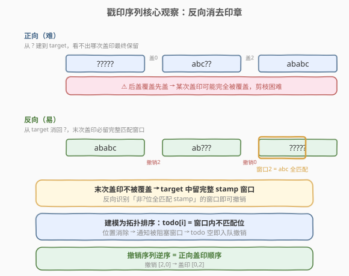
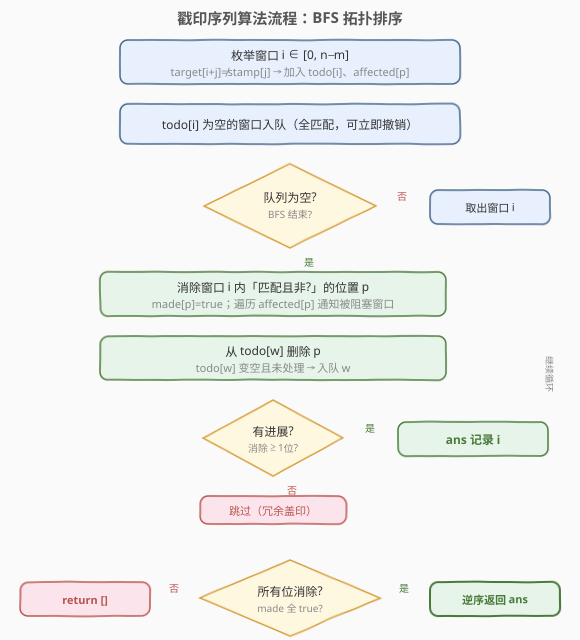
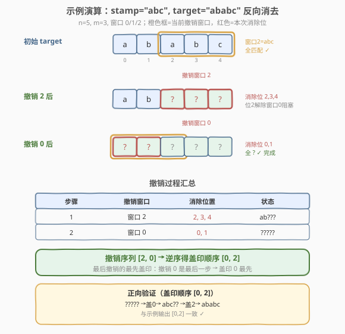

# 戳印序列

- **题目名称**：戳印序列
- **链接**：[936. 戳印序列](https://leetcode.cn/problems/stamping-the-sequence/)
- **难度**：困难
- **标签**：贪心、广度优先搜索、拓扑排序、字符串

## 1. 题目概述

给定印章字符串 `stamp` 和目标字符串 `target`。初始时有一个长度为 `target.length` 的字符串，每个字符都是 `?`（表示空白目标）。

每次操作可把印章盖在某个起始位置 `i`（要求 `0 <= i <= target.length - stamp.length`，印章完整落入目标内），印章的字符会**覆盖**目标中对应位置的字符。问能否通过若干次盖印得到 `target`？若能，返回每次盖印的起始下标数组；若不能，返回空数组。

> 💡 **覆盖语义**：后盖的字符会覆盖先盖的字符。题目只要**任意**一个合法盖印顺序即可（操作数不超过 `10 * target.length` 都算合法），不要求最少。

**示例 1**：

```text
输入：stamp = "abc", target = "ababc"
输出：[0,2]
解释：初始 "?????"。
      盖印位置 0 → "abc??"
      盖印位置 2 → "ababc"（'a','b','c' 覆盖了 '?','?','?'）
```

**示例 2**：

```text
输入：stamp = "abca", target = "aabcaca"
输出：[3,0,1]
解释：初始 "???????"。
      盖印位置 3 → "???abca"
      盖印位置 0 → "abcabca"
      盖印位置 1 → "aabcaca"
```

**约束条件**：

- `1 <= stamp.length <= target.length <= 1000`
- `stamp` 和 `target` 只含小写英文字母

---

## 2. 解题思路

### 2.1 暴力思路

正向构造：从全 `?` 出发，尝试所有盖印顺序。每个位置有 $n - m + 1$ 种选择（$n$ = `target.length`，$m$ = `stamp.length`），搜索深度可达 $10n$，组合爆炸；且正向覆盖后无法判断某次盖印是否「有用」（它可能被后续盖印完全覆盖），剪枝极难。

> 💡 **关键转折**：正向「从 `?` 建到 `target`」难，是因为看不出哪次盖印最终保留；**反向「从 `target` 消除回 `?`」却很容易**——最后一次盖印必然在目标中留下一段完整匹配印章的窗口。

### 2.2 核心观察：反向消去 + 拓扑排序



把过程**倒过来看**：从 `target` 出发，每次「撤销」一次盖印，把对应窗口里**匹配印章的非 `?` 字符**变回 `?`，最终全部变 `?` 即成功。

> 💡 **为什么反向可行？** 正向的**最后一次**盖印不会被任何后续操作覆盖，所以它在 `target` 中留下的那段必然与 `stamp` **完全相同**。反向时，任何「窗口内所有非 `?` 字符都等于 `stamp` 对应字符」的窗口，都可能是某次「最后一次盖印」，可安全撤销。

**撤销一个窗口 $i$ 的条件**（覆盖位置 $i \ldots i+m-1$）：

1. 对窗口内每个位置 $p = i+j$：要么已经是 `?`（已被更晚的撤销处理），要么 `target[p] == stamp[j]`；
2. 至少有一个非 `?` 位置（保证有进展，避免空操作）。

撤销后，把窗口内**匹配且非 `?`** 的位置全部置为 `?`。注意：窗口内 `target[p] != stamp[j]` 的位置必须**已经是 `?`**——它们不是这次盖印留下的，而是被其他盖印覆盖后又在此处被「无关字符」占位，反向时它们早已消除。

**建模为拓扑排序**：对每个候选窗口 $i$（共 $n-m+1$ 个），维护它「尚未满足」的位置集合 $\text{todo}[i]$ = 窗口内 `target[p] != stamp[j]` 的位置（这些位置必须先被别的窗口消除为 `?`，窗口 $i$ 才能撤销）。当某位置 $p$ 被消除为 `?` 时，所有「被 $p$ 阻塞」的窗口的 `todo` 都减一；某窗口 `todo` 变空即可入队撤销。

> ⚠️ **消除顺序即盖印的逆序**：反向撤销序列记为 $[i_1, i_2, \ldots, i_k]$，则正向盖印顺序为其逆序 $[i_k, \ldots, i_2, i_1]$（最后撤销的最先盖）。

### 2.3 算法流程图



具体步骤：

1. **预处理**：枚举所有窗口起点 $i \in [0, n-m]$。对窗口内每个 $j$，若 `target[i+j] != stamp[j]`，把位置 $i+j$ 加入 $\text{todo}[i]$，并记录「位置 $i+j$ 阻塞窗口 $i$」（即 $i$ 加入 $\text{affected}[i+j]$）。
2. **初始化队列**：所有 $\text{todo}[i]$ 为空的窗口入队（它们窗口内全部匹配，可立即撤销）。
3. **BFS 撤销**：取出窗口 $i$，消除其「匹配且非 `?`」的位置 $p$（置 `made[p]=true`）：
   - 对每个被 $p$ 阻塞的窗口 $w \in \text{affected}[p]$：从 $\text{todo}[w]$ 删除 $p$；若 $\text{todo}[w]$ 变空且未处理，入队 $w$。
   - 若本次至少消除一个位置（有进展），把 $i$ 记入答案。
4. **判定**：若所有位置都被消除，将答案逆序返回；否则返回空数组。

### 2.4 示例演算



以示例 1 `stamp = "abc"`、`target = "ababc"`（$n=5, m=3$，窗口 $0,1,2$）为例，展示反向消去过程：

| 步骤 | 当前 target 状态 | 撤销窗口 | 消除位置 | 说明 |
|------|------------------|----------|----------|------|
| 初始 | `a b a b c` | — | — | 窗口 2 全匹配 `abc`，todo 空，先入队 |
| 撤销 2 | `a b ? ? ?` | 2 | 位置 2,3,4 | 窗口 2 = `abc` 全匹配，消除后位置 2 变 `?`，解除窗口 0 对位置 2 的阻塞 |
| 撤销 0 | `? ? ? ? ?` | 0 | 位置 0,1 | 窗口 0 = `ab?`（位置 2 已 `?`），匹配位 0,1 消除 |

撤销序列 `[2, 0]`，逆序得盖印顺序 `[0, 2]`，与示例输出一致。

> 💡 **对照示例 2** `stamp="abca"`、`target="aabcaca"`：反向撤销序列为 `[1, 0, 3]`（窗口 1 全匹配 `abca` 最先撤销，解阻塞后窗口 0、3 依次撤销），逆序得 `[3, 0, 1]`。

---

## 3. 参考代码

### C++

```cpp
class Solution {
  public:
    vector<int> movesToStamp(string stamp, string target) {
        int m = stamp.size(), n = target.size();
        int W = n - m + 1;                       // 候选窗口数

        // todo[i] = 窗口 i 内 target[p]!=stamp[p-i] 的位置集合（阻塞位）
        vector<unordered_set<int>> todo(W);
        // affected[p] = 被位置 p 阻塞的窗口列表
        vector<vector<int>> affected(n);

        for (int i = 0; i < W; ++i) {
            for (int j = 0; j < m; ++j) {
                int p = i + j;
                if (target[p] != stamp[j]) {
                    todo[i].insert(p);
                    affected[p].push_back(i);
                }
            }
        }

        vector<char> made(n, false);             // 位置是否已消除为 '?'
        vector<char> used(W, false);             // 窗口是否已入队
        queue<int> q;
        for (int i = 0; i < W; ++i)
            if (todo[i].empty()) { q.push(i); used[i] = true; }

        vector<int> ans;
        while (!q.empty()) {
            int i = q.front(); q.pop();
            bool progressed = false;
            for (int j = 0; j < m; ++j) {
                int p = i + j;
                if (!made[p] && target[p] == stamp[j]) {
                    made[p] = true;             // 消除位置 p
                    progressed = true;
                    for (int w : affected[p]) { // 通知被 p 阻塞的窗口
                        todo[w].erase(p);
                        if (!used[w] && todo[w].empty()) {
                            q.push(w); used[w] = true;
                        }
                    }
                }
            }
            if (progressed) ans.push_back(i);   // 只记录有进展的撤销
        }

        for (int p = 0; p < n; ++p)
            if (!made[p]) return {};            // 有位置未消除 → 无解

        reverse(ans.begin(), ans.end());        // 撤销逆序 = 盖印顺序
        return ans;
    }
};
```

### Python

```python
class Solution:
    def movesToStamp(self, stamp: str, target: str) -> List[int]:
        m, n = len(stamp), len(target)
        W = n - m + 1

        # todo[i] = 窗口 i 内 target[p]!=stamp[p-i] 的位置集合（阻塞位）
        todo = [set() for _ in range(W)]
        # affected[p] = 被位置 p 阻塞的窗口列表
        affected = [[] for _ in range(n)]

        for i in range(W):
            for j in range(m):
                p = i + j
                if target[p] != stamp[j]:
                    todo[i].add(p)
                    affected[p].append(i)

        made = [False] * n                      # 位置是否已消除为 '?'
        used = [False] * W                      # 窗口是否已入队
        q = deque(i for i in range(W) if not todo[i])
        for i in range(W):
            if not todo[i]:
                used[i] = True

        ans = []
        while q:
            i = q.popleft()
            progressed = False
            for j in range(m):
                p = i + j
                if not made[p] and target[p] == stamp[j]:
                    made[p] = True              # 消除位置 p
                    progressed = True
                    for w in affected[p]:       # 通知被 p 阻塞的窗口
                        todo[w].discard(p)
                        if not used[w] and not todo[w]:
                            q.append(w)
                            used[w] = True
            if progressed:
                ans.append(i)                   # 只记录有进展的撤销

        if not all(made):
            return []                           # 有位置未消除 → 无解

        ans.reverse()                           # 撤销逆序 = 盖印顺序
        return ans
```

> ⚠️ **`affected[p]` 与 `todo[i]` 的互斥关系**：位置 $p$ 在窗口 $w$ 中要么匹配（$p$ 可被 $w$ 消除，$w \notin \text{affected}[p]$），要么不匹配（$p$ 阻塞 $w$，$w \in \text{affected}[p]$）。故消除 $p$ 时只通知「被阻塞」的窗口，不会误删自身。

> 💡 **只记录有进展的撤销**：某窗口入队时其阻塞位已全部消除，但匹配位可能也已被别的窗口消除——此时撤销它不消除任何新位置，是冗余盖印，跳过即可。这保证每步消除至少一个位置，总撤销不超过 $n$ 次。

---

## 4. 复杂度分析

| 维度 | 复杂度 | 说明 |
|------|--------|------|
| 时间复杂度 | $O(nm)$ | 预处理枚举每个窗口的 $m$ 个位置共 $O(nm)$；BFS 中每个位置至多消除一次，每次通知其 `affected` 列表，总通知量等于预处理记录的阻塞对数 $O(nm)$ |
| 空间复杂度 | $O(nm)$ | `todo` 与 `affected` 共存 $O(nm)$ 个阻塞对；`made`/`used`/队列均为 $O(n)$ |

> 💡 $n, m \le 1000$，$nm \le 10^6$，远低于时限。若改用「反复扫描找可撤销窗口」的朴素贪心，单次扫描 $O(nm)$、最多 $n$ 轮，最坏 $O(n^2 m) = 10^9$ 会超时；拓扑排序用队列把「扫描—通知」摊还到每条阻塞对，是关键优化。

---

## 5. 扩展：为何反向贪心不会陷入死局

一个自然疑问：反向每次「任意挑一个可撤销窗口」撤销，会不会走错路导致后面卡死？

**不会**。设 `target` 可由某合法正向盖印序列 $s_1, s_2, \ldots, s_k$ 得到。考虑正向最后一次盖印 $s_k$：它不被任何后续操作覆盖，故 `target` 中窗口 $s_k$ 完全等于 `stamp`，即 $\text{todo}[s_k] = \emptyset$，反向一开始就可撤销。撤销 $s_k$ 后，剩下的状态恰是 $s_1, \ldots, s_{k-1}$ 的盖印结果——$s_{k-1}$ 又成了新的「最后一次」，同样可撤销。

因此只要 `target` 可达，反向每一步都至少存在一个可撤销且有进展的窗口（即原序列的当前末次盖印）。BFS 按拓扑序撤销，等价于不断剥掉末次盖印，必然能消除全部位置。反过来，若 BFS 结束时仍有位置未消除，说明 `target` 根本不可达，返回空数组正确。

> ⚠️ 这也说明：**答案不一定唯一**（多个窗口可能同时可撤销，顺序可换），题目允许返回任意一个，故贪心选择合法。

---

## 6. 面试要点

1. **为什么正向做难、反向做易？**

   正向盖印会被后续覆盖，无法判断某次盖印是否最终保留；反向从 `target` 出发，最后一次盖印必然留下完整匹配印章的窗口，可被直接识别并撤销，把「构造」问题转化为「识别可消除窗口」的贪心/拓扑问题。

2. **撤销窗口的两个条件分别保证什么？**

   「所有非 `?` 位匹配印章」保证这次盖印确实能产生这些字符（否则该窗口不可能是末次盖印）；「至少一个非 `?` 位」保证有进展、避免无限空操作。两者缺一不可。

3. **如何把贪心优化到 $O(nm)$？**

   朴素做法每轮扫描全部窗口找可撤销者，$O(n)$ 轮共 $O(n^2 m)$。引入 `todo[i]`（窗口的阻塞位集合）与 `affected[p]`（被位置 $p$ 阻塞的窗口），位置消除时只通知相关窗口、`todo` 变空即入队——把扫描摊还到每条阻塞对，总工作量 $O(nm)$，本质是拓扑排序的入度维护。

4. **为什么最终答案要逆序？**

   反向撤销序列里，先撤销的是正向最后的盖印。要还原正向盖印顺序，需把撤销序列逆序：最后撤销的窗口对应最先盖印。

5. **`affected[p]` 为什么不含「能消除 $p$ 的窗口」？**

   能消除 $p$ 的窗口 $w$ 满足 `target[p]==stamp[p-w]`，此时 $p$ 不是 $w$ 的阻塞位（不在 `todo[w]`），消除 $p$ 不需要通知 $w$。`affected[p]` 只存「$p$ 阻塞的窗口」（`target[p]!=stamp[p-w]`），二者互斥。

6. **无解如何判定？**

   BFS 结束后若存在位置未被消除（`made[p]==false`），说明没有任何合法盖印能产生 `target[p]`（或产生它的窗口被不匹配位永久阻塞），返回空数组。例如 `stamp="ab"`、`target="ba"`：窗口 0 是 `b?`（`b!=a` 阻塞）、窗口 1 是 `?a`（`a!=b` 阻塞），两窗口 todo 永不空，无解。

---

## 7. 同类练习题

- [685. 冗余连接 II](https://leetcode.cn/problems/redundant-connection-ii/)：拓扑/入度思想判有向图环与冲突，同为「入度维护 + BFS」范式
- [207. 课程表](https://leetcode.cn/problems/course-schedule/)（[题解](../0201-0300/207_课程表.md)）：拓扑排序模板，BFS 入度队列判断可行性
- [444. 序列重建](https://leetcode.cn/problems/sequence-reconstruction/)：拓扑排序判定唯一序列，入度维护与本题同构
- [1585. 检查字符串是否可以通过排序子字符串得到另一个字符串](https://leetcode.cn/problems/check-if-string-is-transformable-with-substring-sort-operations/)：字符串变换可行性判定，逆向分析「能否还原」的同类思路
